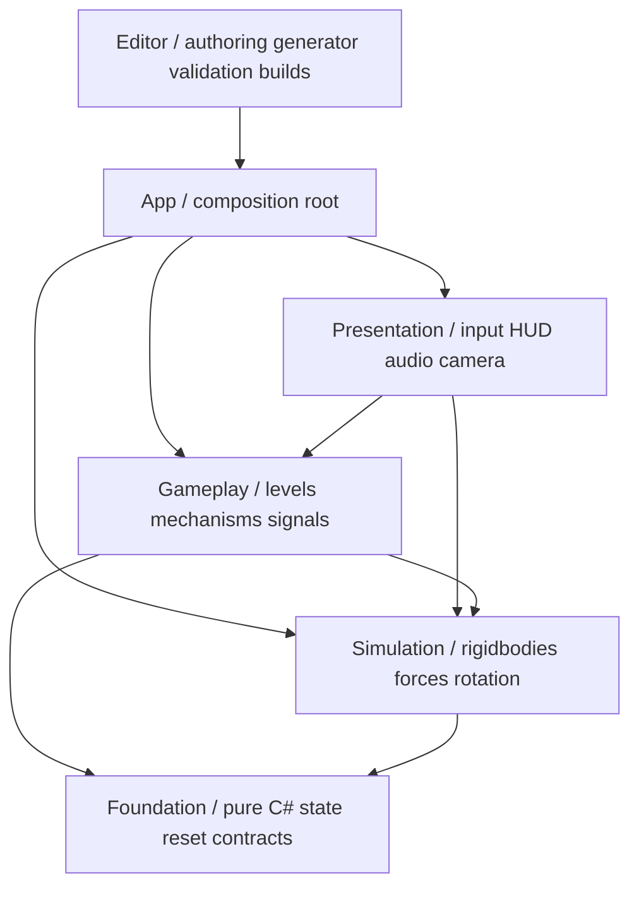
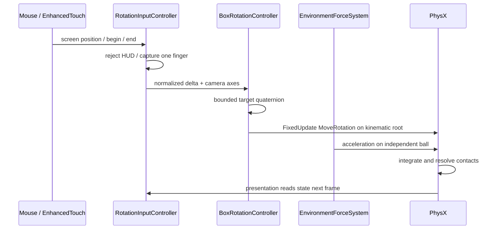
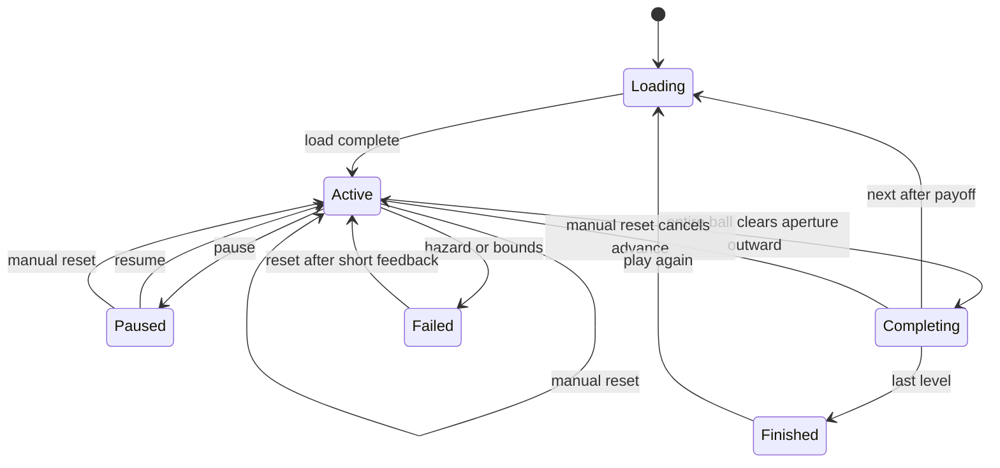

# Kiến trúc Gravity Box

Kiến trúc ưu tiên mô phỏng ổn định, reset có thể kiểm chứng và authoring bằng prefab/data. Đây là nền để mở rộng sau khi prototype chứng minh gameplay; không coi toàn bộ tính năng sản phẩm là yêu cầu hiện tại.

## Hướng phụ thuộc

Mỗi khối là một asmdef. Foundation không tham chiếu UnityEngine. Simulation không tham chiếu LevelManager hoặc HUD. Gameplay không đọc chuột/touch, không xây UI. App tạo service và truyền dependency tường minh. Editor không có trong player. Test assemblies được Unity Test Framework cô lập khỏi release.

## Quyền sở hữu và vòng đời

| Đối tượng | Chủ sở hữu | Tuổi thọ | Trách nhiệm |
| --- | --- | --- | --- |
| GameBootstrap | Gameplay scene | Phiên chơi | Cấu hình runtime và kết nối các lớp |
| LevelManager | Bootstrap | Phiên chơi | Load, reset, advance, state và counters |
| EnvironmentForceSystem | Bootstrap | Phiên chơi | Áp force providers cho danh sách body của màn, đăng ký/hủy tường minh |
| LevelRuntime | LevelManager | Một lần load | Root, registry, signal bus, cơ cấu |
| BallController | LevelManager | Một lần load | Rigidbody state, capture, collision feedback |
| PhysicalProp | LevelRuntime | Một lần load | Body tự do world-space, reset pose/vận tốc; không animation điều khiển |
| LevelDefinition/Catalog/Profile | Asset database/build | Read-only runtime | Nội dung và tuning |
| GameHud/Input/Feedback | Bootstrap | Phiên chơi | Input intent và biểu diễn |
| LocalPlaytestRecorder | Bootstrap | Phiên chơi | CSV local theo event |

Ball được instantiate cạnh LevelRoot trong world hierarchy. Nó không phải con của root: parent transform sẽ tạo gia tốc/đổi vận tốc giả trong zero-G. Khi load màn mới, vô hiệu hóa object cũ ngay trước Destroy cuối frame để không có hai bộ collider hoạt động đồng thời. ForceSystem xóa các target cũ trước khi gắn màn mới. PhysicalProp cũng tách khỏi LevelRoot khi load, được giữ trong LevelRuntime.Props để reset/release; nắp không kế thừa transform khi xoay hộp.

## Đường đi input và vật lý

Một đơn vị Unity tương ứng gần một mét để thông số 9.81 dễ hiểu; scale đồng nhất. ForceMode.Acceleration tích phân theo fixedDeltaTime, không nhân deltaTime lần nữa. Root nhận input camera-relative yaw/pitch, không có nút điều khiển bóng. Assisted snap chọn orientation gần nhất trong đúng 24 phép quay của cube, tránh làm tròn Euler gây sai canonical.

Root xoay trong FixedUpdate trước force; bóng dùng interpolation và CCD. Gate/plate/pad dùng primitive trigger/collider. Door đổi collider đồng bộ theo signal; hoạt ảnh chỉ tác động visual để không tạo chuyển động collider bất thường. Vì vậy cửa mở về mặt collision ngay lúc latch, hình trượt hoàn tất sau đó: tradeoff được ghi ở DECISIONS.

## Trạng thái phiên chơi

TryComplete/TryFail chỉ chuyển từ Active. ExitSocket theo dõi chuyển động từ trong qua cửa thật; chỉ phát Exited khi toàn bộ bi vượt mép ngoài. Khi thắng, chỉ khóa input xoay, giữ ball dynamic và vận tốc thực trong 1,8 giây thực với slow motion 0,35; camera giữ cả bi và hộp trong khung. Capture chỉ dùng để giữ bi khi fail hoặc sau phần quan sát của màn cuối. Reset hủy thời điểm chuyển màn đang chờ trước khi khôi phục; không dùng coroutine chuyển màn khó hủy. Pause đóng băng physics, giữ UI bằng unscaled time. Focus/touch cancel kết thúc drag.

## Reset contract

1. Time scale trở lại 1 và transition timer bị hủy.
2. Xóa signal state theo scope màn.
3. Khôi phục root pose và xóa rotation backlog.
4. Khôi phục plate, door, gate, pad, exit theo registry; bao gồm IgnoreCollision/cooldown/exit traversal state.
5. Khôi phục world pose/vận tốc của các props, sau đó ball với launch velocity; clear trail và wake.
6. Physics.SyncTransforms; Exit.BeginTracking lấy lại mẫu từ pose đã reset; session chuyển Active.

InitialLocalVelocity của zero-G là chủ ý thiết kế, vì vậy reset màn có launch velocity phải khôi phục vận tốc ấy, không ép zero. CaptureInitialState chỉ chạy khi đăng ký một lần lúc load. Reset không capture lại trạng thái đã bị biến đổi. PhysX không hứa deterministic bit-for-bit giữa nền tảng; test dùng sai số cho tích phân, còn trạng thái reset được kiểm tra tường minh.

## Dữ liệu và authoring

LevelCatalog giữ danh sách có thứ tự, shared ball prefab/profile, rotation config và timing. LevelDefinition chứa stable ID, display index/name, profile, prefab, hint, rotation override, launch velocity và solution note. Index phục vụ thứ tự prototype; stable ID dành cho save/analytics về sau. Runtime không mutate ScriptableObject.

Mỗi prefab level có BallSpawn, Exit, Geometry, Mechanisms, Shell và root Rigidbody. Prefab cơ cấu dùng component chung; kênh string nối plate-door trong instance bus, exit có thể yêu cầu channel. Cùng tên channel ở hai prefab không chia sẻ trạng thái. Editor validator bắt reference null, ID trùng, spawn chồng collider, kênh cơ cấu sai, cửa quá hẹp, tâm cửa bị solid chặn và ngưỡng thoát vượt failure bounds. Cửa tròn có trục +Z hướng ra ngoài; hình học vỏ và detector phải dùng cùng ApertureRadius, WallHalfDepth. Wall mesh có lỗ xuyên và cùng MeshCollider non-convex trên root kinematic; đường sáng chỉ là mesh phẳng không collider. Chiều dày tại cửa bằng chiều dày vỏ 0,18 m, không có cổ/gờ nhô vào đường lăn.

Nguồn tạo baseline là Editor/PrototypeBuilder; prefab và ScriptableObject được commit để project chạy không cần generator. Generator chỉ chạy theo menu/CLI tường minh và cập nhật đúng thư mục generated. Khi designer chỉnh tay, tạo prefab/definition riêng ngoài baseline hoặc dùng variant; không chạy regenerate lên dữ liệu đã chỉnh mà chưa backup/version control.

## Mở rộng thành product

| Nhu cầu tương lai | Điểm mở rộng | Khi nào thực hiện |
| --- | --- | --- |
| Magnetic/wind/buoyancy | IForceProvider + localized target query | Sau GO gate và test riêng cho lực |
| Multiple balls | Tái dùng force registry; mở rộng ball ownership và goal policy ở Gameplay | Khi design yêu cầu; input vẫn chỉ xoay root |
| Material behavior | Profile dữ liệu cho physical/interaction coefficients | Trước force phụ thuộc vật liệu |
| Save migration | IProgressStore, schema version, atomic replacement | Khi có persistence người dùng |
| Remote analytics | IPlaytestSink/adapter có consent và queue | Khi xác định dữ liệu, privacy và vận hành |
| Addressables | ILevelLoader async, handle lifetime/cancel | Khi content/memory/loading đủ lớn |
| Localization/accessibility | Text keys, adjustable sensitivity, contrast/haptics/audio settings | Vertical slice sản phẩm |
| Level editor | Custom inspectors, palette, validation, recorded solution routes | Sau khi quy tắc authoring ổn định |

Không thêm abstraction chỉ có một implementation nếu chưa cần hoán đổi. Các seam hiện có giải quyết vấn đề thực: reset, force, cơ cấu và assembly dependencies. LevelManager vẫn đồng bộ ở prototype; đổi asset loading không cần đụng Input hoặc force calculation.

## Tài liệu API đã đối chiếu

- [Rigidbody.MoveRotation Unity 6.3](https://docs.unity3d.com/6000.3/Documentation/ScriptReference/Rigidbody.MoveRotation.html)
- [Rigidbody.AddForce Unity 6.3](https://docs.unity3d.com/6000.3/Documentation/ScriptReference/Rigidbody.AddForce.html)
- [Input System EnhancedTouch](https://docs.unity3d.com/Packages/com.unity.inputsystem@1.17/manual/Touch.html)
- [Unity Test Framework CLI](https://docs.unity.cn/Packages/com.unity.test-framework@1.3/manual/reference-command-line.html)
