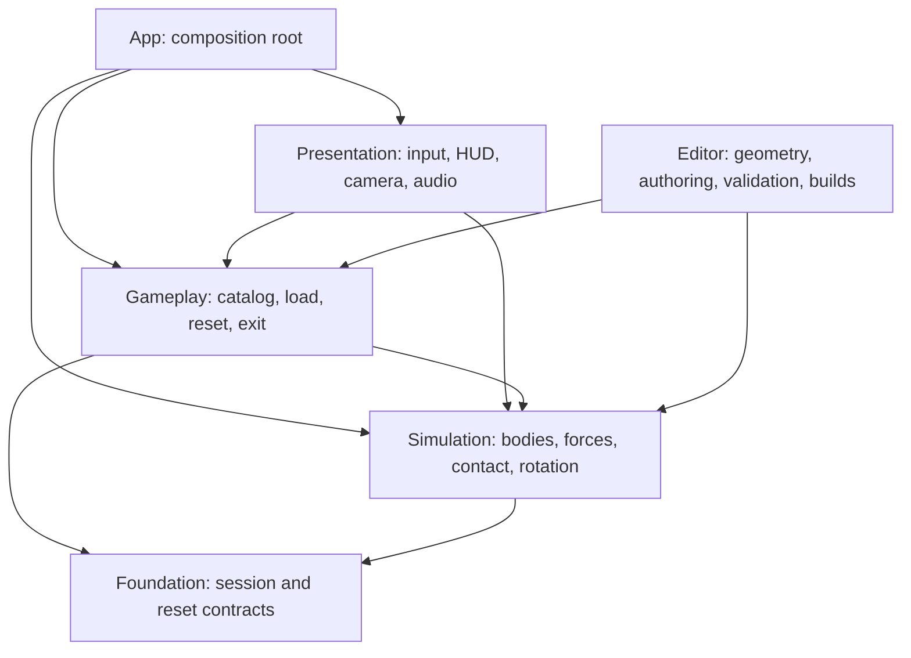

# Kiến trúc Gravity Box

Prototype hiện tại tải tám thí nghiệm hình học và bốn puzzle vật lý, dùng chung mô hình bi thép. Bàn 09 có một thanh trượt, bàn 10 có hai thanh trượt ngược hướng và bàn 11 có ba tầng mê cung và bàn 12 có mê cung ba chiều trong khối cầu. Bi chuyển động trong world space; hộp là vật thể kinematic nhận ý định xoay từ người chơi. PhysX giải quyết va chạm giữa chúng. Không có đường điều khiển input trực tiếp tới vị trí hoặc vận tốc của bi.

## Phụ thuộc

Các lớp được cô lập bằng asmdef. Foundation không tham chiếu UnityEngine. Simulation không biết LevelManager/HUD. Gameplay không đọc touch/chuột hoặc xây giao diện. App truyền dependency tường minh. Editor và test assemblies không vào release player.

## Quyền sở hữu

| Đối tượng | Chủ sở hữu / tuổi thọ | Trách nhiệm |
| --- | --- | --- |
| GameBootstrap | Gameplay scene / phiên chạy | Khởi tạo clock 120 Hz và kết nối hệ thống |
| LevelManager | Bootstrap / phiên chạy | Load một hộp, reset, chuyển hộp thủ công, session |
| LevelRuntime | LevelManager / một lần load | Root, spawn, exit, registry theo hộp |
| BallController | LevelManager / một lần load | Rigidbody độc lập, contact/rolling state, reset, dữ liệu feedback |
| PhysicalProp | LevelRuntime / một lần load | Body thanh trượt độc lập, đăng ký lực, lưu/khôi phục pose/vận tốc, thu hồi khi đổi bàn |
| GravitySliderGuide | PhysicalProp / một lần load | Đọc độ dịch chuyển/vận tốc theo ray; không điều khiển chuyển động hoặc gửi unlock |
| LayeredMaze | LevelRuntime / một lần load | Metadata sàn, lỗ chuyển tầng và đường authoring; xác định tầng từ vị trí thật của bi |
| SpatialMaze | LevelRuntime / một lần load | Metadata vỏ cầu, các thanh rời, thanh xuất phát/thanh đón và seed authoring; không điều khiển bi |
| MazeLayerView | HUD khởi tạo / một lần load | Làm mờ các tầng không hoạt động hoặc hiện tổng thể bằng vật liệu, giữ nguyên physics |
| EnvironmentForceSystem | Bootstrap / phiên chạy | Áp gia tốc thế giới một lần cho mỗi body đã đăng ký |
| BoxRotationController | LevelRuntime / một lần load | Đổi input intent thành chuyển động kinematic bị giới hạn |
| Catalog / profile | Asset / read-only runtime | Hình dạng, vật liệu, kích thước và thông số chung |
| HUD / camera / audio | Bootstrap / phiên chạy | Thể hiện trạng thái vật lý và nhận thao tác |

Ball không nằm dưới transform của hộp. Khi đổi hộp, manager xóa force targets và vô hiệu hóa root/ball/props cũ trước Destroy cuối frame, tránh collider của hai bàn cùng hoạt động. Số force targets là `1 + Props.Length`: hai ở bàn 09, ba ở bàn 10, một ở tám hộp hình học và bàn 11–12. Các cơ cấu tín hiệu cũ vẫn nằm ngoài catalog.

## Clock, scale và contact

Một đơn vị Unity bằng một mét. Bi bán kính 0,015 m, khối lượng khoảng 0,111 kg; quán tính cầu đặc phải nhất quán với `I = 2/5 m r²`. Vỏ hộp dày 0,006 m. `LevelRuntime.InteriorDepth` lưu khoảng cách giữa tâm sàn ngoài và tâm nắp: 0,09 m mặc định, 0,27 m cho hộp ba tầng. Với SphereMaze, giá trị 0,732 m là đường kính ngoài; `SpatialMaze.InnerRadius` và `ShellThickness` mới là metadata có thẩm quyền cho vỏ cong. Tỷ lệ hiển thị đến từ camera, không scale phóng đại Rigidbody.

Input gửi góc mong muốn tới controller; controller dùng MoveRotation trong fixed step. Gia tốc Trái Đất là `(0, -9.81, 0)` trong world space. Hệ lực dùng ForceMode.Acceleration và không nhân timestep lần thứ hai. Ball nhận lực/contact; renderer đọc pose nội suy để hiển thị. Profile rolling resistance xử lý tổn hao khi có mặt đỡ, không dùng damping trong không khí để thay thế ma sát lăn.

Mô phỏng dùng 1/120 s. Contact offset, bounce threshold, solver và giới hạn tốc độ quay của bi được đặt theo scale bàn nhỏ. Giới hạn góc xoay của hộp hạn chế input gây vận tốc bề mặt quá lớn. Việc chọn giá trị phải được đo bằng test dốc/va chạm; không chốt cảm giác chỉ từ Inspector.

## Hình học và cửa thoát

LevelDefinition khai báo `ContainerShape`: Circle, Square, Triangle, LShape, UShape, Annulus, Dumbbell, Star, GravityLock, MechanicalMaze, LayeredMaze và SphereMaze. `LevelRuntime.Footprint` lưu contour ngoài CCW trên mặt XZ; `FootprintVoids` chứa các contour lõi rỗng, mỗi phần tử có `Points`. Vành khuyên có một contour trong, các hình khác có thể lõm nhưng không có lõi rỗng khép kín.

Editor triangulate sàn/nắp theo miền polygon thật; không dựng quạt từ origin cho polygon lõm hoặc chứa lỗ. Thành vỏ đi theo cả contour ngoài lẫn contour trong. Cùng mesh được dùng cho hiển thị/collision. Collider **Fixed cube**, cạnh 0,064 m, thuộc compound kinematic của hộp vuông và không di chuyển tương đối với hộp.

Cửa giữ quy ước local +Z hướng ra ngoài, bán kính 0,023 m và wall half-depth 0,003 m. Renderer/collider dùng cùng hình học mặt cắt. Ring chỉ có renderer, không collider. ExitSocket kiểm tra sweep từ phía trong qua bán kính tròn và đợi toàn bộ cầu vượt mặt ngoài. Sai số clearance/completion tính theo bán kính bi; không giữ các dung sai vài centimet từ prototype cũ.

Bounds của LevelRuntime là hàng rào kiểm tra lỗi sau vùng vỏ và ngưỡng thoát, không phải collider. Kích thước bounds/framing tăng theo contour của từng hộp. Kiểm thử hình học tiếp cận từng cạnh từ phía có thể chơi, kiểm tra sàn/nắp bên trong và khoảng trống bên ngoài polygon, sau đó sweep toàn bộ cầu và nghiêng bi qua các góc/cổ nối. Không giả định origin luôn nằm trong hộp: origin của vành khuyên nằm trong vùng rỗng.

## Session và reset

Active có thể chuyển Paused, Completing khi bi thoát, hoặc Failed nếu phát hiện lọt ra ngoài sai đường. Completing giữ time scale 1; manager không tự chuyển bàn theo timer. Next được người chơi gọi và quay vòng 12 bàn. Reset có thể gọi từ trạng thái đang chơi hoặc đã thoát để lặp cùng điều kiện.

Reset khôi phục root pose trước, xóa input backlog, khôi phục exit/traversal state, rồi world pose/vận tốc của props và contact state của bi. Cuối cùng SyncTransforms và BeginTracking lấy mẫu mới. Registry chỉ capture trạng thái ban đầu một lần; reset không ghi đè trạng thái chuẩn bằng kết quả thử trước đó.

## Ray của thanh trượt bàn 09–10

ConfigurableJoint nối body thanh chặn với root hộp. Một trục tịnh tiến cho phép hành trình 0–0,12 m dọc local +Z; các trục tịnh tiến khác và ba trục quay bị khóa. Anchor đặt giữa hành trình để giới hạn đối xứng của joint biểu diễn được khoảng này. Không có spring, damper drive, motor hoặc projection kéo body về vị trí.

PhysicalProp tách khỏi hierarchy lúc load, nhưng liên kết vật lý của joint vẫn gắn với hộp. GravitySliderGuide chỉ báo displacement/speed và clearance hình học; collider luôn bật. Hệ lực áp cùng gia tốc thế giới cho bi và thanh chặn. Ray là mô hình lý tưởng không ma sát dọc ray; vật liệu tiếp xúc chỉ tác động khi body thật sự chạm housing/end stop. Bàn 10 tái sử dụng cùng authoring với pose riêng; cửa B xoay 180° quanh Y nên cùng trục ray của body hướng về local −Z của hộp. Không thêm controller riêng cho cửa thứ hai. Xem [bàn 09](LEVEL09_LEAVE_IT_BEHIND.md) và [hai mê cung](LEVEL10_11_MAZES.md).

## Mê cung ba tầng và chế độ xem

LayeredMazeBuilder tạo ba sàn có tâm Y lần lượt +0,045; −0,045; −0,135 m. Sàn trên/giữa có lỗ chuyển tầng R=0,038 m tại hai vị trí XZ lệch nhau; sàn dưới dùng ExitSocket tròn R=0,023 m hiện có. Mỗi tầng có hệ vách riêng cao 0,084 m nối sàn với mặt dưới của tầng/nắp phía trên. Toàn bộ collider hoạt động đồng thời; bi tự rơi qua lỗ, không có trigger chuyển pose, lực chuyển tầng hoặc scene phụ.

`LayeredMaze.Decks` giữ floor height, collider, renderers và route authoring; `TransferPorts` chỉ đánh dấu vị trí hình học. `GetLayerIndex` đọc chiều cao bi trong hệ tọa độ hộp. MazeLayerView dùng metadata để đổi shared materials giữa bản gốc và bản mờ, phục hồi vật liệu khi thu hồi; không bật/tắt collider hoặc thay trạng thái Rigidbody. HUD cho xem toàn bộ tầng bằng một nút và chặn thao tác này khỏi input xoay hộp.

## Các thanh kính rời trong cầu

SphereMazeBuilder tạo 32 thanh kính nhỏ trong vỏ cầu bán kính trong 0,36 m, dày 0,006 m. Mỗi thanh có BoxCollider riêng, gắn cố định với root kinematic và cách những thanh khác bằng khoảng không. Vỏ dùng MeshCollider cong với một lỗ tròn duy nhất ở cực −Y local. Không có collider nối thành ống, đồ thị phòng kín hoặc lỗ chuyển tiếp trong các thanh.

SpatialMaze giữ `Planks`, `SpawnPlankIndex`, `CatchPlankIndex`, `AuthoringSeed` và metadata vỏ. Seed chỉ phục vụ Editor authoring; prefab chơi đã chứa các vị trí cố định. Footprint XZ là dữ liệu tương thích, còn validation vỏ dùng bán kính và collider cong. ExitSocket lấy chiều dày thực tại giao tuyến của hai mặt cầu với tiết diện tròn.

Input vẫn chỉ xoay root. Khi bi rời một thanh, nó chuyển động tự do trong world space tới contact tiếp theo; runtime không căn điểm đáp hoặc chuyển pose. Test chứng minh một cú rơi với gia tốc thế giới và một route từ spawn tới thoát bằng controller, không bắt buộc ghé mọi thanh. Xem [thiết kế bàn 12](LEVEL12_SPATIAL_MAZE.md).

## Mở rộng sau khi cảm giác đạt

Giữ seam giữa simulation, level content và presentation để tinh chỉnh từng phần. Chỉ thêm bàn/cơ cấu sau khi cảm giác bi đạt qua thử trực tiếp. Force providers, PhysicalProp, save adapter hoặc loader async có thể được mở rộng khi có yêu cầu cụ thể; số lượng lớp không phải mục tiêu. Các rule tín hiệu/zero-G cũ không được coi là nền tảng cần bật lại.
