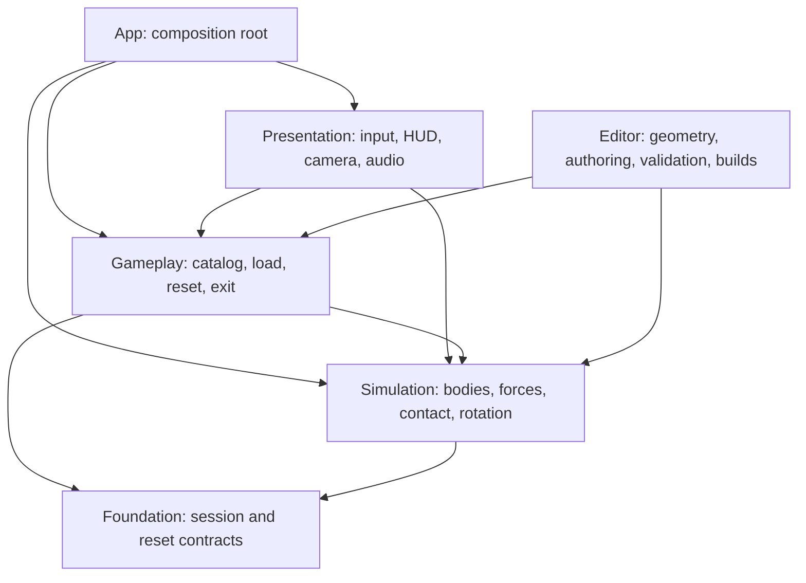

# Kiến trúc Gravity Box

Prototype hiện tại tải ba thí nghiệm hình học dùng chung một mô hình bi thép. Bi chuyển động trong world space; hộp là vật thể kinematic nhận ý định xoay từ người chơi. PhysX giải quyết va chạm giữa chúng. Không có đường điều khiển input trực tiếp tới vị trí hoặc vận tốc của bi.

## Phụ thuộc

Các lớp được cô lập bằng asmdef. Foundation không tham chiếu UnityEngine. Simulation không biết LevelManager/HUD. Gameplay không đọc touch/chuột hoặc xây giao diện. App truyền dependency tường minh. Editor và test assemblies không vào release player.

## Quyền sở hữu

| Đối tượng | Chủ sở hữu / tuổi thọ | Trách nhiệm |
| --- | --- | --- |
| GameBootstrap | Gameplay scene / phiên chạy | Khởi tạo clock 120 Hz và kết nối hệ thống |
| LevelManager | Bootstrap / phiên chạy | Load một hộp, reset, chuyển hộp thủ công, session |
| LevelRuntime | LevelManager / một lần load | Root, spawn, exit, registry theo hộp |
| BallController | LevelManager / một lần load | Rigidbody độc lập, contact/rolling state, reset, dữ liệu feedback |
| EnvironmentForceSystem | Bootstrap / phiên chạy | Áp gia tốc thế giới một lần cho mỗi body đã đăng ký |
| BoxRotationController | LevelRuntime / một lần load | Đổi input intent thành chuyển động kinematic bị giới hạn |
| Catalog / profile | Asset / read-only runtime | Hình dạng, vật liệu, kích thước và thông số chung |
| HUD / camera / audio | Bootstrap / phiên chạy | Thể hiện trạng thái vật lý và nhận thao tác |

Ball không nằm dưới transform của hộp. Khi đổi hộp, manager xóa force targets và vô hiệu hóa root/ball cũ trước Destroy cuối frame, tránh collider của hai bàn cùng hoạt động. Cơ sở PhysicalProp và các cơ cấu cũ vẫn còn để tham khảo; không có instance của chúng trong ba bàn hiện tại.

## Clock, scale và contact

Một đơn vị Unity bằng một mét. Bi bán kính 0,015 m, khối lượng khoảng 0,111 kg; quán tính cầu đặc phải nhất quán với `I = 2/5 m r²`. Vỏ hộp dày 0,006 m; độ sâu tổng khoảng 0,09 m. Tỷ lệ hiển thị đến từ camera, không scale phóng đại Rigidbody.

Input gửi góc mong muốn tới controller; controller dùng MoveRotation trong fixed step. Gia tốc Trái Đất là `(0, -9.81, 0)` trong world space. Hệ lực dùng ForceMode.Acceleration và không nhân timestep lần thứ hai. Ball nhận lực/contact; renderer đọc pose nội suy để hiển thị. Profile rolling resistance xử lý tổn hao khi có mặt đỡ, không dùng damping trong không khí để thay thế ma sát lăn.

Mô phỏng dùng 1/120 s. Contact offset, bounce threshold, solver và giới hạn tốc độ quay của bi được đặt theo scale bàn nhỏ. Giới hạn góc xoay của hộp hạn chế input gây vận tốc bề mặt quá lớn. Việc chọn giá trị phải được đo bằng test dốc/va chạm; không chốt cảm giác chỉ từ Inspector.

## Hình học và cửa thoát

LevelDefinition khai báo `ContainerShape`: Circle, Square, Triangle. Hình dạng quyết định biên thành hộp thực. Hộp vuông có collider **Fixed cube**, cạnh 0,064 m, thuộc compound body kinematic của hộp; nó không nhận xung từ ball để di chuyển tương đối với hộp.

Cửa giữ quy ước local +Z hướng ra ngoài, bán kính 0,023 m và wall half-depth 0,003 m. Renderer/collider dùng cùng hình học mặt cắt. Ring chỉ có renderer, không collider. ExitSocket kiểm tra sweep từ phía trong qua bán kính tròn và đợi toàn bộ cầu vượt mặt ngoài. Sai số clearance/completion tính theo bán kính bi; không giữ các dung sai vài centimet từ prototype cũ.

Bounds của LevelRuntime là hàng rào kiểm tra lỗi sau vùng vỏ và ngưỡng thoát, không phải collider. Kiểm thử hình học kiểm tra collider thật quanh chu vi, spawn clearance, lỗ thật và sự giữ bi khi hộp nghiêng.

## Session và reset

Active có thể chuyển Paused, Completing khi bi thoát, hoặc Failed nếu phát hiện lọt ra ngoài sai đường. Completing giữ time scale 1; manager không tự chuyển bàn theo timer. Next được người chơi gọi và quay vòng ba hộp. Reset có thể gọi từ trạng thái đang chơi hoặc đã thoát để lặp cùng điều kiện.

Reset khôi phục root pose trước, xóa input backlog, khôi phục exit/traversal state, rồi khôi phục world pose, vận tốc và contact state của bi. Cuối cùng SyncTransforms và BeginTracking lấy mẫu mới. Registry chỉ capture trạng thái ban đầu một lần; reset không ghi đè trạng thái chuẩn bằng kết quả thử trước đó.

## Mở rộng sau khi cảm giác đạt

Giữ seam giữa simulation, level content và presentation để tinh chỉnh từng phần. Chỉ thêm bàn/cơ cấu sau khi cảm giác bi đạt qua thử trực tiếp. Force providers, PhysicalProp, save adapter hoặc loader async có thể được mở rộng khi có yêu cầu cụ thể; số lượng lớp không phải mục tiêu. Các rule tín hiệu/zero-G cũ không được coi là nền tảng cần bật lại.
