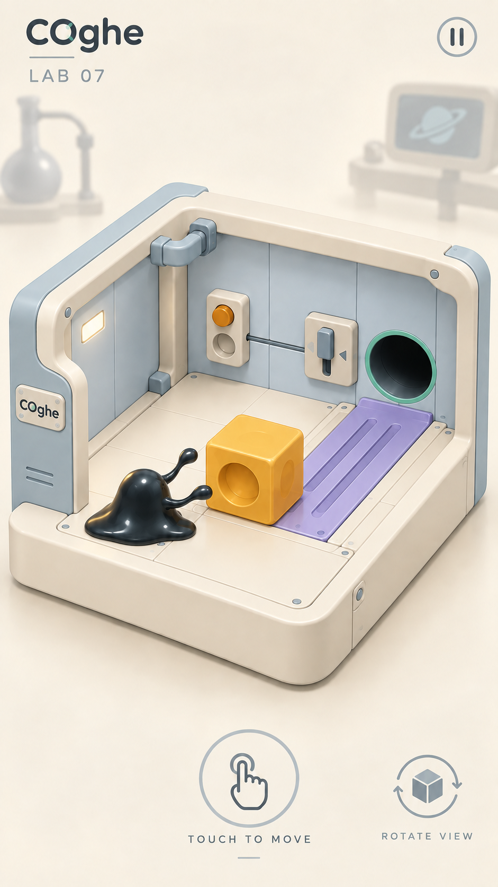
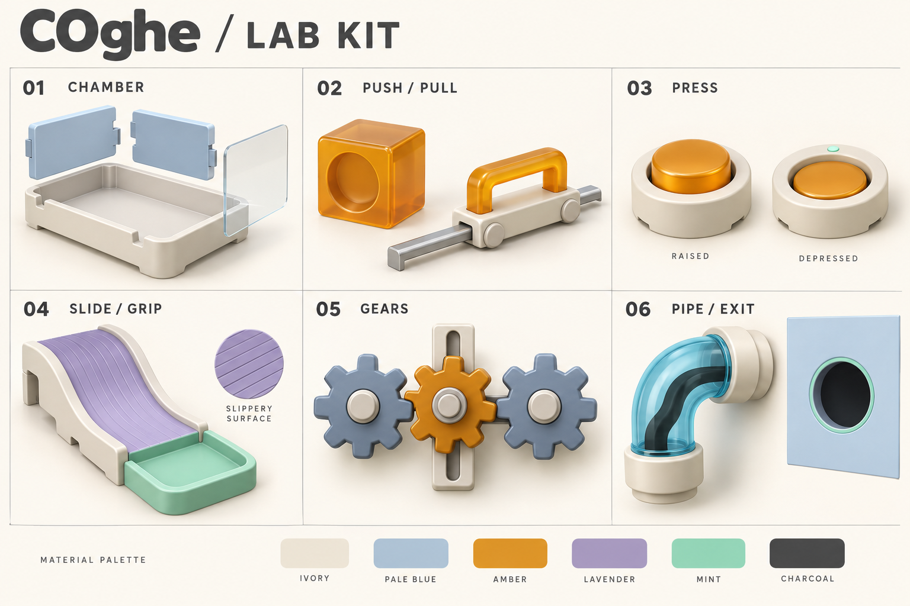
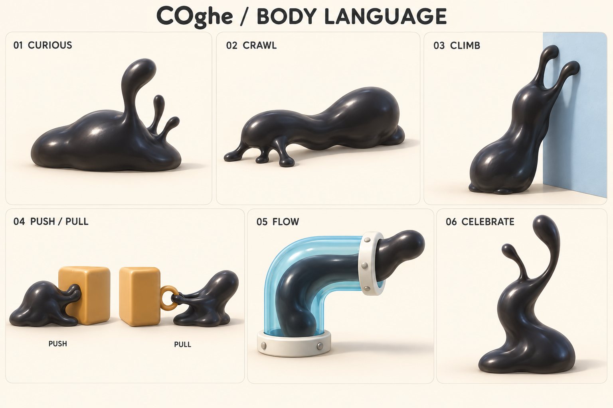

# COghe — Concept mới cho Blender và mobile

[Kế hoạch xây dựng và đo 10 màn V2 trên nhánh NewGraphic](IMPLEMENTATION_PLAN.md).

Ngày 28/09/2026. Theo yêu cầu thiết kế lại concept cho hybrid casual giải đố trong phòng nghiên cứu sinh vật ngoài hành tinh. Đây là **đề xuất art và tài liệu bàn giao dựng hình**, chưa phải asset Blender, screenshot Unity hoặc kết quả đo hiệu năng. Không thay STYLE_RULES hay scene hiện hành bằng ảnh concept.

## Hướng thiết kế

**Phòng lab đồ chơi cao cấp**: khối lớn bo mềm, sáng và ấm, cơ cấu dễ đọc, sinh vật đen là tâm điểm. Người chơi đóng vai người hướng dẫn/chăm sóc trong phòng nghiên cứu. Cảm giác tò mò, thử nghiệm và gắn bó; giữ nguyên cơ thể bất đối xứng, xúc tu và biểu cảm bằng dáng. Không thêm mắt, răng, mặt hay đầu cố định.

Ưu tiên nhìn theo thứ tự: sinh vật → mục tiêu/cơ quan → vùng bám/trơn → bối cảnh. Hình ảnh phân cấp rõ để dễ hiểu ở màn hình nhỏ; không khẳng định khả năng giữ chân người chơi chỉ từ concept.

## 01 — Gameplay dọc

Khung nhìn 3/4 gần trực giao, buồng thử nghiệm chiếm phần lớn vùng chơi. Vỏ ivory, vách xanh nhạt, vật tương tác amber, vùng trơn lavender, viền lỗ mint. Nền kể chuyện bằng bóng dáng thiết bị nghiên cứu, có thể chuẩn bị sẵn thành ảnh nền; không cần mô phỏng cả phòng lab.

Mặt trước/nóc được cắt lớp để quan sát. Đây là cách trình bày: hộp vẫn kín về physics, navigation và chọn điểm. Chữ LAB 07 là nhãn minh hoạ, không phải thiết kế thay thế màn 07. Bố cục cơ quan trong tranh không chứng nhận đường giải.

## 02 — Bộ module dựng Blender

| Module | Cách dựng đề xuất | Tách bộ phận để dùng trong Unity |
| --- | --- | --- |
| Buồng nghiên cứu | Khối hộp, extrude và bevel; tấm vách lắp riêng | Đế, vách, kính và gá ngoài riêng; mặt gần camera có thể ẩn/mờ |
| Thùng/tay kéo | Cube bo cạnh, hốc tròn; tay nắm hình đơn giản | Pivot của thùng và carriage theo cơ chế hiện có |
| Nút bấm | Cylinder thấp, bezel và cap | Cap có hành trình lún; chỉ báo theo trạng thái thật |
| Máng trượt | Profile liên tục có độ dày, sweep/extrude, thành chắn thấp | Mesh nhìn và collider riêng; mép nối không tạo bậc |
| Bánh răng | Profile răng lặp, extrude, bevel nhỏ | Pivot đúng tâm; ray riêng; khớp răng phải tính lại theo khoảng cách trục |
| Ống và lỗ | Curve sweep, tiết diện tròn, vòng nối riêng | Giữ lòng ống đúng đường chạy; cổ nối không thu hẹp aperture |

Ảnh gear là mẫu ngôn ngữ tạo hình, không dùng để lấy trực tiếp profile ăn khớp. Thùng amber trong bảng còn hơi trong: bản sản xuất dùng opaque satin như ảnh gameplay, trừ khi cơ chế cần nhìn xuyên. Khay mint trong bảng là đề xuất vật liệu cố định; đèn trạng thái mint phải tách riêng và có hình/animation để tránh hiểu nhầm khay đã kích hoạt.

## 03 — Dáng và tương tác COghe

Sáu nhóm: tò mò, bò, leo, đẩy/kéo, chui ống và ăn mừng. Dáng leo cần thân trĩu theo trọng lực, dáng đẩy nén thân, dáng kéo căng xúc tu; chui ống giữ dòng mô liên tục. Tư thế trong bảng là key pose, chưa phải animation clip hoặc kiểm chứng bảo toàn thể tích.

Blender dùng để sculpt mẫu thân, kiểm tra silhouette, tạo dáng tham chiếu và thử rig/shape keys cho cử chỉ. Runtime hiện có vẫn chịu trách nhiệm biến dạng theo va chạm, tách/hợp và đi qua ống. Không thay hệ cơ thể bằng một FBX rig cứng rồi kỳ vọng tự tách/hợp; cần kiểm thử một mẫu tích hợp trước khi sản xuất animation hàng loạt. Không dùng mô phỏng chất lỏng Blender chạy trực tiếp trên điện thoại.

## Bàn giao cho người dựng hình

1. Dựng trước một kit gồm chamber, thùng, nút và đoạn ống. Match silhouette/camera, sau đó mới thêm chi tiết nhỏ.
2. Dùng đơn vị mét, kích thước/pivot lấy từ scene gameplay. Giữ bản modifier trong .blend, xuất mesh FBX riêng để kiểm tra trong Unity. Bevel khởi điểm 2–3 segments cho vật nhỏ; chỉ tăng khi silhouette ở góc zoom cần nó. [Tài liệu Bevel của Blender](https://docs.blender.org/manual/en/5.1/modeling/modifiers/generate/bevel.html).
3. Chuẩn hoá tên ví dụ Chamber_Base, Button_Base, Button_Cap, Gear_A, Pipe_Collar. Đặt pivot tại trục quay hoặc điểm lắp; không gộp các phần chuyển động vào một mesh.
4. Dùng palette/material chung. Blender shader node không phải hợp đồng hiển thị Unity: tái tạo vật liệu trong URP, chuyển chi tiết cần thiết thành texture. UV không chồng ngoài chủ ý; texel density nhất quán.
5. Bake AO cục bộ cho khe/lắp ghép, không bake hướng bóng thế giới vào vật xoay. Không thêm collider từ vít, đường viền hoặc đồ trang trí. Không đổi khe, lỗ, lực hay khối lượng theo cảm tính dựng hình.
6. Import kit vào một scene mẫu, đối chiếu với ảnh ở góc overview và zoom. Chỉ nhân rộng khi gameplay và mobile đạt kiểm tra.

## Ngân sách khởi điểm để thử nghiệm

Các con số dưới là hạn mức thử art, không phải số đo hay bảo đảm FPS; giữ ngân sách mô phỏng hiện tại.

| Hạng mục | Mục tiêu ban đầu |
| --- | --- |
| Prop đơn giản | 300–1.500 triangles; cơ quan phức tạp 1.500–4.000 |
| Kit môi trường nhìn thấy | Khoảng 40.000–80.000 triangles, chưa tính mesh COghe hiện hành |
| Vật liệu | 6–8 vật liệu dùng chung; ưu tiên opaque, kính chỉ nơi cần nhìn xuyên |
| Texture | Một atlas 1K cho kit và texture nhỏ dùng chung; tăng khi kiểm tra zoom chứng minh cần |
| Ánh sáng | Một key có shadow, fill nhẹ, reflection chuẩn bị sẵn; không bắt buộc bloom/SSAO/refraction |
| Mục tiêu thiết bị | Thử 60 FPS trên OPPO đang dùng; nếu không đạt phải đo CPU/GPU và điều chỉnh, không suy từ Blender render |

Unity khuyến nghị dùng Profiler để đo tác động cấu hình URP; giảm shadow resolution và các texture/HDR không cần thiết là các lựa chọn tối ưu. [Nguồn Unity](https://docs.unity3d.com/6000.3/Documentation/Manual/urp/configure-for-better-performance.html). Không tắt feature mà gameplay đang cần chỉ để đạt một con số.

## Kiểm tra trước khi đưa vào game

- Xem ở 360×640 và 390×844: sinh vật, tay nắm, lỗ thoát và vùng trơn phải phân biệt ngay; thêm hình/texture để màu không là tín hiệu duy nhất.
- Chuyển overview/zoom/orbit: không bị thành hộp che thao tác, không xuyên vật, không nhấp nháy các mặt trong suốt.
- Nút nổi/lún, gear rời/khớp, cửa đóng/mở nhìn khác nhau rõ ràng. Animation chỉ phản ánh trạng thái simulation.
- Test va chạm ở cổ ống, nối cầu trượt, mép lỗ; viền lỗ phẳng không có collider. Tranh không quyết định kích thước vật lý.
- Đo frame time CPU/GPU, p95, bộ nhớ và nhiệt sau 15 phút trên OPPO; đối chiếu cùng route và camera với bản hiện hành.

## Provenance và QA của đợt concept

Tạo bằng imagegen tích hợp. Prompt đầy đủ trong [Prompts](Prompts/). Ảnh tham chiếu runtime đã được xem để giữ nhận diện: ../Runtime/07-after.png; ba lần tạo mới dùng mô tả bằng chữ. Ảnh gameplay được chỉnh thêm từ bản nháp để bỏ giọt rời, làm thùng opaque và viền lỗ phẳng hơn.

Đã xem trực tiếp cả ba ảnh: bố cục rõ, cùng palette, không thêm mặt cho sinh vật. Giới hạn còn lại: gear cần dựng chuẩn hình học; độ trong của cube ở kit cần giảm; lỗ trong render vẫn có phản xạ khiến viền có cảm giác dày, khi dựng phải dùng chuẩn phẳng trong STYLE_RULES. Board tư thế không phải turnaround đo kích thước hay animation đã chạy.

File ảnh gốc giữ nguyên tại thư mục generated_images của Codex; các bản chọn đã copy vào repository. Cập nhật 29/09/2026: kit `.blend`/`.fbx` và adapter Unity đã có trong `ArtSource/COghe/NewGraphic`; V2 01–10 đã reskin trên nhánh thử nghiệm. Các ảnh ở tài liệu này vẫn là concept; ảnh runtime và số đo xem [báo cáo](../../../Verification/COgheNewGraphic/README.md).
