# COghe — Day Lab trên 10 màn Origin

Ngày 16/09/2026. Mở rộng từ bản Unity màn 07 đã được người dùng duyệt (`8718849`). [STYLE_RULES](../STYLE_RULES.md) là chuẩn để phát triển tiếp. Toàn bộ model được dựng trong Unity bằng C#, không dùng Blender.

## Bản chạy và quy trình dựng

Mở `Builds/Venom/macOS/Venom.app`, chọn 01–09 hoặc BOSS trên HUD. Tên app, bundle và dữ liệu save giữ nguyên. Menu **Gravity Box → COghe → Apply Day Lab · All 10 Origin levels** áp lại art vào scene hiện có; không tạo lại puzzle. Menu Generate Origin tạo lại toàn bộ nội dung tác giả và cũng tự áp style.

`COgheDayLabBuilder.cs` chứa kit chung và mẫu 07. File partial `COgheCampaignArtBuilder.cs` dựng frame, cầu, ống và cơ quan cho các màn còn lại. `COgheDayLabPresentation` quản lý HUD, kính, sàn và các chi tiết che khi zoom; nhận trạng thái từ campaign. Các mesh theo màn lưu riêng trong `Assets/_Game/Venom/Art/DayLab/Meshes/LevelNN`; màn 07 giữ thư mục mesh mẫu. Vật liệu, reflection và profile dùng chung.

## Những phần đã áp dụng

| Màn | Hình ảnh và tính chất được giữ rõ |
| --- | --- |
| 01 | Khung nhôm/sứ sáng, sàn pearl, lỗ sàn thật không bị đế trang trí bịt |
| 02 | Vách kính thấp có đường biên mảnh, thấy thân leo qua hai chiều |
| 03 | Lỗ mặt sau giữ nguyên; xoay khung không đổi mục tiêu chọn mặt |
| 04 | Vùng trơn satin xanh băng có ranh giới; thân đen nổi trên kính |
| 05 | Nóc trơn khác kính thường; sàn cũ trong hơn khi bị lật lên trước camera |
| 06 | Cầu kính satin, đường ghép mảnh bên ngoài, để hở miệng thoát |
| 07 | Giữ mẫu đã duyệt: thùng resin hổ phách, tray sứ, dấu tiếp xúc thùng |
| 08 | Hai khoang cùng kit, vùng bám quanh miệng và ống trong suốt, vòng nối nằm ngoài lòng ống |
| 09 | Nắp kính rời với viền hổ phách; frame nắp đi theo Rigidbody thật khi rơi |
| 10 | Dao kim loại, ray nhôm, nắp sứ có dấu hổ phách, cảm biến A/B theo trạng thái thật; không chỉ lời giải |

Boss dùng cùng Day Lab sáng theo yêu cầu áp style này cho 10 màn. Night Trial vẫn là concept tham khảo. Nhà giữ chức năng mở khoá/cho ăn/chơi hiện có; chưa dựng lại nội thất theo tranh concept.

## Gallery Unity

Ảnh dưới là render camera Unity 720×1280 từ các scene đang chạy, không phải concept; HUD không nằm trong render camera này.

| 01 — Bò đi | 02 — Leo đi |
| --- | --- |
| 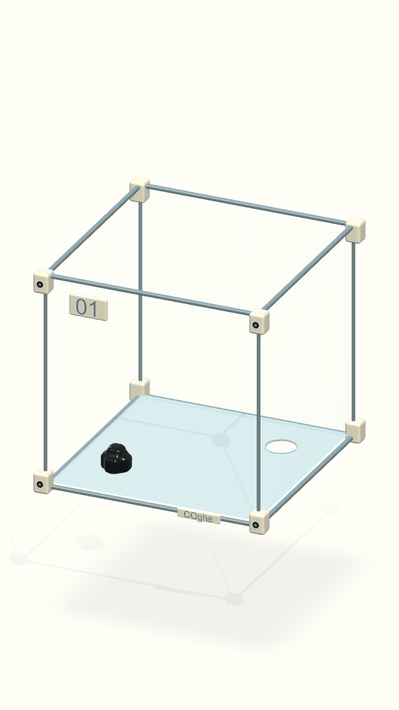 | 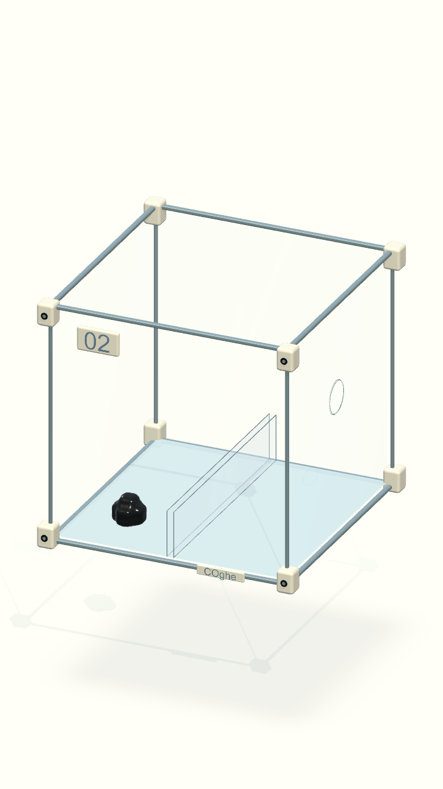 |

| 03 — Xoay đi | 04 — Trơn đấy |
| --- | --- |
| 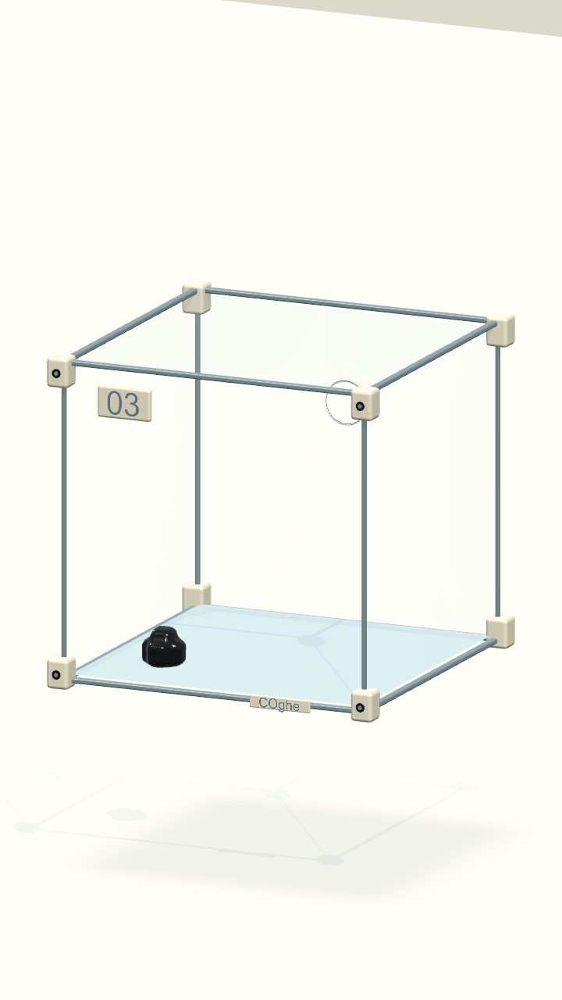 | 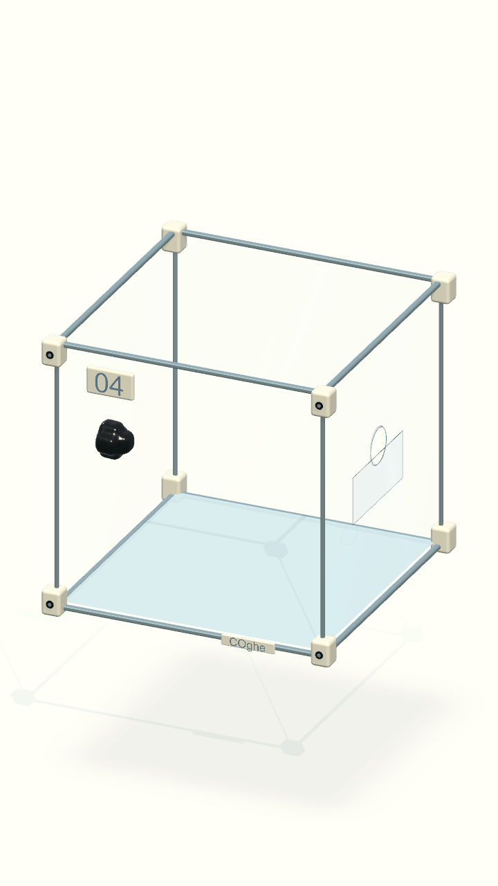 |

| 05 — Trượt đi | 06 — Xoay tròn |
| --- | --- |
| 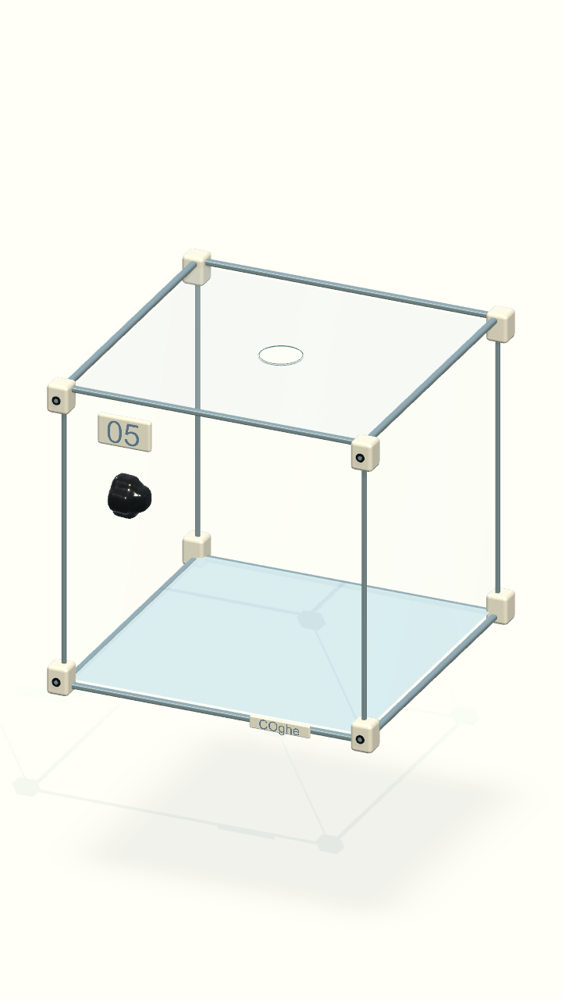 | 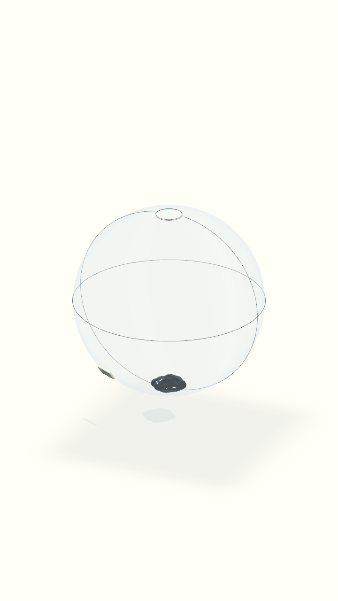 |

| 07 — Đẩy | 08 — Chui qua lỗ |
| --- | --- |
| 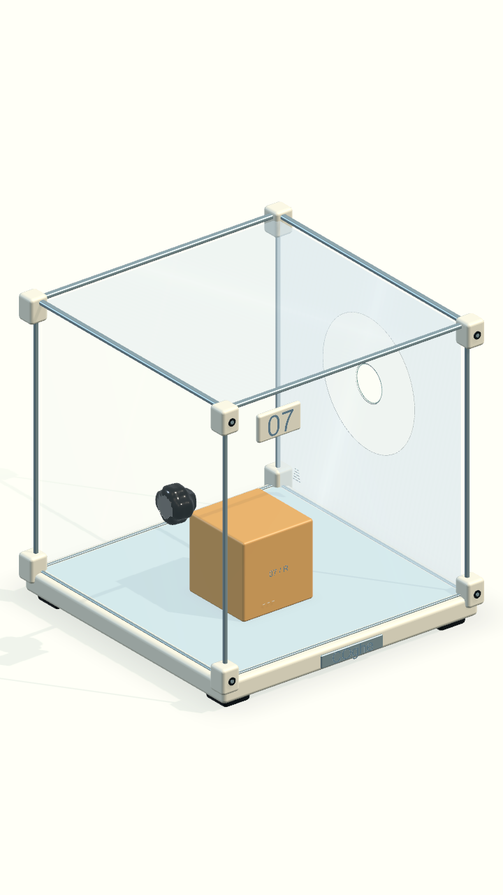 | 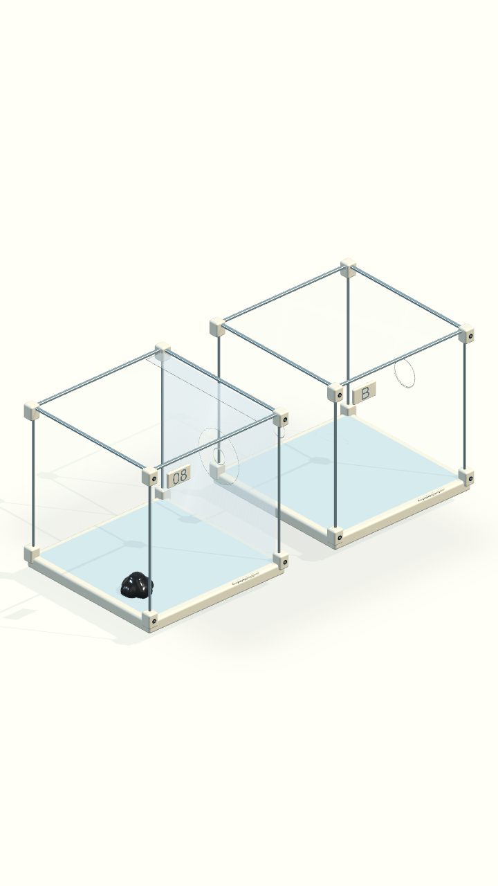 |

| 09 — Lật đi | 10 — Boss |
| --- | --- |
| 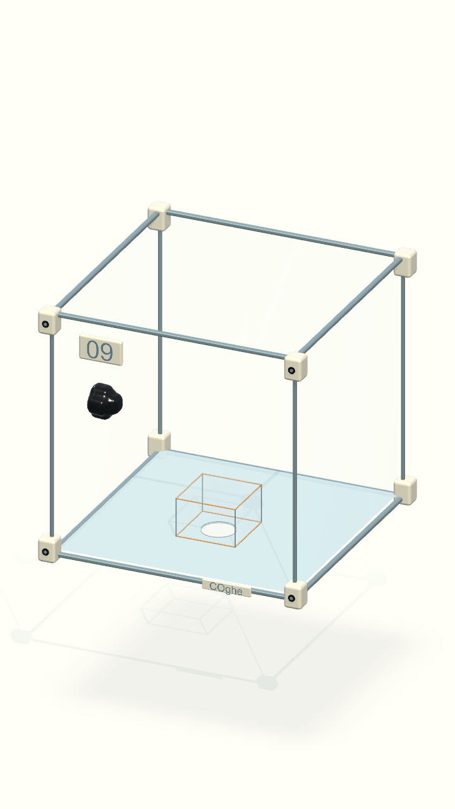 | 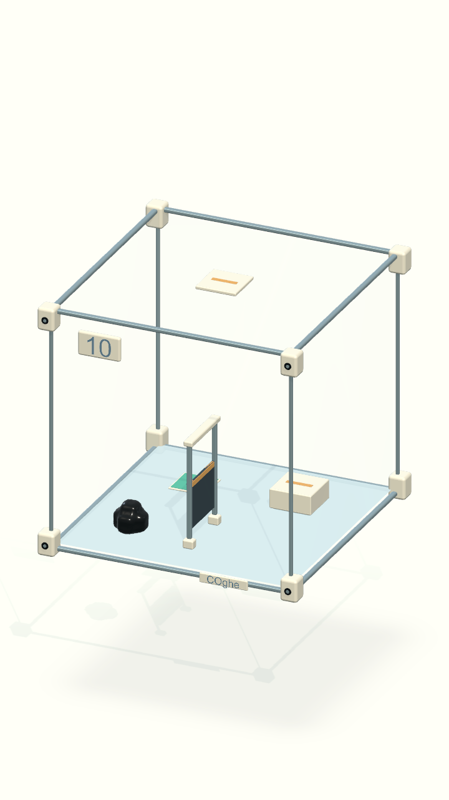 |

| Lật hộp ở màn 05 | Nắp đã rơi ở màn 09 |
| --- | --- |
| 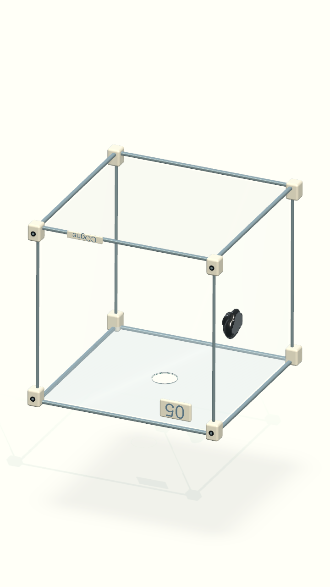 | 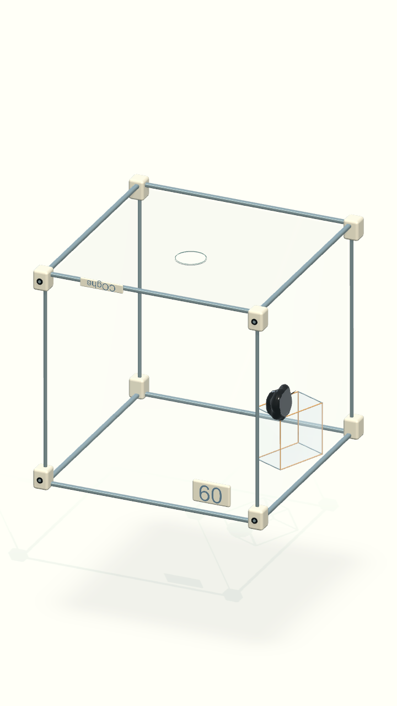 |

| Mô chảy qua ống | Hai phần phối hợp |
| --- | --- |
| 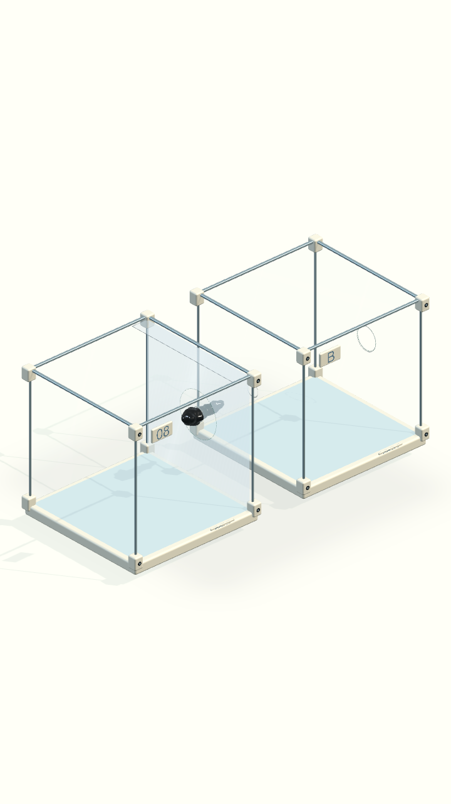 | 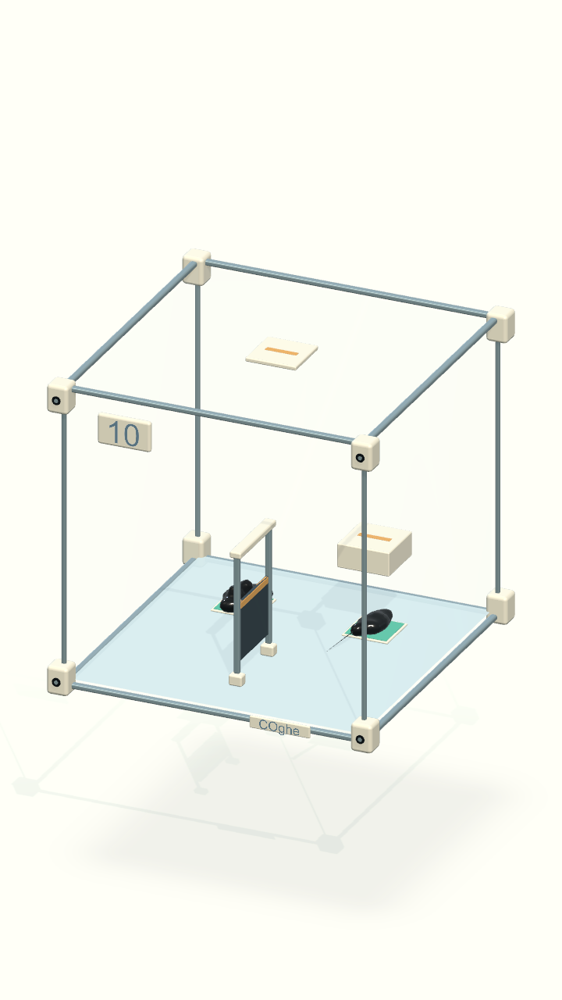 |

## Kiểm chứng và giới hạn

- **25/25 PlayMode qua**, kết thúc 10:17:30 ngày 16/09/2026 (giờ Việt Nam). Build macOS thành công.
- Đã kiểm tra trực tiếp bản Mac: chọn Boss không có chỉ dẫn, bấm dao và đổi phần điều khiển, mở Nhà/cho ăn/chơi, zoom màn 08 ẩn khung và chạm lỗ màn 01 để tự sang màn 02.
- [Đối chiếu vật lý với bản đã duyệt](physics-comparison.json): dữ liệu Rigidbody/collider/joint, pose/parent của chúng, các surface patch, định nghĩa màn, contact material và tham số mô phỏng được giữ nguyên. Trường bán kính cầu chỉ được chuẩn hoá vị trí dòng khi Unity lưu lại YAML.
- Lệnh kiểm tra: `python3 Tools/verify-coghe-art.py`. Script chỉ đọc và so sánh với Git, không sửa scene.
- Bộ PlayMode: `bash Tools/verify-venom.sh GravityBox.Tests.VenomOriginTests`. Bao gồm đường giải 10 màn, leo vách qua lại, trượt rơi, cầu thụ động, đẩy/kéo, bắt vành ống, nắp rơi, Boss tách–giữ–hợp thể, thua khi thoát sớm và mở Nhà. [Kết quả](verification.json).
- Fixture test ngắt `FixedUpdate` ngay tại `sceneLoaded` trước bước mô phỏng đầu tiên: chế độ Physics Script không tự ngắt callback này. Nhờ đó hai lượt đối chiếu quán tính màn 06 có cùng điều kiện đầu; không nới sai số và không đổi physics runtime.
- Chữ trong không gian dùng shader kiểm tra depth, tránh hiện xuyên nắp đóng. Bề mặt trơn giữ màu satin khi mặt kính gần camera được làm trong. Đồ trang trí không có collider hoặc nhận input.
- Một đèn chính đổ bóng, một đèn bù; cubemap studio 128 px/mặt dựng sẵn; không runtime reflection/refraction/bloom/SSAO. Mesh trang trí gộp theo material, cơ quan chuyển động tách riêng.
- Số vertex/tam giác của **mesh art được sinh** nằm trong [verification.json](verification.json); chưa bao gồm hình học gameplay cũ, nhãn, LineRenderer hoặc mesh sinh vật động. Đây không phải phép đo draw call/frame time.
- Chưa đo CPU/GPU/nhiệt trên thiết bị Android/iOS. Chưa xuất APK trong đợt này.
