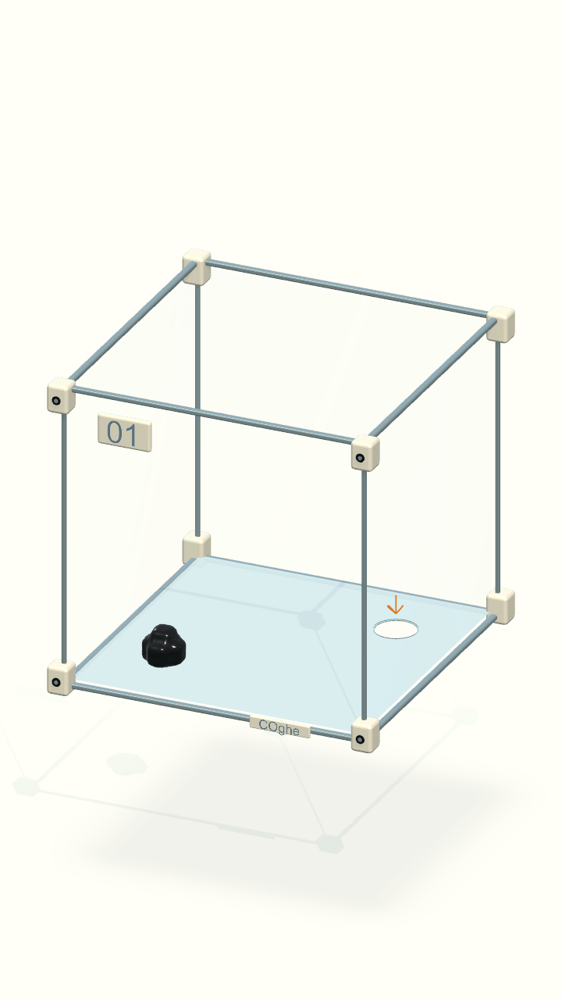
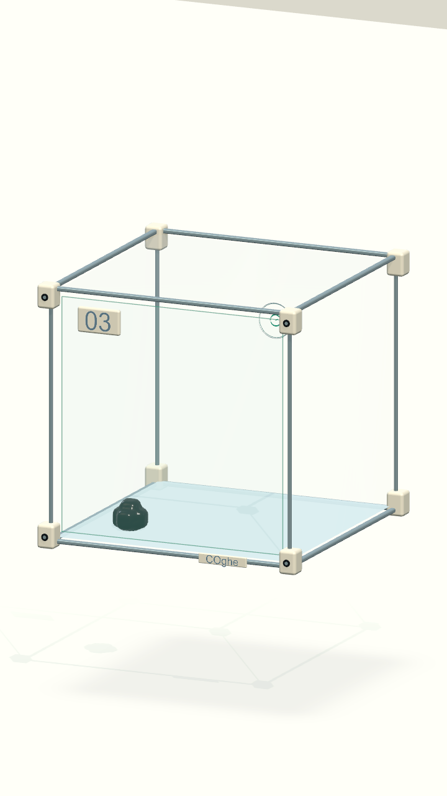
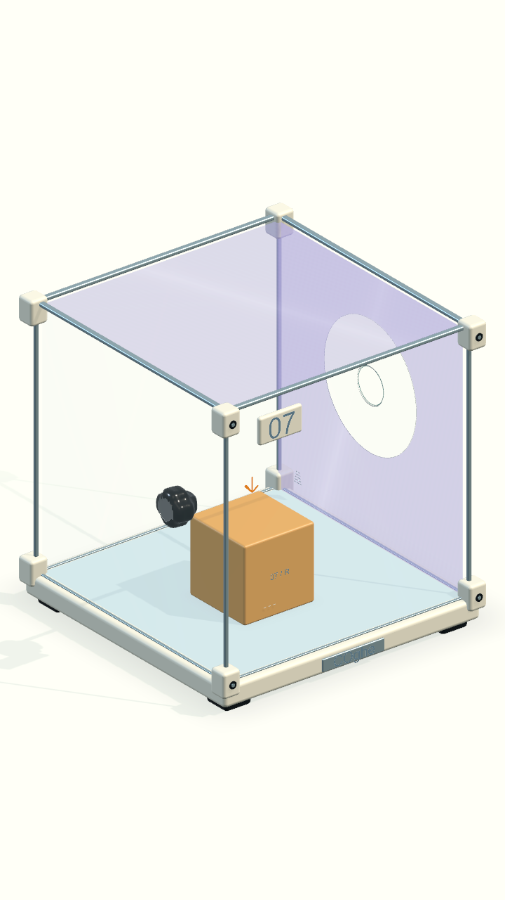
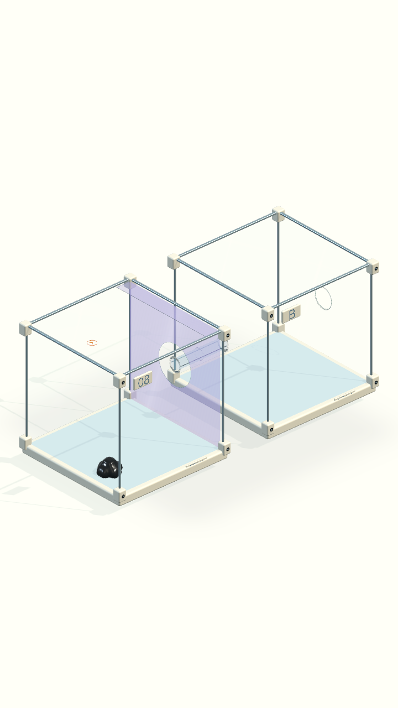
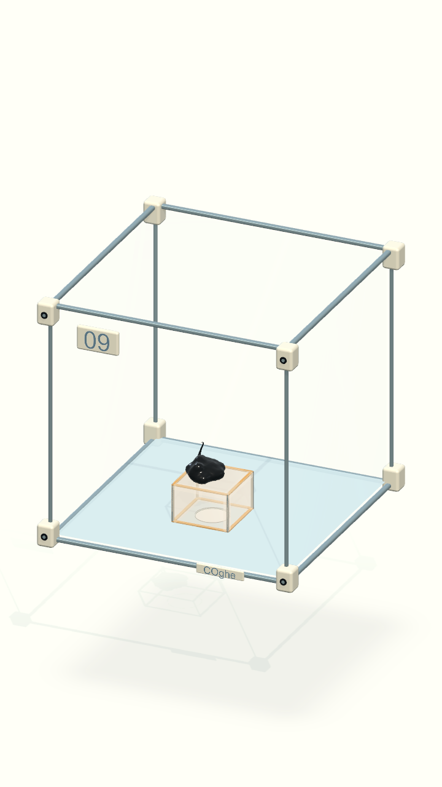
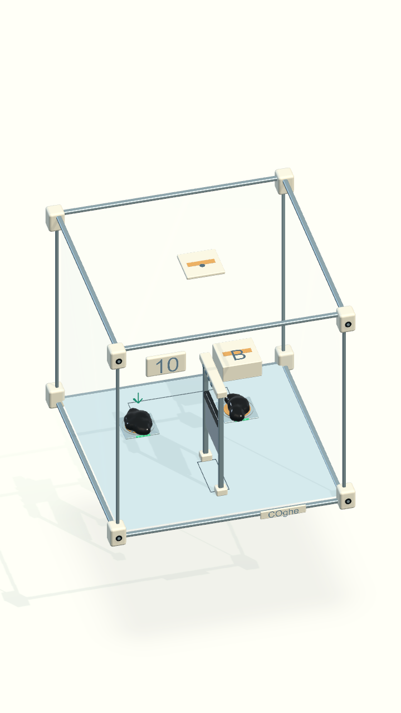

# COghe — dấu điều khiển và nắp dày

Ảnh render từ Unity, khung dọc 720×1280. Màu mint là phản hồi điều khiển;
hổ phách là gợi ý hành động. Icon xoay/cấm xoay thuộc HUD, kiểm tra trực tiếp
trong bản chạy macOS vì các ảnh camera dưới đây không chụp lớp OnGUI.

38/38 kiểm thử Origin đạt. Log, so sánh vật lý và ảnh bổ sung tại
`Artifacts/COgheControls/`.
