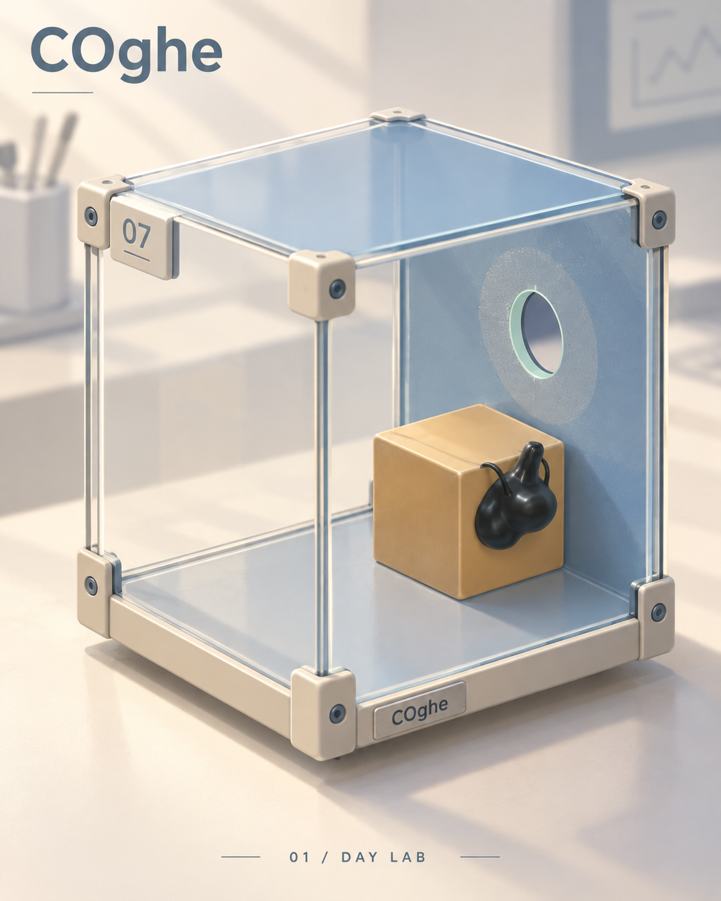
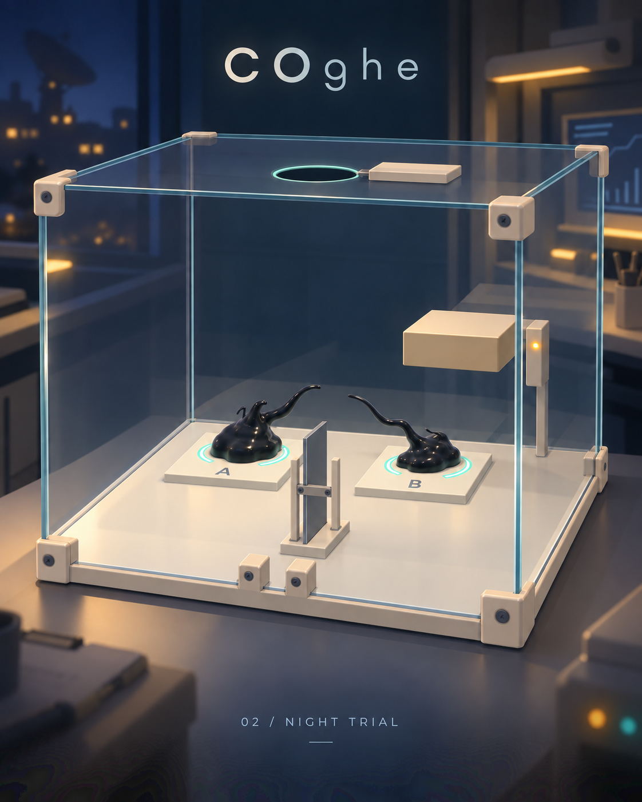
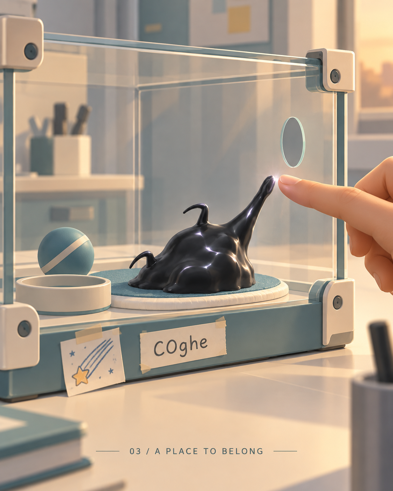

# COghe — Phòng nghiên cứu trở thành nhà

Concept và kế hoạch ngày 15/09/2026. **Đã chốt Day Lab ngày 16/09/2026: 3D cách điệu, phòng nghiên cứu vũ trụ sáng và ấm áp.** Sinh vật dựa trên hình ảnh runtime hiện tại của nhánh Venom.

Chuẩn áp dụng hiện tại: [STYLE_RULES](STYLE_RULES.md). Xem [10 màn trong Unity và kết quả kiểm chứng](Campaign/README.md). Các concept phía dưới là lịch sử định hướng; Boss hiện dùng cùng Day Lab sáng, chưa áp concept Night Trial.

Bối cảnh do người dùng cung cấp: NASA tìm thấy sinh vật trong vật thể lạ rơi xuống Trái Đất; nghiên cứu qua các hộp thử nghiệm, phát hiện trí tuệ/cảm xúc và trở nên thân thiết. Tên sinh vật và game: **COghe**.

Bộ này cập nhật định hướng theo cốt truyện và 10 màn Origin hiện hành. Các tài liệu/concept Venom cũ trong thư mục bên cạnh là lịch sử; những ý tưởng cũ về nâng chỉ số, luật thoát hoặc Boss khác không được đưa trở lại.

## Xem ba concept

**01 — Day Lab: chuẩn cho màn chơi thường**

Kính sạch, vỏ thiết bị sáng, thùng màu ấm, thân đen dễ thấy. Minh hoạ màn 7 với sinh vật bám mặt thùng nhìn về camera và lỗ tròn trên vách.

**02 — Night Trial: biến thể cho Boss**

Cùng vật liệu với ánh sáng buổi tối; hai phần sinh vật giữ A/B. Cửa mở chưa phải chiến thắng: tất cả mô vẫn trong hộp và phải hợp thể trước khi thoát.

**03 — A Place to Belong: Nhà của COghe**

Góc nghiên cứu được cá nhân hoá thành nơi chăm sóc. Cử chỉ qua tấm kính diễn tả sự gắn bó bằng hình khối; sinh vật không có mặt hay mắt mới.

## Kế hoạch và phạm vi

- [Kế hoạch đầy đủ: phong cách, vật liệu, hiệu năng, kiến trúc và các mốc](PLAN.md).
- [Kiểm tra hình ảnh và giới hạn](QA.md).
- Prompt chính xác: [Day Lab](Prompts/01-day-lab.txt), [Night Trial](Prompts/02-night-trial.txt), [chỉnh Night Trial](Prompts/02-night-trial-edit-v2.txt), [A Place to Belong](Prompts/03-a-place-to-belong.txt).

Tạo bằng **imagegen tích hợp**, dùng screenshot local làm tham chiếu danh tính và bố cục; không dùng CLI/API riêng.

Các hình là concept, không phải bản build Unity hoặc bằng chứng performance. Độ mờ nền trong tranh có thể thay bằng nền chuẩn bị sẵn khi triển khai; phản xạ/bóng cần giản lược theo ngân sách thiết bị. Chi tiết khe, bo cạnh và ray cơ quan phải được dựng và kiểm chứng theo kích thước gameplay thật.

Ngày 16/09/2026: từ [bản mẫu Day Lab màn 07 trong Unity](Runtime/README.md) đã được người dùng duyệt, bộ art được mở rộng cho cả 10 màn Origin. Giữ cơ chế, đường giải và bộ mô phỏng cũ; tên ứng dụng vẫn giữ Venom. Ba ảnh phía trên vẫn là concept, không phải ảnh bản build.
