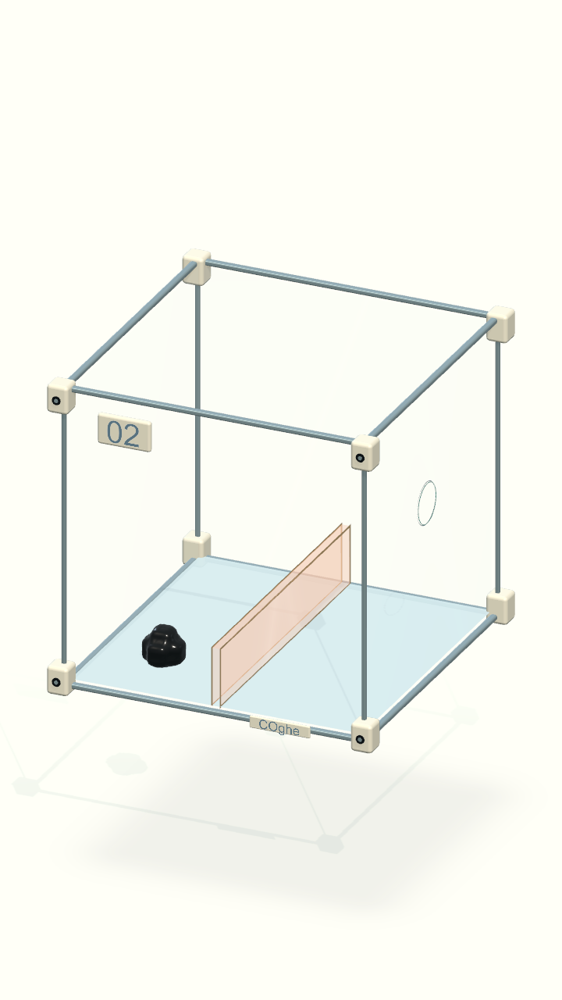
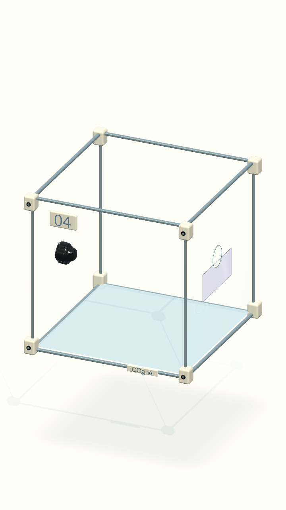
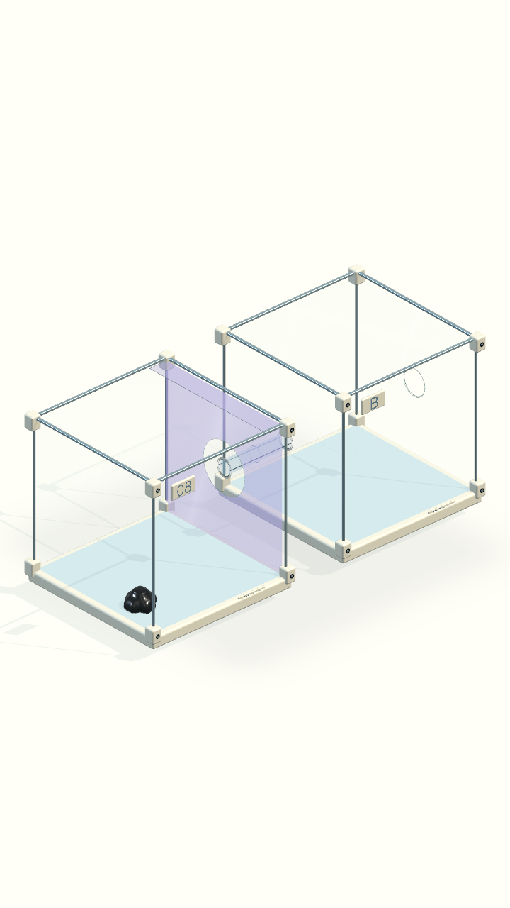
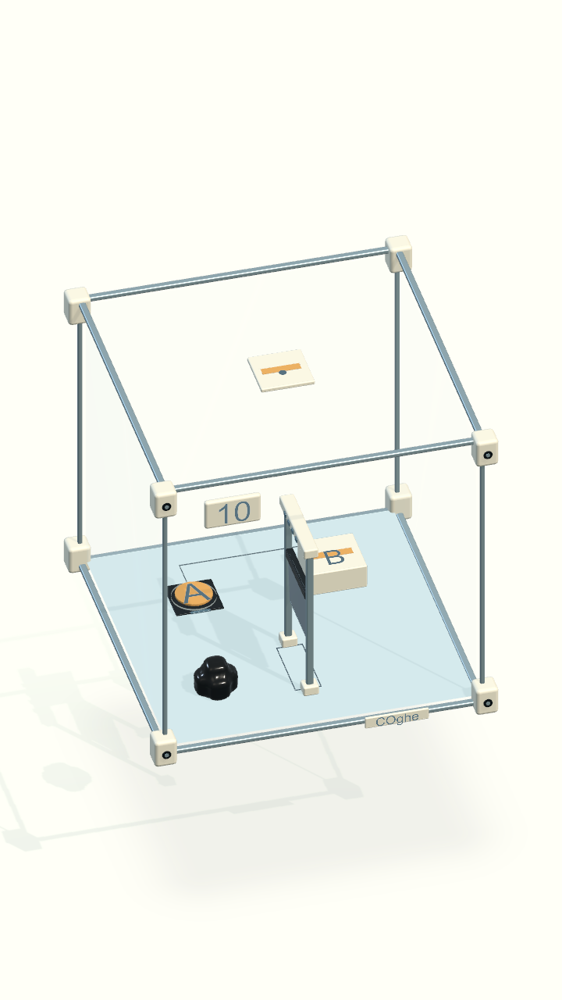
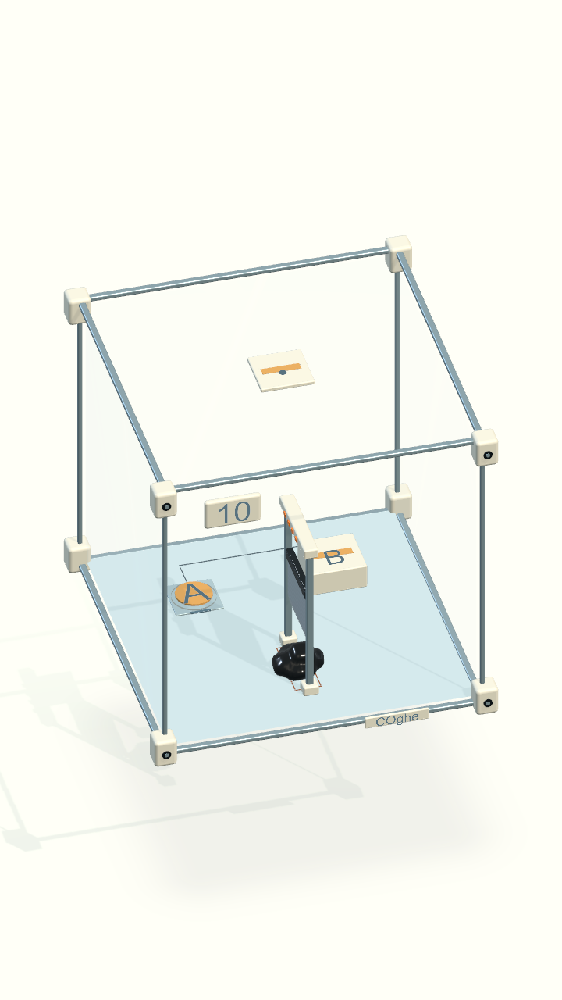
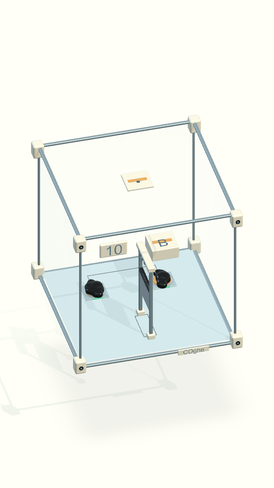
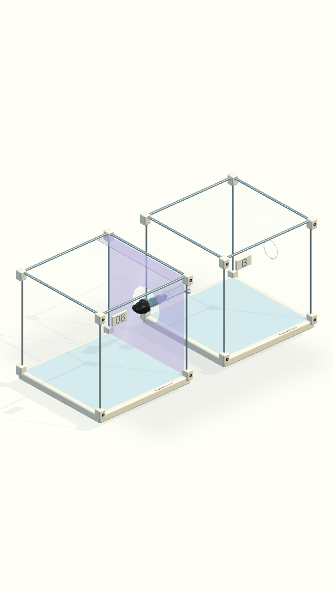

# COghe — cơ quan và vật liệu rõ hơn

Cập nhật 16/09/2026. Ảnh dưới đây là render từ scene Unity ở khung dọc 720×1280.

- 02: nhựa hổ phách trong, mép và độ dày khác kính hộp.
- 04–08: vùng trơn tím satin; vùng bám quanh miệng ống giữ trong và đúng bán kính.
- 08: thành ống cyan trong, vòng sứ và viền kim loại xanh.
- 10: camera cố định 37° / 15°, khóa xoay. Dao thép chờ trên cao; đèn đếm 1 giây theo mô phỏng rồi nhả dao theo trọng lực. Tỷ lệ cắt theo cơ thể lúc dao chạm. Nút A/B lún theo tải, đèn bật từ 12 g.
- Chỉnh vật liệu Boss: thay tấm đế graphite đen bằng xám bạc nhạt. Dao có mặt thép bạc với vân xước 128×128, pháp tuyến riêng từng mặt và cạnh vát đánh bóng; dùng lại ánh sáng/cubemap studio, không thêm đèn hoặc reflection realtime.

## Kiểm tra

- Bộ Origin: **28/28 PlayMode tests qua**, gồm ba tình huống mới: thời gian báo/nhả/reset dao, né khỏi vùng chém, chỉ vị trí lệch khi đang báo.
- Nghiệm Boss hoàn chỉnh: cắt → giữ A/B → hợp thể → thoát → mở Collection; kiểm tra mặt nút lún và nhả theo tải.
- Đối chiếu dữ liệu 01–09: collider, Rigidbody, joint, pose vật lý, navigation, định nghĩa level và tham số mô không đổi.
- Boss giữ nguyên collider/cảm biến/khối lượng. Các thay đổi vật lý có chủ đích: vị trí chờ dao, anchor/giới hạn ray và CCD; định nghĩa khóa xoay và góc camera mới.
- Kiểm tra hình cuối sau chỉnh đèn/vật liệu: **2/2 tests qua** (toàn cảnh 10 màn và chu trình báo/chém/reset). Bản macOS build thành công.
- Chỉnh vật liệu Boss: **2/2 kiểm thử liên quan qua**; đối chiếu riêng trước/sau xác nhận 16 collider/Rigidbody/joint, 8 surface patch, pose và định nghĩa màn không đổi. Ảnh `10-warning` và `10-cooperation` đã cập nhật. Báo cáo: `Artifacts/COgheBossMetal/`.
- Log và báo cáo cục bộ: `Artifacts/COgheReadability/`. Không có kết quả đo FPS trên iPhone.

Chỉ cập nhật ngoại hình Boss bằng **Gravity Box → COghe → Rebuild Day Lab · Boss 10**. Bản nâng cấp cơ quan trước đó dùng **Gravity Box → COghe → Upgrade mechanism readability** và có sửa cấu hình dao. Kiểm thử bằng `bash Tools/verify-venom.sh GravityBox.Tests.VenomOriginTests`, build bằng `bash Tools/build-venom.sh`. Không chạy Generate để chỉ cập nhật ngoại hình của scene đã chỉnh tay.
