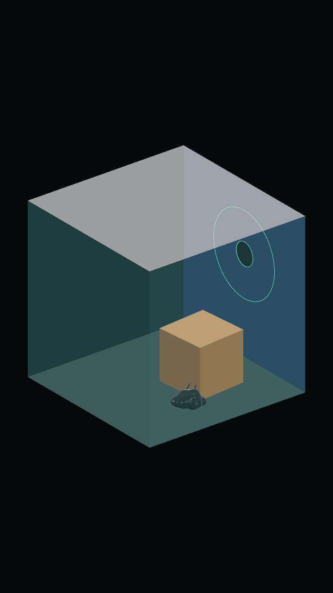
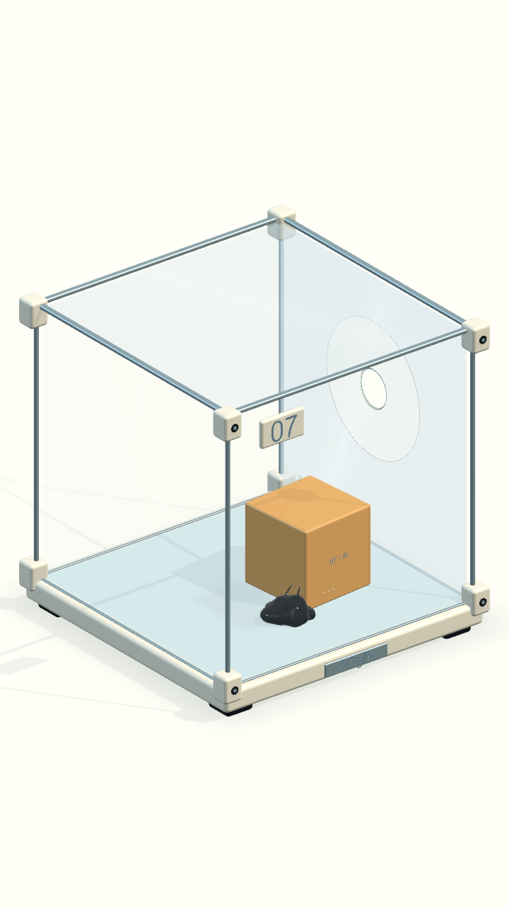
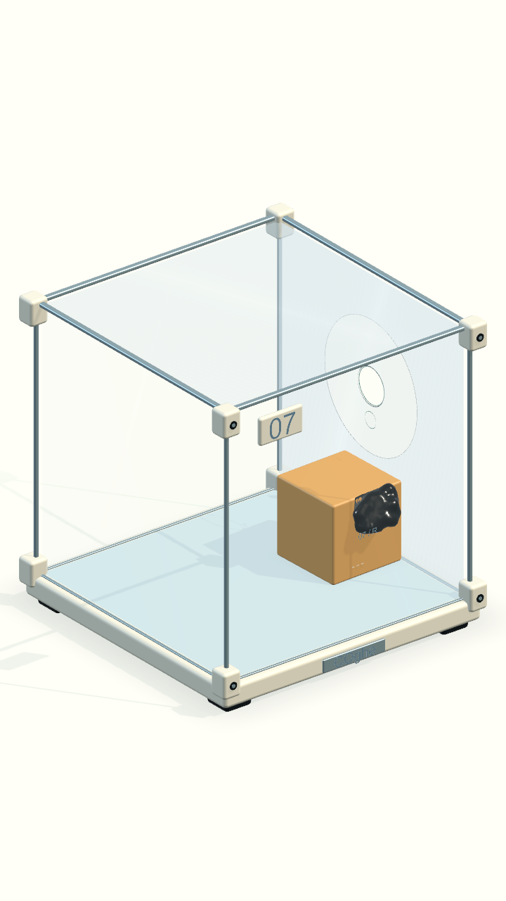
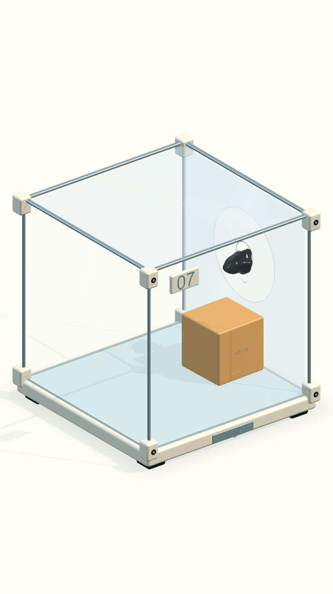

# Day Lab — bản dựng Unity màn 07

Ngày 16/09/2026. Bản mẫu đồ hoạ chạy thật của concept Day Lab, dựng hoàn toàn bằng Unity/C#. Không dùng Blender, FBX hay tranh concept làm nền gameplay.

Tài liệu này lưu **mốc bản mẫu màn 07 tại `8718849`**, trước khi nhân rộng. Bản hiện tại đã áp cho 10 màn: xem [Campaign](../Campaign/README.md) và [STYLE_RULES](../STYLE_RULES.md).

## Phạm vi

- Màn 07: vỏ thiết bị màu sứ ấm, khung nhôm, gá bo cạnh, đầu vít, đế và nhãn COghe.
- Thùng resin hổ phách có bo cạnh, ký hiệu nhỏ; hình học va chạm vẫn là thùng cũ.
- Kính mỏng ít nhuộm màu; vùng trơn xanh băng dùng cùng một shader với vùng bám quanh lỗ. Lỗ vẫn là lỗ hình học thật, viền phẳng không thêm collider.
- Bàn nghiên cứu sáng, một đèn chính có bóng và một đèn bù không bóng. Bóng tiếp xúc mềm là hai quad shader nhỏ, bóng thùng theo vị trí thùng trên sàn cố định của màn 07. Cubemap studio được tạo trước tại bước dựng asset; không có reflection probe cập nhật mỗi frame, khúc xạ, bloom hay SSAO.
- Giữ nguyên cơ thể, xúc tu và animation hiện tại; thay material riêng cho màn 07. Không tăng số hạt hoặc mật độ mesh động.
- HUD sáng riêng cho bản mẫu. Chế độ nhìn gần ẩn góc khung gần camera để không che sinh vật; ăn mừng vẫn ẩn toàn bộ bối cảnh theo hệ thống hiện có.

Các màn khác tiếp tục dùng art trước đây. Tên ứng dụng macOS vẫn là Venom để không đổi định danh/save trong đợt đánh giá art.

## Dựng lại và mở chơi

Trong Unity: **Gravity Box → COghe → Rebuild Day Lab · Level 07**. Lệnh mở scene 07, thay riêng presentation và lưu scene. Bộ sinh campaign cũng gọi builder này cho màn 07.

- Builder: `Assets/_Game/Editor/COgheDayLabBuilder.cs`.
- Mesh, material và cubemap: `Assets/_Game/Venom/Art/DayLab/`.
- Shader: `Assets/_Game/Shaders/COgheLabGlass.shader`.
- HUD và xử lý khung che khi zoom: `Assets/_Game/Venom/Runtime/COgheDayLabPresentation.cs`.
- Scene: `Assets/_Game/Venom/Campaign/VenomOrigin07.unity`.
- Bản chạy: `Builds/Venom/macOS/Venom.app`; chọn **07**.

Builder gộp các mesh trang trí theo vật liệu, tách riêng góc gần camera và thùng chuyển động. Mọi chi tiết mới đều không có collider. Profile sinh vật riêng sao chép thông số từ campaign và chỉ thay `Skin`.

## Kiểm tra

- Đối chiếu scene với commit trước khi sửa: 14 Rigidbody/collider giữ nguyên dữ liệu, vị trí, góc, tỉ lệ và parent. Các child trang trí được bổ sung.
- Đối chiếu profile: toàn bộ tham số mô phỏng/animation giữ nguyên, chỉ material cơ thể đổi.
- **5/5 kiểm tra PlayMode qua**, 09:41:37 ngày 16/09/2026 (giờ Việt Nam): chạm chọn thùng; đẩy/kéo/buông sau 3 giây; kéo thùng khỏi kính; kê thùng rồi leo và thoát; tải cả 10 màn và giữ đủ mô trong hộp. [Kết quả và đối chiếu vật lý](verification.json).
- Đã phát hiện và sửa qua kiểm tra hình: nền quá vàng, bóng quá gắt, đồ nền chiếm khung hình, chữ đè lên hộp, thanh khung che COghe khi zoom.
- Build macOS thành công. Kiểm tra trực tiếp cửa sổ game: chọn màn 07, chạm thùng để sinh vật tiếp cận, bật nhìn gần và xác nhận thanh khung gần camera đã ẩn. Các ảnh dưới được chụp qua camera Unity ở cùng chuỗi mô phỏng để so sánh art.

Ảnh trước/sau ở thư mục này là render gameplay Unity. Concept tham chiếu ở `../Concepts/01-day-lab.png`. Bản mẫu giữ bố cục gameplay và tỉ lệ sinh vật thực tế, nên không trùng hoàn toàn bố cục minh hoạ.

| Trước | Day Lab trong Unity |
| --- | --- |
|  |  |

Kit trang trí đã gộp thành 10 mesh, tổng 12.584 vertex / 17.698 tam giác; số này chưa tính mesh gameplay cũ, nhãn, các đường viền và mesh sinh vật động. Đây là số liệu asset, không phải số draw call hoặc phép đo frame time.

Chưa đo hiệu năng trên thiết bị Android/iOS. Kết quả Mac và số lượng asset không phải cam kết FPS trên điện thoại.
