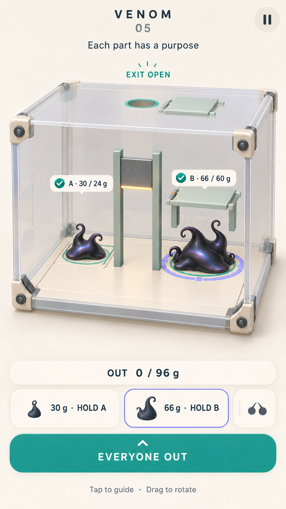
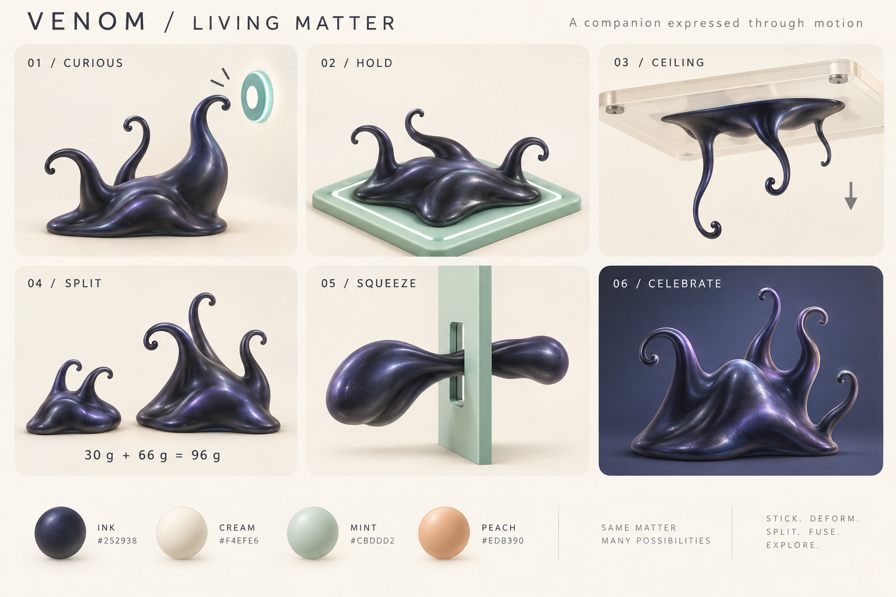
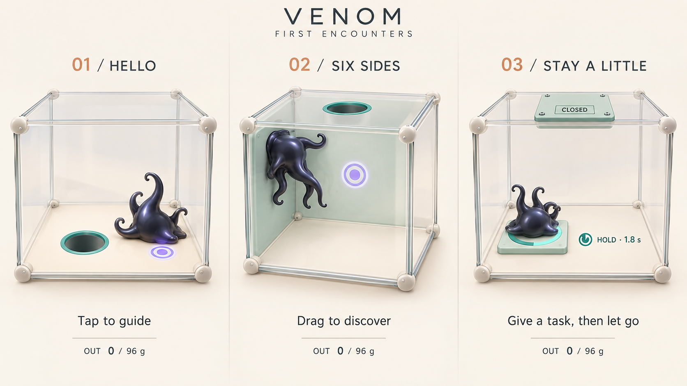
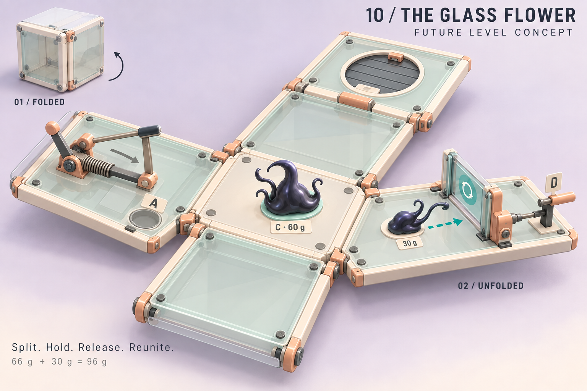

# VENOM — Mực sống trong hộp đồ chơi cơ khí

Concept art v1 · 11/09/2026 · nhánh `Venom` · tham chiếu commit `19b7e5c`.

**Đề xuất:** giữ sinh vật mực đen vô định hình, làm rõ nếp mô và cử chỉ bằng ánh tím dịu; đặt trong hộp cơ khí màu kem, bạc hà và cam đào. Hình ảnh mang cảm giác đồ chơi có thể cầm, xoay và chạm. Nét hấp dẫn riêng nằm ở vật chất sống biết nhận việc và phối hợp với chính những phần cơ thể của mình.

Đây là bộ định hướng hình ảnh, không phải bản cập nhật Unity. Bố cục HUD, vật liệu và vỏ cơ quan trong tranh là đề xuất. Journey 01–05 đã có gameplay; hệ chỉ số và boss 10 chưa triển khai.

## Xem concept

| Tấm | Nội dung | Phạm vi |
| --- | --- | --- |
| [01 — Màn 05](Concepts/01-journey05.png) | Hai phần giữ A/B, lỗ trần đã mở, chưa có vật chất thoát | Art target cho gameplay hiện có |
| [02 — Sinh vật](Concepts/02-living-matter.png) | Tò mò, giữ nút, bám trần, tách, luồn khe, ăn mừng | Ngôn ngữ tạo hình và diễn xuất |
| [03 — Ba lần làm quen](Concepts/03-first-encounters.png) | Chỉ đường → đọc sáu mặt → giữ việc | Art target cho Journey 01–03 |
| [04 — Bông hoa thủy tinh](Concepts/04-glass-flower.png) | Hộp bung bằng bản lề, đổi vai hai phần | Concept cho boss tương lai; chưa chứng minh hình học |

Hình chính:

## Căn cứ trong nhánh Venom

Ưu tiên tài liệu hiện hành theo thứ tự: [chỉ số và level](../../VENOM_STATS_LEVEL_DESIGN.md), [năm màn Journey](../../VENOM_JOURNEY_01_05.md), [thiết kế dẫn đường](../../VENOM_GUIDED_PUZZLE_DESIGN.md), [nghiên cứu chuyển động](../../VENOM_MOTION_STUDY.md). Chuỗi 06–10 cũ trong tài liệu dẫn đường đã được đặc tả chỉ số thay thế.

Đã đối chiếu `VenomJourneyBuilder.cs`, cấu hình A/B/dao trong `VenomJourney.cs`, ảnh kiểm chứng Journey 01 và 05, ảnh bám trần và ảnh múa. Bản gốc có nền gần đen, kính xanh đậm và thân than bóng; ở góc toàn hộp, thân và cơ quan nhỏ, nhiều mặt kính làm giảm tương phản. Đây là nhận xét trực quan trên capture, chưa phải kết quả playtest.

Giữ các đặc điểm quyết định bản sắc:

- Chạm để giao đích/nhiệm vụ; kéo để xoay hộp.
- Cơ thể liên tục, biến dạng được, có xúc tu thăm dò và bám sáu mặt.
- Không có mắt, mặt hay đầu cố định: tài liệu chuyển động đã bỏ hai mắt sáng để tránh cảm giác thú nhỏ có cổ.
- Tổng 96 g; tách/hợp không tạo hoặc xóa vật chất. Hai phần dùng cùng chất liệu và kiến thức, nhưng giữ nhiệm vụ riêng.
- Cơ quan phản ứng từ tiếp xúc/trạng thái thực; biểu cảm không tự mở cửa.
- Mọi vật chất phải đi qua lỗ thật. “Cửa mở” và “hoàn thành màn” là hai trạng thái khác nhau.

Các lab cũ bổ sung tham chiếu về luồn khe, hợp thể và điều khiển; 23 bàn bi thép là di sản cơ khí của project, không phải campaign Venom cần minh họa thành 23 màn mới.

## Xu hướng được áp dụng có chọn lọc

Nguồn được kiểm tra ngày 11/09/2026. Dữ liệu thị trường giúp chọn hướng sản phẩm; không tự chứng minh rằng một bảng màu hay tạo hình sẽ thắng thị trường.

| Quan sát từ nguồn | Quyết định cho Venom |
| --- | --- |
| Sensor Tower, báo cáo tháng 6/2026, mô tả puzzle giữ vai trò lớn trong hệ sinh thái quảng cáo và sự phát triển của các cơ chế hybrid-casual. [Nguồn](https://sensortower.com/blog/gaming-deep-dive-ad-monetization-report) | Đưa hành động có thể hiểu bằng hình lên trước: tách → mỗi phần giữ một việc → cùng thoát. Không đưa kinh tế quảng cáo vào phạm vi concept này. |
| Rollic mô tả Color Block Jam có cơ chế dễ nhận ra, hình ảnh sạch và chiều sâu tăng qua level design. [Nguồn, 12/06/2025](https://rollicgames.com/highlights/hit-stories-is-back-the-success-story-of-color-block-jam) | Một màn tập trung một bài học; màu và silhouette giúp đọc luật. Chiều sâu đến từ chia tải và thứ tự, không từ trang trí thêm. |
| Supersonic nêu nền sạch, dải màu gọn, vật liệu phù hợp hành động, kính cho thấy lớp bên trong và phản hồi vật lý rõ. [Nguồn, 18/11/2025](https://supersonic.com/learn/blog/how-ux-design-drives-player-engagement-in-eogames-hit-hybrid-puzzles/) | Phối vật chất mềm với cơ cấu cứng, giảm kính chồng lớp, dùng chuyển động thật để tạo cảm giác thỏa mãn. |
| Voodoo mô tả chuyển từ liên tục ra game hyper-casual sang phát triển IP casual dài hạn. [Nguồn, 11/03/2026](https://voodoo.io/news/2025-a-year-of-growth-and-transformation-for-voodoo) | Đầu tư một sinh vật có dáng và cử chỉ nhận ra được, có thể đi cùng người chơi qua nhiều chương. |

**Suy luận thiết kế của bộ concept:** bề mặt mềm, khối lớn dễ đọc, cơ khí như đồ chơi và bạn đồng hành có biểu cảm phù hợp với gameplay Venom. Bảng kem–bạc hà–cam đào và mực than ánh tím là lựa chọn riêng cho project, không phải “màu hot 2026” được số liệu chứng minh. Chưa có thử nghiệm retention, CPI hoặc hiệu năng cho hướng này.

## Bảng màu và vật liệu

| Vai trò | Màu gốc | Cách dùng |
| --- | --- | --- |
| Cơ thể | `#252938` | Than xanh tím, các nếp khối rộng; tránh đen phẳng mất chi tiết |
| Ánh phản xạ trên mô | `#8586BD` | Tím mềm theo ánh sáng, không tự phát sáng toàn thân |
| Nền / vỏ hộp | `#F4EFE6` | Kem sáng, khoảng trống giúp đọc khối |
| Mặt phụ / cơ quan | `#CBDDD2` | Bạc hà khoáng, sắc độ đủ khác nền |
| Vỏ cơ cấu phụ | `#EDB390` | Cam đào, nhận diện dao/motor/điểm thao tác |
| Cơ cấu cứng / chữ | `#3C4B51` | Đường ray, chi tiết giữ, thông tin chính |
| Đạt điều kiện | `#178978` | Teal + dấu kiểm hoặc trạng thái mở thực |
| Chưa đủ điều kiện | `#EAAA4E` | Amber + số còn thiếu / biểu tượng chờ |
| Đang chọn | `#777CD9` | Vòng ngoài có ba vạch; không đổi màu phần cơ thể |

Không mã hóa hai cá thể bằng hai màu thân: đây là những phần của cùng một sinh vật. A/B vẫn có chữ, hình vùng nhận và chip nhiệm vụ khi không phân biệt được màu. Các mã màu là token đầu vào, không yêu cầu mọi pixel trong render phải cùng mã.

Mô có độ bóng satin ướt với vùng phản xạ lớn, ít nhiễu. Vỏ cơ quan là nhựa mờ với mép bo nhỏ; kính acrylic chỉ hơi mờ ở mép. Chỉ dùng kim loại tại điểm cần hiểu độ cứng hoặc chuyển động. Tránh bề mặt gương gây lẫn lỗ thoát với reflection.

## Sinh vật: thân là phần diễn chính

Silhouette nền là một khối thấp bất đối xứng, mép bám mỏng, vai mô có thể dồn thành đỉnh. Xúc tu mọc lệch vị trí và thời gian, gốc rộng thu dần, không chia đều như chân bạch tuộc. Cơ thể nguyên có bốn xúc tu giơ tự do; phần nhỏ giảm số và độ dài. Sợi tiếp xúc chỉ xuất hiện khi có mặt bám phù hợp.

| Sự kiện | Tạo hình cần đọc được |
| --- | --- |
| Nhận lệnh | Dồn vai về đích, một xúc tu hướng tới dấu chạm; không dựng một cái đầu |
| Bò / đổi hướng | Mép tiếp xúc kéo trước, khối trên theo sau; thân kéo dài rồi hãm gọn |
| Giữ A/B | Trải thân thấp trong vùng cảm biến, giảm idle; huy hiệu “GIỮ A/B” ổn định |
| Thiếu tải | Tì thử ngắn rồi nghiêng về cảm biến; số còn thiếu và trạng thái chờ vẫn hiện |
| Bám trần | Vùng bám rộng trên mặt dưới; bụng và xúc tu võng theo trọng lực thế giới |
| Tách | Hai khối vẫn có nếp mô mềm; không văng mảnh trang trí giống vật chất bị mất |
| Luồn khe | Thân kéo dài liên tục qua khoảng trống, thu xúc tu; không xuyên phần vách đặc |
| Hợp thể | Mép chạm → nối cổ mô → thu nếp vào khối; chỉ khi nhiệm vụ cho phép |
| Thắng | Cận cảnh vẫy, bật/vỗ xúc tu hoặc xoay/bung; chỉ sau khi đủ 96 g ra ngoài |

Ở góc toàn hộp, ưu tiên hướng thân, độ võng và điểm tiếp xúc hơn các sợi siêu nhỏ. Cảm xúc vẫn cần đọc được khi bỏ hiệu ứng phát sáng.

## Hộp và cơ quan phải giải thích gameplay

Giữ đủ sáu mặt vật lý. Mặt đang nhận lệnh có sắc độ rõ; các mặt phía camera giảm độ đậm có kiểm soát để thấy trong hộp. Mép, góc và dấu mặt vẫn cho biết bề mặt tồn tại. Xoay hộp không biến nó thành khay mở.

Đây là quy tắc hiển thị theo góc nhìn, không đổi collider. Không vẽ sàn đặc cố định nếu nó sẽ che toàn bộ nội dung sau khi xoay: mọi mặt phải xử lý theo vị trí camera và vật thể cần thấy.

| Cơ quan | Ngôn ngữ hình ảnh | Trạng thái cần phân biệt |
| --- | --- | --- |
| Lỗ thoát | Lỗ tròn xuyên mặt, lòng tối, viền mảnh phẳng | Bị nắp che / mở nhưng chưa thoát / đã ra đủ |
| Cảm biến vật chất | Vùng nhận vuông thấp, vòng biên, chữ A/B/C và đơn vị g | Đang tiếp xúc / thiếu lượng mô / đủ lượng mô |
| Nút giữ thời gian | Vòng tiến độ local quanh A | Chưa đủ 1,8 giây / đã chốt |
| Máy cắt | Hai ray và lưỡi mảnh có sống dao, cạnh màu ấm, dấu tiếp cận | Nâng / chuẩn bị / cắt / nâng lại |
| Nắp che B | Tấm trượt có ray dễ nhìn | A chưa đạt thì đóng; A giữ mới mở |
| Tay kéo tương lai | Đầu bám, lò xo, chặn cuối hành trình | Đang căng / đã chốt; đọc tiến bộ qua hành trình thật |
| Cửa chu kỳ tương lai | Motor, liên kết truyền động và vùng chờ | Pha cửa và khoảng đi an toàn |
| Bản lề boss | Trục, giới hạn mở và mép nối liên tục | Đóng / chuyển tiếp / đã mở ổn định |

A/B là **cảm biến lượng vật chất theo tiếp xúc**, không tạo hình như cân trọng lượng hoạt động theo phương đứng. Vì vậy không dùng kim kilogram trên hai nút hiện tại. Chỉ hiển thị lượng mô thực trong vùng nhận, không lấy toàn bộ khối lượng phần nếu nó mới chạm một xúc tu.

Viền thoát và vòng cảm biến không được tạo gờ trang trí trông như collider. Khi triển khai, vỏ bo ngoài cơ cấu cần tôn trọng khoảng trống đã kiểm chứng.

## Áp dụng vào từng màn

| Màn | Trọng tâm art |
| --- | --- |
| 01 | Chỉ sinh vật, điểm chạm và lỗ sàn. Khoảng trống lớn để đọc phản hồi. |
| 02 | Một mặt bám đọc rõ, bóng tiếp xúc và độ võng giúp hiểu trong/ngoài; lỗ duy nhất ở trần. |
| 03 | Tiến độ 1,8 giây trên A, nắp trần đóng rồi trượt mở khi đã chốt. |
| 04 | Dao, A mở nắp B, hai phần giữ đồng thời. Huy hiệu nhiệm vụ bền vững khi đổi chọn. |
| 05 | Bổ sung lượng cần 24/60 g và phản hồi thiếu tải; màu không thay đổi luật cũ. |
| 06–09, đề xuất | Tiến bộ qua lực kéo, độ gọn khi rẽ/hãm, tín hiệu cảm nhận và chuỗi thao tác đã học. |
| 10, đề xuất | Cấu trúc bung mở là cao trào. Giữ thấy được ai đang giữ C và ai chờ để tới D. |

**Trạng thái tham chiếu của tấm 01:** 30 g giữ A cần 24 g, 66 g giữ B cần 60 g; hai vùng đều tiếp xúc đủ và đã chốt cửa. Nắp B nâng, dao nâng, nắp lỗ trần rút. `OUT 0/96 g` vẫn đúng vì cả hai phần còn bên trong. Nút “CÙNG RA NGOÀI” chỉ giao lệnh thoát sau khi mở cửa.

30/66 là một phân bổ minh họa hợp lệ, không cam kết mọi nhát cắt lệch đều cho con số đó. 32 hạt × 3 g = 96 g; ví dụ 48/48 khiến B thiếu 12 g. Art không được làm phần nhỏ sáng hơn thành “mạnh hơn” hoặc cho Strength thay đổi số gram.

Boss bám đặc tả mới: A cần 24 g, phần lớn vận hành tay kéo; sau mở cánh, phần lớn giữ C cần 60 g để phần nhỏ tới D. Đường dùng tay đòn với sức mạnh nền phải còn hiện diện. Không dùng sơ đồ 25/50 g trong bản boss cũ.

## HUD cho màn hình dọc

Thiết kế theo canvas 360 × 640 điểm làm mốc review; tôn trọng safe area của máy thật. Các kích thước dưới đây là mục tiêu thiết kế nội bộ, chưa là kết quả đo usability.

- Vùng trên khoảng 15%: tên bài, một mục tiêu ngắn, pause/retry. Không để logo chiếm trọng tâm.
- Vùng giữa khoảng 62%: toàn hộp và vùng thao tác xoay. Cho phép zoom như prototype.
- Vùng dưới khoảng 23%: chip các phần và nhiệm vụ, tổng đã thoát, hành động theo ngữ cảnh.
- Mục tiêu chạm khoảng 44 × 44 điểm, dù nút 3D nhỏ hơn; vùng chạm không chồng nhau hoặc chọn xuyên mặt khuất.
- Nhãn gram và nhiệm vụ phải đọc được ở tỷ lệ điện thoại; nếu chật, giữ nhãn phần được chọn trên vật thể và đưa phần còn lại về chip.
- Khi quay, chữ vẫn hướng về màn hình nhưng bám đúng đối tượng; tránh đường nhãn chạy xuyên thân hoặc che dao.
- Bảng chỉ số thuộc màn nghỉ khi đã có hệ thống; không che puzzle với năm thanh stat thường trực.

Chữ tiếng Anh trong tranh chỉ giúp trao đổi visual target. Bản Việt dự kiến: “Mỗi phần một nhiệm vụ”, “GIỮ A”, “GIỮ B”, “CỬA ĐÃ MỞ”, “ĐÃ RA 0/96 g”, “CÙNG RA NGOÀI”, “Chạm để dẫn · Kéo để xoay”. Khi sản xuất, tất cả chữ là UI sống, không bake vào texture.

## Chỉ số thể hiện qua hành động

Sức mạnh: mô căng, đầu bám thật, tay kéo đi xa hơn; khối lượng không tăng. Nhanh nhẹn: dồn thân, đổi hướng và hãm gọn hơn; không thêm speed-line che đường. Trí tuệ: nhìn cơ quan, chờ và hoàn tất chuỗi đã học trong nhiệm vụ; không hiện đáp án toàn màn. Cảm nhận: xúc tu thăm dò và hướng về tín hiệu công khai sớm hơn. Gắn bó: cử chỉ đáp lại và chia sẻ thành công, không biến thành khóa cảm xúc bắt buộc.

Cùng một silhouette nền xuyên tiến trình. Nếu thêm cosmetic sau này, phải giữ tương phản và các mã trạng thái; không làm người chơi suy ra một khối nặng hơn vì đội mũ hoặc lớn hơn do hiệu ứng.

## Handoff và kiểm tra khi đưa vào Unity

Ưu tiên một lát cắt Journey 05 và một đoạn bám tường/trần ở Journey 02 trước khi thay art hàng loạt:

1. Tạo vật liệu sáng và quy tắc kính; dùng đúng scene và collider hiện tại.
2. Tạo dáng thân/ánh sáng ở cùng góc camera toàn hộp; kiểm tra cả phần 30 g.
3. Dựng vỏ dao, A/B, nắp và hệ dấu nhiệm vụ; chuyển chữ thành UI.
4. So sánh bản hiện tại với bản art mới ở cùng trạng thái, cùng camera và thao tác.
5. Sau khi đọc luật tốt mới mở rộng biểu cảm, bộ cơ quan tương lai và boss.

Tiêu chí cần kiểm tra trực quan: toàn hộp không bị cắt ở khung 9:16; chọn phần nào nhìn ra ngay; cảm biến thiếu tải không có dấu thành công; lỗ trần không giống lỗ sàn; bám trên mặt dưới không bị hiểu thành đứng trên nóc; xoay không làm kính che mất cơ thể; nhãn còn đọc được ở 360 × 640 và ảnh nhỏ; chuyển xám vẫn phân biệt được chọn/giữ/chưa đủ.

Khi triển khai phải kiểm tra tiếp tách/hợp giữ 96 g, dao không mất hạt, nhiệm vụ không tự hủy khi đổi chọn và chiến thắng chỉ khi tất cả ra ngoài. Lần concept này không chạy lại bộ test Unity vì không sửa code/scene.

Về chi phí đồ họa, ưu tiên một vật liệu thân có highlight đơn giản, hình học vỏ gọn và giảm overdraw kính. Thử giảm số sợi/chi tiết trình diễn trên máy yếu trước khi giảm chất lượng luật gameplay. 30/60 fps cần đo trên thiết bị thật; ảnh concept không chứng minh ngân sách render.

## File nguồn và khả năng tái tạo

Dùng công cụ **imagegen tích hợp**, không dùng CLI/API riêng. Prompt đầy đủ: [màn 05](Prompts/hero.txt), [sinh vật](Prompts/character.txt), [ba màn đầu](Prompts/chapters.txt), [boss](Prompts/boss.txt). Các bản chỉnh, nếu có, được lưu cạnh prompt gốc và ghi trong [kiểm tra hình](QA.md).

Các PNG là concept raster để duyệt hướng, chưa phải mesh, texture atlas, sprite hay prefab sẵn dùng. Hình minh họa cơ khí phải được đối chiếu lại với layout thật khi dựng; các con số và điều kiện trong tài liệu này là chuẩn gameplay ưu tiên nếu nét vẽ chưa chính xác.
