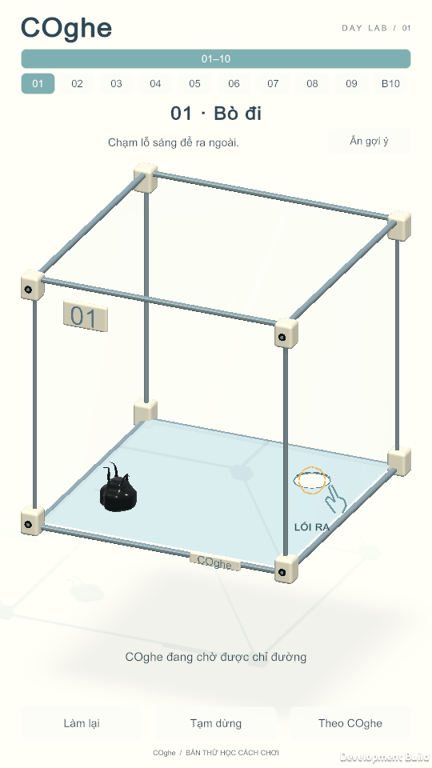
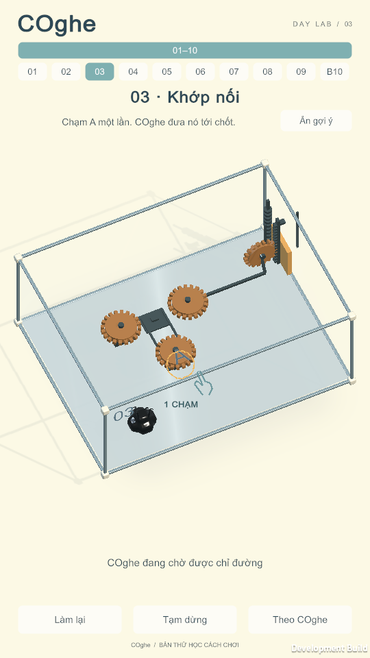

# COghe — bản thử học cách chơi, 24/09/2026

Yêu cầu Mrk: triển khai plan tại Buzz event `530a81629e6e3479aa21bd28e6b850a4d2926034d8dd95138dd857305f507d7e`. Đây là **mốc bản thử10 màn** trong kế hoạch đã duyệt. Đường học60 cần phiên người mới rồi mới chốt; không thay kết quả người chơi bằng replay tự động.

## Nội dung bản thử

| Mới | Source cũ | Hành vi / phản hồi học |
| ---: | ---: | --- |
| 01 | 01 | Chạm đúng lỗ; ngón tay/vòng nhấn tắt sau lệnh thoát được nhận |
| 02 | 02 | Chạm mặt kính để leo; đạt độ cao thật mới chuyển tới lỗ |
| 03 | 41 | A một chạm; đợi hành trình tới chốt và cửa thật mở |
| 04 | 08 | Chạm thùng → bám thật → chỉ đích → kê thùng và leo |
| 05 | 14 | Chạm tay nắm → đích kéo → chốt → buông → lỗ |
| 06 | 18 | Ghép một cầu → buông → chạm mặt cầu để bò qua |
| 07 | 09 | Luyện tay nắm/đích với bánh răng |
| 08 | 16 | A mở đường tiếp cận B; dạy buông trước đổi tay nắm |
| 09 | 42 | A → B → A trở về bằng từng lệnh chạm |
| 10 | 10 | Boss tổng hợp, không hint đáp án |

Nguồn: `COgheOnboardingBuilder.SourceSlots`, các definition trong `Assets/_Game/Venom/OnboardingPilot/Definitions`. ID nội dung giữ nguyên. Bài01/02 khóa xoay ở **bản thử**; hình học và sinh vật giữ nguyên. Các bài xoay/trơn sẽ được làm ở mốc chương11–20 sau đánh giá pilot, chưa nằm trong app10 màn này.

## Kiến trúc và save

- `COgheOnboardingBuilder.Generate` mở scene nguồn, clone definition qua Unity API, lưu scene riêng `COgheLearn01`–`10`. Rerun giữ GUID asset đang có. Không regenerate campaign30/55/60.
- `SceneSequence` là nguồn cho số màn/selector/next. Production vẫn nhận catalog60 hiện có; standalone Tap vẫn giữ catalog10 riêng.
- Definition mới có `ProgressKey` tùy chọn. Để trống tiếp tục dùng `venom.origin.v2`; pilot dùng `coghe.onboarding.pilot.v1`. Mỗi đối tượng save giữ key của chính nó, không đổi key static giữa scene.
- Android pilot dùng `com.gravityboxlab.venom.onboarding`, cài riêng với production. Không sao chép hay xóa completion production. “Nhà” mở khi thắng Boss pilot và lưu riêng.
- `COgheOnboarding` chỉ đọc trạng thái. Không gọi Move/SetPropTarget/Request, không di chuyển collider, không ghi lực/thắng/mass. Hình ngón tay không có collider/input target. Bỏ qua/xem lại không ảnh hưởng vật lý.
- Cue chuyển theo `Attached`, vị trí/chốt ray, cửa, hành trình Tap và cơ thể. Chờ lâu không hoàn thành bài. Có lệnh đích và di chuyển đủ xa mới làm cue đích dịu đi; nếu ngừng lại thì có thể nhắc. Nội dung đã hoàn thành không tự hiện tutorial khi replay; vẫn có nút xem lại.
- HUD bỏ nhánh sai `Order==7`. Cue cũ cho exit/thùng/mái dùng stable ID thay số hiển thị.

## Dựng lại

Đóng Editor đang mở project trước khi chạy batch. Dùng đúng Unity6000.3.19f1.

```bash
/Applications/Unity/Hub/Editor/6000.3.19f1/Unity.app/Contents/MacOS/Unity \
  -batchmode -nographics -projectPath "$PWD" \
  -executeMethod GravityBox.Editor.COgheOnboardingBuilder.Generate \
  -quit -logFile Artifacts/COgheOnboarding/generate.log
bash Tools/build-venom.sh --onboarding
bash Tools/build-venom-android.sh --onboarding
```

Mac: `Builds/COgheOnboarding/macOS/COghe Learn.app`.
Android: `Builds/COgheOnboarding/Android/COghe-Learn.apk`.
Các đường dẫn là hợp đồng đầu ra; xem báo cáo kiểm chứng để biết artifact nào thực sự build thành công.

## Phiên người mới — chưa tiến hành

Chọn5–8 người chưa chơi/chưa xem lời giải, điện thoại portrait. Mỗi người bắt đầu save pilot mới trên app test; không reset app chính. Người quan sát không giải thích thao tác trước. Ghi model máy, OS, kích thước/safe area, build hash và mã người tham gia; không cần danh tính thật.

Câu giao việc duy nhất: “Đưa COghe ra ngoài.” Chỉ hỏi người chơi mô tả ý định sau khi họ đã thử. Ghi riêng hiểu mục tiêu, thao tác không ra và mất hứng. Khi cần trợ giúp, đánh dấu thời điểm/câu nói chính xác; không tính lượt có nhắc miệng là tự hoàn thành.

| Người / thiết bị / build | Bài | Chạm đúng đầu tiên (s) | Tự qua? | Chạm nhầm | Retry | Cần nhắc? / câu nói | Hiểu nhưng thao tác không ra | Ghi chú |
| --- | --- | --- | --- | --- | --- | --- | --- | --- |
| Chưa có dữ liệu | | | | | | | | |

Gate đề xuất: ≥80% tự qua ba bài đầu; báo tử số/mẫu số. Bài04–09 phải phân biệt được một chạm A và tay nắm→đích, tự biết buông. Kiểm tra skip/show/pause/retry/Follow/Next/nhà bằng chạm thật; thử720×1280 và720×1612, notch/safe area thực tế.

Chưa dùng pilot10 để kết luận khả năng xoay/trọng lực hoặc phối hợp nhiều phần. Các gate đó cần bản chương tiếp theo và phiên riêng. Đo frame-time/GC và15–20 phút nhiệt trên điện thoại trước khi báo hiệu năng mobile.

Map60 để review: [ONBOARDING_PROGRESSION_DRAFT](LevelDesign/COghe/ONBOARDING_PROGRESSION_DRAFT.md). Bài ba vai trò trước Boss50 còn cần một bước thiết kế/triển khai riêng theo ghi chú trong map.

## Ảnh từ app Mac

Ảnh framebuffer540×960 từ build `2a67191a3c1b4864a2b52e4b44438e7e`; cùng tỷ lệ720×1280.





Kết quả build,421 PlayMode,8 EditMode, replay hai tỷ lệ và các giới hạn: [Báo cáo kiểm chứng](COGHE_ONBOARDING_VERIFICATION_2026_09_24.md).
