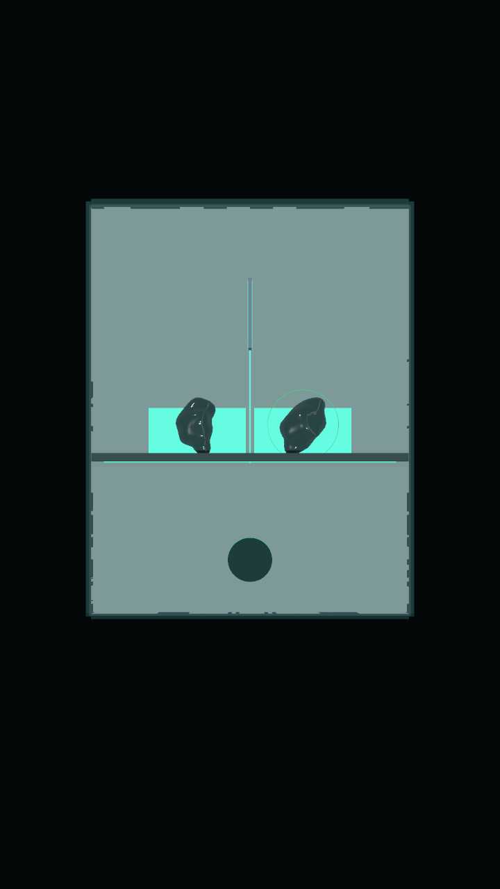
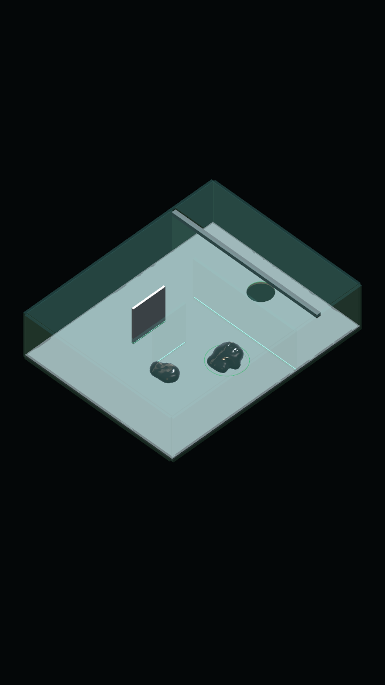
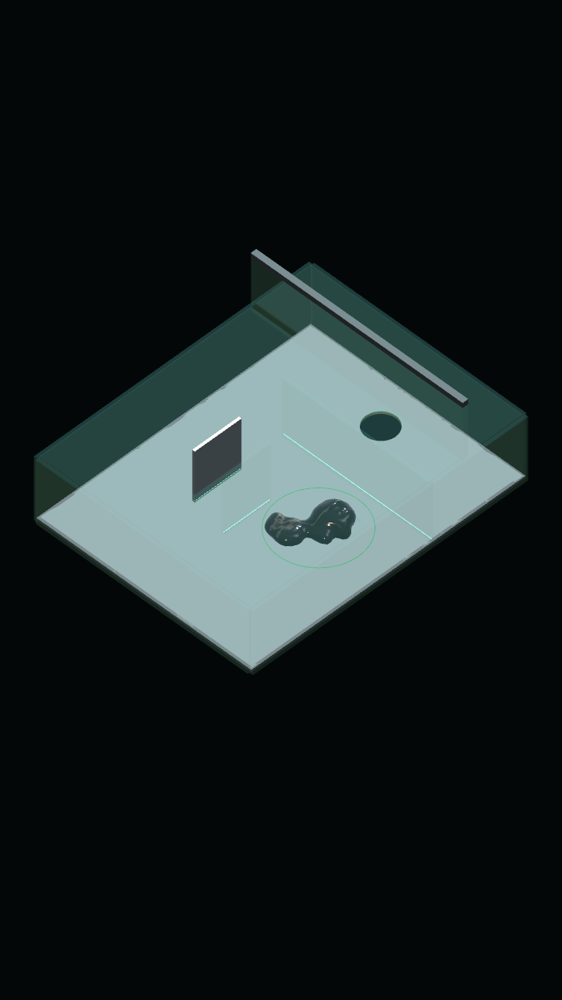

# Venom 02–03 — Ảnh từ mô phỏng Unity

Ảnh được render bằng camera scene trong `VenomControlTests`, Unity 6000.3.19f1, graphics enabled. Đường giải điều khiển sinh vật bằng lực bám–kéo; không đặt vị trí hạt trong lúc giải. Ảnh cập nhật góc camera ngày 10/09/2026: màn 02 nhìn xuống 88°; màn 03 góc nhìn 3/4 từ góc trái đầu xuất phát, cao 45° và chéo 45°. Các ảnh camera dưới đây không có HUD native.

## Màn 02: hai phần cùng giữ công tắc

## Màn 03: phần nhỏ tìm đường tới chủ thể

## Màn 03: nhập lại

