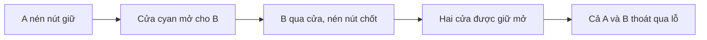

# Bàn 16 — Two to escape

Hai viên bi thép cùng nằm trong hộp vuông 640 × 640 × 90 mm, trọng lực Trái Đất 9,81 m/s². Mỗi bi có đường kính 30 mm và khối lượng khoảng 111 g. A có sắc cyan, B có sắc hổ phách để dễ theo dõi; màu không làm thay đổi vật lý. Một thao tác xoay tác động tới cả hộp và cả hai bi; không có chọn bi, điều khiển riêng hoặc giữ bi bằng code.

## Luật áp dụng cho toàn game

Màn chỉ thắng sau khi **tất cả bi của màn đó đã thoát hoàn toàn qua lỗ thật**. `OUT 0/2 → OUT 1/2 → OUT 2/2` theo dõi từng bi. Ở 1/2, người chơi tiếp tục xoay; bi đã thoát vẫn dynamic nhưng không bị tính là rơi sai khỏi hộp. Reset khôi phục cả hai bi, các cửa, các nút, chốt giữ và bộ đếm.

Mười lăm màn cũ vẫn có một bi và áp dụng cùng điều kiện 1/1. Hỗ trợ hút trong 40 mm quanh lỗ dùng trạng thái riêng cho mỗi bi; va chạm với viên bi khác vẫn có thể chặn đường hút. Không teleport, tắt collider cửa, đóng băng bi ở lỗ hay tính thắng bằng khoảng cách gần cửa.

## Phối hợp trong một thao tác xoay

1. Dẫn A xuống hốc cyan. Bi phải chạm và nén nút lò xo ở cuối hốc. Cửa cyan ở khoang của B mở bằng lực motor.
2. Duy trì tải lên A, đồng thời nghiêng ngang để B tới cửa nằm lệch bên phải. Hốc giữ A bằng thành va chạm khi B di chuyển. Rời nút quá sớm làm cửa trở về đóng.
3. B qua cửa rồi vòng về nút hổ phách trong khoang dưới. Khi B nén nút, chốt giữ mở cả hai cửa, bao gồm cửa thoát khỏi khoang của A.
4. Rút A khỏi hốc, vòng qua thành hốc rồi xuống cửa. Dẫn cả hai bi tới sân chung và lỗ tròn ở cuối hộp. Có thể cho viên nào ra trước cũng được; chốt giữ tránh phụ thuộc vào bi đã thoát.

Vách giữa kéo tới z=-215 mm; hai cửa chia khoang ở z=-25 mm, tâm x=-200 mm và +220 mm, khe rộng 68 mm. Hốc A tại x=-200/z=105 mm; hốc B tại x=100/z=-180 mm. Lỗ duy nhất ở `(0, -45, -278)` mm, bán kính 23 mm. A bắt đầu `(-200, -24, 250)` mm, B `(70, -24, 250)` mm. Vách phủ đủ chiều sâu để lật hộp không đi vòng trên vách. Đường nét cùng màu liên hệ từng nút với cửa nó điều khiển.

## Cơ quan và năng lượng

Nút là rigidbody 20 g trên ray, hành trình 8 mm, lò xo 18 N/m và giảm chấn 1,2 N·s/m. Chỉ có tiếp xúc thực với một bi đã đăng ký **và** hành trình nén ít nhất 3 mm mới kích hoạt; tự trọng của nút khi lật hộp không đủ điều kiện. Mặt nút bằng kính màu và viền mảnh giúp nhìn thấy bi đang tì lên nó.

Cửa là rigidbody 50 g, hành trình 95 mm, di chuyển bằng motor giới hạn ±2 N. Bộ điều khiển lực dùng `F = clamp(100 × sai_lệch_vị_trí − 4,5 × vận_tốc_ray, −2, 2)` (đơn vị SI). Đây là cửa có nguồn năng lượng hỗ trợ, không phải cơ cấu thụ động lấy toàn bộ công mở cửa từ trọng lượng bi. Trọng lực, joint và va chạm vẫn giải chuyển động thật; collider cửa luôn tồn tại. Joint mô tả ray lý tưởng trong housing và bỏ va chạm giữa carriage với root housing; bi vẫn va chạm cả housing và cửa. Chốt giữ là trạng thái gameplay của nút thứ hai, reset sẽ nhả chốt.

## Kiến trúc và kiểm chứng

`LevelRuntime.AdditionalBallSpawns` mở rộng spawn chính mà không thay ID/prefab cũ. `LevelManager.Balls` quản lý toàn bộ vòng đời và đăng ký force cho từng bi. `ExitSocket` lưu lịch sử traversal và lực hỗ trợ riêng, phát `BallExited` cho từng bi rồi `Exited` khi đủ toàn bộ. Camera theo viên cuối vừa thoát khi hoàn tất; âm lăn/va chạm theo từng bi. Thuộc tính `Ball` được giữ cho chẩn đoán một bi cũ, không quyết định thắng.

`CooperativeRelay` điều khiển lực nút/cửa theo bước physics; `PressurePlunger` nhận callback tiếp xúc. `GravitySliderGuide` chỉ đo hành trình joint, vẫn giữ nguyên vai trò đo thụ động ở màn 09/10. Những trigger cũ cũng nhận danh sách bi; one-way clearance và cooldown impulse riêng cho từng bi. Mô hình lực chất lỏng có thể tách trạng thái theo bi khi authoring thêm spawn; VFX chất lỏng hiện vẫn theo bi chính, chưa phải màn thử nhiều bi trong nước.

[Kiểm chứng](Verification/Cooperative16/README.md), [ảnh](Images/Level16/README.md). Đường giải tự động chỉ gửi ý định xoay hộp, không dẫn trực tiếp vị trí hoặc vận tốc bi. Nó xác nhận khả năng giải, không phải đánh giá cảm giác chơi tay hoặc độ khó.
