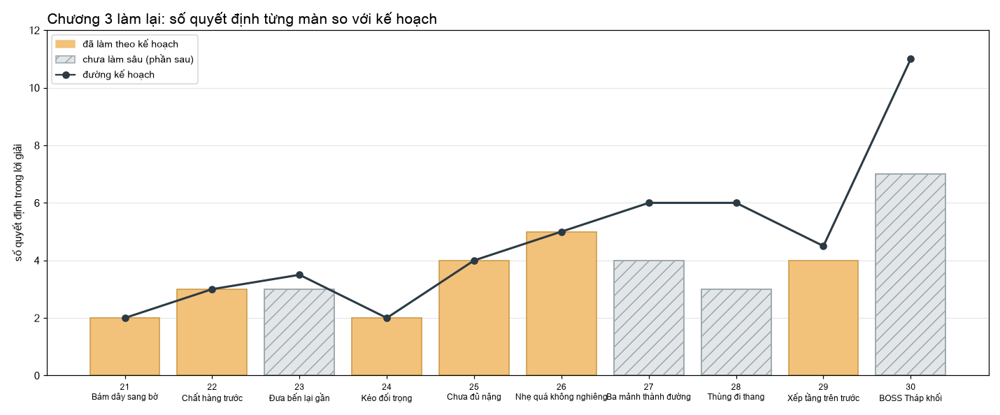

# Chương 3 dựng lại theo kế hoạch "hook" (06/10/2026)

Theo `PLANS/COGHE_LEVEL_HOOK_PLAN.md` mục 5.3 và lời Mrk (06/10/2026): "Giờ mày xây dựng Chương 3 theo kế hoạch trước đây.
Chú ý curve độ khó." Màn mới theo quy tắc đã chốt ở chương 1–2: không chữ, mỗi cặp một màu, không chi tiết tối.

Phần 1 (xong): thứ tự mới; hai màn sửa có thứ tự 22, 29; hai màn mới 25, 26.

Phần 2 (xong):
- 23 làm sâu (`N23`): cần B dời ra xa.
- 24 sửa chữ báo sai lúc vào màn.
- Câu gợi ý dưới tên màn không còn lộ lời giải.
- 21 dời biển số khỏi vòng dây.

Phần sau:
- 27: bốn mảnh, bãi chờ chỉ chứa một.
- 28: "Gửi hàng lên trước".
- Boss 30 làm lại.

## Thứ tự chương 3

| Vị trí | Nội dung (key) | Tên | Ghi chú |
| --- | --- | --- | --- |
| 21 | `18` | Bám dây sang bờ | Dạy đu dây, đưa từ 22 lên |
| 22 | `N22` | Chất hàng trước | **Mới** (E04 + thứ tự) |
| 23 | `N23` | Đưa bến lại gần | Màn 19 cũ, đưa từ 24 lên; cần B dời từ cạnh chỗ xuất phát ra góc trước–phải |
| 24 | `21` | Kéo đối trọng | Dạy đối trọng, đưa từ 25 lên |
| 25 | `N25` | Chưa đủ nặng | **Mới** |
| 26 | `N26` | Nhẹ quá không nghiêng | **Mới** |
| 27 | `22` | Ba mảnh thành đường | Giữ; làm sâu ở phần sau |
| 28 | `13` | Thùng đi thang | Giữ; làm lại ở phần sau |
| 29 | `N29` | Xếp tầng trên trước | **Mới** (E07 + thứ tự) |
| 30 | `B1` | Tháp khối (Boss) | Chờ làm lại |

Bỏ khỏi thứ tự chơi: `19` (thay bằng N23), `E04` (Cõng thùng, thay bằng N22), `E05` (Hai nhịp dây, kế hoạch bỏ), `E06` (Bập bênh, thay bằng N26),
`E07` (Chồng hai tầng, thay bằng N29). Cảnh và test của chúng vẫn còn.

## Màn mới

| Màn | Lời giải | Cơ chế |
| --- | --- | --- |
| 22 · Chất hàng trước | Trượt thùng B ngang xe khi xe còn ở xa → kéo xe A cập bệ → leo thùng → lên bệ | Thùng B có `RequiredRail` = xe A (chỉ trượt khi xe chưa cập bờ). Chốt khoá đỏ trên mép bệ, có vạch nối, hạ xuống khi xe cập bờ; chạm thùng lúc đó thì bị từ chối |
| 25 · Chưa đủ nặng | Đẩy thùng nhẹ vào khay: ván chỉ nâng nửa chừng (11° so với 22°) → COghe xuống khay ngồi cạnh thùng → ván thăng bằng, lẫy bắt → ra khỏi hố, qua ván | Phòng của màn 21, khay dài 24 cm cho thùng và COghe; thùng 20 g; trục ván có lò xo (`HingeJoint.spring` 0,10) nên góc ván theo trọng lượng trên khay |
| 26 · Nhẹ quá không nghiêng | Tách đôi → mỗi nửa đứng một nút A (hai nút cách xa nhau; cửa mở rồi giữ luôn) → nửa thân qua trục ván: ván kẽo kẹt, không nghiêng → nhập lại → cả thân nghiêng ván, xuống phòng thoát | Ván nặng 260 g, trọng tâm lệch 3 cm về phía chân: giữ được nửa thân (48 g) ở bất cứ đâu, nhưng nghiêng khi cả thân (96 g) vượt trục 8 cm |
| 29 · Xếp tầng trên trước | Leo lên khối A khi A còn ở chỗ cũ → đẩy B tới đầu xa của A → kéo A cập bệ → leo A, leo B → lên bệ | B có `RequiredRail` = A; chỗ đứng đẩy B là mặt trên của chính A (không phải bản sao lúc cập bờ). Chốt khoá như màn 22 |

## Phần 2

- **23 · Đưa bến lại gần (`N23`):** dựng như màn 19 (`PlusN23`, chép từ `Next19`), chỉ dời cần B từ ngay cạnh chỗ xuất phát
  ra góc trước–phải, dưới cạnh bến. Đường lên cầu thang không đi ngang cần B, nên người chơi đu trước, hụt (rơi xuống sàn,
  có cầu thang lên lại), rồi mới tìm ra B.
- **24 · Kéo đối trọng:** dòng trạng thái "Đối trọng đang kéo cầu" hiện ngay khi vào màn, vì khay rỗng tự võng tạo lực căng
  khoảng 0,1 N. Giờ chỉ báo khi lực căng trên 0,15 N, tức khi khay đã có tải (`COgheSeesawBridge.Activity`).
- **Câu gợi ý dưới tên màn** (audit L11–30, điểm 1): ghi tình huống, không ghi lời giải.
  - 24: "Khay nặng thì dây căng."
  - 27: "Ba mảnh, một bãi chờ."
  - 28: "Thùng cần lên tầng trên."
  - Các màn mới cũng vậy.
  - Ghi vào định nghĩa có sẵn bằng `ApplySpatialNextHints`, không dựng lại cảnh.
- **21 · biển số:** đổi sang góc trên–phải của kính trước, không còn che vòng dây A (`MoveChapterThreePlaques`).

## Phần sau: hướng làm

- **27 · Ba mảnh → bốn mảnh, bãi chờ chỉ chứa một.** Thêm một khối cao thứ hai cũng phải tạm vào bãi chờ: phải đưa B ra bãi,
  đặt nhịp C, trả B về, rồi mới đưa khối mới ra bãi. Bố cục sẽ tìm bằng bộ giải như màn thùng (mỗi khối một ray, bãi một chỗ),
  để thứ tự là bắt buộc và nhìn thấy được.
- **28 · Gửi hàng lên trước.** Khay thang chỉ nâng được thùng *hoặc* COghe: lực thang đủ cho một trong hai, cả hai thì đứng
  yên và báo quá tải. Lên tới tầng trên, thùng tự trượt xuống bến trên (gờ nghiêng ở mép khay; cần thêm vào
  `COghePassengerLift`). Gọi khay về bằng nút gọi tầng, rồi mới lên.
- **Boss 30.** Theo kế hoạch 5.3:
  - Nửa 1 ngồi lên khay nặng, dây kéo chốt của C1 ra.
  - Nửa 2 đu dây sang kệ cần, kéo B: chốt cắm, nửa 1 được thả.
  - Đẩy C2, rồi đẩy C3 lui khỏi mái nhô.
  - Xuống bằng chồng khối, nhập lại.
  - Cả thân kéo C1, leo lên, thoát.
  - Dùng lại khay đối trọng (màn 24–25) và dây đu (màn 21, 23), là hai thứ chương này dạy.

## Lỗi gặp khi dựng và cách sửa

- **Lưới hình bị ghi đè.** Màn Plus đánh số file lưới hình theo vị trí trong danh sách `PlusLevels`
  (`meshSerial=(40+index)*1000`, file `Geometry{số}.asset` dùng chung một thư mục). Chèn N22… vào giữa danh sách thì các màn
  thùng phía sau bị đẩy sang số của màn khác. Kết quả: dựng màn mới ghi đè lưới hình của màn thùng 51–54 (sàn mất lỗ thoát)
  và của màn 29. Sửa: màn mới luôn thêm ở **cuối** danh sách (có ghi chú ngay chỗ đó), rồi dựng lại K01–K10 và các màn N.
- **Màn 26:** vùng an toàn của cửa (`COgheTissueClearance`) chặn lệnh khi hai nửa nhập nhau cạnh cửa. Cửa đã giữ luôn
  (`Retain`) nên không cần vùng an toàn; đã bỏ.

## Đường độ khó

Số quyết định trong lời giải (đếm tay: kéo, đẩy, tách, đứng nút, nhập, bước leo có ý nghĩa) so với kế hoạch 5.6:
2 · 3 · 3–4 · 2 · 4 · 5 · 4 · 3 · 4 · 7. Màn 23 tính thêm lần đu hụt. Kế hoạch: 2 · 3 · 3–4 · 2 · 4 · 5 · 6 · 6 · 4–5 · 11.

Các màn đã làm theo kế hoạch đều khớp. Còn thấp hơn kế hoạch: 27 (4 so với 6), 28 (3 so với 6) và Boss 30 (7 so với 11),
đều thuộc phần sau. Số đo trong game (`MeasureLevelMetrics`, vị trí 21–30) nằm ở `PLANS/chapter3-rebuild/levels_ch3.jsonl`.
Ở màn 26, số đo gồm cả bước thử nửa thân và các lần chạm dự phòng của lời giải mẫu, nên cao hơn số người chơi cần.

## Kiểm tra

- `SpatialPlusN22Solve`, `N25Solve`, `N26Solve`, `N29Solve` và bốn test đi lang thang `…Wander`: đạt.
- `N25Solve` kiểm thùng một mình không làm ván bắt lẫy.
- `N26Solve` kiểm nửa thân không làm ván nghiêng.
- Clip 21–30: `Artifacts/Clips/ch3/chuong3.mp4`.

Code:
- Dựng cảnh: `Assets/_Game/Editor/COgheSpatialPlusLevels.cs` (`PlusN22`, `PlusN25`, `PlusN25Room`, `PlusN26`, `PlusN29`).
- Lời giải mẫu: `COgheSpatialPlusScenario` (`N22`, `N25`, `N26`, `N29`).
- Thứ tự: `SpatialOrder`.
- Lệnh dựng: `GenerateChapterTwoLevels -coghe-plus-levels N22,N25,N26,N29`.
