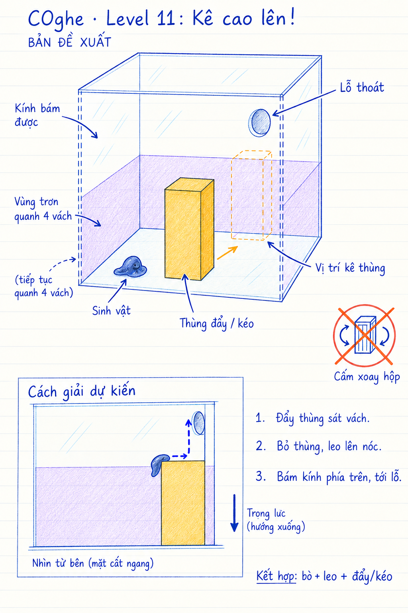

# COghe — Level 11: Kê cao lên!

**Trạng thái: đề xuất để thảo luận, chưa được chốt hoặc triển khai trong Unity.**
Ngày 16/09/2026. Bản phác không theo tỷ lệ.

## Bố cục và cách giải dự kiến

- Hộp kính vuông, khóa xoay. COghe bắt đầu trên sàn.
- Vùng chống bám liên tục bao quanh phần dưới của cả bốn vách. Sàn vẫn đi được; góc vách không có khe bám để vượt vòng trơn.
- Lỗ thoát nằm trên phần kính bám được, phía trên vùng trơn.
- Một thùng nhựa hổ phách đẩy/kéo được. Mặt thùng bám được; nóc cao hơn mép vùng trơn đủ để chuyển tiếp thân sinh vật sang kính phía trên.
- Đẩy thùng sát vách → thả thùng theo quy tắc hiện có → leo mặt thùng và nóc → bám vùng kính phía trên → đến lỗ thoát.
- Khung nét đứt trong bản vẽ chỉ minh họa vị trí thùng khi giải; không phải thùng thứ hai hoặc vùng tự hút/khóa vị trí trong game.
- Những cách kê thùng khác vẫn được chấp nhận nếu tạo một đường đi hợp lệ. Không kiểm tra đúng một tọa độ đáp án cố định.

## Vai trò trong tiến trình

Một màn củng cố nhẹ sau Boss 10: phối hợp bò, leo và đẩy/kéo, không mở kỹ năng mới hay tăng chỉ số. Cấu trúc gần màn 07, vì vậy cần người dùng chọn đây là màn nghỉ/củng cố hay thay bằng thử thách mới trước khi phát triển.

## Cần kiểm tra khi dựng prototype

Thùng trượt/đẩy ổn định, không đổ vì lực sinh vật; biên vùng trơn đúng dữ liệu vật lý; leo thùng rồi chuyển sang vách không mắc cạnh; có thể kéo thùng ra khi kê sai. AI chỉ thực hiện đường đi được chỉ dẫn, không tự giải bằng cách kê thùng. Không có nhảy hoặc đường bay tự động. Hình sinh vật trong phác chỉ là ký hiệu, không thay đổi thiết kế cơ thể hiện tại.

## Nguồn hình

Tạo bằng công cụ image_gen tích hợp, theo skill imagegen. Prompt ban đầu và lượt chỉnh nằm trong [generation-prompts.md](generation-prompts.md).
