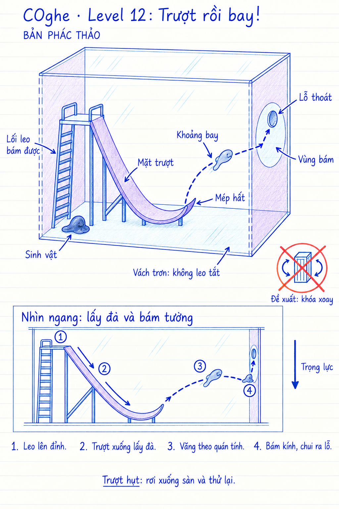

# COghe — Level 12: Trượt rồi bay!

**Trạng thái: Prototype; đường leo và đường giải đã qua kiểm thử tự động trên Mac ngày 18/09/2026.** Content `venom.origin.12` hiện nằm ở màn hiển thị **22** trong campaign 30. Phác thảo gốc ngày 16/09/2026 được giữ bên dưới; hình không theo tỷ lệ.

## Chỉnh đường leo — 18/09/2026

Người dùng phản hồi rất khó leo lên mặt trên. Đường leo cũ hướng vào mặt dưới
của phần bệ nhô ra; tiếp cận từ một số hướng phải vòng sang cạnh hẹp. Bản sửa
đặt mặt bám ở mép trước bệ (z = −0,10 m), từ sàn đến y = 0,145 m. Mặt trên
rộng 193 × 200 mm thay cho 193 × 100 mm. Sinh vật xuất phát trước mặt leo.
Camera pitch 20°, yaw −24° để thấy mặt bệ nhưng không lấy nóc hộp che đích chạm.

Giữ nguyên lòng máng, vùng đón, khoảng bay, vật liệu trơn, khối lượng và lực.
Hai lệnh dự kiến: chạm bệ hổ phách để leo, rồi chạm đầu máng tím để trượt.
Màn khóa xoay trong prototype. Có thể rơi về sàn và leo thử lại. Không thêm
lực phóng, hút qua khoảng bay hoặc dịch chuyển sinh vật lên bệ.

Builder `RebuildAccessibleSlide` dựng đúng source 12 rồi cập nhật slot 22.
Kết quả và giới hạn kiểm chứng: [báo cáo màn 22](../../../Verification/COgheCampaign30/slide-22.md).

## Ý tưởng người dùng

Sinh vật trèo lên cầu trượt làm bằng vật liệu trơn, trượt xuống rồi tung người bám vào thành tường nơi có lỗ thoát.

## Chi tiết bố cục đề xuất

- Hộp kính, sàn đi được. Lối leo riêng có độ bám dẫn lên bệ xuất phát; không bắt sinh vật leo ngược một mặt trơn.
- Cầu trượt cố định, lòng trượt phủ vật liệu trơn màu tím. Đường cong xuống lấy đà, đáy lượn liên tục rồi mép cuối cong lên để hướng vận tốc vào khoảng bay.
- Cầu trượt không chạm vách đích. Có một khoảng không thật giữa mép trượt và vùng đón.
- Vùng kính bám được quanh lỗ đủ lớn để sinh vật đáp ở dưới lỗ, bám lại rồi bò vào. Vách xung quanh trơn để không thể leo trực tiếp từ sàn; lối leo và bệ xuất phát tách khỏi các vách.
- Đề xuất khóa xoay ở màn giới thiệu này. Đây là bổ sung để thảo luận, không phải yêu cầu khóa xoay đã được người dùng chốt.
- Hình sinh vật trên đường bay và tại vùng đón biểu diễn các thời điểm của cùng một bản thể, không phải phân tách.

## Nhịp điều khiển đề xuất

Chạm bệ xuất phát để leo lên; từ bệ, chỉ hướng về vùng đón để bước vào lòng trượt. Khi đã vào vùng trơn, cơ thể không có lực bò hiệu dụng; trọng lực, tiếp xúc với máng và quán tính quyết định chuyển động. Khi đã rời mép, không điều khiển đổi hướng trên không hay hút xuyên khoảng bay. Chỉ bám khi thực sự tiếp xúc với vùng kính bám được; sau đó thực hiện lệnh tới lỗ như bình thường.

Màn đầu dùng vùng đón rộng và hình học tha thứ để người chơi đọc được cơ chế. Trượt hụt thì rơi xuống sàn, có đường leo thử lại; không bắt đầu lại toàn màn chỉ vì đáp hụt. Các xúc tu thăm dò không được tự tạo cầu nối trước khi tới vùng tiếp xúc hợp lệ.

## Nhịp animation

1. **Trên đỉnh:** ngóc nhẹ thăm dò rồi dồn cơ thể vào mép.
2. **Trượt:** thân dẹt và dài ra theo hướng vận tốc; xúc tu bị kéo về sau, không chạy animation chân bám giả trên mặt trơn.
3. **Rời máng:** thu phần thân sau, vươn các xúc tu trước về vùng kính; thân thành giọt kéo dài, biến dạng theo vận tốc và trọng lực.
4. **Bám tường:** phần tiếp xúc dàn rộng, thân dưới kéo trễ theo quán tính rồi thu lại. Chỉ sau tiếp xúc mới kéo toàn thân lên vùng bám.
5. **Hụt:** rơi, dẹt khi chạm sàn, hồi phục và quay nhìn cầu trượt. Chiến thắng giữ camera cận và bộ ba hoạt ảnh vui hiện có.

## Kiểm chứng bắt buộc trước khi chốt kích thước

- Điểm xuất phát cao hơn vùng đáp để có ngân sách thế năng; tính cả tổn hao do ma sát và biến dạng, không giả định bảo toàn cơ năng hoàn toàn.
- Chọn độ dốc, bán kính lượn, góc mép, khoảng bay và kích thước vùng đón bằng mô phỏng với cơ thể hiện tại. Không dùng cú hất bằng lực tùy ý hoặc animation kéo cơ thể tới đích để thay quỹ đạo vật lý.
- Mesh và collider lòng máng liên tục, không có cạnh gây kẹt hoặc ghim phần thân sau. Cơ thể mất bám hoàn toàn khi vào vùng trơn.
- Kiểm tra chuyển tiếp trượt → bay → bám với toàn bộ khối lượng cơ thể, tránh phần đuôi mắc máng hoặc xuyên tường.
- Giới hạn vùng hỗ trợ lỗ chỉ sau khi đã bám và đến gần miệng, không hút sinh vật từ giữa không trung để bỏ qua thử thách.
- Kiểm tra góc camera thấy được bệ, mặt trượt, khoảng bay và vùng đón trên màn hình dọc; kiểm tra đường leo tắt qua cạnh, trụ và các mặt khác.
- Nếu cầu trượt đã căn sẵn giải được chỉ bằng một lần chỉ đường, coi đây là màn giới thiệu cơ chế. Không mô tả nó là một puzzle khó khi chưa có lựa chọn cần suy nghĩ.

## Nguồn hình

Tạo bằng công cụ image_gen tích hợp theo skill imagegen; dùng mockup màn 11 làm tham chiếu phong cách. Prompt đầy đủ: [generation-prompt.md](generation-prompt.md).
