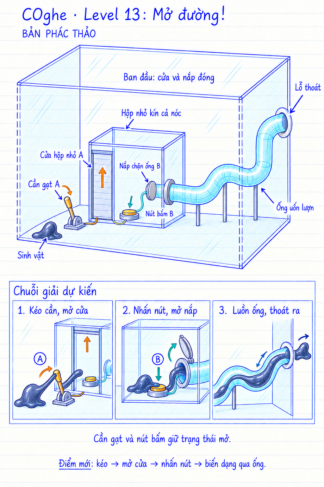

# COghe — Level 13: Mở đường!

**Trạng thái: đã triển khai Unity; content 13 nằm ở màn 17 trong campaign 30 màn.**
Bản phác ngày 16/09/2026 không theo tỷ lệ; mô tả đề xuất ban đầu được giữ bên dưới.

### Cập nhật đoạn thoát ống — 18/09/2026

Giữ chuỗi cần A → cửa A → nút B → nắp B → ống cong → lỗ cuối. Cơ quan không
cắt cơ thể ở màn này. Đầu và đuôi sinh vật được cùng bộ điều khiển ống dẫn qua
miệng ra; phần đầu đã ra ngoài không nhận thêm lực hút nhanh hơn khi đuôi còn
trong ống. Giữ collider và đủ 32 hạt vật chất. Luật thắng vẫn kiểm tra toàn bộ
bản thể đã qua lỗ cuối, không thắng tại miệng vào.

Kiểm tra cả liên kết vật lý và lớp da được dựng thật để bắt trường hợp dữ liệu
còn nối nhưng hình ảnh thành các giọt rời. [Báo cáo kiểm thử](../../../Verification/COgheCampaign30/tube-exit-17.md).

## Yêu cầu của người dùng

Màn phức tạp hơn một chút. COghe kéo cần gạt để mở cửa vào hộp nhỏ bên trong hộp lớn. Trong hộp nhỏ có nút bấm mở nắp chặn một đường ống ngoằn ngoèo, dẫn ra lỗ thoát của hộp lớn.

## Chi tiết bổ sung trong bản phác — đề xuất để chốt

- Miệng ống nằm bên trong hộp nhỏ. Hộp nhỏ kín cả nóc, có một cửa vào. Hai đầu ống nối kín với các mặt hộp, không để hở đường leo tắt vào lỗ thoát.
- Cần gạt A nằm ngoài hộp nhỏ; kéo qua nấc kích hoạt mở cửa A. Cần có nấc giữ, COghe rời tay thì cửa vẫn mở.
- Nút B nằm trong hộp nhỏ, có độ lún rõ. Nhấn đủ hành trình kích hoạt mở nắp B; cơ quan giữ mở khi COghe rời nút. Đây là khác biệt với nút phải đứng đè liên tục, cần phản hồi hình ảnh rõ ràng.
- Các đường nối A → cửa và B → nắp biểu đạt quan hệ nhân quả. Trong game, đèn chỉ đổi trạng thái khi cơ quan thực sự kích hoạt; nắp phải rời khỏi lòng ống trước khi cho cơ thể đi qua.
- Đường ống cyan trong suốt, 2–3 khúc cong rộng, một tuyến liên tục không chia nhánh. Những khúc cong tạo sự thú vị khi cơ thể biến dạng; khó khăn chính là chuỗi phụ thuộc của hai cơ quan.
- Không thêm vật liệu trơn, cơ quan cắt, yêu cầu chia cơ thể, giới hạn thời gian hay kỹ năng mới trong bản này. Quyền xoay hộp chưa được chốt; hình không tự bổ sung luật cấm xoay.

## Chuỗi giải và trạng thái

| Trạng thái | Hành động của người chơi / COghe | Kết quả nhìn thấy |
| --- | --- | --- |
| Cửa đóng, nắp ống đóng | Chỉ COghe đến cần gạt; thực hiện kéo | Cần nghiêng đến nấc, cửa nâng lên và giữ mở |
| Cửa mở, nắp ống đóng | Chỉ vào nút B trong hộp nhỏ | COghe vào hộp, đè nút lún; nắp bật lên hoặc rút ra khỏi miệng ống |
| Cửa mở, nắp mở | Chỉ miệng ống / lối thoát | COghe kéo dài thành dòng, đi theo các đoạn cong liên tục |
| Toàn bộ bản thể ra ngoài đầu ống cuối | Hoàn tất điều kiện thoát | Chạy camera cận và bộ hoạt ảnh chiến thắng hiện có |

Nút giữ trạng thái để một bản thể hoàn chỉnh có thể rời nút rồi vào ống, tránh tạo yêu cầu chia cơ thể mà màn không cung cấp cơ quan cắt. Không tự đóng cửa hoặc nắp lên sinh vật. Retry phục hồi toàn bộ trạng thái ban đầu.

## AI và điều khiển

Người chơi nhận ra và lựa chọn thứ tự cần gạt → nút → ống. Trí nhớ kỹ năng giúp COghe biết cách bám, kéo, đè và luồn khi đã được chỉ tới đúng đối tượng; không tự lập kế hoạch giải toàn màn chỉ từ một lần chạm lỗ thoát. Khi đã vào ống, COghe tự đi qua các đoạn cong, không buộc người chơi chạm từng khúc.

Kéo cần giữ thao tác hướng dẫn phù hợp với kiểu kéo đồ vật hiện có: tới gần và bám tay nắm, sau đó ra hướng kéo; hoạt ảnh và hành trình cần phải khớp tác động thực. Không biến nút bấm trên màn hình thành thao tác mở cửa từ xa khi sinh vật chưa chạm cơ quan.

## Animation đề xuất

- **Kéo cần:** xúc tu cuốn quanh tay nắm, phần thân sau bám sàn, thân căng rồi kéo theo cung chuyển động của cần. Khi qua nấc, thân nhún nhẹ và buông ra.
- **Nhấn nút:** dàn thân lên mặt nút, dồn khối lượng làm nút lún rõ, quay về phía nắp khi nó mở.
- **Vào ống:** đưa một xúc tu thăm dò miệng, phần đầu kéo dài, thân sau thu dần thành một dòng liên tục.
- **Qua khúc cong:** đường bao thân ôm lòng ống, khối phồng di chuyển liên tục; giữ cảm giác có khối lượng, không chia thành chuỗi bi rời hoặc biến mất rồi xuất hiện lại.
- **Ra ngoài:** phần trước nở ra, phần đuôi vẫn nối với dòng trong ống cho tới khi ra hết. Chỉ sau khi toàn bộ bản thể thoát mới chiến thắng.

## Cần kiểm chứng khi dựng

Cửa mở đủ khoảng hở; không thể vòng qua nóc hộp nhỏ; chốt cửa/nắp không tự mở do đảo trọng lực; nút không vô tình bị thân đang ngoài hộp tác động xuyên vách; đầu nối ống không có khe hở để vào tắt. Bán kính cong và tiết diện ống phải tương thích với giới hạn biến dạng của toàn bản thể, không ép người chơi chia nhỏ để đi qua. Giữ tổng khối lượng qua các trạng thái luồn ống; đầu cuối thực sự xuyên vỏ hộp và điều kiện thắng kiểm tra ngoài hộp, không tại miệng vào.

Camera 3/4 phải thấy cần, cửa, nút sau kính, nắp và toàn tuyến ống trên màn hình dọc. Nhãn A/B trong hình giải thích bố cục; cách đưa gợi ý vào game sẽ chốt riêng, không mặc định thêm hướng dẫn toàn lời giải sau Boss 10.

## Nguồn hình

Tạo bằng công cụ image_gen tích hợp, theo skill imagegen. Tham chiếu phong cách: mockup Level 12. Prompt ban đầu và lượt chỉnh: [generation-prompts.md](generation-prompts.md).
