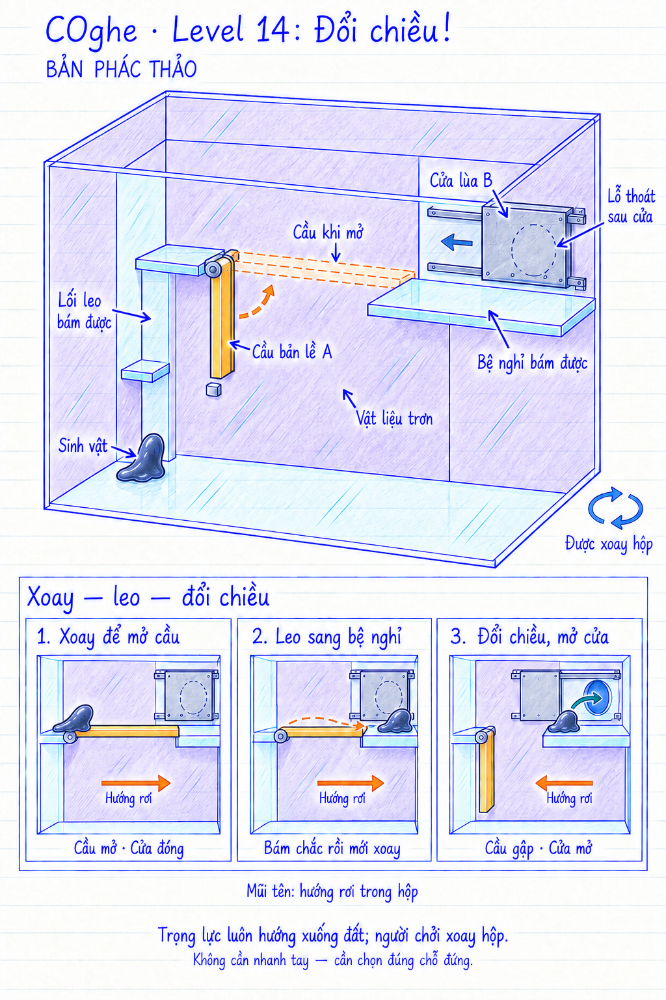

# COghe — Level 14: Đổi chiều!

**Trạng thái: đề xuất mockup, chưa triển khai hoặc kiểm chứng bằng Unity.** Ngày 16/09/2026. Bản vẽ không theo tỷ lệ; các sơ đồ dưới giữ hệ tọa độ hộp đứng yên để so sánh trạng thái.

## Yêu cầu của người dùng

Kết hợp xoay hộp với cơ quan bên trong. COghe phải leo trèo để vượt các bề mặt vật liệu trơn và đi vào lỗ thoát.

## Phương án đề xuất

Một cầu bản lề và một cửa lùa phản ứng khác nhau với hướng trọng lực tương đối trong hộp. Người chơi phải đưa COghe sang bệ bám an toàn trước khi đổi hướng hộp để mở đường ra. Không dùng đồng hồ hoặc đòi hỏi phản xạ nhanh.

### Bố cục

- Sàn đi được. Một dải kính bám được ở phía trái dẫn từ vị trí xuất phát lên bệ đầu cầu.
- Khoảng vách giữa hai bệ phủ vật liệu trơn. Lớp trơn tiếp tục trên các vách/nóc có thể dùng để bò vòng. Bề mặt bám hợp lệ nổi bật bằng kính xanh nhạt; vùng trơn màu tím.
- **Cầu A:** một tấm nhựa hổ phách bám được, có bản lề ở bệ trái. Ban đầu treo xuống. Khi xoay hộp theo hướng phù hợp, cầu chuyển tới chặn cơ khí và nối sang bệ phải. Nét đứt trong bản vẽ là tư thế mở của chính tấm cầu này.
- **Bệ nghỉ:** cố định vào hộp, đủ rộng cho toàn bộ bản thể, bám được cả trên mặt và cạnh khi đổi hướng trọng lực. Nó không nằm trong vùng quét của cầu hoặc hành trình cửa.
- **Cửa B:** tấm bạc trên ray kín che lỗ thoát. Trọng lực kéo cửa sang trái để lộ lỗ; hướng nghiêng duy trì cầu mở lại đẩy cửa về phía đóng. Cửa không rơi khỏi ray như nắp tự do màn 09.
- Từ bệ nghỉ có một vùng kính bám được nối tới lỗ thoát sau cửa. Khe nhận đầu cầu không để hở một đoạn phải nhảy hoặc bò trên vùng trơn.

## Chuỗi giải dự kiến

1. Xoay hộp sang tư thế A: cầu áp vào chặn mở, cửa lùa bị kéo về phía đóng.
2. Dẫn COghe leo lên, qua cầu và đặt toàn thân trên bệ nghỉ bám được.
3. Xoay sang tư thế B: cầu trở về phía gập, cửa lùa trượt khỏi lỗ. COghe vẫn bám bệ cố định.
4. Chỉ COghe đi qua vùng kính an toàn tới lỗ thoát.

Khó khăn chính là nhận ra việc đổi hướng giúp mở cửa cũng làm mất cây cầu phía sau. Vị trí nghỉ của sinh vật là một phần của lời giải.

## Quy tắc vật lý

- Trọng lực thế giới luôn hướng xuống đất; xoay hộp làm đổi hướng trọng lực trong hệ tọa độ hộp. Mũi tên ngang ở ba hình nhỏ biểu diễn hướng tương đối này, không phải lực đổi hướng trong thế giới.
- Cầu dùng bản lề thụ động, khối lượng và tâm khối lượng thực, giới hạn góc/chặn cơ khí, giảm chấn vừa đủ. Cửa có một bậc tự do trên ray và hai chặn cuối. Không dùng animation hoặc điều kiện góc hộp để dịch chuyển cơ quan tức thời.
- Tư thế A phải tạo mô-men ép cầu vào chặn mở và lực dọc ray giữ cửa đóng. Tư thế B phải tạo mô-men gập cầu và lực dọc ray mở cửa. Không chọn tư thế mà trọng lực thẳng hàng chính xác với cầu gây mô-men bằng không tại vị trí khởi động; căn chặn, trọng tâm và khoảng góc hữu dụng bằng prototype. Có thể cần nghiêng hơn một phần tư vòng thay vì đúng 90 độ.
- Có khoảng hướng ổn định đủ rộng cho người chơi giữ hộp bằng tay trên mobile. Hình vẽ chỉ thể hiện hai tư thế kết quả, không chốt góc hay kích thước.
- COghe bám cầu chuyển động bằng tiếp xúc hợp lệ. Khi đổi hướng trên bệ nghỉ, cơ thể vẫn chịu trọng lực và có độ kéo trễ; không khóa toàn thân cứng vào thế giới hoặc làm giảm sức bám vô cớ.
- Các trạng thái của cầu và cửa xuất phát từ mô phỏng, không mã hóa thành luật loại trừ nhị phân. Chấp nhận trạng thái giữa và cách giải khác nếu hợp lệ về vật lý. Không chấm một chuỗi thao tác cố định.
- Nếu xoay hộp tạo đường rơi khác tới bệ, đó là ứng viên lời giải để đánh giá. Ưu tiên bố cục làm đường leo/cầu rõ và hữu ích; không thêm lực vô hình hoặc vùng cấm tùy ý để ép lời giải dự kiến.

## Animation và phản hồi

- COghe bám đầu cầu, đưa xúc tu thăm dò mặt cầu khi nó tới bệ nhận; thân kéo dài theo đường leo.
- Trên cầu nghiêng, xúc tu chuyển điểm bám theo bề mặt thực; vùng trơn không chạy animation bám thành công.
- Ở bệ nghỉ, thân hạ thấp và mở vùng bám khi hộp xoay, phần tự do chảy trễ theo trọng lực.
- Sau khi cửa trượt, có phản ứng quay thân về lỗ. Kết thúc giữ camera và ba hoạt ảnh vui hiện có.
- Bản lề có trục và chặn nhìn thấy được; ray và tấm cửa tách bạch. Tiếng chạm chặn nhẹ, không rung/va đập liên tục. Icon xoay được giữ cố định theo lựa chọn UI hiện có.

## Cần kiểm chứng trước khi chốt màn

Cầu thực sự nối được hai bệ; đủ chỗ cho toàn cơ thể nghỉ; các hướng giữ cơ quan ổn định đủ rộng; xoay chậm/nhanh không làm cầu/cửa xuyên kính; đổi hướng không kẹp sinh vật; không bị mắc mép khi chuyển từ cầu động sang bệ cố định. Kiểm tra đường leo/rơi thay thế do xoay ba chiều, khả năng quay lại khi thao tác sai, và đảm bảo không có ngõ cụt buộc retry vì cơ quan mất khỏi hộp. Camera phải nhìn được cầu, vùng trơn, bệ và cửa trong các tư thế giải trên màn hình dọc.

## Nguồn hình

Tạo bằng công cụ image_gen tích hợp, theo skill imagegen; mockup màn 13 chỉ làm tham chiếu phong cách. Prompt ban đầu và lượt chỉnh: [generation-prompts.md](generation-prompts.md).
