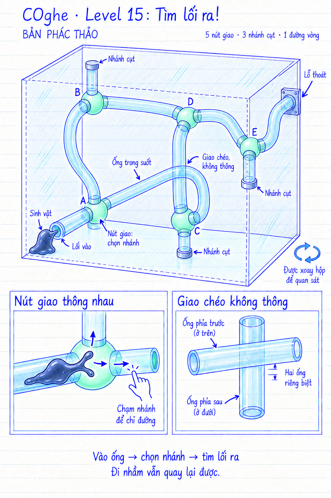

# COghe — Level 15: Tìm lối ra!

**Trạng thái: mockup để thảo luận, chưa triển khai Unity.** Ngày 16/09/2026. Hình thể hiện ý tưởng không gian, không phải bản vẽ kỹ thuật theo tỷ lệ. Bảng kết nối dưới đây xác định các đường thông thực sự.

## Yêu cầu của người dùng

Một mê cung các ống đan xen. Người chơi giúp COghe di chuyển trong ống, lựa chọn hướng đi để tìm lỗ thoát.

## Bố cục đề xuất

- Một mạng ống cyan trong suốt bên trong hộp kính, uốn ở nhiều độ sâu. Mỗi ống có lòng liên tục và bán kính cong đủ để toàn bộ cơ thể biến dạng qua.
- Năm ngã ba A–E, ba nhánh cụt và một đường vòng. Một miệng vào thấp gần sinh vật; đầu ra duy nhất xuyên kín qua vỏ hộp. Các đầu khác đóng kín, không để chui ra ngoài mạng ống rồi bò tới lỗ.
- Nút nối thật có buồng nối trong suốt và viền mint. Ống chỉ đi chéo qua nhau có khoảng cách thực giữa hai vỏ, không có buồng nối; không thể chuyển từ ống này sang ống kia ở chỗ chéo.
- Được xoay hộp để nhìn các đoạn bị che. Trọng lực thế giới và biến dạng cơ thể vẫn nhất quán; xoay không thay đổi sơ đồ kết nối.
- Vật liệu ống ở màn này bám được từ bên trong. Đây là sinh vật chủ động bò và co kéo, không phải dòng nước chỉ chảy xuống theo trọng lực. Không thêm vật liệu trơn hoặc cơ quan cắt.

## Sơ đồ kết nối chính xác

Mỗi cạnh là một đoạn ống thông hai chiều. Giao chéo trên hình chiếu không sinh thêm cạnh.

| Điểm | Nối tới |
| --- | --- |
| Vào | A |
| A | Vào, B, C |
| B | A, D, Cụt 1 |
| C | A, D, Cụt 2 |
| D | B, C, E |
| E | D, Cụt 3, Ra |
| Cụt 1 | B |
| Cụt 2 | C |
| Cụt 3 | E |
| Ra | E |

Đường vòng: A → B → D → C → A. Hai tuyến ra hợp lệ: Vào → A → B → D → E → Ra, hoặc Vào → A → C → D → E → Ra. Không bắt người chơi chọn một tuyến duy nhất. Chữ A–E là ký hiệu thiết kế; không mặc định biến thành nhãn lời giải trong game. Các cổ đỡ trên thân khớp phải đóng kín, không trở thành miệng vào ngoài sơ đồ.

## Điều khiển và AI

1. Chạm miệng vào: COghe thu người và luồn đến nút A.
2. Ở ngã ba: COghe dừng thăm dò, chờ người chơi chọn một nhánh nối trực tiếp với nút hiện tại. Vòng phản hồi hiện trên nhánh thực sự được chọn.
3. COghe tự di chuyển qua đoạn ống tới nút giao tiếp theo; không yêu cầu chạm từng khúc cong.
4. Người chơi có thể chọn đường quay lại. Tới đầu cụt thì dừng, không mất mạng hoặc reset màn; ra lệnh ngược để trở về nút gần nhất.
5. Chỉ đoạn cuối tới Ra đưa toàn bộ sinh vật ra ngoài và kích hoạt chiến thắng.

Chạm thẳng lỗ thoát không làm AI tìm và giải toàn bộ mê cung. Sự thông minh thể hiện ở thao tác luồn, phản ứng tại ngã rẽ, quay đầu và nhớ chỗ đã thăm; quyết định tuyến đường thuộc về người chơi. Không tự tách cơ thể khi thăm dò hai nhánh. Có thể cho một vệt mint mờ ở đoạn vừa đi qua để hỗ trợ trí nhớ, nhưng không tô sẵn lời giải hoặc tự đánh dấu nhánh đúng. Vệt nhớ là đề xuất riêng, chưa được người dùng chốt.

Khi các ống chồng hình trên màn hình, chỉ những nhánh nối hợp lệ tại nút đang đứng mới nhận lệnh rẽ. Hình phản hồi phải gắn đúng lòng ống/nhánh. Không tự chọn nhánh nằm gần lỗ thoát nhất; không đi xuyên qua một ống chỉ tình cờ chồng hình lên đoạn đang đứng. Xoay hộp và thao tác chạm phải phân biệt rõ như điều khiển hiện có.

## Animation

- Trong đoạn thẳng: khối cơ thể kéo dài, sóng co bóp đi qua liên tục; giữ khối lượng, không dùng chuỗi hạt rời.
- Ở khúc cong: đầu đổi hướng trước, phần thân và đuôi ôm theo lòng ống sau.
- Ở ngã ba: đầu thân ngóc và hai xúc tu thăm dò ngắn; khi nhận lệnh thì thu xúc tu ở nhánh còn lại, dồn toàn thân vào nhánh đã chọn.
- Ở đầu cụt: thăm dò nắp, co nhẹ rồi quay hướng chờ chỉ dẫn; không tự chọn một lời giải khác.
- Khi quay lại trong ống hẹp: đổi hướng co kéo của khối lỏng, không ép thân cứng quay một vòng 180 độ trong tiết diện nhỏ.
- Khi ra ngoài: phần đầu nở ra và kéo phần đuôi qua hết; giữ bộ hoạt ảnh ăn mừng hiện có.

## Cần kiểm chứng trước khi dựng chính thức

Đảm bảo hình học collider khớp bảng kết nối, không có giao thông giả ở điểm chéo; các buồng nối và ống đủ cho toàn bản thể đi mọi chiều và quay lại. Chọn nhánh khi đường ống chồng hình phải đáng tin trên màn hình dọc. Xoay không làm cơ thể rò sang ống khác hoặc xuyên vỏ. Các đoạn đi lên dùng khả năng bám/co kéo đã có, không chuyển tức thời bằng animation. Kiểm tra thất thoát khối lượng, mắc đuôi tại nút và điều kiện thắng chỉ ở đầu ra thật.

Độ khó đến từ đọc không gian và nhớ nhánh, không từ kính đục hoặc đoạn ống không thể nhìn thấy. Khi dựng, giảm độ đậm các ống không liên quan và nhấn nhẹ ống đang chứa cơ thể; các hiệu ứng chỉ giúp đọc hình, không tiết lộ lời giải.

## Nguồn hình

Tạo bằng công cụ image_gen tích hợp theo skill imagegen. Mockup màn 14 chỉ làm tham chiếu nét vẽ. Prompt ban đầu và lượt chỉnh: [generation-prompts.md](generation-prompts.md).
