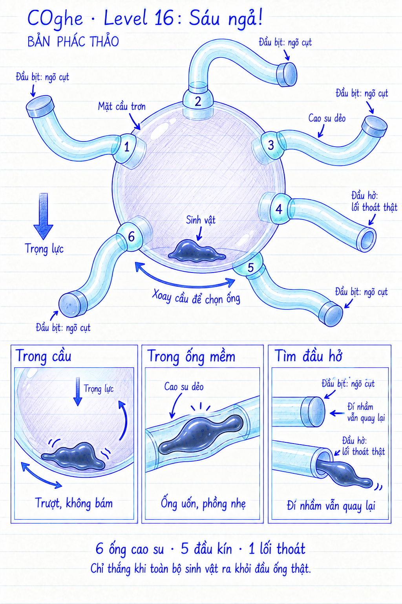

# COghe — Level 16: Sáu ngả!

**Trạng thái: mockup theo ý tưởng người dùng, chưa triển khai Unity.** Ngày 16/09/2026. Hình không theo tỷ lệ.

## Yêu cầu người dùng

Thiết kế dựa trên màn 06: sinh vật ở trong khối cầu trơn. Có sáu ống cao su dẻo để đi ra, nhưng chỉ một ống là lối thoát thật.

## Cách diễn giải trong bản phác

- Sáu miệng nối kín qua vỏ cầu, mỗi miệng dẫn vào một ống cao su riêng ở bên ngoài. Các ống không phân nhánh hoặc nối với nhau.
- Năm ống có đầu bịt kín, một ống có đầu hở thông ra ngoài. Đây là cách diễn giải đề xuất cho “lối thoát giả”; người dùng chưa chỉ định rằng ống giả là nhánh cụt hay vòng quay về cầu.
- Số 1–6 giúp chỉ vị trí trong bản vẽ. Ống 4 được chọn làm lối thật trong mockup, không phải yêu cầu vị trí cố định của người dùng.
- Cao su mềm bán trong suốt giúp thấy cơ thể đang ở đâu và đọc độ phồng; các ống dùng cùng một ngôn ngữ vật liệu. Đầu thật không có màu phát sáng riêng tiết lộ đáp án.
- Đầu kín/hở là manh mối quan sát. Nhãn “lối thoát thật” chỉ để giải thích bản thiết kế, không mặc định xuất hiện trong game. Chưa có thiết kế giấu đáp án hoặc ngẫu nhiên hóa theo lần thử.

## Điều khiển và diễn tiến

1. Trong cầu, giữ đúng nguyên tắc màn 06: mặt trong trơn, không bám. Chạm vị trí vẫn cho COghe phản ứng và chạy animation cố di chuyển, nhưng không tạo lực bò hiệu dụng. Xoay cầu để trọng lực và quán tính đưa nó về miệng ống mong muốn.
2. Khi cơ thể thực sự tới miệng ống, nó biến dạng để vào lòng ống. Không hút qua khoảng xa hoặc xuyên vỏ cầu.
3. Đề xuất lòng cao su có độ bám để COghe chủ động luồn và quay lại theo hướng được chỉ. Quy tắc này áp dụng trong ống; không làm mặt cầu hết trơn.
4. Vào ống cụt: thăm dò đầu bịt, dừng lại; người chơi chỉ hướng quay về miệng hoặc xoay cầu hỗ trợ trở lại. Không mất mạng, không reset toàn màn. Không tự chuyển sang ống khác.
5. Vào ống thật: luồn tới đầu hở, ra hoàn toàn rồi mới thắng.

**Ranh giới thắng phải ở đầu ra cuối ống thật.** Chui qua vỏ cầu vào một ống vẫn đang ở trong hệ kín, chưa phải thoát màn. Năm ống bịt không được kích hoạt thắng dù phần cơ thể đã nằm ngoài hình cầu. Giữ luật hợp thể và toàn bộ sinh vật thoát; màn này không thêm cơ quan cắt.

## Cảm giác cao su dẻo

- Gốc ống gắn chắc vào vỏ cầu; các đoạn còn lại uốn theo trọng lượng và có độ trễ khi người chơi xoay.
- Có độ cứng uốn và xu hướng hồi hình, không coi ống là dây hoàn toàn nhũn. Độ cong nghỉ của ống có thể khác nhau, nhưng tất cả cùng tuân theo trọng lực thế giới.
- Cơ thể đi qua gây phồng cục bộ vừa phải, phần ống sau nó hồi lại. Phần thân sinh vật cũng co kéo liên tục, không thành chuỗi bi rời.
- Đầu bịt là một phần vỏ kín thật. COghe có thể làm nó hơi căng khi thăm dò nhưng không xuyên qua.
- Ở đầu hở, mép cao su biến dạng theo tiếp xúc rồi hồi lại khi đuôi ra hết; sau đó chạy chiến thắng hiện có.

## Độ khó và khả năng quan sát

Khó khăn là đọc vị trí các miệng, quan sát đầu ống và xoay cầu để tiếp cận đúng ống. Năm đầu kín phải có dấu hiệu hình học nhất quán; nếu che giấu hoàn toàn và chỉ cho thử từng ống thì màn trở thành mò đáp án. Cần giữ sáu ống tách bạch, không quấn vào nhau che hết vỏ cầu. Camera phải bao được cả các đầu ống khi chúng uốn; xoay giúp quan sát những mặt bị khuất.

## Cần kiểm chứng trước khi chốt prototype

- Sáu lỗ đều nối thông thật với đúng ống; năm đầu bịt kín, đúng một đầu hở. Vỏ cầu giữa các lỗ không có khe rò.
- Lòng ống giữ tiết diện và độ cong cho toàn bản thể đi qua và quay lại. Giới hạn biến dạng để không xẹp kín, tự thắt nút hoặc tạo trạng thái kẹt không thể phục hồi.
- Collider phải theo đúng hình dạng uốn đủ chính xác; không chỉ rung mesh trang trí trên collider ống cứng rồi gọi là vật lý cao su.
- Kiểm tra xoay nhanh, va giữa các ống, tải cơ thể và biến dạng tại mối nối; tránh xuyên vỏ, bật sinh vật ra ngoài hoặc mất khối lượng.
- Bất cứ phần mềm nào hỗ trợ ra lỗ chỉ tác động sát đầu hở thật, không kéo sinh vật từ trong cầu vượt qua cả ống.
- Dùng mô hình uốn có giới hạn và đo chi phí thực tế trên mobile trước khi tăng độ chi tiết. Bản phác không chứng minh một mô phỏng cao su hoàn chỉnh chạy tốt trên thiết bị.

## Nguồn hình

Tạo bằng công cụ image_gen tích hợp theo skill imagegen. Mockup màn 15 chỉ làm tham chiếu phong cách. Prompt đầy đủ: [generation-prompt.md](generation-prompt.md).
