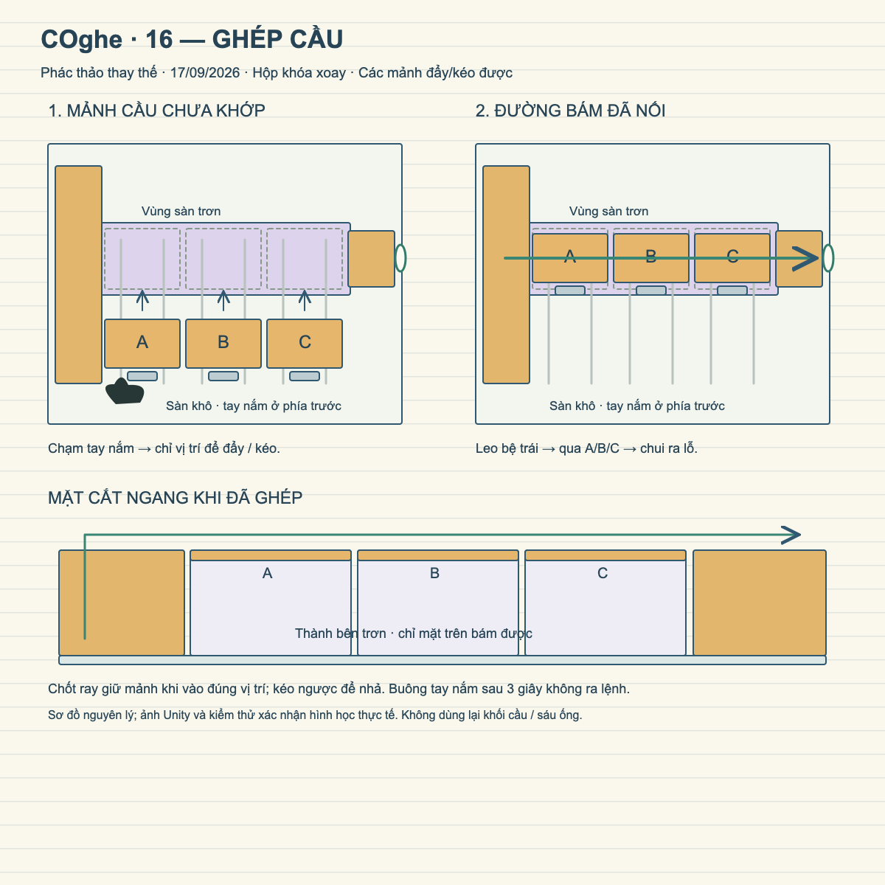
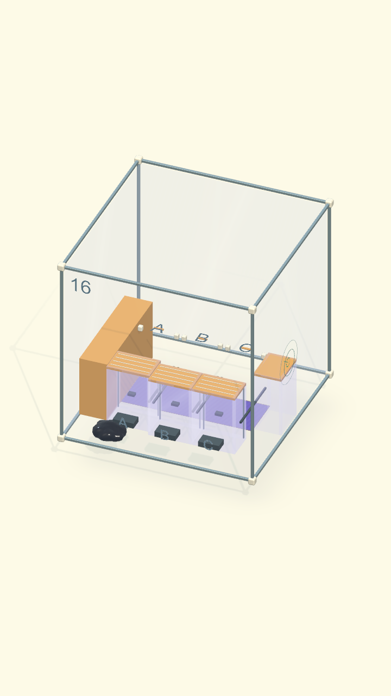
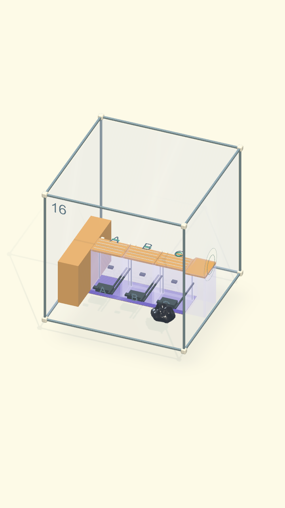

# COghe — Level 16: Ghép cầu

Thiết kế thay thế ngày 17/09/2026 theo yêu cầu người dùng. Bỏ thiết kế khối cầu
và sáu ống cũ; không dùng lại phác thảo đó cho màn 16.

[Bản vector chỉnh sửa được](mockup-ghep-cau.svg).

## Ý đồ

Sinh vật đẩy/kéo ba mô-đun A/B/C thành một cây cầu để trèo qua vùng vật liệu
trơn tới lỗ. Đây là màn lắp ghép chủ động, phân biệt với cầu tự khớp do xoay
trọng lực của màn 18. Hộp khóa xoay. Không thêm kỹ năng hoặc chỉ số tăng cấp.

## Bố trí

- Hộp kính 60 cm. Camera 3/4 thấy tay nắm ở phía trước, ba vị trí ghép và lỗ bên phải.
- Dải trơn tím ở giữa sàn. Vùng thao tác khô nằm phía trước. Tường/nóc trơn để
  không thể leo vòng qua cầu; vẫn nhận chạm và animation cố bò như quy tắc chung.
- Bệ trái có mặt bám để leo lên cao 20 cm. Bệ phải cùng cao độ, nối vùng bám quanh
  lỗ thoát. Thành bên bệ phải trơn, không dùng nó làm bậc leo tắt từ sàn.
- Ba mặt cầu hổ phách, dài 13,8 cm, rộng 9 cm, cách nhau 2 mm khi thẳng hàng.
  Mỗi mô-đun trượt 16 cm trên một ray riêng theo chiều trước–sau.
- Tay nắm thấp và chân đỡ gắn cùng Rigidbody. Chạm tay nắm để thao tác; chạm
  mặt cầu để bò/leo. Khối có thành bên trơn, mặt trên có bám.
- Chốt cuối ray giữ vị trí thật khi đã đẩy tới; kéo ngược nhả chốt. Không teleport
  mảnh ghép, không lắp tự động từ xa, không đặt điều kiện thắng vô hình.

## Điều khiển / lời giải

1. Chạm tay nắm A, COghe tự tới và bám. Chạm phía sau để đẩy A tới chốt.
2. Không ra lệnh 3 giây thì buông; làm tương tự B và C, thứ tự tùy người chơi.
3. Nếu đẩy sai hoặc muốn chỉnh, chạm lại tay nắm rồi chỉ về trước để kéo ra.
4. Chỉ lên bệ trái rồi sang lỗ. COghe leo bệ, đi qua các mặt cầu đã nối và
   chui ra hoàn toàn trước khi thắng. Vẫn áp dụng luật phải hợp thể.

Mất đường do cầu chưa khớp không làm chết ngay: sinh vật rơi xuống sàn rồi có
thể bò về vùng khô để thao tác tiếp. Không có giới hạn thời gian.

## Cấu trúc triển khai

`VenomAssemblyBridgeBuilder` tạo riêng scene 16. Menu **Gravity Box → COghe →
Rebuild Assembly Bridge Level 16**. Dùng lại `COgheRailSlider` (lực, joint và
chốt thật), `VenomMovableProp` có điểm bám tay nắm tùy chọn, `VenomSurfacePatch`
và điều hướng bề mặt. `COgheAssemblyBridge` chỉ đo các mảnh đã vào chốt,
không tự di chuyển cơ quan hoặc khóa thắng.

Phác thảo SVG trong repository thể hiện bố trí và hướng thao tác; ảnh Unity
sau kiểm thử là nguồn xác nhận hình học, vật liệu và đường giải thực tế.

## Ảnh và kiểm chứng prototype

Kiểm tra riêng sau lần chỉnh nhãn cuối: **3/3 đạt**,
`Artifacts/COgheExpansion/bridge16-final.xml`. Hồi quy **27/28 đạt**; lỗi còn
lại thuộc tiếp cận cơ quan G ở Boss 20 và đã được ghi nhận trước thay màn 16.
