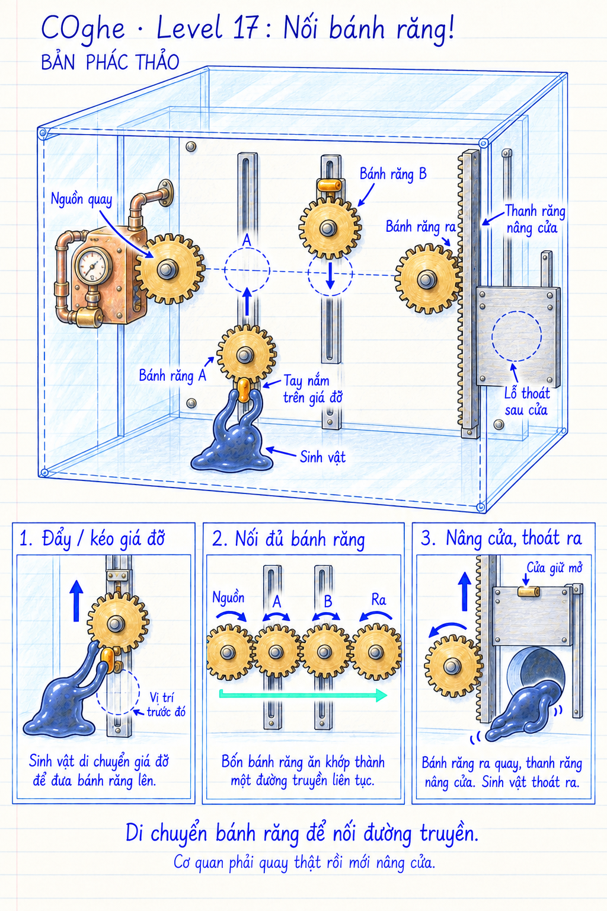

# COghe — Level 17: Nối bánh răng!

**Trạng thái: mockup đề xuất, chưa triển khai Unity.** Ngày 16/09/2026. Hình thể hiện ý tưởng và trạng thái cơ quan, không phải bản vẽ gia công theo tỷ lệ. Khoảng cách trục, đường kính vòng chia, pha răng và chiều truyền động phải được xác lập bằng mô hình cơ cấu khi dựng.

## Yêu cầu người dùng

Một hệ thống steampunk đơn giản hoạt động trong hộp. Thay đổi vị trí các bánh răng làm cửa che lỗ mở để sinh vật thoát ra ngoài.

## Phương án đề xuất

- Bốn bánh răng ngoài, cùng mặt phẳng: **Nguồn → A → B → Ra**.
- Bánh Nguồn và bánh Ra có trục cố định. Nguồn nhận chuyển động chậm từ một cụm dẫn động nhỏ kiểu steampunk; cụm này không thêm thao tác giải đố riêng.
- A và B quay tự do trên ổ trục của hai giá đỡ trượt theo ray. Ban đầu A thấp hơn, B cao hơn hàng truyền động nên đường truyền bị ngắt.
- COghe bám vào tay nắm trên **giá đỡ không quay**, rồi đẩy/kéo giá đỡ để dịch vị trí bánh răng. Không nắm răng hoặc tay quay đang chuyển động.
- Khi hai bánh trung gian được đặt đúng vị trí ăn khớp, chuyển động truyền tới bánh Ra. Bánh Ra ăn khớp với thanh răng thẳng gắn cửa; cửa nâng lên để lộ lỗ tròn thật.
- Có chốt cơ khí giữ cửa ở vị trí mở hết. Dừng nguồn bằng cơ cấu ngắt cuối hành trình hoặc dùng ly hợp giới hạn mô-men để không tiếp tục ép bánh răng vào cửa đã chạm chặn. Cách thực hiện cụ thể cần chọn khi dựng prototype.

Chỉ có hai bánh cần di chuyển nhằm giới thiệu cơ chế dễ đọc. Có thể xử lý A hoặc B trước; không chấm một thứ tự thao tác cố định. Vòng nét đứt là vị trí đích trong bản phác, không mặc định hiện sẵn đáp án trong game.

## Trình tự chơi dự kiến

1. Quan sát nguồn đang quay nhưng bánh Ra và cửa chưa chuyển động.
2. Chỉ COghe tới tay nắm A; hướng dẫn đẩy giá lên tới vùng ăn khớp.
3. Chỉ tới tay nắm B; hướng dẫn kéo giá xuống để nối phần còn lại.
4. Thấy chuyển động truyền qua cả bộ, thanh răng nâng cửa, chốt giữ cửa.
5. Buông cơ quan, dẫn COghe tới lỗ và thoát toàn bộ bản thể.

Giữ kiểu điều khiển gián tiếp: người chơi chỉ dẫn, COghe tiếp cận và thao tác. Không thêm thao tác kéo bánh răng trực tiếp bằng ngón tay từ xa. Nếu lệnh đặt vào vùng chưa ăn khớp, bánh Ra không có truyền động; phản hồi đến từ chuyển động thực của bộ cơ quan.

## Quy tắc truyền động

- Nhìn từ phía người chơi vào mặt các bánh: Nguồn quay thuận chiều kim đồng hồ → A ngược → B thuận → Ra ngược.
- Thanh răng nằm **bên phải** bánh Ra. Bánh Ra quay ngược chiều kim đồng hồ làm thanh răng đi lên.
- Các bánh dùng răng tương thích. Khi ăn khớp, khoảng cách tâm dựa trên tổng bán kính vòng chia; pha răng phải tránh chồng phần đặc. Răng không được xuyên nhau hoặc truyền động qua khoảng trống.
- Giá trượt và trục quay là hai chuyển động riêng. Ray giữ bánh đúng mặt phẳng, tay nắm đi theo giá nhưng không quay theo bánh.
- Cần có nguồn mô-men đủ nâng cửa, ma sát/giới hạn lực hợp lý, hành trình ray và chặn vật lý. Bố cục phải chừa không gian để COghe tiếp cận và di chuyển tay nắm.
- Có thể mô phỏng quan hệ bánh răng bằng ràng buộc cơ học có kiểm tra ăn khớp thay vì va chạm từng răng ở mọi bước. Điều này phải bảo toàn quan hệ vị trí, tốc độ, chiều quay và tải. Không thay thành cờ “đặt đúng ô” rồi mở cửa bằng animation độc lập.
- Nguồn quay chậm, có giới hạn mô-men khi mắc răng. Khi cửa mở hết, bộ truyền dừng hoặc ly hợp trượt có giải thích cơ học; không rung giật hoặc tích lực vô hạn ở chặn.
- Chưa chốt quyền xoay hộp. Nếu cho xoay, khối lượng và ma sát giá trượt phải hoạt động nhất quán; những cách sắp xếp hợp lệ bằng trọng lực cũng cần được đánh giá. Bản phác không tự bổ sung luật khóa xoay.

## Hình ảnh và animation

- Steampunk gọn: đồng thau/đồng đỏ ở bánh răng và cụm nguồn, thép bạc ở thanh răng/cửa, giá đỡ sáng và hộp kính của Day Lab. Không đổi toàn cảnh sang xưởng tối, khói dày hoặc nhiều chi tiết trang trí che cơ quan.
- COghe quấn xúc tu quanh tay nắm, phần thân còn lại bám kính, kéo căng khi đẩy/kéo rồi thu lại khi giá dừng. Va chạm của cơ thể với răng quay phải được xử lý bằng che chắn/hình học giá đỡ, không tự thêm sát thương hoặc cắt cơ thể.
- Khi nối được một phần, các bánh có nguồn quay theo thật; bánh chưa nối không tự quay để trang trí. Ánh chỉ báo nếu dùng phải theo trạng thái cơ học.
- Khi nối đủ, mắt xích cuối quay, thanh răng dịch lên, cửa mở rõ ràng. Tiếng cơ khí nhỏ và nhịp chậm, tránh âm rít liên tục.
- Cửa giữ mở cho sinh vật rời cơ quan và đi ra. Chiến thắng giữ luật toàn bộ bản thể thoát và bộ hoạt ảnh hiện có.

## Kiểm chứng trước khi chốt

Kiểm tra đường tiếp cận hai tay nắm, không kẹp sinh vật ở ray/răng/cửa, trạng thái vào/ra ăn khớp liên tục, chiều quay và hành trình thanh răng, chuyển giao tải khi nối bánh cuối, khả năng sửa vị trí sai, ngắt nguồn/chốt cửa khi mở hết. So sánh mô hình cơ cấu với hình nhìn thực tế trên mobile để không có khoảng hở hoặc răng xuyên nhau. Không cho bộ truyền đứng yên mà cửa vẫn đi lên. Bản phác hiện tại chưa chứng minh độ khó, lực đẩy cần thiết hoặc độ ổn định vật lý.

## Nguồn hình

Tạo bằng công cụ image_gen tích hợp theo skill imagegen. Mockup màn 16 chỉ làm tham chiếu nét vẽ. Prompt ban đầu và lượt chỉnh: [generation-prompts.md](generation-prompts.md).
