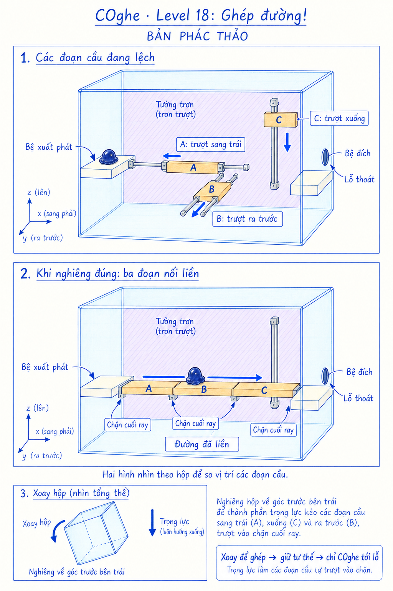

# COghe — Level 18: Ghép đường!

**Trạng thái: bản phác nguyên lý, chưa dựng hoặc kiểm chứng Unity.** Ngày 16/09/2026. Hai hình lớn so sánh trạng thái trong hệ tọa độ hộp; hình nhỏ biểu diễn việc xoay cả hộp. Hình không chốt kích thước, hướng camera hoặc góc xoay chính xác.

## Yêu cầu người dùng

Người chơi xoay hộp tới một tư thế để các cơ quan tự khớp với nhau, tạo đường cho sinh vật di chuyển tới lỗ thoát.

## Phương án đề xuất

Ba thanh cầu cứng, bám được, bị giữ trên ba ray có phương khác nhau. Xoay hộp làm trọng lực kéo chúng về các chặn ghép. Tới đúng tư thế, cả ba cùng nằm thành một đường liên tục từ bệ xuất phát tới bệ đích cạnh lỗ thoát thật trên vỏ hộp.

| Phần | Chuyển động tương đối với hộp | Trạng thái lệch | Trạng thái ghép |
| --- | --- | --- | --- |
| A | Ray ngang | Nằm quá xa bên phải | Trượt trái, nối bệ xuất phát với B |
| B | Ray theo chiều sâu | Lùi về phía sau | Trượt ra trước, nối A với C |
| C | Ray lên/xuống | Nằm quá cao | Trượt xuống, nối B với bệ đích |

Các thanh phải giữ nguyên hình dạng/kích thước giữa hai trạng thái. Không cần thêm bản lề, biến hình, nam châm, nút bấm hoặc cơ quan khóa cửa cho phiên bản giới thiệu này.

## Luồng chơi

1. COghe đứng trên bệ xuất phát bám được; người chơi quan sát các chỗ đứt đường.
2. Xoay hộp để trọng lực tương đối hướng về phía trái, phía trước và phía dưới cùng lúc, đưa ba thanh tới chặn đúng.
3. Khi các đoạn đã sát nhau và ổn định, giữ tư thế hộp, chỉ COghe đi qua A → B → C tới bệ đích rồi lỗ.
4. Toàn bộ bản thể thoát ra ngoài thì chiến thắng như luật hiện có.

Mục tiêu là một vùng tư thế chung làm các phần đồng thời ghép được, không phải tìm ba tư thế khác nhau rồi khóa từng phần. Không có yêu cầu nhanh tay hoặc căn đúng một góc duy nhất.

## Nguyên tắc vật lý và hình học

- Trọng lực thế giới luôn xuống đất. Ray và chặn gắn vào hộp, các thanh chuyển động theo thành phần lực dọc ray.
- Tạo bố cục ở trạng thái ghép trước: bệ trái → A → B → C → bệ phải phải thật sự tiếp xúc, có đủ bề mặt bám và không cần nhảy qua khe. Sau đó dịch từng thanh theo ray để tạo trạng thái ban đầu. Cách này tránh vẽ một đường đẹp nhưng không thể lắp bằng chuyển động đã cho.
- Tư thế xuất phát phải giải thích được vì sao các thanh đang lệch. Có thể chọn hướng hộp làm trọng lực đẩy chúng về đầu ray đối diện. Nếu một thanh tự trượt khi bắt đầu chơi thì chấp nhận chuyển động đó; không khóa nó lơ lửng trái trọng lực để giữ đúng hình minh họa.
- Ray có hành trình giới hạn, chặn thật và giảm chấn vừa đủ. Mép nối có thể vát nhẹ để dẫn hướng khi tiếp xúc. “Tự khớp” là tới các chặn hình học dưới tải, không phải phát hiện góc hộp rồi dịch chuyển tức thời vào ô đích.
- Giữ tư thế giải thì trọng lực ép các thanh sát chặn. Rời tư thế có thể làm đường tách lại; không tự hàn vĩnh viễn các thanh hoặc thay đổi hệ quy chiếu của chúng.
- Phải có khoảng hướng đủ rộng để lực dọc cả ba ray vượt ma sát và giữ được vị trí, kể cả khi chịu tải COghe. Chọn vùng tư thế và ma sát bằng prototype; chưa chốt số độ trong mockup.
- Tính chuyển động của các thanh khi mang sinh vật. Chuyển điểm bám từ thanh đang chuyển động sang thanh/bệ khác phải dựa vào tiếp xúc thực, không kéo cứng sinh vật theo tâm ray.
- Bệ xuất phát/đích bám được để sinh vật an toàn khi xoay. Vùng trơn xung quanh làm rõ lý do dùng cầu; ray và giá đỡ không vô tình tạo một đường leo tắt liên tục. Nếu có lời giải khác hợp lệ về vật lý, đánh giá như một cách chơi thay thế, không chặn bằng luật góc/chuỗi lệnh vô hình.
- Lỗ ở vỏ hộp, không phải chỉ một lỗ trên bệ nổi bên trong. Điều kiện thắng không kích hoạt khi các thanh ghép xong mà sinh vật vẫn chưa thoát.

## Animation và phản hồi

Thanh trượt theo gia tốc, chậm lại khi gặp chặn, tạo tiếng chạm nhỏ và một nhịp rung ngắn. Các mép nối có thể sáng mint nhẹ khi thật sự tiếp xúc; không phát sáng báo hoàn tất chỉ vì hộp gần một góc định trước. COghe bám bệ, cơ thể kéo trễ theo trọng lực lúc xoay, thăm dò mép thanh rồi bò liên tục qua các khớp. Không tự nhảy qua một đường chưa nối.

## Kiểm chứng khi dựng

Kiểm tra tất cả thứ tự các thanh tới chặn để tránh tự khóa do va nhau; quét vùng hướng ghép được và góc lân cận; giữ tải toàn bộ bản thể trên mỗi thanh; thử xoay chậm/nhanh và quay ngược; kiểm tra mép nối, ray, kẹp đuôi và xuyên kính. Đảm bảo có thể quay về bệ hoặc đưa các phần về vị trí để thử lại, không làm sinh vật mất khỏi hộp. Kiểm tra đọc chiều sâu và chọn điểm đến trên màn hình dọc.

Bản phác chỉ xác định ý tưởng và các bậc tự do. Nó chưa chứng minh cấu hình cơ khí, mức độ khó hoặc sự ổn định khi chạy game.

## Nguồn hình

Tạo bằng công cụ image_gen tích hợp theo skill imagegen. Prompt cho bản thanh cầu thẳng được chọn và lượt chỉnh cuối: [generation-prompts.md](generation-prompts.md).
