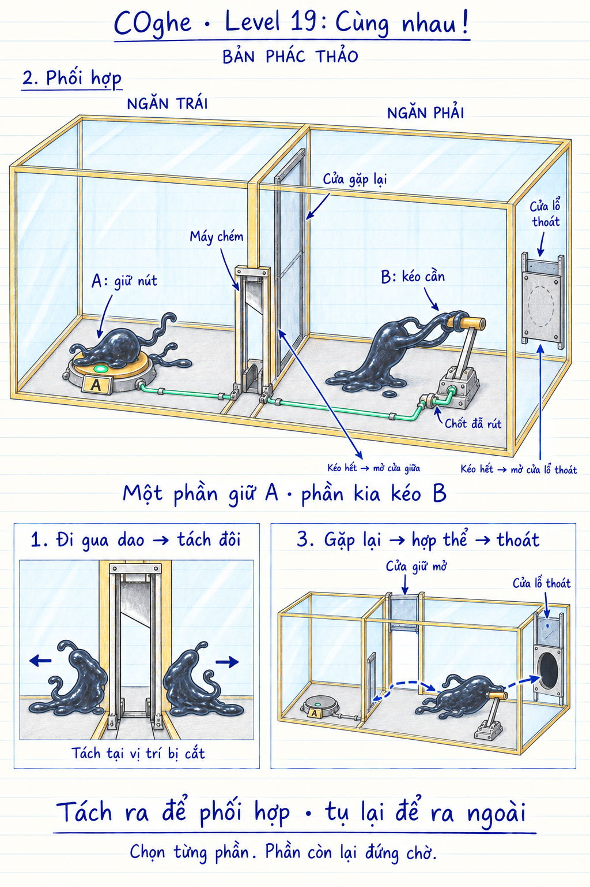

# COghe — Level 19: Cùng nhau!

**Trạng thái: mockup đề xuất, chưa triển khai hoặc kiểm chứng trong Unity.** Hình minh họa bố cục và quan hệ cơ quan, không chốt kích thước, lực, camera hay hành trình cơ khí.

## Yêu cầu người dùng

Hộp lớn chia thành hai ngăn có cơ quan riêng. COghe đi qua máy chém để chia thành hai phần, phối hợp xử lý cơ quan đồng thời ở hai ngăn, sau đó tụ lại và thoát khỏi hộp lớn.

## Phương án trong bản phác

Hai vai trò khác nhau: **giữ nút A ở ngăn trái** và **kéo cần B ở ngăn phải**. A rút chốt khóa B. Khi A đang được giữ, B mới di chuyển được. Kéo B hết hành trình mở cửa gặp lại ở vách giữa và cửa che lỗ thoát trên vỏ hộp. Chốt giữ hai cửa mở, cho phép cả hai phần rời cơ quan để hợp thể.

Đây là cách cụ thể hóa đề xuất của người dùng; số lượng cơ quan, cách liên động và bố trí dưới đây chưa phải yêu cầu đã được người dùng xác nhận riêng.

| Thành phần | Vị trí / vai trò |
| --- | --- |
| Vách chia | Kính/nhựa cứng trong suốt, viền amber; bịt kín từ sàn tới nóc và hai đầu |
| Máy chém | Trong một cửa nhỏ sát sàn ở đầu trước vách chia, trên đường ban đầu giữa hai ngăn |
| Nút A | Sàn ngăn trái, cách xa máy chém; nhận tải của một phần cơ thể |
| Chốt B | Gắn đế cần gạt bên phải; lò xo giữ khóa, A rút chốt |
| Cần B | Ngăn phải; tay nắm để sinh vật bám và kéo |
| Cửa gặp lại | Cửa rộng thứ hai ở phía sau vách chia, tách biệt với cửa máy chém |
| Lỗ thoát | Lỗ thật xuyên thành ngoài ngăn phải, có cửa che trượt trên ray |

Mái và vỏ trước vẽ nhạt/cắt bớt để nhìn cơ quan; trong game chúng vẫn là bề mặt kín. Cửa gặp lại tạo đường đoàn tụ an toàn sau khi giải. Cửa máy chém không bị khóa tùy tiện để cưỡng ép hai phần phải ở riêng.

## Trình tự chơi dự kiến

1. Sinh vật bắt đầu nguyên khối ở ngăn trái. Người chơi chỉ nó qua cửa máy chém vào ngăn phải.
2. Máy chém cắt phần cơ thể thực sự giao với lưỡi. Hai phần được đẩy tách vừa đủ, vẫn nằm trong hộp và có thể điều khiển riêng.
3. Chọn phần ở ngăn trái, chỉ tới A. Nó đứng trên nút, nút lún xuống, đèn sáng và chốt ở B rút ra.
4. Chuyển sang phần bên phải. Nó bám tay nắm B rồi kéo theo chỉ dẫn. Trong lúc kéo, phần trái tiếp tục đứng giữ A.
5. Kéo hết hành trình: hai cửa mở hoàn toàn và được chốt giữ. Có phản hồi nhìn/nghe được cho thời điểm chốt bắt.
6. Chỉ phần trái đi qua cửa gặp lại, đưa hai phần lại gần nhau; chúng tự hợp thể theo luật hiện có.
7. Chỉ bản thể đã hợp nhất tới lỗ thoát. Toàn bộ cơ thể thoát ra ngoài mới thắng.

Đồng thời ở đây là hai trạng thái cùng tồn tại: A có tải trong lúc B được kéo. Người chơi chọn từng phần, không cần hai ngón tay điều khiển hai nhân vật cùng lúc, không cần bấm đúng cùng một khung hình.

## Liên động, nhả tay và hồi phục

- A không tự mở cửa thoát. Tác dụng trực tiếp của A là rút chốt khóa cần B.
- Chỉ dẫn tới B khi A chưa có tải: sinh vật thử kéo, thân căng nhẹ, chốt vẫn chặn hành trình. Phản hồi ngắn, không chạy vòng animation kéo vô hạn.
- Khi A mất tải trước khi hoàn tất, khóa/phanh giữ B tại vị trí an toàn và ngăn tiến thêm. Không cho hai cửa rơi đột ngột lên sinh vật. Cơ cấu giữ giữa hành trình cần được thể hiện bằng ray khóa hoặc bánh cóc/phanh khi dựng.
- Khi A được đè lại, có thể tiếp tục kéo B. Không đặt thời hạn giữ nút hoặc đếm ngược.
- Khi B hoàn tất, chốt ở cửa chịu tải. A có thể nhả, B có thể buông, hai cửa vẫn mở. Chốt chỉ reset khi chơi lại màn.
- Trạng thái Idle không đồng nghĩa với tự rời nút. Phần không được chọn đứng chờ tại vị trí; không tự tìm về phần lớn hơn trong màn phối hợp này.
- Quy tắc buông vật sau 3 giây không có lệnh áp dụng cho thao tác cầm/kéo như hiện có; nó không làm một phần đang đứng trên A tự bước ra khỏi A.
- Nếu hai phần gặp nhau và hợp thể sớm, cứ cho hợp thể; người chơi có thể quay lại máy chém để tách lại. Không cấm hợp thể bằng cờ nhiệm vụ.
- Nếu lưỡi chém hụt hoặc cơ thể qua cửa nguyên vẹn, chấp nhận kết quả vật lý. Một cơ thể chưa tách không đủ tầm với để vừa giữ A vừa kéo B; nó có thể quay lại thử.
- Không có thùng rời dùng để đè A thay cho một phần trong phương án đầu này. Máy chém, ray, chốt đều có liên kết cố định, không tự rơi ra thành đối trọng.

## Tách, hợp thể và điều kiện thắng

- Không ép tỷ lệ 50/50 bằng script. Vị trí cơ thể lúc lưỡi chạm quyết định phần lớn/nhỏ. Bản vẽ chỉ minh họa hai phần.
- Bố trí lối tiếp cận và vùng cắt giúp người chơi dễ tạo hai phần đủ dùng. Ngưỡng nhận tải của A và cơ lợi của B phải đủ dễ cho các tỷ lệ cắt thường gặp.
- Một mẩu cực nhỏ có thể không kéo nổi B; có thể đổi vai nếu hình học cho phép, hoặc hợp thể và cắt lại. Không bắt chơi lại toàn màn chỉ vì tỷ lệ cắt chưa phù hợp.
- Xung tách không bắn một phần xuyên kính hoặc ra ngoài. Không đổi sức bám theo tỷ lệ khối lượng một cách khiến phần nhỏ không leo nổi đường bắt buộc.
- Gần nhau là tự tụ lại; chỉ hợp thể khi có đường tiếp xúc thật, không xuyên vách kín giữa hai điểm gần nhau.
- Giữ luật chung: nếu bất kỳ phần rời nào chui ra ngoài trước khi hợp thể đủ thì thua, hiện đúng thông báo **“bạn phải hợp thể trước khi chui ra”**.
- Không tự chặn vô hình miệng lỗ để sửa lỗi người chơi đi ra sớm. Cửa mở không phải điều kiện thắng; vẫn phải thoát toàn bộ bản thể đã hợp nhất.

## Cơ học và khả năng giải

- Hai cửa trượt có ray, chặn và vị trí chứa tấm cửa khi nâng. Không xuyên nóc hoặc biến mất khi mở như một lối tắt đồ họa.
- Phương án cơ khí để thử: cần B kéo cáp qua ròng rọc tới hai cửa có đối trọng, cuối hành trình bắt chốt. A điều khiển bộ rút chốt/phanh của cần. Cáp, truyền lực và nguồn của bộ rút chốt cần được chốt khi dựng; các đường xanh trong hình là ký hiệu quan hệ, không phải bản thiết kế truyền động đầy đủ.
- Cơ lợi và đối trọng phải phù hợp lực kéo của một phần sinh vật. Cần có giới hạn lực và xử lý mắc cửa; không cho B hoàn tất trong khi cửa thực tế còn kẹt.
- Cảm biến A nhận tải thực, không chỉ kiểm tra ID hoặc số lượng phần. Kích thước/khoảng cách A–B phải vượt tầm với của một bản thể nguyên khối, để yêu cầu phối hợp xuất phát từ bố cục.
- Vách giữa bịt kín mọi đường leo vòng qua đầu/trần. Cửa nhỏ máy chém vẫn là đường đi có thật; cả thân có thể đi qua khi lưỡi ở cao.
- Hai phần có thể dừng an toàn, quay lại hoặc thử lại. Không có điểm kẹt khi chuyển lựa chọn, nhả cần giữa chừng hay đổi thứ tự tiếp cận.
- Bản phác chưa chốt cho phép/khóa xoay. Hình thể hiện một tư thế để đọc cơ quan. Nếu cho xoay, phải kiểm tra tải nút, ray cửa, khóa cần và các lời giải bằng trọng lực; không để một cơ quan không khóa tự mở trái với liên động được hiển thị.

## Animation và cách đọc trên mobile

- Máy chém dùng thép bạc, ở cao khi sẵn sàng; giữ cảnh báo 1 giây và cắt theo va chạm hiện có. Không thêm máu hay yếu tố kinh dị.
- Phần trên A hơi bẹt theo tải, thỉnh thoảng cử động xúc tu nhưng không tự rời vùng cảm biến.
- Phần kéo B quấn tay nắm bằng xúc tu, phần thân còn lại bám sàn, kéo dài theo lực và co lại khi buông. Không kéo cần từ xa bằng lệnh trực tiếp của người chơi.
- Chỉ phần được chọn có mũi tên nhỏ trên đầu. Dấu chạm và đích gắn đúng mặt được chọn.
- Nút amber có độ lún, đế sáng; đèn mint và chốt B chuyển trạng thái đúng lúc nhận/mất tải. Sau khi hoàn tất, đèn A tắt khi nhả nhưng chốt cửa vẫn giữ rõ ràng.
- Góc nhìn cần thấy đồng thời A, tay nắm B, cửa giữa và lỗ thoát; các nhãn trong mockup là chú thích thiết kế, không mặc định đưa toàn bộ lời giải lên HUD.
- Hai phần hợp thể bằng animation đang có, sau đó dùng camera và bộ animation chiến thắng hiện có.

## Kiểm chứng khi dựng Unity

1. Thử nguyên khối: không thể giữ A và kéo B cùng lúc bằng một cơ thể dài, bám xuyên vách hoặc raycast xuyên cửa.
2. Thử hai phần nhiều tỷ lệ: vào hai ngăn, chọn đổi phần, giữ tải, kéo đủ hành trình, đi qua cửa gặp lại, hợp thể và thoát.
3. Bỏ chọn phần ở A, chờ lâu hơn 3 giây: nó vẫn giữ vị trí và tải. Bỏ lệnh ở B: buông đúng quy tắc nhưng không gây sập cửa/kẹp người.
4. Nhả A giữa hành trình B, nhả B, tiếp tục, chuyển vai, hợp thể sớm rồi cắt lại; không mất khả năng giải.
5. Kiểm tra lưỡi chém hụt, tách lệch, xung tách sát kính và hợp thể hai phía vách; không mất khối lượng hay xuyên vật.
6. Hai cửa mở và chốt thật trước khi cho trạng thái hoàn tất; sau khi A nhả vẫn có đường cho cả hai ra khỏi chỗ đứng.
7. Một phần thoát sớm phải báo thua; mở cửa hoặc chỉ hợp thể trong hộp không tự thắng.
8. Kiểm tra góc nhìn, bấm đúng cơ quan và chọn phần trên màn hình dọc. Nếu cho xoay, bổ sung quét tư thế và quay nhanh/chậm.

Chưa chạy các kiểm chứng trên: hiện chỉ tạo mockup và tài liệu, không đổi gameplay hay build game.

## Nguồn hình

Tạo bằng image_gen tích hợp, không dùng CLI/API fallback. Prompt gốc và lượt chỉnh: [generation-prompts.md](generation-prompts.md).
