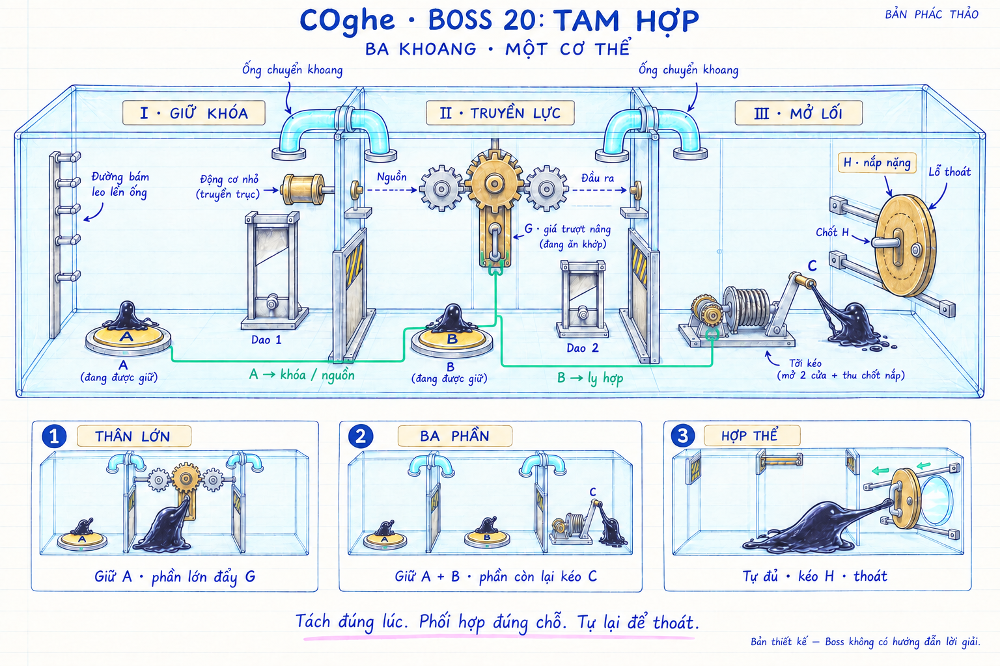
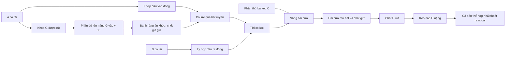
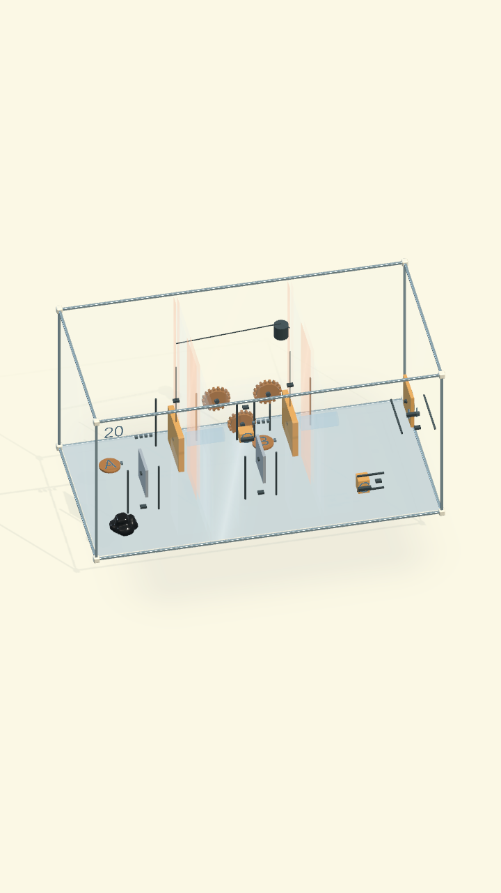

# COghe — Boss 20: TAM HỢP

**Trạng thái: Prototype, đã kiểm chứng đường giải và input bản chỉnh 18/09/2026.** Content
`venom.origin.20` hiện là màn **30 · TAM HỢP** trong campaign 30. Phần phác
thảo bên dưới lưu ý đồ ban đầu, không thay cho bằng chứng chơi trong Unity.

## Bản chỉnh màn 30 — rõ ràng và dễ chơi hơn

Theo yêu cầu 18/09/2026, giữ ba khoang, hai dao, A/B giữ tải, bánh G, tời C,
nắp H và luật hợp thể trước khi thoát. Giảm khó thao tác và yêu cầu chia đúng
khối lượng; không biến Boss thành tutorial có lời giải trên HUD.

| Hạng mục | Bản điều chỉnh |
| --- | --- |
| Chuyển khoang | Tâm ống hạ từ y=+0,075 xuống −0,150 m; bán kính 25 → 32 mm; bệ bám thấp, liên tục tới sàn, vành cyan/porcelain phân biệt với cửa đoàn tụ |
| Nút A/B | Vùng cảm biến 84 → 112 mm; mặt amber lớn, chữ A/B nổi rõ; cả hai nhận tải thật từ 12 g, không tự chốt khi rời nút |
| Giá G | 20 g, lực cản 0,030 N, vẫn chịu trọng lực và khóa A; không buộc một cú cắt đầu lệch tỷ lệ chính xác |
| Tời C | Tốc độ cửa mục tiêu 0,10 m/s thay 0,025; giữ giới hạn lực và phanh giữ tiến độ khi mất tải/buông tay |
| Nắp H | Giữ khối lượng 200 g và chốt liên động; cản 0,36 N thay 0,57 N. Điều kiện thắng vẫn yêu cầu toàn bộ cơ thể hợp nhất |
| Hình ảnh | Kính ngăn yên hơn; cửa porcelain có ray; dao thép trong khung riêng; đường liên kết A/G và B/C cùng đèn trạng thái đọc cơ quan thật |
| Camera | 42° pitch / 24° yaw; mở gần khoang A; chọn cận cảnh bằng A · Dao / G · B / C · Lỗ hoặc Toàn cảnh. Giữ chọn nóc và khóa xoay vật lý |

Hai phần gần nhau vẫn tự tụ. Người chơi có thể cắt lại nếu tụ sớm; nhả A/B
giữa lúc nâng cửa làm phanh giữ vị trí, đặt lại tải rồi tiếp tục. Cơ quan đã
hoàn tất giữ bằng chốt thật. Không thêm hạn giờ hoặc yêu cầu bấm nhiều ngón.

Builder: `RebuildReadableBoss`, dựng source 20 và slot 30, giữ ID/save.
Trình bày nằm trong `COgheBossReadabilityArtBuilder` và component đọc trạng thái
`COgheCooperativeBossPresentation`; không cấp lực hoặc phát lệnh giải đố.

Các ngưỡng và mô hình logic 6 đơn vị ở phần phác thảo cũ bên dưới là **lịch sử**;
không dùng chúng làm chứng nhận vật lý/khả giải cho bản chỉnh mới.

[Kiểm chứng và ảnh Unity bản mới](../../../Verification/COgheCampaign30/boss-30.md):
20/20 kiểm tra hồi quy cuối, gồm thao tác nắm lại G sau khi tự buông;
chưa đo lại thiết bị hoặc playtest người mới.



## Yêu cầu người dùng

Boss rất khó: hộp lớn chia thành ba khoang, các cơ quan liên kết với nhau, sinh vật phải kết hợp nhiều kỹ năng để thoát. Những cơ quan, ngưỡng lực và luồng cụ thể dưới đây là đề xuất thiết kế để hiện thực hóa yêu cầu đó.

## Ý tưởng chính

**Tách một phần để giữ khóa → giữ phần lớn để làm việc nặng → tách tiếp để phối hợp ba nơi → tụ đủ để mở lối cuối.**

Mấu chốt không phải có ba nút thay vì hai. Người chơi phải phân bổ khối lượng theo từng giai đoạn. Nếu chia thành những phần nhỏ quá sớm, không phần nào đủ lực di chuyển giá bánh răng; có thể hợp lại rồi thử tiếp. Sau khi bộ truyền được chuẩn bị, lại cần những phần độc lập ở ba khoang.

Bảy kỹ năng đã biết: bò, leo, biến dạng chui ống, đẩy, kéo, tách bằng máy chém, tự tụ khi gần nhau. Không giới thiệu Copy hoặc nâng chỉ số trong Boss.

**Đề xuất khóa xoay hộp như Boss 10**, giữ trọng lực thế giới cố định và góc nhìn 3/4 thấy cả ba khoang. Có thể zoom/focus phần được chọn rồi trở về tổng quan. Quyền xoay là lựa chọn của bản đề xuất, không phải yêu cầu mới đã được người dùng chốt.

## Bố cục ba khoang

| Khoang | Cơ quan / đường đi | Nhiệm vụ |
| --- | --- | --- |
| I — Giữ khóa | Dao 1, nút A, động cơ chậm có giới hạn mô-men, lối leo tới ống 1–2 | Tách lần đầu; một phần giữ A để mở khóa giá G và đóng khớp truyền động đầu vào |
| II — Truyền lực | Giá bánh răng G nặng trên ray đứng, nút B, Dao 2, lối leo tới ống 2–3 | Phần lớn nâng G tới vị trí ăn khớp; tách tiếp; một phần giữ B để đóng ly hợp đầu ra |
| III — Mở lối | Cần C điều khiển tời, nắp H nặng có chốt khóa trên ray ngang, lỗ thật xuyên thành ngoài | Phần thứ ba kéo C khi A/B đang hoạt động; sau đó bản thể đã tụ kéo H và thoát |

Hai vách chia kín từ sàn tới trần và kín hai đầu. Mỗi vách có:

- Một ống chuyển khoang ở cao, có đường leo, bệ tiếp cận, miệng mở và lòng ống thật. Đi được hai chiều từ đầu màn.
- Một cửa đoàn tụ rộng sát sàn, đóng lúc đầu; tời ở III mở và chốt cửa sau khi phối hợp thành công.

Ống không có cờ vô hình chỉ cho “mảnh nhỏ” đi qua. Dùng khả năng biến dạng đã học; phần lớn cũng đi được nếu geometry và giới hạn biến dạng cho phép. Trọng tâm phân chia đến từ khối lượng/lực và yêu cầu giữ cơ quan ở xa nhau, không phải một nhãn kích cỡ bí mật.

Không thêm thùng rời để vô tình thay thế phần giữ nút. Các giá, lưỡi, đối trọng đều có liên kết cơ khí và không thể nhấc khỏi ray để đè A/B.

## Cơ quan liên kết như thế nào

| Tác động | Kết quả trực tiếp | Khi bỏ tác động |
| --- | --- | --- |
| Một phần đè A | Rút khóa hành trình G; đồng thời đóng khớp truyền động đầu vào | Nguồn ngắt khỏi bộ truyền; khóa/phanh giữ giá, không làm G rơi |
| Phần lớn nâng giá G | Bánh trung gian nối bánh nguồn với bánh ra; chốt ở đầu ray giữ đúng vị trí | G vẫn được giữ sau khi buông; nhả A vẫn ngắt lực đầu vào |
| Một phần đè B | Đóng ly hợp từ bánh ra sang tời | Ngắt lực tới tời; phanh giữ cửa tại vị trí an toàn |
| Phần ở III kéo C | Điều khiển tời nâng hai cửa và rút chốt H nếu có lực truyền tới | Nếu chưa hết hành trình, phanh giữ tiến độ; có thể tiếp tục |
| Hai cửa tới chặn mở hết | Chốt cơ khí giữ cả hai cửa, chốt H được giữ ở trạng thái rút | Không cần tiếp tục giữ A, B hoặc C |
| Sinh vật kéo H đã mở khóa | Nắp trượt ngang để lộ lỗ thật | Chốt cuối ray giữ H mở để sinh vật rời tay nắm |

**A phải có cả tác dụng lên khóa G và khớp đầu vào.** Nếu A chỉ mở khóa G, sau khi G đã được chốt đúng vị trí người chơi có thể bỏ A mà tời vẫn chạy, làm mất nhu cầu phối hợp ba nơi.

**Cơ cấu chính chỉ rút chốt của H, chưa tự mở H.** Nếu H không có chốt liên động, nguyên khối có thể chui hai ống tới III rồi kéo nắp, bỏ qua cả puzzle. Chốt này phải hiện hữu và có phản hồi khi thử kéo lúc còn khóa.

Sơ đồ quan hệ:



Các liên kết hợp tại một nút trong sơ đồ biểu thị điều kiện cùng cần có, không phải những đường mở khóa thay thế. Đường mint và mũi tên trong mockup chỉ là chú thích quan hệ; không dùng hình để suy ra sơ đồ dây/đường trục chính xác.

## Một lời giải dự kiến

1. Dùng Dao 1 chia thành một phần nhỏ và một phần lớn. Ví dụ khoảng một phần ba và hai phần ba; không yêu cầu cắt đúng số đó.
2. Cho phần nhỏ đứng trên A. Quan sát chốt G rút và đầu vào bộ truyền có lực.
3. Cho phần lớn leo, biến dạng qua ống 1–2 tới II.
4. Dùng phần lớn đẩy giá G lên ray đứng. Khi răng nối đúng và giá tới chặn, chốt giữ vị trí. Bánh đầu ra chuyển động nhưng tời chưa hoạt động vì B chưa được giữ.
5. Dùng Dao 2 tách phần lớn thành hai phần đủ dùng. Giữ hai phần xa nhau để chưa tụ lại.
6. Một phần ở II đè B. Phần còn lại leo và chui ống 2–3 tới III.
7. Chọn phần ở III, kéo C. Trong lúc đó A và B vẫn có tải. Tời nâng hai cửa ngăn; ở cuối hành trình, hai cửa bắt chốt và chốt H rút.
8. Rời A/B, đưa các phần qua đường sàn vừa mở để gặp nhau. Gần nhau thì tự tụ, kể cả tụ từng đôi trước.
9. Bản thể lớn kéo H theo ray ngang, để lộ lỗ rồi chui ra. Chỉ thắng khi toàn bộ bản thể đã hợp nhất thoát khỏi hộp.

Đây là lời giải cho tài liệu thiết kế, không phải hướng dẫn hiện trong Boss. Nếu người chơi tạo được cách khác đúng cơ học và luật thắng, không bác bỏ chỉ vì khác thứ tự trên.

## Khối lượng, lực và phép chia

Không có hệ nâng chỉ số. Khả năng đẩy/kéo thay đổi theo lượng cơ thể hiện tại và điều kiện bám, như kỹ năng đã chốt.

Để khảo sát ban đầu, có thể chuẩn hóa tổng khối lượng thành M và khả năng kéo/đẩy của bản thể đầy đủ thành F. Các giá trị sau là giả thuyết cần đo lại trong Unity:

- A/B nhận tải được từ một phần vừa nhỏ, dự kiến khoảng 0,18–0,20 M ở tư thế sàn đã chọn; chống rung tín hiệu nhưng không lưu trạng thái giữ khi cơ thể đã rời đi.
- G cần lực nâng vào khoảng 0,55 F. Phần khoảng 0,60–0,80 M có thể làm việc này; phần khoảng một phần ba thường không đủ lực.
- C có cơ lợi đủ để một phần nhỏ thao tác, dự kiến từ khoảng 0,15 M; tời nhận năng lượng từ động cơ, không yêu cầu phần nhỏ tự nâng toàn bộ hai cửa.
- H cần lực kéo khoảng 0,85 F, tạo lý do tụ đủ cơ thể trước thao tác cuối trong cách chia dự kiến.

Đây không phải công thức khẳng định lực ngoài đời tỷ lệ tuyến tính tuyệt đối với khối lượng sinh vật. Lực thực còn phụ thuộc điểm bám, ma sát, tư thế, hành trình, gia tốc và cơ cấu truyền lực.

Không kiểm tra `fragmentCount == 3` để cho tời chạy. Kiểm tra tải A, tải B, liên kết bánh răng, ly hợp, lệnh/lực tại C và vị trí cửa. Nếu người chơi có hơn ba phần mà vẫn bố trí đủ tải và cuối cùng tụ hết, đó là lời giải hợp lệ.

Không kiểm tra `isFullyMerged` để cưỡng ép khóa chuyển động H. H là một vật cản có lực cản thực. Một cách chia rất lệch có thể để phần lớn đủ sức mở H trước khi tụ hết; luật thắng vẫn yêu cầu hợp thể, và cho một phần thoát sớm vẫn thua như toàn game. Không thay quan hệ lực liên tục bằng phép kiểm tra số phần.

## Sai được, sửa được

- **Chia nhỏ quá sớm:** giữ phần ở A, đưa hai phần khác tới cùng một bệ trong II để tụ thành phần lớn, nâng G, rồi cắt lại tại Dao 2.
- **Phần giữ A quá lớn, phần sang II quá nhỏ:** nhả nút, quay về qua ống, tụ và cắt lại. Không có cổng chỉ mở một chiều nhốt chúng ở phòng khác.
- **Tụ lại sớm:** cứ cho tụ; chỉ cần cắt lại nếu vẫn cần nhiều vị trí hoạt động đồng thời. Không khóa hợp thể bằng trạng thái quest.
- **Nhả A/B trước khi tời xong:** ngắt truyền lực, phanh/chốt chống tụt giữ an toàn; trở lại nút và tiếp tục. Không cắt người bằng cửa.
- **Bỏ kéo C quá 3 giây:** phần đó buông cơ quan theo quy tắc đã có; tiến độ cơ khí được giữ an toàn, không tự hoàn tất.
- **G chưa ăn khớp đúng:** đầu ra không có lực; có thể kéo giá xuống và thử chỉnh lại khi A đang được giữ. Phải có cách nhả chốt giá bằng chính tay nắm, không làm cấu hình sai thành trạng thái vĩnh viễn.
- **Kéo H khi còn khóa:** chốt chịu lực, sinh vật thử kéo rồi phản hồi ngắn; không phát hiệu ứng mở khi cửa vẫn đứng yên.
- **Một phần thoát trước khi hợp thể:** giữ luật thua và thông báo “bạn phải hợp thể trước khi chui ra”.
- **Chém lệch hoặc chém hụt:** giữ kết quả vật lý; không tự chia theo tỷ lệ kịch bản hoặc ép phân mảnh thành đúng ba phần.

## Những điểm cần dựng đúng vật lý

1. **G đi từ dưới lên trên ray đứng.** Không cho giá đi ngang xuyên qua một bánh răng cố định để tới ô đích. Răng tương thích, khoảng cách trục hợp lý, có pha tiếp xúc và giới hạn mô-men khi chưa khớp.
2. Ba bánh răng nối ngoài: bánh vào thuận chiều kim đồng hồ → G ngược → bánh ra thuận, nhìn cùng một phía. Trục đầu vào/đầu ra cần ổ trục và truyền hướng phù hợp; không vẽ một trục cứng xuyên cả ba tâm khiến G vô nghĩa.
3. Tay nắm G ở giá không quay. Che phần răng/ổ đỡ để sinh vật không vô tình bị cắt bởi một cơ quan chưa được định nghĩa là dao.
4. Động cơ có nguồn năng lượng và giới hạn mô-men; chốt/ly hợp/phanh là những cơ quan riêng. Khi cửa chạm chặn, ngắt truyền động hoặc cho ly hợp giới hạn lực trượt; không tích lực vô hạn.
5. Hai cửa có ray, khoảng chứa khi nâng, chống tụt giữa hành trình và chốt ở vị trí mở. Chỉ giải phóng H khi cả hai cửa thực sự mở đủ và được giữ; một cửa kẹt thì chưa báo hoàn tất.
6. Cáp, ròng rọc hoặc thanh liên động rút chốt H phải được dựng có đường đi và hành trình. Các mũi tên trong bản phác chưa chứng minh truyền lực hoặc khoảng trống.
7. A/B có vùng nhận tải thực. Idle hoặc đổi chọn phần không làm nó tự rời nút. Tắt hành vi tự tìm về phần lớn trong thử thách phối hợp này.
8. Khoảng cách A, B, C vượt tầm vươn hữu dụng của một cơ thể liên tục; không cho một xúc tu xuyên vách để tác động cơ quan phòng khác.
9. Đường leo và bệ dưới cả bốn miệng ống phải thật sự liên thông. Không để cửa ống lơ lửng ngoài tầm bám, dùng tự dịch chuyển hoặc đưa sinh vật vào ống bằng cutscene.
10. Bảo toàn khối lượng khi cắt/tụ; không giảm sức bám phần nhỏ tới mức không đi được đường bắt buộc. Hai phần gần nhau qua vách kín không hợp thể xuyên vách.
11. Bố trí camera không thay đổi collider. Mái/front trong bản vẽ được làm nhạt để thấy puzzle, không phải chỗ hở sinh vật có thể bò ra ngoài.
12. Hai máy chém giữ cơ chế cảnh báo 1 giây, lưỡi thép ở cao, cắt theo va chạm và có khoảng trống an toàn cho xung tách.

## Boss khó và dễ đọc

Độ khó đến từ ba quyết định gắn nhau:

- **Thứ tự:** nâng G trước khi làm phần đang ở II quá nhỏ.
- **Phân bổ:** một phần giữ nguồn, một phần giữ đầu ra, một phần thao tác tời.
- **Kết thúc:** biết bỏ các vị trí giữ sau khi cửa đã chốt, thu hồi tất cả cơ thể rồi kéo H.

Không có hướng dẫn lời giải tự động, đường nét đứt chỉ đáp án hoặc mũi tên bảo người chơi bấm từng bước. Vẫn giữ phản hồi chạm, chọn phần, độ lún nút, chiều quay bánh răng, chốt rút/đóng và trạng thái cửa. “Không tutorial” không có nghĩa che thông tin cơ quan.

A/B có đường liên kết nhìn được và ký hiệu nhất quán, không chỉ phân biệt bằng màu. Cần thấy rõ đầu vào quay mà đầu ra chưa quay, hoặc tời có lực nhưng chưa được kéo. Khi không đủ lực nâng G, cơ thể căng, giá nhích trong biên có thể rồi dừng; tránh animation chạy vô hạn như lỗi.

Các giai đoạn có chỗ dừng để quan sát. Không thêm đếm ngược, cắt theo nhịp ngẫu nhiên hoặc buộc thao tác ba ngón để tăng khó.

Mục tiêu thử nghiệm ban đầu cho người đã vượt màn 19: khoảng 6–12 phút tìm lời giải lần đầu, với vài lần thử sai có thể tự sửa. Đây là mục tiêu thiết kế, chưa phải số đo hay cam kết. Nếu người chơi qua quá nhanh, tăng bài toán bố trí/quan hệ lực sau playtest; nếu họ kẹt vì không đọc được trạng thái, sửa hình ảnh và phản hồi trước.

## Khoảnh khắc hoàn tất

Khi phối hợp đúng, chuyển động truyền rõ qua ba khoang: bánh nguồn → G → bánh ra → tời. Hai cửa ngăn nâng lên và các chốt bắt ở cuối hành trình, một đợt sáng mint nhẹ xác nhận đường đã mở.

Lúc cả ba phần gặp nhau, cơ thể tụ thành bản thể lớn, xúc tu vươn thử rồi kéo nắp H nặng. Giữ quyền điều khiển tới khi chui hết ra ngoài, sau đó dùng camera gần và bộ nhảy mừng hiện có. Không tự kéo sinh vật ra bằng cutscene trước khi người chơi giải thao tác cuối.

Art theo Day Lab: khung sáng, kính yên, resin amber, thép bạc ở dao, brass vừa đủ ở bánh răng, ống cyan nhìn được cơ thể chảy bên trong. Không dùng độ tối, khói hoặc chớp sáng để che puzzle.

## Rà soát logic đã thực hiện

Chạy:

```sh
python3 Docs/LevelDesign/COghe/Level20/logic_audit.py
```

Kết quả lưu tại [logic-audit.json](logic-audit.json):

- Mô hình chia tổng khối lượng thành 6 đơn vị, có vị trí ba khoang, giữ/nhả nút, cắt, tụ, nâng G, mở cơ cấu chính và kéo H.
- Duyệt **1.772 trạng thái có thể tới**; tất cả có ít nhất một đường tới đích trong những giả định của mô hình.
- Giới hạn tối đa hai phần: **120 trạng thái**, không mở được cơ cấu chính. Nhu cầu ba vị trí được suy ra từ tải và hành động đồng thời, không có điều kiện đếm đúng ba phần.
- Có lời giải dài 15 hành động trừu tượng. Đây không phải 15 cú chạm thực tế hoặc số phút chơi.
- Ví dụ ngắn nhất chia 2/6 + 4/6 rồi 1/6 + 3/6; minh họa không cần cắt ba phần bằng nhau. Đây chỉ là một đường giải trong mô hình rời rạc.

**Giới hạn:** mô hình giả định các ống/bệ đều tới được, cắt/tụ làm được, các chốt an toàn và cơ quan hoạt động như đặc tả. Chưa mô phỏng trọng lực, va chạm, lực liên tục, bóp méo, camera, cảm giác điều khiển, hoặc các hành động cố tình làm thua. Ngưỡng H trong mô hình thô dùng cả 6 đơn vị; runtime phải dùng lực thực liên tục và kiểm tra thắng riêng.

Kết quả chỉ rà chuỗi phụ thuộc và hồi phục. Nó không chứng minh geometry, khả năng giải trong Unity hoặc độ khó “rất khó” đối với người chơi.

## Khi dựng prototype

- Dùng các cơ quan tái sử dụng: máy chém, cảm biến tải, khóa/ly hợp, giá bánh răng, tời, cửa có chốt, nắp ray và tuyến leo/ống. Cấu hình liên kết bằng dữ liệu level; không gom mọi hành vi vào một chuỗi if theo số màn.
- Tách trạng thái vật lý khỏi animation và feedback. AI chỉ tiếp cận và thực hiện lệnh kỹ năng; không tự suy luận rồi hoàn thành chuỗi Boss thay người chơi.
- Thử toàn bộ lời giải, tách sớm, chia lệch, tách nhiều hơn ba phần, bỏ nút giữa hành trình, tụ sớm, cửa kẹt, kéo nắp sớm và đổi phần khi đang leo/ống.
- Dùng lực/khối lượng thật để hiệu chỉnh các ngưỡng giả thuyết; kiểm tra lời giải thay thế từ cơ thể kéo dài, va chạm, tải đồng thời hoặc geometry.
- Kiểm tra chọn A/B/C, tay nắm G/H, dao và miệng ống trên màn hình dọc. Ba khoang cần vừa đủ rộng để đọc; zoom không được che mất tín hiệu đang giữ ở hai khoang kia.
- Chạy playtest không hướng dẫn để đo thời gian hiểu liên kết, điểm mắc, số lần phân chia lại và khả năng tự sửa. Sau đó mới chốt độ khó và build cho người dùng test.

## Nguồn hình

Ảnh tạo bằng công cụ image_gen tích hợp; không dùng CLI/API fallback. Prompt và hai lượt chỉnh: [generation-prompts.md](generation-prompts.md). Bản cuối được lưu trong thư mục này.

## Camera bản Unity — 17/09/2026

Theo yêu cầu playtest, khung tổng quan được đưa gần hơn: `ViewRadius` từ 0.87 xuống 0.68, cơ quan lớn hơn khoảng 28%. Giữ góc 40° pitch / 12° yaw để nhìn ba khoang cùng lúc. Thay đổi nằm trong asset Level20 và builder để sinh lại màn vẫn giữ camera mới. Nút Nhìn gần tiếp tục theo sinh vật đang chọn; không đổi cơ quan hoặc vật lý.



Kiểm chứng: `Artifacts/COgheExpansion/camera20.xml` — 2/2 đạt (tải/render/idle/reset catalog 20 màn, liên động ba vai trò Boss 20). Kiểm tra này không thay thế test toàn bộ đường giải Boss. [Ảnh trước thay đổi](camera-before.png).
