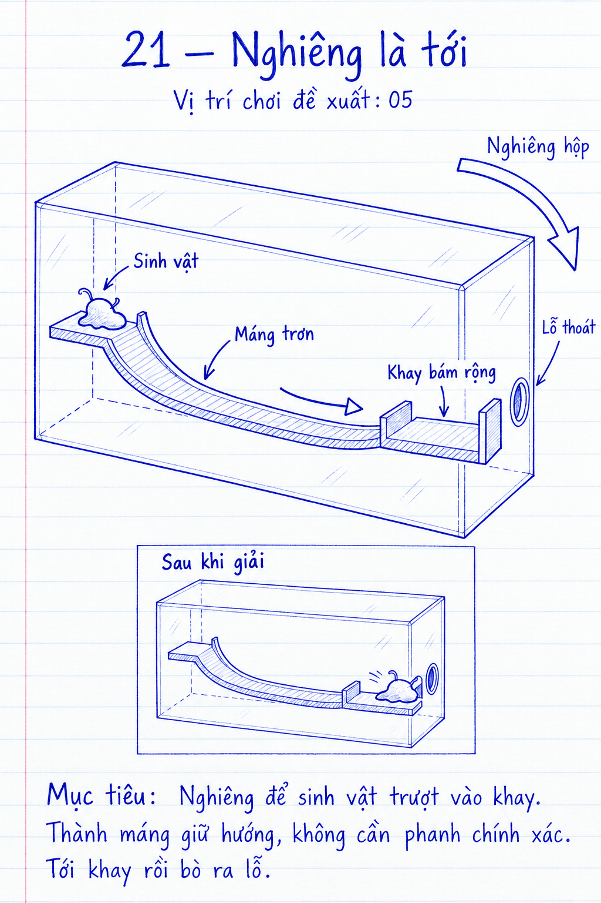

# COghe — 21: Nghiêng là tới

**Prototype Unity v5, 21/09/2026.** ID ổn định `venom.origin.21`, vị trí chơi **5**,
giữa màn cũ 04 và 05. Đã kiểm tra load/reset/idle và ngân sách mô phỏng trên macOS;
chưa playtest tay trên thiết bị di động. Không đổi ID các màn cũ.
Nguồn: [tiến trình 30 màn](../../../COGHE_CAMPAIGN_30_DESIGN.md),
[quy trình](../../../COGHE_LEVEL_DESIGN_RULES.md), [Day Lab](../../../ArtDirection/COghe/STYLE_RULES.md).

## 1. Mục tiêu và phác thảo



[Xem cả 10 bản phác thảo](../Sketches21-30/review.html). Bản v1 để duyệt bố cục và thao tác;
chi tiết tỷ lệ, vách kín, ray/chốt và tiếp xúc cơ khí được giản lược, cần kiểm chứng khi dựng.

Người chơi đã biết xoay và mặt trơn; màn này cho cảm giác “chọn hướng rồi chờ được
đón”, giảm yêu cầu phanh liên tục. Ý định không phải dạy lại đáp án cho người đã hiểu.
Theo ảnh và yêu cầu mới ngày 21/09, hộp bắt đầu nghiêng 45° quanh hướng nhìn: khay
thoát cao hơn bệ xuất phát trong thế giới. Người chơi phải xoay về tư thế máng
dốc xuống để trượt tới khay. Không có điều kiện ẩn đếm thao tác xoay; trọng lực
và hình học quyết định chuyển động. Retry phục hồi đúng góc nghiêng ban đầu.
Một hộp kính ngang, bệ xuất phát cao bên trái, máng cong hạ dần và khay bám rộng
thấp hơn ở cuối phải, sát lỗ. Đây là cầu trượt liên tục như phác thảo, không phải
những miếng kính rời hoặc một dải trơn trên sàn.

```text
MẶT CẮT DỌC — sơ đồ chức năng, chưa theo tỷ lệ
         vỏ kính (camera thấy máng và hai đầu)
  ┌──────────────────────────────────────────┐
  │  S / bệ bám                              │ O = lỗ cuối
  │  ┌────┐                                 │
  │  │    ╰╮  máng trơn có thành             │
  │  │     ╰───────────────╮         O       │
  │  │                    ╰─────────┤khay bám│
  └──┴───────────────────────────────────────┘
          xoay để phía phải thấp hơn
```

- Một máng thật có đáy/lườn trơn, bề ngang đủ chứa toàn thân và dung sai chạm; bệ
  nhận ở cuối có vùng bám rộng, thành cuối chống trôi quá. Đo kích thước ở greybox.
- Spawn trên bệ trái. Miệng lỗ xuyên vỏ bên phải nằm trong vùng nhận bám, viền phẳng.
- Hộp cho xoay như luật cũ, không thêm khóa trục vô hình. Lườn máng giảm lệch ngang
  bằng va chạm; các tư thế lật ngoài ý đồ vẫn có sàn/mặt hồi phục thật.
- Camera 3/4 thấp vừa đủ thấy dốc và COghe; khung không che bệ nhận. Dấu đích bám
  vào mặt thật; khi nhấn vùng trơn vẫn có animation cố bò/mất bám.

Kích thước bản v3: hộp 0,90 × 0,66 × 0,48 m; lòng máng rộng 0,22 m, thành 32 mm;
bệ xuất phát cao y=0,115 m; khay 0,20 × 0,26 m ở y=−0,18 m. Lỗ xuyên mặt phải
ở y=−0,125 m, cùng trục giữa máng. Bệ và khay nối trực tiếp với máng, không yêu cầu
căn cú bay. Dải bám bên trái nối sàn an toàn với bệ để phục hồi khi rơi.

## 2. Lời giải và kết quả

1. Chỉ vào vùng máng, COghe rời bệ bám và chạm mặt trơn.
2. Nghiêng cho phía khay thấp hơn. Giữ hộp yên, mô trượt trong lòng máng tới khay.
3. Thân chạm vùng bám thật, dừng nhờ tiếp xúc và lực bám; chỉ lỗ để thoát toàn bộ.

Không bấm giữa lúc trượt, không chốt thắng vì đã vào khay. Nếu tìm được đường bò
vòng trên mặt bám hợp lệ, chấp nhận làm lời giải khác cho màn nghỉ; không thêm cờ
“phải từng trượt” mới cho ra. Nếu đường vòng làm mất hoàn toàn cơ hội trải nghiệm,
điều chỉnh hình học/vật liệu nhìn thấy khi dựng, không thêm khóa vô hình.

## 3. Phục hồi và trạng thái

- Nghiêng ngược: dừng ở đầu trái, nghiêng lại. Không rơi khỏi hộp, không mất mô.
- Rơi khỏi máng ở góc quá lớn: về sàn an toàn, có đường bám về bệ; test cả lật ngược.
- Không tới lỗ: khay rộng cho bò chỉnh, không cần phanh bằng thao tác xoay cuối.
- Reset đưa cơ thể/hộp về đầu, hủy lệnh. Pause dừng mô phỏng và không tích lực.
- Cắt/tụ không có cơ quan sử dụng; luật bản thể hợp nhất và đủ vật chất thoát vẫn giữ.

## 4. Cơ quan và animation

Dùng `VenomSurfacePatch`, mô phỏng trọng lực/rotation và navigation hiện có. Máng
là hình học tĩnh trong hệ hộp, collider liên tục; không motor, khớp hoặc cơ chế hút mới.
Không dựa vào `COgheSlideLaunchMonitor` để ép hoàn tất vì không cần một cú bay.

Mặt trơn tím satin đặc có độ dày, thành sứ thấp liền mạch, bệ hổ phách, khay xanh
mint nhạt có vùng bám rõ. Mặt dẫn đường luôn cùng trục với lòng máng kể cả đoạn
thoải. Mesh hiển thị lấy trực tiếp tiết diện của collider liên tục; phần art không
có collider và vẫn hiện khi bật camera follow. COghe co thân khi chạm cuối,
thả xúc tu bám rồi ngóc lên; phản hồi đọc vận tốc/contact thật. Âm trượt nhỏ và một
tiếng tiếp xúc dịu, không phát nhạc thắng trước khi ra. Giữ ba animation thắng hiện có.

## 5. Độ khó, chi phí và kiểm chứng

Một quyết định chính, một cơ thể, không giới hạn thời gian. Mục tiêu: sau khi biết
hướng, một lần nghiêng và chờ là đủ; thử dải góc rộng và giữ 3 giây không sửa liên tục.
Chưa chốt dung sai đạt; tham chiếu ±15° là mục tiêu thử nghiệm trong plan chung.

Không có cơ quan động độc lập; chi phí chủ yếu ở mặt máng và skin/contact. Dùng mesh
trang trí ghép chung, collider vừa đủ liền, không thêm nhiều thanh nhỏ để giả độ mịn.

Tuyến chuẩn nghiêng–trượt–bám và cả khối qua lỗ đã được kiểm chứng tự động. Các ca
nghiêng sai/lật, nhiều đích lệch, camera follow và số lần người thật phải sửa vẫn cần
playtest. Đo OPPO cùng profile hiện tại, p95/p99/max, skin/navigation và lượt chơi dài.

Ghi tuyến người chơi thực dùng. Thắng bằng bò vòng là hợp lệ nhưng không chứng minh
dung sai của tuyến trượt; phải thử riêng tuyến nghiêng–trượt dự kiến.

## 6. Tích hợp và trạng thái

Builder/scene/definition đã tạo trong campaign tích hợp. Tuyến nghiêng–trượt–bám–thoát
đã được giải trọn vẹn bằng rotation và lệnh di chuyển thật; test không gán trạng thái
thắng. ID và display slot độc lập, không dùng vị trí 5 làm luật vật lý.

## 7. Sửa theo phản hồi 18/09/2026

Người chơi báo màn 05 không chơi được và không giống phác thảo. Bản v2 có bệ/khay
gần trong suốt, máng hiển thị bằng nhiều mặt rời và không hiện thành chắn thật.
Hàm dựng mặt nghiêng còn đổi trục ở đoạn thoải, khiến mặt dẫn đường không khớp
collider. Bản v3 sửa cả hình học, trình bày và trục mặt dẫn đường. Menu dựng riêng:
`Gravity Box → COghe → Rebuild Campaign 05 · Learning Slide`.

Bài test lời giải nay chạm bằng tọa độ màn hình, theo dõi tiếp xúc thực với máng,
yêu cầu đi vào khay trên cao (không chấp nhận rơi xuống sàn), rồi đủ 32 hạt qua lỗ.
Đã đạt các góc nghiêng 12°/24°/36° với điểm chạm lệch ±40 mm; đủ 32 hạt qua lỗ.
Đạt đứng chờ 10 giây trên bệ, nghiêng sai 30° rồi quay về và chạm lại bệ; thân vẫn
liền, không mất mô. Hồi quy `VenomOriginTests`, `COgheCampaign30IntegrationTests`,
`COgheCampaign30SolvabilityTests`, `COgheEarlyExpansionTests`: **76/76 đạt**.
Đã build Mac và chơi tay qua màn ở tư thế ban đầu lẫn sau khi kéo nghiêng nhẹ;
kiểm tra follow và trở lại toàn cảnh. Bản Mac được để ở đầu màn 05 cho người dùng.
Đây là dung sai trong mô phỏng kiểm thử, chưa phải kết quả playtest người mới trên OPPO.

Ảnh Unity: [bệ và máng](../../../Verification/COgheCampaign30/level05-slide-start.png),
[đã vào khay sau khi nghiêng](../../../Verification/COgheCampaign30/level05-slide-caught.png).

## 8. Sửa kẹt đuôi và xuyên máng — 21/09/2026

- Tái hiện bằng chạm đầu máng rồi chờ: thân nhìn như hai phần dù graph vẫn là
  một bản thể. Spawn cũ y=0,143 m đặt các hạt thấp nhất vào bệ: tâm hạt ở
  y=0,11525 m, bán kính 9 mm, trong khi mặt bệ y=0,115 m. Vị trí xuất hiện mới
  y=0,162 m để toàn bộ thể tích sinh vật bắt đầu phía trên bệ và rơi xuống bằng
  trọng lực. Không tăng lực lò xo, không thay luật phân tách/hợp thể chung.
- Collider cũ chỉ có các mặt mỏng, thiếu đáy và đầu bịt; hai thành quay mặt va
  chạm ra ngoài. Máng mới là tiết diện U kín, đáy dày **24 mm**, thành dày
  **10 mm**, có va chạm phía dưới và từ trong lòng máng. Render lấy cùng tiết
  diện/thickness, giữ lòng máng tím và thành sứ Day Lab.
- Giữ nguyên độ rộng, độ dốc, bệ, khay và đường giải đã duyệt. Helper dựng máng
  nhận độ dày tùy chọn; chỉ tái dựng content 21 / slot 05. Máng ở các màn khác
  không bị đổi hình học ngầm.
- Thêm kiểm tra thể tích spawn; đo khoảng cách giữa các cụm hạt mỗi 0,1 giây
  trong lúc rời bệ, thay vì chỉ đếm graph ở cuối đường; kiểm tra mặt dưới/thành
  bằng ray; xoay thuận/ngược và lật 180° trong mô phỏng thật, kiểm tra từng hạt
  không nằm bên trong đáy máng. Giữ các bài giải qua lỗ và hồi phục nghiêng sai.

Kết quả và giới hạn kiểm chứng: [báo cáo sửa màn 05](../../../Verification/COgheCampaign30/slide05-solid-trough.md).

## 9. Tư thế mở màn theo ảnh người dùng — 21/09/2026

Hộp nghiêng 45° quanh hướng nhìn ban đầu, nâng phía khay/lỗ và hạ phía bệ.
Camera giữ nguyên để thấy rõ lòng máng như ảnh tham chiếu. Đây là rotation
được lưu trong scene sau khi dựng hình; `BoxRotationController` ghi nhận nó
làm trạng thái gốc. Không thêm luật theo số màn trong runtime, không đổi lực
bám hoặc trọng lực, không chạy animation tự đưa hộp về tư thế giải.

Người chơi chạm máng rồi xoay hộp trở lại tư thế máng xuống dốc. Ở tư thế mở
màn, sinh vật có thể trượt tới phần trũng nhưng không tự trượt ngược lên khay.
Làm lại phục hồi cả sinh vật và góc nghiêng này. Các tư thế xuống dốc khác vẫn
là lời giải hợp lệ, không bắt buộc xoay chính xác về một góc.

Kiểm chứng PlayMode: **6/6 đạt**,
`Artifacts/COgheCampaign30/slide05-opening-final.xml`. Bao gồm chờ 10 giây ở
bệ; chạm máng và chờ 12 giây không tự tới khay; reset trả đúng pose; giải
trọn với đích xoay 0°/−12°/−24°/−36°; hồi phục nghiêng sai; liền mô và
va chạm đáy/thành khi xoay/lật. Không thay runtime dùng chung trong lần đổi
tư thế này. [Ảnh sau khi chạm máng ở góc ban đầu](../../../Verification/COgheCampaign30/level05-uphill-opening.png).

Đã build Mac thành công và kiểm tra trực tiếp tư thế mở màn, sinh vật trên bệ,
nút Làm lại trên player mới. Để sẵn màn 5 cho người dùng. Lượt giải qua các góc
và đổi góc trước reset ở trên được kiểm chứng bằng PlayMode; chưa đo lại OPPO.
