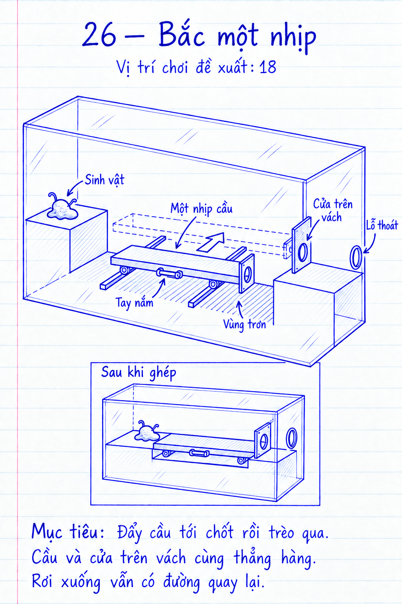

# COghe — venom.origin.26 — Bắc một nhịp

> **Rà soát v3 — 18/09/2026, màn hiển thị 18:** đã sửa hình học và kiểm chứng lại
> đường giải. [Báo cáo và ảnh Unity](../../../Verification/COgheCampaign30/review-14-16-18.md)
> ghi trạng thái hiện hành; các ước lượng/Nháp bên dưới là lịch sử phác thảo.
> Chưa kiểm thử lại trên OPPO ở lượt này.

## 1. Định danh, phạm vi và trạng thái

- ID ổn định `venom.origin.26`; vị trí hiển thị **18**, chuẩn bị màn Ghép cầu cũ 16.
- Prototype Unity v2, 17/09/2026; scene, definition, builder và cầu một nhịp đã tồn tại.
- Origin hiện hành, 32 hạt/120 Hz; không sửa màn cũ 16 hoặc hồi sinh thiết kế cầu ống đã bỏ.
- Yêu cầu đã có: thêm thử thách vừa sức bằng lắp ghép, dễ chạm mobile; kích thước là ước lượng chưa thử.
- Ray cầu, khóa lỗ, reset, camera chạm và ngân sách mô phỏng đã qua test macOS; chưa playtest tay mobile.
Nguồn: [quy tắc level](../../../COGHE_LEVEL_DESIGN_RULES.md), [template](../LEVEL_TEMPLATE.md), [Day Lab](../../../ArtDirection/COghe/STYLE_RULES.md), [kiến trúc](../../../COGHE_EXPANSION_11_20.md).

## 2. Mục tiêu trải nghiệm và tiến trình

- Nhận ra một thanh cầu trên ray có thể đưa vào vị trí rồi buông để dùng nó làm đường đi.
- Đã biết đẩy/kéo và chốt; giới thiệu ghép một module trước khi màn cũ 16 yêu cầu ba module.
- Khám phá qua khe thiếu rõ ràng, hai bệ cùng cao độ và tay nắm nằm phía người chơi.
- Màn giới thiệu nhẹ; chỉ nhắc “Chạm tay nắm để dịch chuyển; chạm mặt cầu để đi”.
- Một cơ thể, không dao/nút/đổi khối lượng, không nâng chỉ số hoặc phần thưởng Nhà.

## 3. Phác thảo, hình học, camera và thao tác

[Xem cả 10 bản phác thảo](../Sketches21-30/review.html). Bản v1 để duyệt bố cục và thao tác;
chi tiết tỷ lệ, vách kín, ray/chốt và tiếp xúc cơ khí được giản lược, cần kiểm chứng khi dựng.

- Sơ đồ v0.1: `Spawn / bệ trái == [khe + một cầu dịch trước–sau] == bệ phải / Exit`.
- Hộp 0,60 m; spawn trước-trái trên sàn bám; lỗ cuối vách phải, ngang bệ cao khoảng 0,18 m trên sàn.
- Cầu dài khoảng 0,17 m, rộng 0,12 m, ray dịch 0,10 m; các số này phải đo lại với footprint và mép nối.
- Vách kín toàn khoang thoát chỉ có một cửa ngang bệ. Cầu mang một tấm chắn có lỗ, cùng Rigidbody, chạy sát mặt vách.
- Chưa ghép: phần đặc của tấm chắn phủ cửa thật; ghép tới chặn: lỗ trên tấm và cửa vách trùng, mặt cầu nối hai bệ.
- Tấm chạy song song, có khe lắp riêng; không để mesh tấm/cầu xuyên vách trong bất kỳ vị trí nào; đây là rủi ro dựng cần kiểm chứng.
- Mép nối đích dự kiến 2–4 mm, hành lang 0,11–0,12 m; bệ đặc, không tạo hốc dưới mặt cầu mỏng.
- Sàn rơi xuống có lối bám quay lại trái; vật trơn có biên thật. Lối quay lại không xuyên vách khoang thoát.
- Khóa xoay; camera tĩnh khoảng 35°/15°, fit bounds tĩnh, thấy tay nắm/cửa; follow không đổi trọng lực.
- Chạm tay nắm rộng → bám/kéo; chạm mặt deck sau buông → bò. “Buông vật”/3 giây chỉ kết thúc giữ prop, chốt vẫn còn.
- Thử portrait 720×1280/720×1612, safe area; đích hợp lệ trên nóc/trơn vẫn nhận chạm nhưng không tạo bám.

## 4. Lời giải, kết thúc và phục hồi

| Bước | Lệnh | Trạng thái / tín hiệu | Bỏ dở hoặc làm ngược |
| --- | --- | --- | --- |
| 1 | Chọn tay nắm, chỉ phía ổ ghép | Cầu dịch về chặn, cửa thật dần trùng | Buông giữa ray dừng, kéo tiếp được |
| 2 | Buông rồi chỉ lên bệ/cầu | Chốt giữ module; COghe đi trên deck | Kéo ngược nhả chốt; module không biến mất |
| 3 | Chỉ vào Exit | Đi qua cổ cửa và bệ phải | Rơi trước cửa về sàn hồi phục bên trái |

- Chỉ có `FinalExit`; thắng khi toàn thân hợp nhất ở trong và đủ 32 hạt thoát; không có cổng transfer.
- Không thêm “đã ghép” vào luật thắng để che khe hở. Tấm chắn/cửa kín tự ngăn đường tắt qua tường và nóc.
- Nếu đi qua được ở vị trí chưa hết hành trình nhưng đủ hở thật, chấp nhận lời giải vật lý đó; đo ngưỡng sử dụng để cơ cấu đọc rõ.
- Kéo ngược khi đang trên cầu: rơi vào khay hồi phục, không nghiền/mất hạt; thử tiếp cận tay nắm từ mọi phía.
- Hai chặn ray giữ module trong hộp; không thể đẩy mất khỏi màn hoặc chèn vào góc không tới được.
- Pause dừng mô phỏng; reset xóa lực/lệnh, trả module và chốt về vị trí rút. Save hoàn tất cũ giữ nguyên.
- Nếu thử nhiều phần: tự tụ khi gần/không cản, ra trước khi nhập hết hiện “bạn phải hợp thể trước khi chui ra”.

## 5. Cơ quan và kiến trúc dùng lại

| Cơ quan | Lực / hành trình ước lượng | Trạng thái, phụ thuộc và reset |
| --- | --- | --- |
| Cầu / `COgheRailSlider` | Ray ngang 0,10 m; cản 0,03–0,06 N | COghe cấp lực, cuối ray chốt; kéo ngược nhả; reset rút |
| Deck + tấm có lỗ | Cùng một Rigidbody, chuyển động cứng | Mở đường bằng giao hình học; không actuator riêng |
| Quan sát ghép / `COgheAssemblyBridge` | Đọc pose/chốt, không tự di chuyển | Đèn trạng thái, không tự khóa thắng |

- Dùng rail, tay nắm tách mặt deck và catch của màn 16 hiện tại; tấm có lỗ đã được dựng thành collider thật trong scene prototype.
- `COgheAssemblyBridge.Ready` hiện yêu cầu đúng ba ray. Với một module phải cấu hình hóa số ray hợp lệ hoặc dùng observer tương ứng; không gắn nguyên code ba ray rồi coi đèn/Ready đã hoạt động.
- Route invalidation theo module động; giữ lực hữu hạn và 32 ID mô, không if-level để tạo bám hoặc kéo tự động tới đích.

## 6. Hình ảnh, animation và phản hồi

- Day Lab: deck hổ phách, chân/ổ bạc, mặt trơn lavender; lỗ thật không bị quad trang trí lấp.
- Nhận chạm → bám tay → đẩy thân → chốt kêu nhẹ; đèn chỉ sáng khi chốt thật. Deck luôn là đích bò, không chọn nhầm prop.
- Thắng dùng ba hoạt ảnh hiện có; chưa có render Unity/mobile. Mặt trước không che vị trí cầu hoặc cửa chắn.

## 7. Độ khó và ngân sách runtime

- Dự kiến 1 quyết định ghép rồi 1 quyết định đi, một cơ thể; không timing, không căn tilt; mục tiêu thử 1–2 phút.
- Một Rigidbody/khớp module ngoài mô; thêm collider tấm có lỗ và mép tiếp giáp, số lượng cuối cùng chưa chốt.
- Đo graph ở lúc kéo và đi qua, contact tại ổ, skin và lớp kính; ngân sách GC/GPU chưa xác định từ dữ liệu mới.

## 8. Chơi thử và hồi quy

- Tuyến kéo cầu–khóa khớp–bò qua–thoát đã qua full-solution test, không teleport mô hay gán trạng thái rail. Kéo ngược và playtest mobile vẫn là checklist hiệu chỉnh.
- Stress vị trí giữa ray, mô giữa mép cửa, rơi xuống khay, đi vòng toàn bộ mặt hộp; không được có softlock hoặc xuyên tấm.
- Hồi quy rail/AssemblyBridge và màn cũ 16/18; playtest người mới ghi thời gian, nhầm tay/deck và số lần chạm lại.

## 9. Bằng chứng hiệu năng trên thiết bị

- Chưa có device/build/SHA/log, số p50/p95/p99/max, spike, GPU/GC/memory hoặc phiên nhiệt.
- Đo cùng OPPO/profile đã xác nhận, 32 hạt/120 Hz; mục tiêu 60 FPS chưa được chứng minh, ngân sách p95/p99 cần chốt.
- Kịch bản kéo nhiều lần rồi leo qua, kèm baseline và phiên 15–20 phút; ghi máy/OS/resolution/build/commit/diff thực.

## 10. Tích hợp, tương thích và nghiệm thu

- Slot 18 đã tích hợp; ID 26 không ghi đè scene/save cũ 16, catalog/build/next đã dùng mapping mới.
- Không mở Nhà hay cấp phần thưởng. Kiểm tra migration vị trí, tải/retry/replay và save idempotent khi triển khai.
- Kết luận Nháp: cần dựng/kiểm chứng tấm có lỗ và khe lắp; không dùng dossier này làm bằng chứng khả giải hay hiệu năng.
