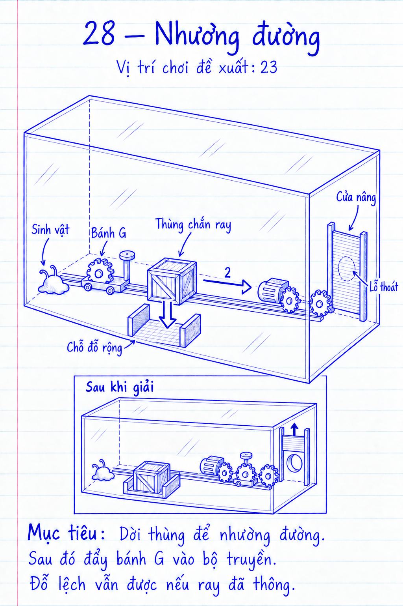

# COghe — venom.origin.28 — Nhường đường

## 1. Định danh, phạm vi và trạng thái

- ID ổn định `venom.origin.28`; vị trí hiển thị **23**, sau luyện bộ truyền, trước phối hợp phức tạp hơn.
- Prototype Unity v2, 17/09/2026; scene, definition, builder, thùng chắn và hốc đỗ đã tồn tại.
- Origin hiện hành, 32 hạt/120 Hz; tuyến chuẩn đã kiểm chứng, các kích thước/lực vẫn cần hiệu chỉnh bằng playtest thiết bị.
- Người dùng đã yêu cầu màn vừa sức, thích đẩy/kéo/lắp bánh; thứ tự thao tác được gợi bởi vật cản thật.
- Chọn thùng từ camera, bộ truyền–cửa, reset và ngân sách mô phỏng đã qua test macOS; chưa playtest tay mobile.
Nguồn: [quy tắc level](../../../COGHE_LEVEL_DESIGN_RULES.md), [template](../LEVEL_TEMPLATE.md), [Day Lab](../../../ArtDirection/COghe/STYLE_RULES.md), [kiến trúc](../../../COGHE_EXPANSION_11_20.md).

## 2. Mục tiêu trải nghiệm và tiến trình

- Nhận ra cần dành chỗ cho một cơ cấu chuyển động trước khi kéo nó vào vị trí.
- Dùng kỹ năng thùng đẩy/kéo và ổ bánh đã biết; không yêu cầu Sokoban, vị trí pixel hoặc công thức mới.
- Vật cản hổ phách nằm ngay trên đường ray; hốc đỗ nhìn thấy từ đầu đủ rộng để người chơi đoán hướng dời.
- Màn kết hợp 2 quyết định: dọn đường rồi nối truyền động; hướng dẫn chỉ nhắc cách chọn/buông vật.
- Một cơ thể, không tách, không nâng chỉ số, không buff Nhà hoặc phần thưởng vĩnh viễn.

## 3. Phác thảo, hình học, camera và thao tác

[Xem cả 10 bản phác thảo](../Sketches21-30/review.html). Bản v1 để duyệt bố cục và thao tác;
chi tiết tỷ lệ, vách kín, ray/chốt và tiếp xúc cơ khí được giản lược, cần kiểm chứng khi dựng.

- Sơ đồ v0.1: `Spawn → [thùng chắn ray ↔ hốc đỗ bên cạnh] → ổ G → motor–G–tải → Exit`.
- Spawn trước-trái trên sàn bám; bộ truyền giữa-sau; lỗ cuối thấp ở bên phải sau nắp nâng.
- Vách khoang cuối kín từ sàn tới nóc, aperture duy nhất có nắp đặc; bò lên thùng/tường không vòng qua cửa.
- Thùng tự do khoảng 0,11×0,09×0,11 m; vùng đỗ mở khoảng 0,18×0,18 m, không cần đặt đúng một điểm.
- Ở chỗ chặn ray, một cữ cố định phía sau ngăn carriage đẩy cả thùng theo ray; hướng ngang sang hốc vẫn thông.
- Hốc mở về phía người chơi, không có cổ hẹp; để tối thiểu khoảng 60 mm tiếp cận mặt kéo ngoài thùng, cần đo lại với mô.
- Thùng có thể kéo trở ra từ mọi tư thế đỗ; rail/ốp cố định không cho nhét thùng vào sau bộ truyền hoặc che kín mặt bám duy nhất.
- G có tay nắm rộng ở mặt trước, ray ngang 60–80 mm; hành lang bò khoảng 0,12 m, không có trần thấp phải ép chính xác.
- Khóa xoay; camera tĩnh khoảng 38°/15°, thấy đáy hốc, thùng, điểm chặn và tay G; fit bounds tĩnh, zoom không đổi vật lý.
- Chạm thùng/tay G → tới bám; chạm đích rộng → đẩy/kéo. Buông hoặc 3 giây không lệnh chỉ hủy giữ prop, không tự đỗ.
- Chạm sàn/nóc/trơn hợp lệ vẫn chọn đích, chỉ mặt bám truyền lực. Thử 720×1280/720×1612 và safe area trước chốt bố cục.

## 4. Lời giải, kết thúc và phục hồi

| Bước | Lệnh | Trạng thái / tín hiệu | Bỏ dở hoặc làm ngược |
| --- | --- | --- | --- |
| 1 | Dời thùng ngang vào khoảng trống | Ray bị chắn → khoảng chạy trống thấy được | Đỗ lệch vẫn được nếu không va ray; kéo trở ra dễ |
| 2 | Buông thùng, kéo G tới chặn | Bánh nối nguồn/tải, nắp nâng | G gặp thùng thì dừng va chạm, không khóa lệnh vô cớ |
| 3 | Buông và tới Exit | Nắp chốt mở, đường thông | Có thể quay lại sửa vị trí trước khi thoát |

- Thắng khi hợp nhất trong hộp rồi đủ 32 hạt qua `FinalExit`; không có transfer/điều kiện “thùng đã vào zone”.
- Vị trí đỗ chỉ gợi ý; bất kỳ cách dọn đường hợp lệ đều được. Không dùng trigger parking làm mã cho phép motor chạy.
- Nếu người chơi đẩy được thùng bằng chính carriage và thật sự dọn đường, chấp nhận hoặc sửa hình cữ; không phủ nhận bằng cờ lịch sử.
- Đẩy G trước tạo tiếp xúc chặn; kéo ngược để lấy khoảng rồi dời thùng, không tích lực phóng thùng hoặc ép xuyên vật.
- Thùng sát cữ/hốc vẫn còn mặt kéo tiếp cận; thử mọi cạnh/góc, không đặt hốc cụt buộc Retry làm lời giải chuẩn.
- Rút G giữa lúc nâng: phanh tải giữ nắp; gài lại tiếp tục. Chốt cuối giữ nắp mở, không yêu cầu giữ G.
- Reset trả thùng/G/nắp/vận tốc/lệnh/chốt; pause dừng mô phỏng; save đã thắng giữ nguyên. Nếu có phần rời thử nghiệm, tụ/thoát theo luật chung.

## 5. Cơ quan và kiến trúc dùng lại

| Cơ quan | Lực / hành trình ước lượng | Trạng thái, phụ thuộc và reset |
| --- | --- | --- |
| Thùng / `VenomMovableProp` | Khối lượng 0,10–0,14 kg, tiếp xúc sàn thật | Tự do trong khoảng chứa; không parking-state; reset chắn ray |
| G / `COgheRailSlider` | Ngang 60–80 mm, cản 0,04 N | Bị chặn do collider; catch cuối, kéo ngược nhả |
| `COgheGearTrain` + nắp | Motor hiển thị khoảng 0,03–0,04 N·m, nắp nâng 0,12 m | Ăn khớp cấp công nâng; phanh/chốt giữ tải; reset đóng |

- Dùng prop/rail/gear có sẵn; phanh rack ngắt truyền cần triển khai/cấu hình dùng lại, không giả định hoàn thiện sẵn.
- Source→G→rack là liên kết duy nhất; thùng ảnh hưởng bằng va chạm, không điều kiện theo danh tính prop hoặc số màn.
- Route và cache theo pose thùng/G/nắp; không chạy truy vấn toàn scene trên mỗi đỉnh skin để nhận biết “đã đỗ”.

## 6. Hình ảnh, animation và phản hồi

- Day Lab 07; thùng/ổ hổ phách, cữ bạc nhỏ, hốc có viền nền nhẹ không phát sáng như nút điện.
- Vòng chạm → tới mặt thật → thân đẩy/kéo → vật dịch hoặc dừng vào cữ; đường motor/nắp và catch đọc pose thật.
- Tay G/hốc không bị kính chồng che; âm chạm cữ nhẹ. Chưa có render Unity; thắng dùng ăn mừng hiện có.

## 7. Độ khó và ngân sách runtime

- Dự kiến 2 quyết định có thứ tự, 1 cơ thể, sai có thể lùi; mục tiêu thử 2–4 phút, không timing hay căn chính xác.
- Một prop tự do, một carriage, một nắp; điểm nặng dự kiến là tiếp xúc thùng–cữ và graph khi đổi vật, chưa đo.
- Chưa có ngân sách collider/skin/GC/GPU chốt; giữ kit/đèn Day Lab, đo thực trên mobile thay vì suy từ số object.

## 8. Chơi thử và hồi quy

- Tuyến đỗ thùng thật rồi kéo G mở cửa đã qua full-solution test. G trước thùng, đỗ lệch và playtest mobile vẫn là checklist hiệu chỉnh.
- Thử mọi góc đỗ và leo lên thùng để tìm đường tắt; bắt buộc cửa đóng vẫn che aperture vật lý, không mất hạt hoặc softlock.
- Hồi quy prop/containment màn cũ 7/9/11 và gear/rail 17/20 nếu sửa dùng chung; full solution không teleport.
- Người mới: ghi số người/lượt, thời gian, có tưởng hốc là nút không, chạm sai prop và khả năng tự phục hồi.

## 9. Bằng chứng hiệu năng trên thiết bị

- Chưa có model/OS/build/SHA/log, p50/p95/p99/max, spike, CPU/GPU/GC/memory/nhiệt; chưa tuyên bố đạt FPS.
- Đo OPPO đã xác nhận với baseline cùng profile 32 hạt/120 Hz; mục tiêu 60 FPS, ngưỡng p95/p99 cần chốt.
- Kịch bản đổi thùng↔G và va cữ, sau đó phiên 15–20 phút; lưu commit/diff, cấu hình và thời lượng thực.

## 10. Tích hợp, tương thích và nghiệm thu

- Slot 23 là đề xuất, không đổi ID màn cũ; ID 28/save/build/catalog/next cần đăng ký riêng khi triển khai.
- Không mở Nhà, không làm mất quyền cũ. Kiểm tra tải lại/replay/lưu idempotent và rollback dữ liệu nội dung.
- Kết luận Nháp v0.1; việc ưu tiên là chứng minh hốc không softlock và mọi mặt kéo đọc/chạm được trước art chi tiết.
