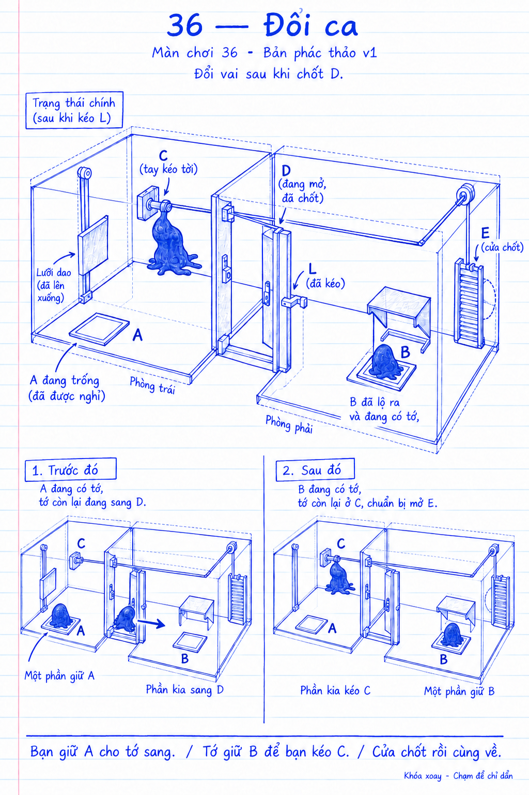

# COghe — Màn 36 — Đổi ca

## 1. Định danh, phạm vi và trạng thái

ID đề xuất `venom.origin.36` · vị trí chơi **36** · Đổi ca. Người thiết kế: Codex, 21/09/2026. **Nháp v1** theo yêu cầu Mrk; không tự ghi là đã duyệt. Hồ sơ và phác thảo mới, không thay scene cũ. Chưa có scene/definition/builder mới; chưa kiểm chứng Editor/Mac/mobile.

Thiết kế: đủ brief/lời giải/phục hồi để review. Prototype, hoàn thiện và nghiệm thu: chưa thực hiện. [Hợp đồng chương và nguồn](../Sketches31-40/README.md).

## 2. Mục tiêu trải nghiệm và vị trí trong tiến trình

Người được giúp sang bên kia trở thành người giữ cơ quan cho bạn mình.

Dùng kỹ năng bò/leo/luồn/đẩy/kéo đã có, cùng cắt/tụ và giao việc cho phần cơ thể. Vai trò: luyện/kết hợp thêm quan hệ so với màn 35. Kết quả chỉ ghi hoàn tất màn, không cấp buff hoặc mở lại Nhà. Điểm mới là quan hệ cơ quan trong bố cục này, không phải kỹ năng có thể mua.

## 3. Phác thảo, hình học, camera và thao tác

Hai khoang với dao và A bên trái, cửa tạm D giữa; cần C của tời ở trái. Phải có L chốt D và kéo nắp che nút B. B nối ly hợp tới tời C bằng trục/cáp nhìn được. C vận hành cửa E bên phải chỉ khi B có tải. A không liên quan E. Khi E mở hết, chốt giữ; vùng tụ trước E. Cấu trúc A–D giống màn 35 để người chơi áp dụng lại.

Khóa xoay; tổng quan 3/4 thấy spawn, cơ quan mục tiêu và cửa cuối. Nhìn gần/theo phần chọn chỉ đổi camera. Màn nhiều khoang có nút xem khoang; không che trạng thái phần đang giữ ở khoang khác. Các bản vẽ không theo tỷ lệ. Kích thước khởi điểm để blockout: bệ tụ khoảng 0,18 × 0,18 m; đường chân bám dọc ray khoảng 0,12 m; tay nắm 0,05–0,06 m. Đây là giả thuyết, phải kiểm tra theo kích thước/tầm giãn mô thật; chưa chốt clearance ống. Không dùng ngưỡng khối lượng vô hình tại ống.

Chạm sàn/đích → bò/leo; chạm tay → tới bám; chạm đầu hành trình → đẩy/kéo; đổi lệnh → hủy lực cũ. Nóc/trơn vẫn nhận đích hợp lệ; mặt trơn không sinh lực bám. Retry/pause/zoom/chọn phần nằm ngoài hộp và safe area.

## 4. Lời giải, kết thúc và phục hồi

1. Tách; phần trái giữ A, phần phải qua D.
2. Phần phải kéo L, chốt D và lộ nút B.
3. Phần phải giữ B; phần trái rời A và đi tới C.
4. Kéo C khi B được giữ, mở/chốt E.
5. Rời B/C, tập hợp ở bên phải, hợp thể rồi thoát.

**Sửa sai:** Nhả A trước L thì mở lại như 35. Nhả B khi C đang chạy: phanh E giữ tiến độ, giữ B rồi tiếp tục. Quên rời A không mất tiến độ; không tự bỏ nhiệm vụ hộ người chơi.

**Điều kiện hoàn tất:** tụ trong hộp trước khi ra FinalExit, rồi đủ toàn bộ 32 hạt. Cửa/ống nội bộ chỉ chuyển khoang. Chấp nhận cách giải khác đúng vật lý, không khóa theo lịch sử từng bước. Retry trả vị trí/vận tốc, chốt, tải, ly hợp, lệnh và mô về trạng thái đầu; pause dừng mô phỏng, không để callback cũ mở máy. Mất phần/cửa kẹp/không quay lại tay nắm được là lỗi prototype cần sửa, không coi Retry là lời giải thường lệ.

## 5. Cơ quan, trạng thái và kiến trúc dùng lại

**Quan hệ:** `A → D tạm; L → D chốt + lộ B; B có tải AND C kéo → E mở/chốt`.

Kết hợp chốt D màn 35 với cooperative winch; cấu hình L đồng thời kéo nắp B bằng liên kết vật lý, không chỉ bật khả năng theo cờ lịch sử.

Dùng `VenomMovableProp`, `COgheRailSlider`, `COgheGearTrain`, `COgheTissueSensor`, `COgheGuillotine` và cooperative winch khi hợp đồng phù hợp. Đây là hướng tái dùng, không khẳng định driver mới đã tồn tại. Motor mô-men hữu hạn, điểm bám/phản lực thật, chốt chỉ bắt ở cuối hành trình thật. Mọi cơ quan reset cùng scene; ngắt nguồn không được animation tiếp tục truyền lực. Pose cơ quan/cửa đổi phải cập nhật route và aperture. Không rải nhánh theo số màn hoặc đọc lời giải mẫu trong runtime.

## 6. Hình ảnh, animation và phản hồi

Hai đường liên kết riêng A–D và B–C–E; ký hiệu cơ quan và cơ cấu chuyển động cho thấy vai trò đã đổi, không chỉ đổi màu đèn.

Chuỗi phản hồi: nhận chạm → đi tới → bám → truyền lực → vật chuyển/va chặn → chốt thật. Đèn chỉ báo trạng thái đo được; âm khớp/catch ngắn, không thay tín hiệu hình. Sinh vật không tự giải bước tiếp theo. Phác thảo tạo bằng imagegen tích hợp; prompt và manifest ở thư mục review. Khi dựng cần ảnh Unity thật theo Day Lab 07. Ăn mừng/chuyển màn dùng luồng hiện có.

## 7. Độ khó và ngân sách runtime

Dự kiến **5 cụm quyết định**, tối đa **2 vai trò cùng lúc** trong lời giải mẫu; đây không phải số cú chạm tối thiểu. Mục tiêu lần đầu 4–6 phút, **chưa đo**. Độ chính xác/thời điểm giữ thấp; cho phép dừng quan sát giữa các bước.

Rủi ro riêng: B và C ở hai khoang xa nhau, một cơ thể không giữ và kéo được. D vẫn mở sau đổi ca. Nắp B đóng phải thật sự che mặt cảm biến, không nhãn nhìn xuyên nắp.

Giữ baseline 32 hạt/120 Hz, Day Lab một key light có bóng. Dự kiến điểm nặng: pose cơ quan → cập nhật đường đi, tiếp xúc ray/catch và tách/tụ/đổi phần. Chưa chốt ngân sách collider/joint/GC/GPU; số cơ quan không chứng minh FPS. So cùng thiết bị với màn cơ khí/tam hợp hiện có, không giảm luật vật lý để đạt chỉ tiêu.

## 8. Chơi thử và hồi quy

Chưa chạy gameplay tests cho các màn mới. Checklist khi prototype:

- Giải trọn bằng chạm/API điều khiển thật, không teleport mô/gán cửa mở; thử cả camera tổng quan và gần.
- Làm ngược thứ tự, kéo dở, buông sau timeout, đổi phần, mất tải giữa hành trình, pause/reset ở mọi chốt.
- B và C ở hai khoang xa nhau, một cơ thể không giữ và kéo được. D vẫn mở sau đổi ca. Nắp B đóng phải thật sự che mặt cảm biến, không nhãn nhìn xuyên nắp.
- Với nhiều phần: cắt lệch, tụ sớm, nhiều hơn số vai trò mẫu, mọi phần có đường về; đủ mô, không nhập xuyên kính, không thoát sớm. Với một thân: thử leo vòng vách/tay nắm và tiếp cận từ nóc.
- Với ray/ống/cầu: đo nhiều đích chạm lệch; không kẹp, không mắc tại chặn, không bám lại liên tục để giải.
- Playtest người chưa biết lời giải và replay người đã biết: ghi số người/lượt, thời gian suy luận riêng thao tác, điểm chạm sai, lần thử lại và điểm không hiểu.
- Khi sửa shared runtime chạy toàn bộ EditMode/PlayMode của package và hồi quy các scene dùng chung.

## 9. Bằng chứng hiệu năng trên thiết bị

**Chưa có build, thiết bị, mẫu frame-time hoặc FPS cho màn này.** Chưa có chứng nhận performance. Khi dựng: đo cùng máy/profile với baseline 30 màn, ghi commit+diff+build hash, resolution/safe area, warm-up, thời lượng thực; tách CPU/GPU, p50/p95/p99/max, GC/memory, spike lúc ra lệnh/cắt/tụ/cửa đổi. Mục tiêu chung 60 FPS cần đo trên mobile; thử phiên 15–20 phút để quan sát nhiệt. Không dùng hình minh họa hoặc test logic thay số đo.

## 10. Tích hợp, tương thích và nghiệm thu

Vị trí 36/ID 36 là đề xuất mới, chưa đăng ký catalog, scene, save hoặc build list; giữ nguyên các ID cũ. Khi tích hợp kiểm tra mở tiếp/replay/save idempotent, mất điện giữa lưu và ăn mừng; không cấp Nhà lại. Màn 40 kết thúc chương mới, chưa tự đặt màn 41.

Kết luận: **bàn giao thiết kế minh họa**, chưa nghiệm thu playable. Bước tiếp theo nếu triển khai là blockout và kiểm chứng rủi ro nêu trên trước art; không cần build game để review tài liệu này. Lịch sử v1: tạo theo yêu cầu 21/09/2026.

## 11. Cập nhật triển khai và kiểm chứng — 21/09/2026

Phần trên lưu thiết kế minh họa v1. Màn 36 hiện đã được dựng thành `Assets/_Game/Venom/Campaign30/COgheOrigin36.unity`, đăng ký campaign40 màn với ID ổn định `venom.origin.36`. Các khoảng hở, tay nắm và góc nhìn được hiệu chỉnh qua mô phỏng vật lý; quan hệ cơ quan và thứ tự giải giữ theo concept.

Luồng đã chạy trong app macOS: **Giữ A, phần kia kéo L rồi giữ B, phần cũ rời A kéo C, hợp thể và thoát.** Hợp thể trước khi ra cửa; ảnh trước thoát ghi1 phần/0 hạt thoát, ảnh thắng ghi1 phần/32 hạt thoát; không thua. Kiểm tra reset sau thắng và chọn các điều khiển nhìn thấy trong trạng thái đầu màn đều đạt.

Toàn bộ suite: **341/341 PlayMode,8/8 EditMode**. Cả10 lời giải đạt trong bản macOS Development thực tế; chưa đo hiệu năng hay chơi chạm tay trên thiết bị mobile. [Hồ sơ triển khai chung](../CHAPTER_31_40_IMPLEMENTATION.md) ghi trạng thái nguồn, các điều chỉnh và giới hạn kiểm chứng. Bằng chứng màn này: `Artifacts/chapter40-player-proof/20260921T135858138Z/level-36.json`, `level-36-open.png` và `level-36-won.png`.

## Rà đường đi và phục hồi — 21/09/2026

Kiểm tra nhánh bỏ A khi phần kia đã qua D rồi giữ A lại, kéo L mở B, đổi ca B/C, hợp thể và thoát bằng điểm chạm thật.

Các kiểm tra mới dùng `TouchPoint`, camera/HUD và mô phỏng thật; không gán vị trí sinh vật hoặc ép trạng thái thắng. [Kết quả, phạm vi và bằng chứng đợt rà 32–40](../../../Verification/COgheCampaign30/LEVELS_32_40_ROUTE_AUDIT_2026_09_21.md).
