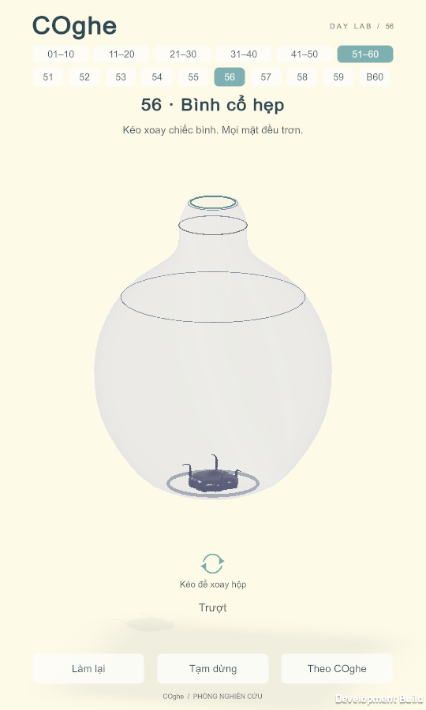

# COghe — Hồ sơ level 56 — Bình cổ hẹp

Nguồn chuẩn: [quy tắc level](../../../COGHE_LEVEL_DESIGN_RULES.md), [Day Lab](../../../ArtDirection/COghe/STYLE_RULES.md), [chương 56–60](../../../COGHE_CAMPAIGN_56_60.md).

## 1. Định danh, phạm vi và trạng thái

ID `venom.origin.56`, vị trí 56; v1, cập nhật 24/09/2026 bởi Codex.
Scene `Assets/_Game/Venom/Campaign30/COgheOrigin56.unity`; definition `Definitions/Slot56.asset`.
Builder `COgheCampaign60Builder.GenerateCampaign60`; mesh riêng trong `Campaign30/VesselMeshes`.
Yêu cầu Mrk: thêm5 màn giống màn7, toàn vật liệu trơn, hình vật thể khác nhau; Buzz event395566321fe15754a3b260ece858f289e96772e8a99007426c2992e5ccfbbae8.
Trạng thái **Đã kiểm chứng kỹ thuật trong Editor và Mac**. Unity 6000.3.19f1: 403/403 PlayMode, 8/8 EditMode; Mac hoàn thành cả 5 màn với 32 hạt/màn, một cơ thể. Thiết bị mobile và người mới chưa kiểm chứng.

| Mốc | Điều kiện | Bằng chứng |
| --- | --- | --- |
| Thiết kế | Bố cục và động từ xoay đã rõ | Yêu cầu + hồ sơ này |
| Prototype | Giải đủ32 hạt, không xuyên vỏ | PlayMode05: 403/403 toàn bộ suite |
| Hoàn thiện | Day Lab và portrait đọc được | Mac player02 + ảnh runtime bên dưới |
| Nghiệm thu | Gameplay, save, chuyển màn, thiết bị | Chưa đạt gate thiết bị |

## 2. Mục tiêu trải nghiệm và vị trí

Nghiêng bụng bình rồi lật để cổ trở thành đường xuống. Giới thiệu biến thể vỏ rỗng: bụng phình, vai thu, cổ hẹp.
Kỹ năng đã biết: kéo xoay như màn7; không thêm động từ. Không nâng chỉ số, đồ mua hay buff Nhà.
Tín hiệu: sinh vật luôn rơi, satin tím là mặt trơn, vòng mint là lỗ thật duy nhất.
Lesson nhắc thao tác xoay, không tự giải; không thêm phần thưởng.

## 3. Phác thảo, hình học, camera và thao tác

Phác thảo v1: `spawn trong bụng kín → lòng cong của vật thể → cổ/đoạn cuối → lỗ tròn mint → ngoài`.
Mặt trong100% trơn; không vùng bám, dao, nút, vật đẩy hoặc ống chuyển. Spawn do builder khai báo; mọi tiết diện/lỗ có collider đúng hình.
Tường6mm; lỗ đường kính96mm; baseline32 hạt/120Hz. Vỏ cong liên tục, không đặt hộp bao chặn lỗ.
Camera16° pitch/-14° yaw ban đầu, overview theo bounds thật, follow giữ tính trình bày.
Kéo trong vùng chơi → xoay vật lý qua BoxRotationController; chạm mặt → nhận lệnh/hoạt ảnh cố bò nhưng không tạo lực bám.
Mắt/miệng khắc kín (nếu có) không được tô mint hoặc nhận tương tác. Điện thoại cần kiểm tra thêm độ rõ nét khuôn.
Portrait720×1280 và720×1612; quay nhiều hướng, kiểm tra cả cửa và vùng chơi với HUD.

## 4. Lời giải, kết thúc và phục hồi

Lời giải dành cho tác giả/test: Lật bình, đợi mô trượt qua vai, căn cổ và lỗ cùng chiều trọng lực.

| Bước | Lệnh | Trạng thái/tín hiệu | Phục hồi |
| --- | --- | --- | --- |
| 1 | Kéo xoay để đổi mặt thấp nhất | Mô trượt theo trọng lực | Xoay ngược để về bụng |
| 2 | Căn đoạn tiếp theo xuống thấp | Mô đi qua lòng vật thể | Đổi hướng nếu mô nằm lại góc |
| 3 | Căn miệng lỗ | Toàn bộ32 hạt ra ngoài, một cơ thể | Retry về pose/spawn ban đầu |

Thắng/thua dùng luật chung: nhập bên trong trước khi hạt đầu ra, đủ32 mới thắng. Không cơ quan cắt trong màn này.
Có thể đi đường xoay khác; không khóa lời giải theo số bước/thời gian. Không timer. Pause dừng mô phỏng; retry xóa lệnh và phục hồi pose.
Trượt ngược là tình huống sửa được, không được xuyên thành hoặc kẹt vĩnh viễn không phản hồi.

## 5. Cơ quan và kiến trúc

| Thành phần | Trách nhiệm | Reset |
| --- | --- | --- |
| BoxRotationController | Cùng giới hạn góc/tốc độ như màn7 | Pose ban đầu |
| VenomSurfacePatch + COgheCurvedSurface | Mặt trơn, picking, tiếp xúc/skin qua mesh thật | Cache hình học tĩnh; transform cập nhật |
| MeshCollider | Vỏ rỗng6mm, miệng mở | Gắn pivot kinematic |
| FinalExit hiện có | Hỗ trợ tại miệng và kiểm32 hạt | Xóa trạng thái thoát |

Không thêm nhánh luật vật lý theo số màn. BVH cục bộ không xây lại khi xoay. Art không collider, không lực, không sửa thắng.

## 6. Art, animation và phản hồi

Day Lab: vỏ lavender satin trong, chi tiết sứ/nhôm mảnh, sinh vật đen ướt; vòng mint flush3.2mm theo lỗ thật.
Kéo → chuyển động vỏ → mô trượt; chạm → feedback đích/cố bò trượt. Không tạo mặt bám từ trang trí.
Không mua asset, không Blender, không thêm đèn hay bóng; dùng studio/cubemap chung. Ảnh runtime ở cuối hồ sơ; số liệu trong báo cáo chương.

## 7. Độ khó và ngân sách

Một vai trò, một cơ thể, không timing cưỡng bức. Độ khó ở suy luận hướng trọng lực và đường cong, không ở nút nhỏ.
Chưa đo thời gian giải với người mới. Cost: một mesh collider tĩnh gắn pivot, một surface, BVH local; không route grid trên mặt cong thụ động.
Giữ32 hạt/120Hz và material chung. Không suy ra FPS từ số collider/triangle; mobile60FPS chưa đo.

## 8. Chơi thử và hồi quy

Đường giải qua API xoay, chống tự thắng, toàn bộ mặt trơn, containment, pause/retry, chạm và portrait, truy vấn BVH so brute-force, chuyển55→60 và quay về7.
Chạy trọn EditMode/PlayMode; Mac player bình thường với input gameplay. Test không teleport mô/ép thắng.
Kết quả và lệnh chính xác ghi trong `Docs/COGHE_CAMPAIGN_56_60_VERIFICATION_2026_09_24.md` (đã hoàn tất Editor/Mac).

## 9. Bằng chứng hiệu năng thiết bị

Mac build development phục vụ kiểm chứng khả giải và hình; không đại diện điện thoại.
Thiết bị mobile/SoC, raw frame times/GC/GPU,15–20phút nhiệt và baseline trước/sau: **chưa đo**. Không chứng nhận mobile performance.

## 10. Tích hợp, tương thích và nghiệm thu

Append vào catalog60; ID/scene01–55 giữ nguyên. Save key/schema không đổi, không migration, không thêm quyền Nhà.
Normal build wrappers chọn60; `--tap` vẫn10 màn riêng. Mốc60 là Boss, không tự advance ra61.
Nghiệm thu kỹ thuật Editor/Mac đạt theo báo cáo; nghiệm thu điện thoại/người mới chưa có. Dùng artifact nguồn/hash để xác định bản thử.

## Ảnh runtime đã kiểm tra

