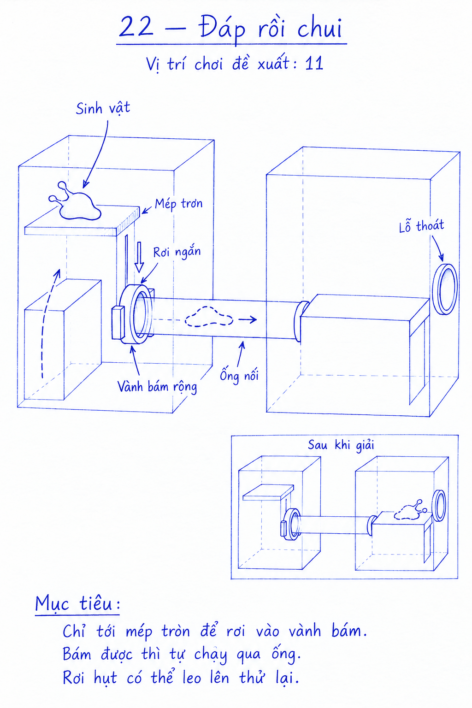
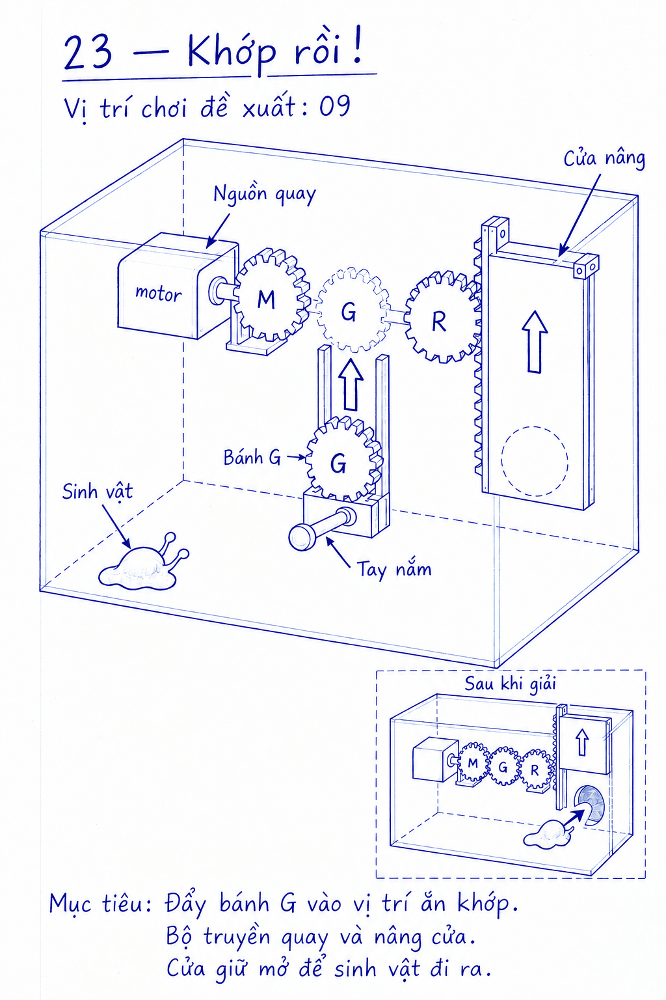
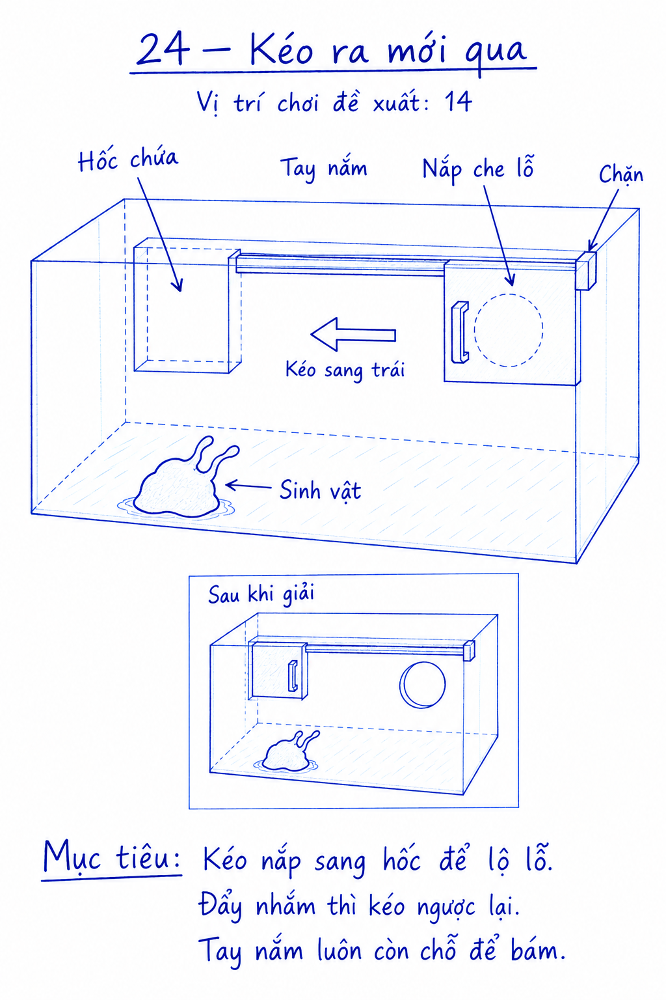
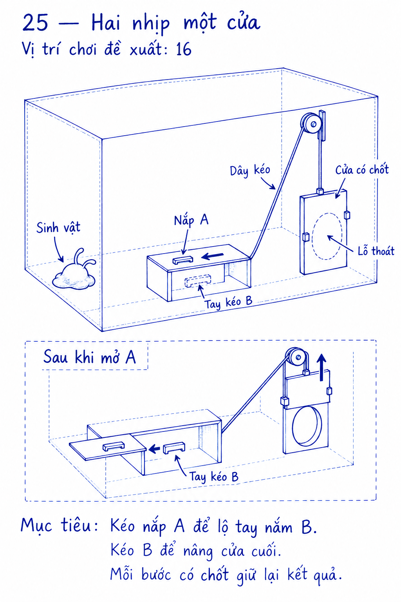
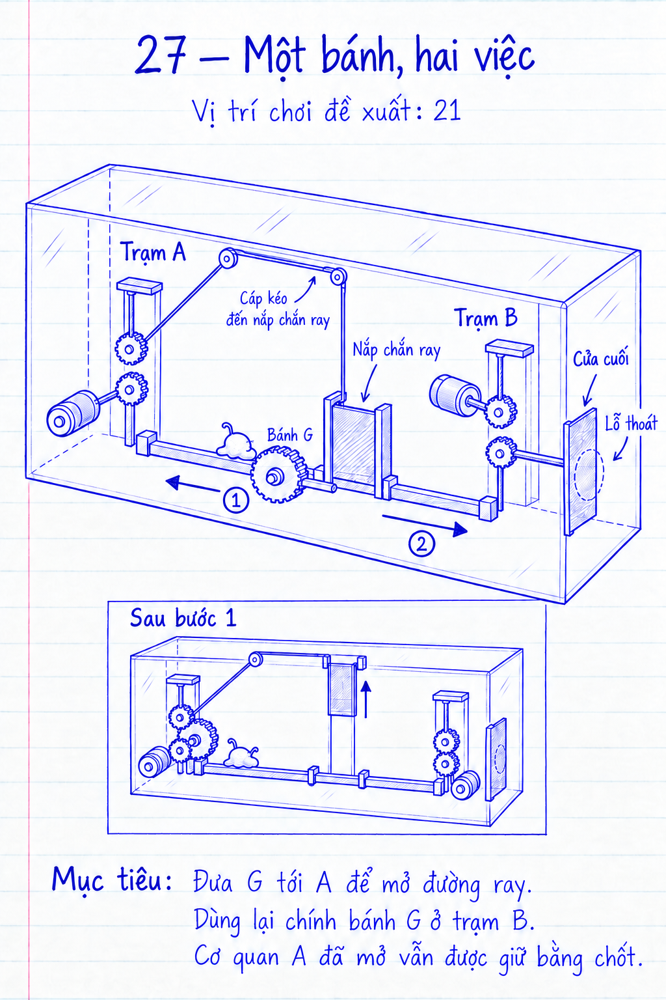
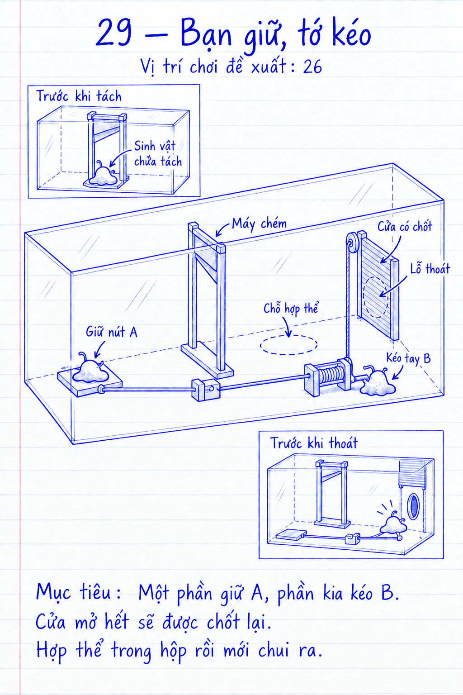
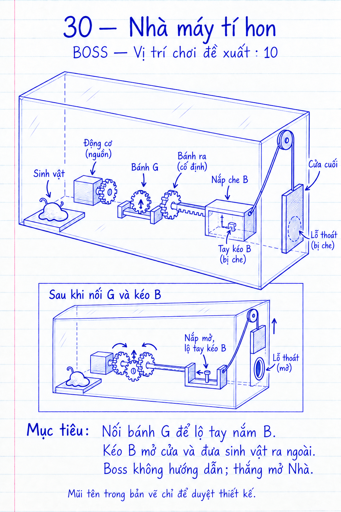

# COghe — 10 bản phác thảo xen kẽ (21–30)

Bản duyệt v1 · 17/09/2026. Phong cách bút bi xanh trên giấy kẻ dòng, theo bản vẽ của người dùng. Các thiết kế đã được dựng thành prototype Unity.

[Xem gallery, phóng lớn và đổi thứ tự](review.html) · [Tiến trình 30 màn](../../../COGHE_CAMPAIGN_30_DESIGN.md)

**Mã 21–30 là ID nội dung, không phải thứ tự chơi.** Prototype đã được xen vào campaign 30 màn và kiểm tra tự động trên macOS; các hình vẫn là tài liệu tác giả, không phải HUD hướng dẫn của game.

| Mã | Tên / ảnh | Vị trí chơi | Điều khiển |
| --- | --- | ---: | --- |
| 21 | [Nghiêng là tới](../Level21/mockup-v1.png) | 5 | Xoay + chạm |
| 22 | [Đáp rồi chui](../Level22/mockup-v1.png) | 11 | Chạm, khóa xoay |
| 23 | [Khớp rồi!](../Level23/mockup-v1.png) | 9 | Chạm, khóa xoay |
| 24 | [Kéo ra mới qua](../Level24/mockup-v1.png) | 14 | Chạm, khóa xoay |
| 25 | [Hai nhịp một cửa](../Level25/mockup-v1.png) | 16 | Chạm, khóa xoay |
| 26 | [Bắc một nhịp](../Level26/mockup-v1.png) | 18 | Chạm, khóa xoay |
| 27 | [Một bánh, hai việc](../Level27/mockup-v1.png) | 21 | Chạm, khóa xoay |
| 28 | [Nhường đường](../Level28/mockup-v1.png) | 23 | Chạm, khóa xoay |
| 29 | [Bạn giữ, tớ kéo](../Level29/mockup-v1.png) | 26 | Chạm, khóa xoay |
| 30 | [Nhà máy tí hon](../Level30/mockup-v1.png) | 10 · BOSS | Chạm, khóa xoay |

## Cách đọc

- Hình chính là bố trí khởi đầu; riêng 29 minh họa giai đoạn phối hợp sau khi tách, kèm ô trước khi tách.
- Khung nhỏ là một thời điểm khác, không thêm vật thể/sinh vật vào cùng một trạng thái.
- Nét đứt chỉ phần bị che hoặc vị trí đích. Các nắp cuối bắt đầu đóng và mở khi làm đúng cơ quan.
- Hình giản lược tỷ lệ, vách bao khoang và các mối truyền động. Hồ sơ từng màn giữ mô tả chức năng và điều kiện chống đi vòng; vị trí ray, chốt, chiều cao, tiếp xúc răng cần kiểm tra bằng hình khối trong Unity.
- Giữ luật chỉ tách bằng máy chém, gần nhau thì tụ lại; hợp thể trước khi thoát.

## 21 · Nghiêng là tới

Vị trí chơi đề xuất: **5**.

Chạm vào máng rồi nghiêng hộp cho COghe trượt tới khay bám rộng. Khay giữ hướng và đón cơ thể, giảm việc phải phanh hoặc chỉnh góc liên tục.

[Hồ sơ chi tiết](../Level21/README.md)

## 22 · Đáp rồi chui

Vị trí chơi đề xuất: **11**.

Cho COghe rời mép trơn để rơi một đoạn ngắn vào vành bám rộng. Khi bám thật vào miệng ống, nó tự chảy sang hộp bên kia; rơi hụt vẫn leo lên thử lại.

[Hồ sơ chi tiết](../Level22/README.md)

## 23 · Khớp rồi!

Vị trí chơi đề xuất: **9**.

Bám tay nắm và đẩy giá bánh G vào chỗ thiếu giữa nguồn quay và bánh ra. Bộ truyền hoạt động, cửa nâng lên và được chốt giữ.

[Hồ sơ chi tiết](../Level23/README.md)

## 24 · Kéo ra mới qua

Vị trí chơi đề xuất: **14**.

Nắp đang che lỗ. Kéo nó sang hốc trống bên trái để mở đường; đẩy nhầm vẫn có thể kéo ngược lại bằng cùng tay nắm.

[Hồ sơ chi tiết](../Level24/README.md)

## 25 · Hai nhịp một cửa

Vị trí chơi đề xuất: **16**.

Kéo nắp A để tiếp cận tay nắm B, rồi kéo B nâng cửa cuối. Hai thao tác có kết quả nhìn thấy và chốt giữ tiến độ.

[Hồ sơ chi tiết](../Level25/README.md)

## 26 · Bắc một nhịp

Vị trí chơi đề xuất: **18**.

Đẩy một mô-đun cầu tới chặn: mặt cầu nối hai bệ, đồng thời lỗ trên tấm chắn khớp cửa vách. Buông tay rồi leo qua cầu tới lỗ thoát.

[Hồ sơ chi tiết](../Level26/README.md)

## 27 · Một bánh, hai việc

Vị trí chơi đề xuất: **21**.

Dùng cùng bánh G tại A để nâng nắp chắn ray. Khi nắp đã được chốt, chuyển G tới B để mở cửa cuối; không phải giữ lại một bánh ở A.

[Hồ sơ chi tiết](../Level27/README.md)

## 28 · Nhường đường

Vị trí chơi đề xuất: **23**.

Thùng nằm giữa bánh G và bộ truyền. Dời thùng sang chỗ đỗ bên cạnh để thông ray, rồi đẩy G vào bộ truyền mở cửa.

[Hồ sơ chi tiết](../Level28/README.md)

## 29 · Bạn giữ, tớ kéo

Vị trí chơi đề xuất: **26**.

Đi qua máy chém để tách đôi. Một phần giữ nút A, phần kia kéo B; cửa mở hết thì có chốt giữ. Gọi hai phần về gần nhau để hợp thể trước khi thoát.

[Hồ sơ chi tiết](../Level29/README.md)

## 30 · Nhà máy tí hon

Vị trí chơi đề xuất: **10** · **Boss**.

Boss kết hợp hai thao tác quen: nối G để mở nắp che tay B, rồi kéo B mở cửa cuối. Một cơ thể, không hướng dẫn lời giải trong màn; thắng Boss đầu mở Nhà của sinh vật.

[Hồ sơ chi tiết](../Level30/README.md)

## Nguồn và phiên bản

Tạo và chỉnh bằng imagegen tích hợp; lưu ảnh PNG nguyên bản sau chỉnh. [Prompt, đường dẫn nguồn và các lần sửa](generation-manifest.json). Bản v1 để người dùng góp ý bố cục, cơ quan, trình tự và độ rõ của thao tác.
