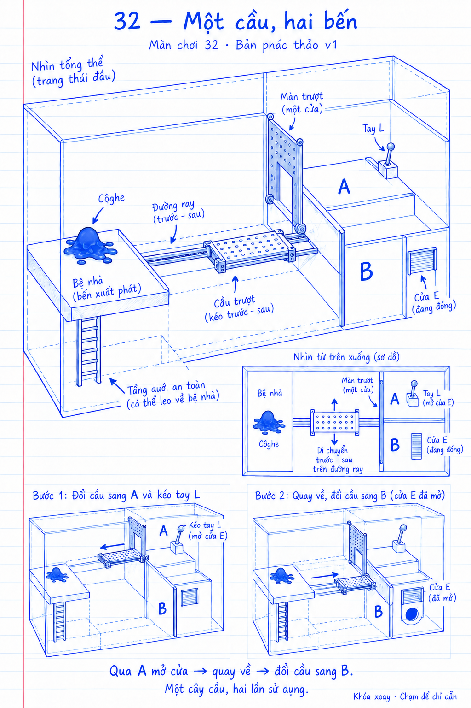
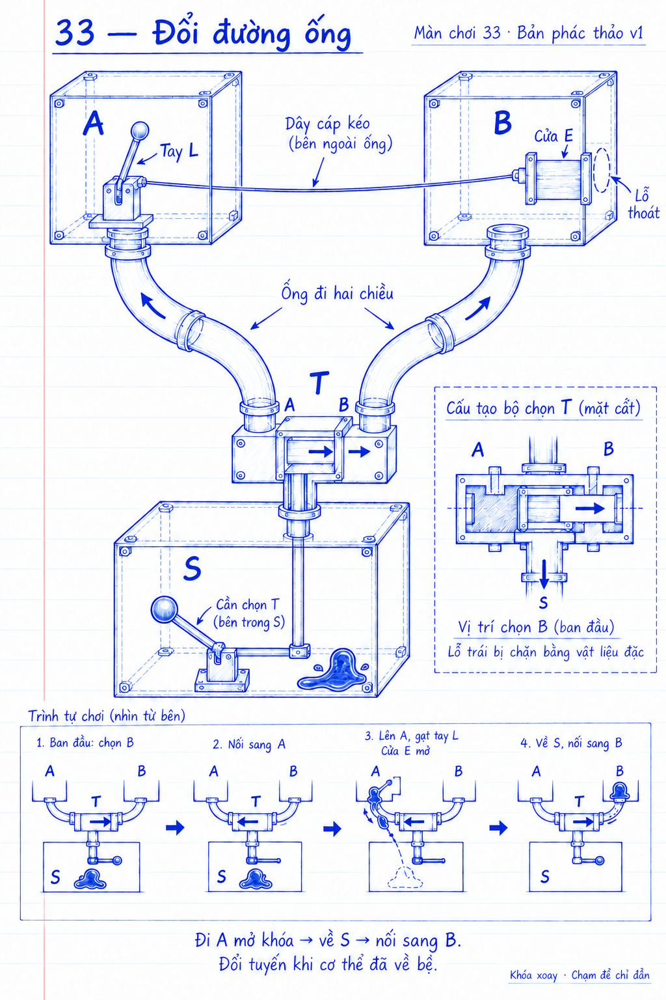
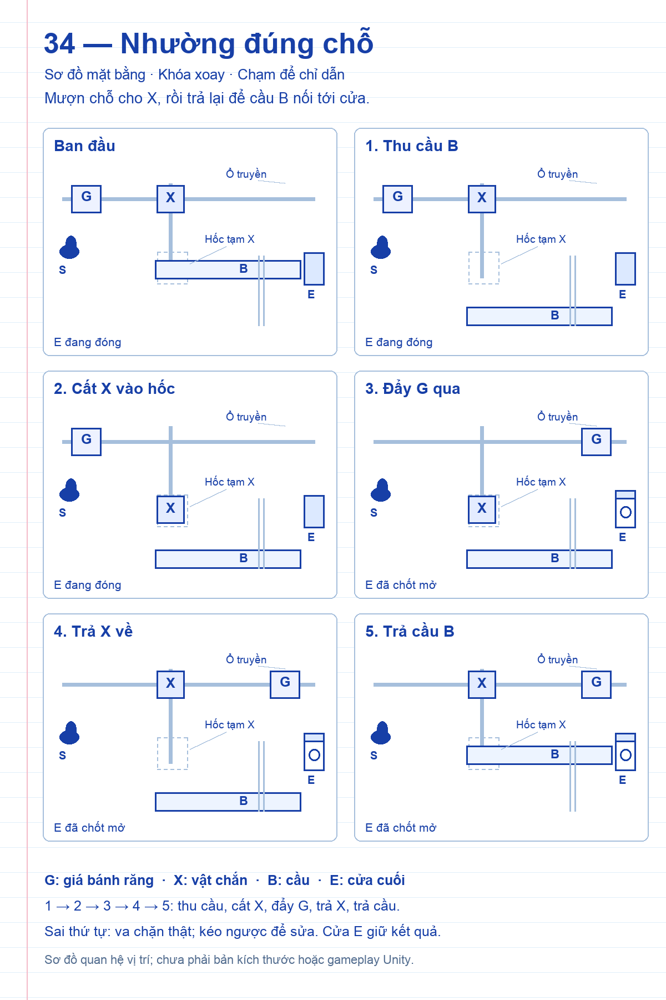
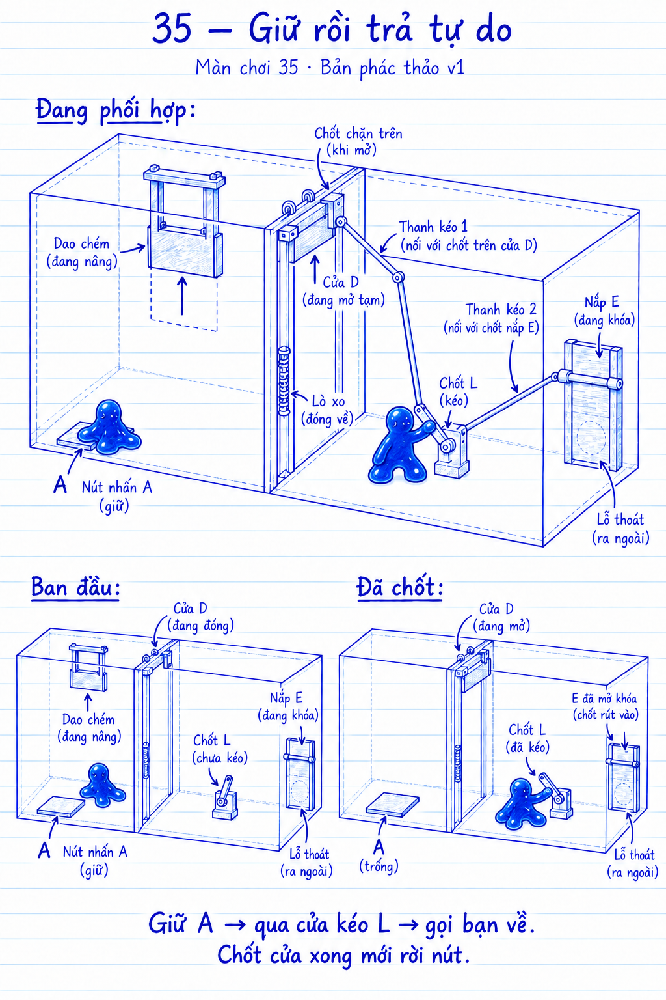
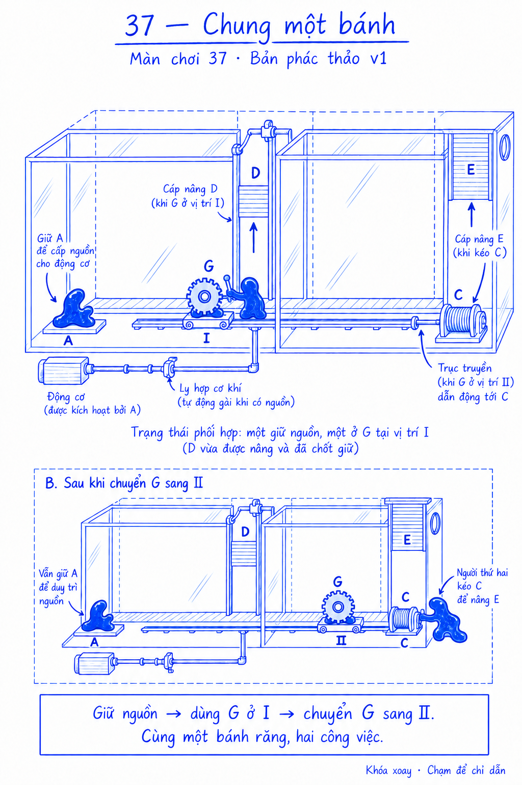
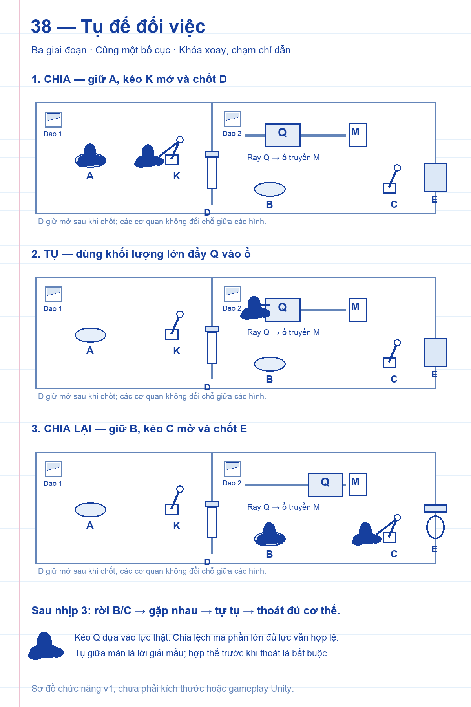
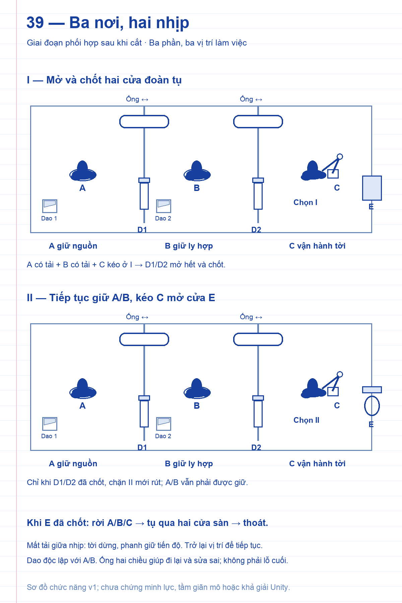

# COghe — Thiết kế minh họa màn chơi 31–40

21/09/2026 · Nháp v1 · Codex · Theo yêu cầu Mrk.

[Mở gallery ảnh và mô tả](review.html). Mỗi màn có một PNG gốc và hồ sơ theo template của repo. Đây là bộ thiết kế nối tiếp vị trí chơi 30 “Tam hợp”, không phải sắp lại các màn đã có.

Chủ đề chương: **dùng lại cơ quan, đổi thứ tự và đổi vai**. Màn 31 nghỉ nhịp sau Boss 30; từ đó tăng dần phạm vi phải dự tính. 31–34 một cơ thể, 35–37 hai vai trò, 38 đổi phân bổ mô, 39–40 ba vai trò. Số bước không phải một thang khó duy nhất: 35 ít bước hơn 34 nhưng thêm việc duy trì hai nhiệm vụ ở hai nơi. Mức khó/phút chỉ là dự đoán cần kiểm tra với người chơi.

| Màn | Thiết kế | Cụm quyết định / vai trò | Điểm tăng suy luận |
| --- | --- | --- | --- |
| 31 | [Lùi để tiến](../Level31/README.md) | 3 / 1 | Muốn tiến lên, trước hết phải kéo bộ phận đang che tay mở khóa lùi lại. |
| 32 | [Một cầu, hai bến](../Level32/README.md) | 3 / 1 | Một cây cầu phải được dùng hai lần; bến không có cửa thoát lại là nơi cần đến trước. |
| 33 | [Đổi đường ống](../Level33/README.md) | 4 / 1 | Phải đi nhánh phụ, quay lại rồi đổi tuyến; nhìn theo đường ống để suy ra quan hệ khóa–cửa. |
| 34 | [Nhường đúng chỗ](../Level34/README.md) | 5 / 1 | Một bộ phận hữu ích ở cuối màn lại đang chiếm chỗ cần dùng lúc đầu. |
| 35 | [Giữ rồi trả tự do](../Level35/README.md) | 4 / 2 | Giữ tạm một cửa để bạn qua, rồi người bên kia chốt cửa để giải phóng người đang giữ. |
| 36 | [Đổi ca](../Level36/README.md) | 5 / 2 | Người được giúp sang bên kia trở thành người giữ cơ quan cho bạn mình. |
| 37 | [Chung một bánh](../Level37/README.md) | 5 / 2 | Một người giữ nguồn; người kia tái sử dụng cùng bộ truyền ở hai trạm trước khi mở cửa. |
| 38 | [Tụ để đổi việc](../Level38/README.md) | 6 / 2 | Chia để mở đường, tụ để kéo tải, rồi chia lại để vận hành bộ máy vừa chuẩn bị. |
| 39 | [Ba nơi, hai nhịp](../Level39/README.md) | 6 / 3 | Ba vị trí cùng làm việc, nhưng người vận hành phải chọn đầu ra đúng thứ tự và biết khi nào cả nhóm được nghỉ. |
| 40 | [BOSS · Cỗ máy đoàn tụ](../Level40/README.md) | 8 / 3 | Chuẩn bị máy khi còn đủ lực, chia việc theo ba khoang, hoàn tất hai đầu ra rồi thu hồi cả cơ thể. |

## Hợp đồng chung cho chương

- **Đây là thiết kế minh họa v1, chưa dựng scene hoặc playtest Unity.** Các mốc phút, dung sai và độ khó là mục tiêu khảo sát.
- Màn chơi/ID mới đề xuất **31–40 nối sau campaign hiện tại**; giữ nguyên toàn bộ ID 01–30. Không nhầm content 30 cũ với Boss ở vị trí chơi 30.
- Tất cả khóa xoay, camera tổng quan 3/4 và nhìn gần theo phần chọn. Chạm cơ quan để tới bám, chạm vùng đích để đẩy/kéo; không kéo đồ vật từ xa. Chọn một phần tại một thời điểm, phần khác giữ việc đã giao.
- Cần lớn, một trục có chặn rõ. Mục tiêu vùng chạm ít nhất 48 điểm logic trên điện thoại; phải đo lại trên hai tỷ lệ 9:16 và màn dọc dài, safe area thật. Đường bám nằm cạnh ray, không treo cơ thể bằng lực vô hạn.
- Mỗi nhịp kéo mục tiêu hoàn tất trước timeout prop 3 giây (thử khoảng 2–2,5 giây gồm tăng tốc). Nếu chưa đạt, sửa tải/tỉ số/hành trình; không buộc spam chạm. Nút giữ không chịu timeout prop.
- Cơ quan chia hai loại đọc được bằng hình: **lò xo hồi** cần giữ liên tục; **ngàm chốt** giữ kết quả. Phanh giữ tải giữa hành trình được ghi riêng, không coi là đã hoàn tất. Mất nguồn phải ngừng truyền công.
- Dao báo 1 giây rồi cắt mô thật, không ép chia đều. Tự tụ khi đủ gần và không bị ngăn, kể cả giữ nút/khác đích; không cooldown. Không kiểm tra số phần chính xác để mở máy.
- Lối chuyển khoang là Transfer, đi hai chiều; lỗ cuối là FinalExit. **Hợp thể trong hộp trước lần ra đầu tiên; toàn bộ 32 hạt ra mới thắng.** Ra sớm khi còn phần khác: “bạn phải hợp thể trước khi chui ra”.
- Vách kín từ sàn tới trần và hai đầu, cửa/ống có lỗ thật. Nóc vẫn nhận đích chạm hợp lệ. Không cấm leo bằng luật ẩn; nếu tìm được đường tắt vật lý hợp lệ thì chấp nhận hoặc sửa hình học công khai.
- Rơi tới sàn an toàn có đường leo lại; không yêu cầu chạm giữa lúc rơi, căn răng, chia đúng tỷ lệ hoặc làm nhiều ngón đồng thời. Không Copy, buff Nhà, chỉ số nâng cấp, đồng hồ đếm ngược.
- Hình bút bi xanh là tài liệu tác giả; không phải ảnh gameplay. Các insets là thời điểm khác, không thêm bản thể. Nét đứt là vị trí sau/đường bị che, không phải lối đi xuyên vật.
- Khi dựng art dùng Day Lab: kính sạch, sứ ấm, cơ quan amber, ống cyan, vùng trơn lavender có vân, exit mint sát mặt; sinh vật đen bóng không mắt/miệng. Nhãn và chất liệu cùng diễn tả chức năng, không chỉ màu.
- Màn 40 không có lời giải, số bước hay mũi tên đáp án trong HUD. Phản hồi thao tác, nguồn/ly hợp/chốt và icon khóa xoay vẫn có. Không thêm phần thưởng vĩnh viễn chưa được yêu cầu.

## Căn cứ đã đọc

[Luật hiện hành](../../../COGHE_LEVEL_DESIGN_RULES.md) · [Campaign 30](../../../COGHE_CAMPAIGN_30_DESIGN.md) · [Kỹ năng](../../../VENOM_CREATURE_SKILLS.md) · [Giải đố thuần](../../../VENOM_PURE_PUZZLE_AND_HOME.md) · [Template](../LEVEL_TEMPLATE.md) · [Day Lab](../../../ArtDirection/COghe/STYLE_RULES.md) · [Bộ phác cũ](../Sketches21-30/README.md).

Luật hiện hành ưu tiên hơn các đoạn Journey cũ về cooldown/chặn tụ. GDD gốc `Docs/GDD_REFERENCE.md` là Steel Ball Lab, không áp rotation-only vào COghe. Nguồn đọc tại commit `5fb2609f0407e0871e5d973aa41a7b65af7f3b05`.

## 31 — Lùi để tiến

Muốn tiến lên, trước hết phải kéo bộ phận đang che tay mở khóa lùi lại.

1. Kéo G về chặn trái để lộ tay P.
2. Buông G, kéo P hết hành trình: chốt chặn ray rút và được giữ.
3. Đẩy G sang phải tới chặn ăn khớp; motor nâng E tới chốt mở. Buông và thoát.

**Nếu làm sai:** Đẩy trước chỉ chạm chặn. G luôn kéo ngược được; P đã rút không tự đóng. Ngắt truyền khi E đang nâng thì phanh giữ tải, gài lại tiếp tục.

[Hồ sơ đầy đủ](../Level31/README.md).

## 32 — Một cầu, hai bến

Một cây cầu phải được dùng hai lần; bến không có cửa thoát lại là nơi cần đến trước.

1. Đẩy cầu tới bến A, qua cầu và kéo L để mở/chốt E ở bến B.
2. Quay lại bệ trung tâm bằng chính cầu A; kéo cầu về bến B.
3. Qua cầu B, đi qua E đã mở và thoát.

**Nếu làm sai:** Chọn B trước thì trở về bệ rồi đổi A. Cầu không tự chạy; tay ở bệ khiến người chơi trở về trước khi chuyển. Rơi xuống có lối leo lại; L giữ kết quả.

[Hồ sơ đầy đủ](../Level32/README.md).

## 33 — Đổi đường ống

Phải đi nhánh phụ, quay lại rồi đổi tuyến; nhìn theo đường ống để suy ra quan hệ khóa–cửa.

1. Quan sát E còn khóa ở B; đổi T về A bằng một lệnh tới đầu ray.
2. Đi ống A, kéo L để mở/chốt E bên B.
3. Quay về S qua cùng ống A, đổi T về B.
4. Đi ống B tới E và thoát cả cơ thể.

**Nếu làm sai:** Đi B sớm có bệ quay đầu để trở về S. T không tự đổi, không có tay điều khiển từ các khoang xa. Kéo dở T về đầu ray cũ; không đóng cắt qua mô.

[Hồ sơ đầy đủ](../Level33/README.md).

## 34 — Nhường đúng chỗ

Một bộ phận hữu ích ở cuối màn lại đang chiếm chỗ cần dùng lúc đầu.

1. Thu cầu B về hốc trước để giải phóng hốc tạm X.
2. Kéo X ngang vào hốc vừa mở, dọn đường G.
3. Đẩy G qua giao điểm tới ổ cuối ray, mở/chốt E.
4. Kéo X về vị trí ban đầu, giờ nằm phía sau G; hốc của B trống lại.
5. Đưa cầu B trở lại bệ thoát, bò qua và ra E.

**Nếu làm sai:** Các vật captive trên ray nên không xoay kẹt góc. X phải rời hốc tạm trước khi B trở lại. G cuối hành trình nằm hoàn toàn qua giao điểm với ray X. Muốn rút G, thu B và đỗ X lần nữa; E vẫn chốt mở.

[Hồ sơ đầy đủ](../Level34/README.md).

## 35 — Giữ rồi trả tự do

Giữ tạm một cửa để bạn qua, rồi người bên kia chốt cửa để giải phóng người đang giữ.

1. Qua dao tách, cho một phần giữ A để D mở.
2. Đưa phần còn lại qua D rồi kéo L hết hành trình: D được chốt, E được mở khóa.
3. Gọi phần giữ A sang khoang phải để tự tụ.
4. Kéo nắp E sang hốc và đưa cả cơ thể ra ngoài.

**Nếu làm sai:** Nhả A sớm: phần ở phải ở yên trên bệ an toàn, phần trái trở lại A. Nếu D chưa mở đủ để cài L, mở lại rồi kéo. Tụ sớm thì về dao cắt lại. Chống kẹp không tự tạo tiến độ thắng.

[Hồ sơ đầy đủ](../Level35/README.md).

## 36 — Đổi ca

Người được giúp sang bên kia trở thành người giữ cơ quan cho bạn mình.

1. Tách; phần trái giữ A, phần phải qua D.
2. Phần phải kéo L, chốt D và lộ nút B.
3. Phần phải giữ B; phần trái rời A và đi tới C.
4. Kéo C khi B được giữ, mở/chốt E.
5. Rời B/C, tập hợp ở bên phải, hợp thể rồi thoát.

**Nếu làm sai:** Nhả A trước L thì mở lại như 35. Nhả B khi C đang chạy: phanh E giữ tiến độ, giữ B rồi tiếp tục. Quên rời A không mất tiến độ; không tự bỏ nhiệm vụ hộ người chơi.

[Hồ sơ đầy đủ](../Level36/README.md).

## 37 — Chung một bánh

Một người giữ nguồn; người kia tái sử dụng cùng bộ truyền ở hai trạm trước khi mở cửa.

1. Tách, một phần giữ A để đóng nguồn.
2. Phần làm việc đưa G tới I, chờ D mở đủ và chốt.
3. Cùng phần đó chuyển G tới II để nối nguồn sang tời C.
4. Đi tới C, kéo mở/chốt E trong khi A vẫn có tải.
5. Gọi phần A qua D, tụ lại rồi thoát.

**Nếu làm sai:** Đặt G ở I quá lâu không mất gì. Nhả A hoặc rút G: phanh giữ cửa đang nâng, không tự hoàn tất. G chuyển ngược được; A luôn tới được từ đường cũ sau D mở.

[Hồ sơ đầy đủ](../Level37/README.md).

## 38 — Tụ để đổi việc

Chia để mở đường, tụ để kéo tải, rồi chia lại để vận hành bộ máy vừa chuẩn bị.

1. Tách, một phần giữ A; phần kia kéo K mở/chốt D.
2. Rời A/K và tụ lại trong vùng rộng trước Q.
3. Dùng khối lượng lớn đẩy Q vào ổ, chốt giữ bộ truyền.
4. Qua dao 2 tách lại, phân một phần tới B.
5. Phần còn lại kéo C khi B giữ để mở/chốt E.
6. Gọi các phần về, tụ lại và thoát.

**Nếu làm sai:** Tách lại quá sớm thì tụ ngay tại bệ Q rồi kéo tiếp. Cắt lệch có thể tụ/cắt lại ở dao gần. Chấp nhận phần lớn đủ lực kéo Q trước khi tụ nếu chia lệch; không khóa Q bằng số phần.

[Hồ sơ đầy đủ](../Level38/README.md).

## 39 — Ba nơi, hai nhịp

Ba vị trí cùng làm việc, nhưng người vận hành phải chọn đầu ra đúng thứ tự và biết khi nào cả nhóm được nghỉ.

1. Cắt qua hai dao để bố trí ba phần ở ba khoang; không cần bằng nhau.
2. Giữ A và B bằng hai phần; phần thứ ba tới C.
3. Kéo C về I để nâng và chốt cả D1/D2.
4. Khi thanh chặn II đã rút, đưa C về II để mở/chốt E; A/B vẫn giữ.
5. Rời các vị trí, tụ qua đường sàn vừa mở.
6. Đưa toàn bộ cơ thể qua lỗ cuối.

**Nếu làm sai:** Nhả A/B/C trước cuối: tải được phanh, giữ lại tiến độ. I chưa xong thì II vướng chặn rõ. Tụ sớm qua ống thì chia lại tại hai dao, không mất trạng thái đã chốt.

[Hồ sơ đầy đủ](../Level39/README.md).

## 40 — BOSS · Cỗ máy đoàn tụ

Chuẩn bị máy khi còn đủ lực, chia việc theo ba khoang, hoàn tất hai đầu ra rồi thu hồi cả cơ thể.

1. Khi còn nguyên khối, kéo Q lùi để lộ P.
2. Kéo P rút chốt; đẩy Q tiến vào ổ truyền và chốt giữ.
3. Dùng hai dao, đưa các phần tới ba khoang bằng ống; giữ A và B.
4. Phần thứ ba kéo C về I, nâng/chốt D1 và D2.
5. Giữ A/B, đổi C sang II để rút và chốt khóa H.
6. Buông cơ quan; gọi phần ở A/B tới vùng tụ qua hai cửa sàn.
7. Tụ lại, kéo H sang hốc chứa để lộ lỗ cuối.
8. Dẫn toàn bộ bản thể qua lỗ; dùng ăn mừng hiện hành.

**Nếu làm sai:** Chia sớm khi Q chưa đặt: về qua ống, tụ lại kéo Q rồi cắt tiếp. Bỏ một nút thì tời dừng/phanh, không hủy chốt. Kéo H sớm gặp chốt thật. Mọi ống hai chiều, không nhốt mảnh. Tụ sớm được phép, dao vẫn tiếp cận được.

[Hồ sơ đầy đủ](../Level40/README.md).

## Rà chuỗi trạng thái trên giấy

`python3 logic_audit.py` tạo [logic-audit.json](logic-audit.json). Màn 34: 9 trạng thái trừu tượng, mọi trạng thái có đường giải không dùng Reset; lời giải ngắn nhất 5 hành động gồm trả X rồi trả B. Mô hình ba vị trí màn 39: 192 trạng thái với ba vai trò có đường hoàn tất rồi về R; hai vai trò có 16 trạng thái và không hoàn tất.

Mô hình giả định một phần chỉ ở một trạm tại một thời điểm, ống hai chiều luôn đi được và các chốt đúng đặc tả. Nó không mô phỏng lực, mô mềm, cắt, thời gian, camera hoặc input; không chứng minh khả giải Unity, không chứng minh một thân không kéo giãn tới nhiều trạm. Màn 40 dùng quan hệ này nhưng chưa được duyệt vét cạn toàn bộ.
