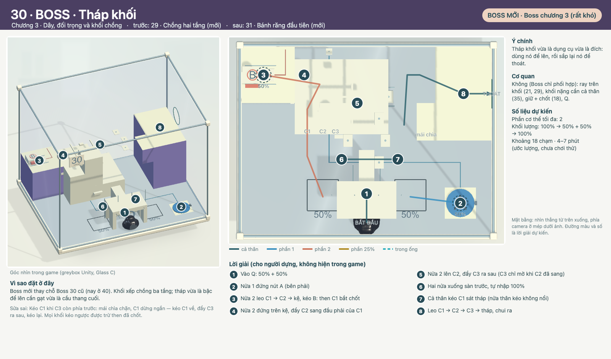

# COghe 30 — BOSS · Tháp khối

`coghe.spatial.plus.b1` · Theo [LEVEL_TEMPLATE](../../LEVEL_TEMPLATE.md). Nguồn: [quy tắc](../../../../COGHE_LEVEL_DESIGN_RULES.md), [style](../../../../ArtDirection/COghe/STYLE_RULES.md), [đề xuất 50 màn](../PLACEMENT.md), [cơ quan](../MECHANICS.md).

## 1. Định danh, phạm vi và trạng thái

- ID `coghe.spatial.plus.b1` · vị trí đề xuất **30/50** · chương 3 (Dây, đối trọng và khối chồng) · **Boss** · hồ sơ v0.1, 30/09/2026.
- Trạng thái: **Nháp — thiết kế + greybox minh hoạ**. Chưa có scene trong catalog/build, chưa chơi thử; mọi số liệu là ước lượng.
- Hình minh hoạ: greybox Unity dựng bằng `PlusDesign B1` trong [builder](../../../../../Assets/_Game/Editor/COgheSpatialPlusDesignLevels.cs) với cùng helper, kích thước và art Glass C của Spatial 11–30, chụp bằng `COgheSpatialPlusDesignRender` (góc camera trong game + mặt bằng). Đường màu và số là lời giải dự kiến, không phải hướng dẫn trong game.
- Được yêu cầu (Mrk, 29/09/2026): 18 màn dễ xen giữa 30 màn có sẵn để độ khó mượt hơn, 2 Boss rất khó bằng khối/bánh răng xếp nhiều lớp; có hình mô tả; đề xuất thứ tự tổng 50 màn.

| Mốc | Điều kiện chuyển bước | Trạng thái |
| --- | --- | --- |
| Thiết kế | Mục tiêu, bố cục, lời giải, phục hồi đủ rõ để dựng | Nháp, chờ Mrk duyệt |
| Prototype | Chơi trọn bằng chạm thật; các lỗi dự kiến có đường sửa | Chưa làm |
| Hoàn thiện | Cơ quan dùng chung, Glass C, camera, phản hồi | Chưa làm |
| Nghiệm thu | PlayMode + native, OPPO, người chơi mới | Chưa làm |

## 2. Mục tiêu trải nghiệm và vị trí trong tiến trình

**Tháp khối vừa là dụng cụ vừa là đích: dùng nó để lên, rồi sắp lại nó để thoát.**

- Vai trò: Boss chương 3 (rất khó). Trước: 29 · Chồng hai tầng (mới) · sau: 31 · Bánh răng đầu tiên (mới).
- Vì sao ở đây: Boss mới thay chỗ Boss 30 cũ (nay ở 40). Khối xếp chồng ba tầng; tháp vừa là bậc để lên cần gạt vừa là cầu thang cuối.
- Cơ quan: Không (Boss chỉ phối hợp): ray trên khối (21, 29), khối nặng cần cả thân (35), giữ + chốt (18), Q.
- Gợi ý: không có hướng dẫn lời giải (Boss). Giải đố thuần, không cần nâng chỉ số hay mua đồ.

## 3. Phác thảo, hình học, camera và thao tác

Tháp thoát 27 cm bên phải có mái chìa ở dải 18–27 cm phía trước. Xe C1 (9 cm, nặng: chỉ cả thân kéo nổi) chở C2 (9 cm, trượt ngang) chở C3 (9 cm, trượt trước–sau). Lúc đầu C2 sát kệ cần gạt 18 cm bên trái. Then C1 chỉ rút khi nút A có tải VÀ cần B đã kéo.

- Hộp cố định 0,8 × 0,6 m như Spatial 11–30; kéo đổi góc nhìn, pinch zoom; không nghiêng trọng lực. Camera đầu 3/4 như hình.
- Mặt ngà leo được, mặt tím trơn (bậc trơn ≤3,5 cm vượt được, ≥5 cm chặn); mint chỉ ở lỗ thoát. Mọi đường tắt phải bị chặn bằng hình học công khai (mặt trơn, khe), không bằng số màn.
- Chạm sàn/bệ → đi tới; chạm tay nắm/nút/vòng → tiếp cận và tác động; chạm Q → vào máy; chạm miệng ống → vào ống; chạm phần hoặc ô phần → đổi chọn.

## 4. Lời giải, kết thúc và phục hồi

| Bước | Lệnh / ý định | Trạng thái trước → sau | Tín hiệu thật | Bỏ dở / làm ngược |
| --- | --- | --- | --- | --- |
| 1 | Vào Q: 50% + 50% | Mốc 0 → mốc 1; cơ quan/tiếp xúc thật xác nhận | Vật thật đổi trạng thái (chốt, bậc, cửa, dây) | Đổi đích huỷ tiếp cận; cơ quan chưa chốt thì kéo ngược/làm lại được |
| 2 | Nửa 1 đứng nút A (bên phải) | Mốc 1 → mốc 2; cơ quan/tiếp xúc thật xác nhận | Vật thật đổi trạng thái (chốt, bậc, cửa, dây) | Đổi đích huỷ tiếp cận; cơ quan chưa chốt thì kéo ngược/làm lại được |
| 3 | Nửa 2 leo C1 → C2 → kệ, kéo B: then C1 bắt chốt | Mốc 2 → mốc 3; cơ quan/tiếp xúc thật xác nhận | Vật thật đổi trạng thái (chốt, bậc, cửa, dây) | Đổi đích huỷ tiếp cận; cơ quan chưa chốt thì kéo ngược/làm lại được |
| 4 | Nửa 2 đứng trên kệ, đẩy C2 sang đầu phải của C1 | Mốc 3 → mốc 4; cơ quan/tiếp xúc thật xác nhận | Vật thật đổi trạng thái (chốt, bậc, cửa, dây) | Đổi đích huỷ tiếp cận; cơ quan chưa chốt thì kéo ngược/làm lại được |
| 5 | Nửa 2 lên C2, đẩy C3 ra sau (C3 chỉ mở khi C2 đã sang) | Mốc 4 → mốc 5; cơ quan/tiếp xúc thật xác nhận | Vật thật đổi trạng thái (chốt, bậc, cửa, dây) | Đổi đích huỷ tiếp cận; cơ quan chưa chốt thì kéo ngược/làm lại được |
| 6 | Hai nửa xuống sàn trước, tự nhập 100% | Mốc 5 → mốc 6; cơ quan/tiếp xúc thật xác nhận | Vật thật đổi trạng thái (chốt, bậc, cửa, dây) | Đổi đích huỷ tiếp cận; cơ quan chưa chốt thì kéo ngược/làm lại được |
| 7 | Cả thân kéo C1 sát tháp (nửa thân kéo không nổi) | Mốc 6 → mốc 7; cơ quan/tiếp xúc thật xác nhận | Vật thật đổi trạng thái (chốt, bậc, cửa, dây) | Đổi đích huỷ tiếp cận; cơ quan chưa chốt thì kéo ngược/làm lại được |
| 8 | Leo C1 → C2 → C3 → tháp, chui ra | Mốc 7 → mốc 8; cơ quan/tiếp xúc thật xác nhận | Vật thật đổi trạng thái (chốt, bậc, cửa, dây) | Đổi đích huỷ tiếp cận; cơ quan chưa chốt thì kéo ngược/làm lại được |

- **Phục hồi riêng:** Kéo C1 khi C3 còn phía trước: mái chìa chặn, C1 dừng ngắn — kéo C1 về, đẩy C3 ra sau, kéo lại. Mọi khối kéo ngược được trừ then đã chốt.
- Dòng khối lượng: `100% → 50% + 50% → 100%`. Tách chỉ qua Q; đủ gần và không vật cản thì tự nhập, không cooldown.
- Thắng: toàn bộ mô nhập thành một cơ thể **trong hộp** rồi qua lỗ cuối; ra trước khi nhập hết thì thua đúng câu hiện hành. Retry trả mọi vật về đầu.

## 5. Cơ quan, trạng thái và kiến trúc dùng lại

| MechanismId | Loại | Hợp đồng | Reset |
| --- | --- | --- | --- |
| b1.1 | Ray trên xe hai tầng (có) | Xem [MECHANICS](../MECHANICS.md) | Reset pose, lực, chốt, tác vụ và người giữ |
| b1.2 | COgheLoadLatch AND + pawl (có) | Xem [MECHANICS](../MECHANICS.md) | Reset pose, lực, chốt, tác vụ và người giữ |
| b1.3 | Khối nặng + CompensateLoad (có) | Xem [MECHANICS](../MECHANICS.md) | Reset pose, lực, chốt, tác vụ và người giữ |
| b1.4 | COgheQuantumSplitter (có) | Xem [MECHANICS](../MECHANICS.md) | Reset pose, lực, chốt, tác vụ và người giữ |

Rủi ro cần prototype: Ba tầng ray lồng nhau cần prototype: khớp nối xe–xe, chỗ đứng khi đẩy C2/C3, lực kéo C1 có cả tháp.

## 6. Hình ảnh, animation và phản hồi

Glass C / mạch in / ray satin theo STYLE_RULES như Spatial 11–30: A xanh tròn, B san hô; tím = trơn; mint = lỗ cuối; bánh răng cố định màu nhựa hổ phách của bộ bánh răng cũ, bánh trên xe trượt màu ngà (cần art pass riêng cho bánh răng Glass C). Nhận ý định → tiếp cận → tác động → kết quả theo trạng thái thật.

## 7. Độ khó và ngân sách runtime

| Trục | Dự kiến | Thực đo |
| --- | --- | --- |
| Phần cơ thể tối đa | 2 | Chưa chơi thử |
| Số chạm lời giải mẫu | khoảng 18 | Chưa đo |
| Thời gian lần đầu | 4–7 phút | Chưa đo |
| Độ chính xác | Thấp: đích rộng, không canh thời điểm | Chưa đo |

Không gộp thành điểm khó tổng. So sánh vị trí dùng số chạm đo được của các màn cũ (xem [PLACEMENT](../PLACEMENT.md)).

## 8. Chơi thử và hồi quy

Chưa dựng. Khi dựng: đường giải chính bằng chạm thật (PlayMode + native Mac), các ca ở mục 4, Retry/pause, phần nhỏ/lớn, đường tắt qua kính/mặt trơn; người chơi mới chưa biết lời giải.

## 9. Bằng chứng hiệu năng trên thiết bị

Chưa có. Đo trên OPPO như PLAN của Spatial 11–30 khi có build.

## 10. Tích hợp, tương thích và nghiệm thu

- ID mới, không đụng save của 30 màn đã có; thứ tự hiển thị đổi theo [PLACEMENT](../PLACEMENT.md), ID màn cũ giữ nguyên.
- Kết luận: **đề xuất thiết kế**, chờ Mrk duyệt trước khi dựng.
