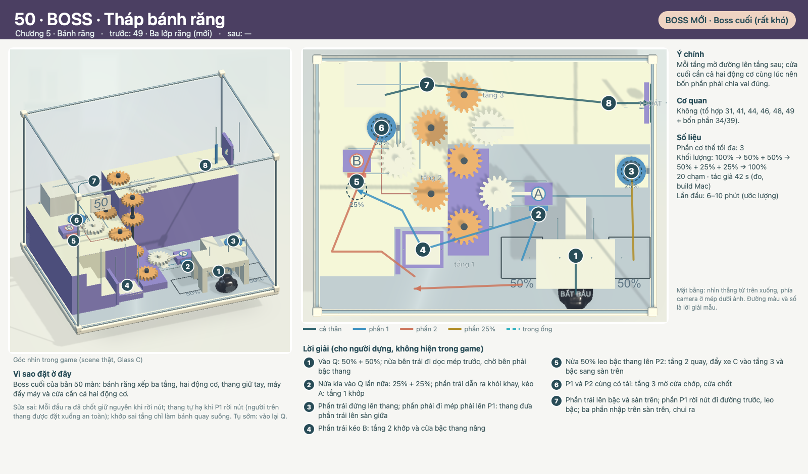

# COghe 50 — BOSS · Tháp bánh răng

`coghe.spatial.plus.b2` · Theo [LEVEL_TEMPLATE](../../LEVEL_TEMPLATE.md). Nguồn: [quy tắc](../../../../COGHE_LEVEL_DESIGN_RULES.md), [style](../../../../ArtDirection/COghe/STYLE_RULES.md), [đề xuất 50 màn](../PLACEMENT.md), [cơ quan](../MECHANICS.md).

## 1. Định danh, phạm vi và trạng thái

- ID `coghe.spatial.plus.b2` · vị trí đề xuất **50/50** · chương 5 (Bánh răng) · **Boss** · hồ sơ v0.1, 30/09/2026.
- Trạng thái: **Đã dựng — chơi được** (30/09/2026). Scene `COgheSpatialPlusB2.unity`, vị trí 50/50 trong catalog Spatial (save theo ID). Mục 4 là lời giải như đã dựng; thay đổi so với thiết kế ở cuối mục 1.
- Hình: chụp từ scene thật (dựng bằng `B2` trong [COgheSpatialPlusLevels.cs](../../../../../Assets/_Game/Editor/COgheSpatialPlusLevels.cs)) bằng `COgheSpatialPlusDesignRender` (góc camera trong game + mặt bằng). Đường màu và số là lời giải mẫu, không phải hướng dẫn trong game.
- Được yêu cầu (Mrk, 29/09/2026): 18 màn dễ xen giữa 30 màn có sẵn để độ khó mượt hơn, 2 Boss rất khó bằng khối/bánh răng xếp nhiều lớp; có hình mô tả; đề xuất thứ tự tổng 50 màn.

| Mốc | Điều kiện chuyển bước | Trạng thái |
| --- | --- | --- |
| Thiết kế | Mục tiêu, bố cục, lời giải, phục hồi đủ rõ để dựng | Mrk duyệt 30/09/2026 |
| Prototype | Chơi trọn bằng chạm thật; các lỗi dự kiến có đường sửa | Xong: lời giải chạm thật + test đi lang thang tìm chỗ kẹt |
| Hoàn thiện | Cơ quan dùng chung, Glass C, camera, phản hồi | Glass C/mạch in như 11–30; bánh răng dùng art bánh răng hiện có |
| Nghiệm thu | PlayMode + native, OPPO, người chơi mới | PlayMode + native Mac xong; OPPO và người chơi mới: chưa |

### Đã dựng: thay đổi so với thiết kế

- Bỏ cần L: sàn giữa không còn chỗ trống cho L (đặt ở đâu cũng chắn chỗ đứng của B, bậc hoặc vách). Kéo B vừa khớp tầng 2 vừa nâng cửa bậc thang qua thanh nối — còn 3 phần (50/25/25) thay vì 4.
- Thanh răng tầng 2 chạy về phía trước: chạy ra sau nó đâm vào đường của bậc.
- Thang giữ tay MotorSpeed 2,5; P1 sau Q bên phải, P2 trên sàn giữa.
- Lời giải mẫu: phần 25% trái dẫn ra khỏi khay Q trước khi kéo A (game đã nhắc “dẫn phần đó rời khay”); đi thẳng thì vướng vỏ Q.

## 2. Mục tiêu trải nghiệm và vị trí trong tiến trình

**Mỗi tầng mở đường lên tầng sau; cửa cuối cần cả hai động cơ cùng lúc nên bốn phần phải chia vai đúng.**

- Vai trò: Boss cuối (rất khó). Trước: 49 · Ba lớp răng (mới) · sau: —.
- Vì sao ở đây: Boss cuối của bản 50 màn: bánh răng xếp ba tầng, hai động cơ, thang giữ tay, máy đẩy máy và cửa cần cả hai động cơ.
- Cơ quan: Không (tổ hợp 31, 41, 44, 46, 48, 49 + bốn phần 34/39).
- Gợi ý: không có hướng dẫn lời giải (Boss). Giải đố thuần, không cần nâng chỉ số hay mua đồ.

## 3. Phác thảo, hình học, camera và thao tác

Tháp bánh răng trên một hàng trục: tầng 1 bàn sàn (xe A, động cơ P1 sau Q bên phải), tầng 2 trên sàn giữa 18 cm (xe B, động cơ P2), tầng 3 trên sàn trên 27 cm (xe C do tầng 2 đẩy vào). Thang giữ tay chỉ chạy khi P1 có tải. Kéo B vừa khớp tầng 2 vừa nâng cửa bậc thang qua thanh nối. Thanh răng tầng 2 đẩy xe C và bậc sang sàn trên. Cửa chớp lỗ thoát cần P1 và P2 cùng có tải, rồi chốt.

- Hộp cố định 0,8 × 0,6 m như Spatial 11–30; kéo đổi góc nhìn, pinch zoom; không nghiêng trọng lực. Camera đầu 3/4 như hình.
- Mặt ngà leo được, mặt tím trơn (bậc trơn ≤3,5 cm vượt được, ≥5 cm chặn); mint chỉ ở lỗ thoát. Mọi đường tắt phải bị chặn bằng hình học công khai (mặt trơn, khe), không bằng số màn.
- Chạm sàn/bệ → đi tới; chạm tay nắm/nút/vòng → tiếp cận và tác động; chạm Q → vào máy; chạm miệng ống → vào ống; chạm phần hoặc ô phần → đổi chọn.

## 4. Lời giải, kết thúc và phục hồi

| Bước | Lệnh / ý định | Trạng thái trước → sau | Tín hiệu thật | Bỏ dở / làm ngược |
| --- | --- | --- | --- | --- |
| 1 | Vào Q: 50% + 50%; nửa bên trái đi dọc mép trước, chờ bên phải bậc thang | Mốc 0 → mốc 1; cơ quan/tiếp xúc thật xác nhận | Vật thật đổi trạng thái (chốt, bậc, cửa, dây) | Đổi đích huỷ tiếp cận; cơ quan chưa chốt thì kéo ngược/làm lại được |
| 2 | Nửa kia vào Q lần nữa: 25% + 25%; phần trái dẫn ra khỏi khay, kéo A: tầng 1 khớp | Mốc 1 → mốc 2; cơ quan/tiếp xúc thật xác nhận | Vật thật đổi trạng thái (chốt, bậc, cửa, dây) | Đổi đích huỷ tiếp cận; cơ quan chưa chốt thì kéo ngược/làm lại được |
| 3 | Phần trái đứng lên thang; phần phải đi mép phải lên P1: thang đưa phần trái lên sàn giữa | Mốc 2 → mốc 3; cơ quan/tiếp xúc thật xác nhận | Vật thật đổi trạng thái (chốt, bậc, cửa, dây) | Đổi đích huỷ tiếp cận; cơ quan chưa chốt thì kéo ngược/làm lại được |
| 4 | Phần trái kéo B: tầng 2 khớp và cửa bậc thang nâng | Mốc 3 → mốc 4; cơ quan/tiếp xúc thật xác nhận | Vật thật đổi trạng thái (chốt, bậc, cửa, dây) | Đổi đích huỷ tiếp cận; cơ quan chưa chốt thì kéo ngược/làm lại được |
| 5 | Nửa 50% leo bậc thang lên P2: tầng 2 quay, đẩy xe C vào tầng 3 và bậc sang sàn trên | Mốc 4 → mốc 5; cơ quan/tiếp xúc thật xác nhận | Vật thật đổi trạng thái (chốt, bậc, cửa, dây) | Đổi đích huỷ tiếp cận; cơ quan chưa chốt thì kéo ngược/làm lại được |
| 6 | P1 và P2 cùng có tải: tầng 3 mở cửa chớp, cửa chốt | Mốc 5 → mốc 6; cơ quan/tiếp xúc thật xác nhận | Vật thật đổi trạng thái (chốt, bậc, cửa, dây) | Đổi đích huỷ tiếp cận; cơ quan chưa chốt thì kéo ngược/làm lại được |
| 7 | Phần trái lên bậc và sàn trên; phần P1 rời nút đi đường trước, leo bậc; ba phần nhập trên sàn trên, chui ra | Mốc 6 → mốc 7; cơ quan/tiếp xúc thật xác nhận | Vật thật đổi trạng thái (chốt, bậc, cửa, dây) | Đổi đích huỷ tiếp cận; cơ quan chưa chốt thì kéo ngược/làm lại được |

- **Phục hồi riêng:** Mỗi đầu ra đã chốt giữ nguyên khi rời nút; thang tự hạ khi P1 rời nút (người trên thang được đặt xuống an toàn); khớp sai tầng chỉ làm bánh quay suông. Tụ sớm: vào lại Q.
- Dòng khối lượng: `100% → 50% + 50% → 50% + 25% + 25% → 100%`. Tách chỉ qua Q; đủ gần và không vật cản thì tự nhập, không cooldown.
- Thắng: toàn bộ mô nhập thành một cơ thể **trong hộp** rồi qua lỗ cuối; ra trước khi nhập hết thì thua đúng câu hiện hành. Retry trả mọi vật về đầu.

## 5. Cơ quan, trạng thái và kiến trúc dùng lại

| MechanismId | Loại | Hợp đồng | Reset |
| --- | --- | --- | --- |
| b2.1 | COgheGearTrain ba chuỗi, trục nối tầng (ShaftLinks) | Xem [MECHANICS](../MECHANICS.md) | Reset pose, lực, chốt, tác vụ và người giữ |
| b2.2 | Đầu ra cần hai động cơ (COgheGearTrain.ExtraClutches) | Xem [MECHANICS](../MECHANICS.md) | Reset pose, lực, chốt, tác vụ và người giữ |
| b2.3 | Thang bánh răng giữ tay (như 46) | Xem [MECHANICS](../MECHANICS.md) | Reset pose, lực, chốt, tác vụ và người giữ |
| b2.4 | Thanh nối B → cửa bậc thang; thanh răng → xe C và bậc (COgheViewMechanism) | Xem [MECHANICS](../MECHANICS.md) | Reset pose, lực, chốt, tác vụ và người giữ |
| b2.5 | Q (có) | Xem [MECHANICS](../MECHANICS.md) | Reset pose, lực, chốt, tác vụ và người giữ |

Rủi ro cần prototype: Đầu ra hai động cơ là mở rộng nhỏ của GearTrain; bốn phần + nhiều bánh quay: đo hiệu năng OPPO sớm.

## 6. Hình ảnh, animation và phản hồi

Glass C / mạch in / ray satin theo STYLE_RULES như Spatial 11–30: A xanh tròn, B san hô; tím = trơn; mint = lỗ cuối; bánh răng cố định màu nhựa hổ phách của bộ bánh răng cũ, bánh trên xe trượt màu ngà (cần art pass riêng cho bánh răng Glass C). Nhận ý định → tiếp cận → tác động → kết quả theo trạng thái thật.

## 7. Độ khó và ngân sách runtime

| Trục | Dự kiến | Thực đo |
| --- | --- | --- |
| Phần cơ thể tối đa | 3 | 3 (lời giải mẫu) |
| Số chạm lời giải mẫu | khoảng 26 | 20 (native Mac, tác giả) |
| Thời gian lần đầu | 6–10 phút | Tác giả 42 s; người mới: chưa đo |
| Độ chính xác | Thấp: đích rộng, không canh thời điểm | Không cần canh thời điểm |

Không gộp thành điểm khó tổng. So sánh vị trí dùng số chạm đo được của các màn cũ (xem [PLACEMENT](../PLACEMENT.md)).

## 8. Chơi thử và hồi quy

- `SpatialPlusB2Solve`: lời giải mẫu bằng chạm thật từ đầu tới lỗ thoát, rồi Retry về đầu (PlayMode, 120 Hz).
- `SpatialPlusB2Wander`: đi lang thang — chạm mọi góc và giữa mọi mặt cố định đi được (sàn, bệ, sàn cao), rồi về điểm xuất phát; kẹt ở đâu là trượt tại đó. Sau đó Retry và giải trọn.
- `SpatialPlusB2RetryPartway`: Retry giữa chừng (đã tách, đã kéo A): về một thân, mọi cơ quan về đầu, rồi giải trọn.
- Native Mac (build 50 màn, chạy theo thứ tự catalog): qua, 20 chạm, 42 s, p95 16.7 ms.
- Bằng chứng: [báo cáo kiểm thử Spatial Plus](../../../../Verification/COgheSpatialPlus/README.md).

## 9. Bằng chứng hiệu năng trên thiết bị

Mac (M4, author replay): p95 16.7 ms/khung. OPPO: chưa đo — đo như PLAN của Spatial 11–30.

## 10. Tích hợp, tương thích và nghiệm thu

- ID mới, không đụng save của 30 màn đã có; thứ tự hiển thị đổi theo [PLACEMENT](../PLACEMENT.md), ID màn cũ giữ nguyên.
- Kết luận: **đã dựng và kiểm thử tự động**; chờ Mrk chơi thử, đo OPPO và người chơi mới.
