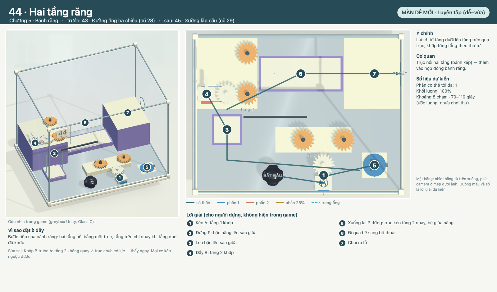

# COghe 44 — Hai tầng răng

`coghe.spatial.plus.e14` · Theo [LEVEL_TEMPLATE](../../LEVEL_TEMPLATE.md). Nguồn: [quy tắc](../../../../COGHE_LEVEL_DESIGN_RULES.md), [style](../../../../ArtDirection/COghe/STYLE_RULES.md), [đề xuất 50 màn](../PLACEMENT.md), [cơ quan](../MECHANICS.md).

## 1. Định danh, phạm vi và trạng thái

- ID `coghe.spatial.plus.e14` · vị trí đề xuất **44/50** · chương 5 (Bánh răng) · màn dễ mới · hồ sơ v0.1, 30/09/2026.
- Trạng thái: **Nháp — thiết kế + greybox minh hoạ**. Chưa có scene trong catalog/build, chưa chơi thử; mọi số liệu là ước lượng.
- Hình minh hoạ: greybox Unity dựng bằng `PlusDesign E14` trong [builder](../../../../../Assets/_Game/Editor/COgheSpatialPlusDesignLevels.cs) với cùng helper, kích thước và art Glass C của Spatial 11–30, chụp bằng `COgheSpatialPlusDesignRender` (góc camera trong game + mặt bằng). Đường màu và số là lời giải dự kiến, không phải hướng dẫn trong game.
- Được yêu cầu (Mrk, 29/09/2026): 18 màn dễ xen giữa 30 màn có sẵn để độ khó mượt hơn, 2 Boss rất khó bằng khối/bánh răng xếp nhiều lớp; có hình mô tả; đề xuất thứ tự tổng 50 màn.

| Mốc | Điều kiện chuyển bước | Trạng thái |
| --- | --- | --- |
| Thiết kế | Mục tiêu, bố cục, lời giải, phục hồi đủ rõ để dựng | Nháp, chờ Mrk duyệt |
| Prototype | Chơi trọn bằng chạm thật; các lỗi dự kiến có đường sửa | Chưa làm |
| Hoàn thiện | Cơ quan dùng chung, Glass C, camera, phản hồi | Chưa làm |
| Nghiệm thu | PlayMode + native, OPPO, người chơi mới | Chưa làm |

## 2. Mục tiêu trải nghiệm và vị trí trong tiến trình

**Lực đi từ tầng dưới lên tầng trên qua trục; khớp từng tầng theo thứ tự.**

- Vai trò: Luyện tập (dễ–vừa). Trước: 43 · Đường ống ba chiều (cũ 28) · sau: 45 · Xưởng lắp cầu (cũ 29).
- Vì sao ở đây: Bước tiếp của bánh răng: hai tầng nối bằng một trục, tầng trên chỉ quay khi tầng dưới đã khớp.
- Cơ quan: Trục nối hai tầng (bánh kép) — thêm vào hợp đồng bánh răng.
- Gợi ý: gợi ý thao tác cho hành động mới rồi giảm dần; không gợi ý lời giải. Giải đố thuần, không cần nâng chỉ số hay mua đồ.

## 3. Phác thảo, hình học, camera và thao tác

Bàn răng sàn trước (tầng 1) với xe A; sàn giữa 18 cm bên trái có bánh tầng 2 và xe B; trục đứng nối hai tầng. Tầng 1 nâng bậc lên sàn giữa, tầng 2 nâng bệ ra bờ thoát.

- Hộp cố định 0,8 × 0,6 m như Spatial 11–30; kéo đổi góc nhìn, pinch zoom; không nghiêng trọng lực. Camera đầu 3/4 như hình.
- Mặt ngà leo được, mặt tím trơn (bậc trơn ≤3,5 cm vượt được, ≥5 cm chặn); mint chỉ ở lỗ thoát. Mọi đường tắt phải bị chặn bằng hình học công khai (mặt trơn, khe), không bằng số màn.
- Chạm sàn/bệ → đi tới; chạm tay nắm/nút/vòng → tiếp cận và tác động; chạm Q → vào máy; chạm miệng ống → vào ống; chạm phần hoặc ô phần → đổi chọn.

## 4. Lời giải, kết thúc và phục hồi

| Bước | Lệnh / ý định | Trạng thái trước → sau | Tín hiệu thật | Bỏ dở / làm ngược |
| --- | --- | --- | --- | --- |
| 1 | Kéo A: tầng 1 khớp | Mốc 0 → mốc 1; cơ quan/tiếp xúc thật xác nhận | Vật thật đổi trạng thái (chốt, bậc, cửa, dây) | Đổi đích huỷ tiếp cận; cơ quan chưa chốt thì kéo ngược/làm lại được |
| 2 | Đứng P: bậc nâng lên sàn giữa | Mốc 1 → mốc 2; cơ quan/tiếp xúc thật xác nhận | Vật thật đổi trạng thái (chốt, bậc, cửa, dây) | Đổi đích huỷ tiếp cận; cơ quan chưa chốt thì kéo ngược/làm lại được |
| 3 | Leo bậc lên sàn giữa | Mốc 2 → mốc 3; cơ quan/tiếp xúc thật xác nhận | Vật thật đổi trạng thái (chốt, bậc, cửa, dây) | Đổi đích huỷ tiếp cận; cơ quan chưa chốt thì kéo ngược/làm lại được |
| 4 | Đẩy B: tầng 2 khớp | Mốc 3 → mốc 4; cơ quan/tiếp xúc thật xác nhận | Vật thật đổi trạng thái (chốt, bậc, cửa, dây) | Đổi đích huỷ tiếp cận; cơ quan chưa chốt thì kéo ngược/làm lại được |
| 5 | Xuống lại P đứng: trục kéo tầng 2 quay, bệ giữa nâng | Mốc 4 → mốc 5; cơ quan/tiếp xúc thật xác nhận | Vật thật đổi trạng thái (chốt, bậc, cửa, dây) | Đổi đích huỷ tiếp cận; cơ quan chưa chốt thì kéo ngược/làm lại được |
| 6 | Đi qua bệ sang bờ thoát | Mốc 5 → mốc 6; cơ quan/tiếp xúc thật xác nhận | Vật thật đổi trạng thái (chốt, bậc, cửa, dây) | Đổi đích huỷ tiếp cận; cơ quan chưa chốt thì kéo ngược/làm lại được |
| 7 | Chui ra lỗ | Mốc 6 → mốc 7; cơ quan/tiếp xúc thật xác nhận | Vật thật đổi trạng thái (chốt, bậc, cửa, dây) | Đổi đích huỷ tiếp cận; cơ quan chưa chốt thì kéo ngược/làm lại được |

- **Phục hồi riêng:** Khớp B trước A: tầng 2 không quay vì trục chưa có lực — thấy ngay. Mọi xe kéo ngược được.
- Dòng khối lượng: `100%`. Tách chỉ qua Q; đủ gần và không vật cản thì tự nhập, không cooldown.
- Thắng: toàn bộ mô nhập thành một cơ thể **trong hộp** rồi qua lỗ cuối; ra trước khi nhập hết thì thua đúng câu hiện hành. Retry trả mọi vật về đầu.

## 5. Cơ quan, trạng thái và kiến trúc dùng lại

| MechanismId | Loại | Hợp đồng | Reset |
| --- | --- | --- | --- |
| e14.1 | COgheGearTrain nhiều bánh + trục (có runtime chuỗi bánh) | Xem [MECHANICS](../MECHANICS.md) | Reset pose, lực, chốt, tác vụ và người giữ |

Rủi ro cần prototype: Hiển thị trục nối rõ ràng; một người phải đi lại nút P hai lần (chủ ý dễ).

## 6. Hình ảnh, animation và phản hồi

Glass C / mạch in / ray satin theo STYLE_RULES như Spatial 11–30: A xanh tròn, B san hô; tím = trơn; mint = lỗ cuối; bánh răng cố định màu nhựa hổ phách của bộ bánh răng cũ, bánh trên xe trượt màu ngà (cần art pass riêng cho bánh răng Glass C). Nhận ý định → tiếp cận → tác động → kết quả theo trạng thái thật.

## 7. Độ khó và ngân sách runtime

| Trục | Dự kiến | Thực đo |
| --- | --- | --- |
| Phần cơ thể tối đa | 1 | Chưa chơi thử |
| Số chạm lời giải mẫu | khoảng 8 | Chưa đo |
| Thời gian lần đầu | 70–110 giây | Chưa đo |
| Độ chính xác | Thấp: đích rộng, không canh thời điểm | Chưa đo |

Không gộp thành điểm khó tổng. So sánh vị trí dùng số chạm đo được của các màn cũ (xem [PLACEMENT](../PLACEMENT.md)).

## 8. Chơi thử và hồi quy

Chưa dựng. Khi dựng: đường giải chính bằng chạm thật (PlayMode + native Mac), các ca ở mục 4, Retry/pause, phần nhỏ/lớn, đường tắt qua kính/mặt trơn; người chơi mới chưa biết lời giải.

## 9. Bằng chứng hiệu năng trên thiết bị

Chưa có. Đo trên OPPO như PLAN của Spatial 11–30 khi có build.

## 10. Tích hợp, tương thích và nghiệm thu

- ID mới, không đụng save của 30 màn đã có; thứ tự hiển thị đổi theo [PLACEMENT](../PLACEMENT.md), ID màn cũ giữ nguyên.
- Kết luận: **đề xuất thiết kế**, chờ Mrk duyệt trước khi dựng.
