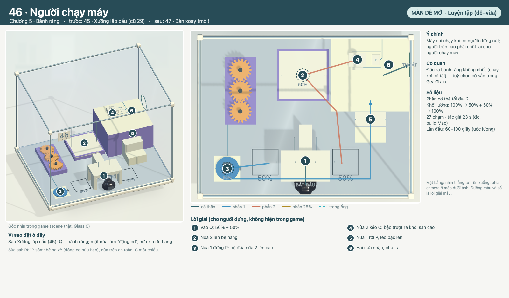

# COghe 46 — Người chạy máy

`coghe.spatial.plus.e15` · Theo [LEVEL_TEMPLATE](../../LEVEL_TEMPLATE.md). Nguồn: [quy tắc](../../../../COGHE_LEVEL_DESIGN_RULES.md), [style](../../../../ArtDirection/COghe/STYLE_RULES.md), [đề xuất 50 màn](../PLACEMENT.md), [cơ quan](../MECHANICS.md).

## 1. Định danh, phạm vi và trạng thái

- ID `coghe.spatial.plus.e15` · vị trí đề xuất **46/50** · chương 5 (Bánh răng) · màn dễ mới · hồ sơ v0.1, 30/09/2026.
- Trạng thái: **Đã dựng — chơi được** (30/09/2026). Scene `COgheSpatialPlusE15.unity`, vị trí 46/50 trong catalog Spatial (save theo ID). Mục 4 là lời giải như đã dựng; thay đổi so với thiết kế ở cuối mục 1.
- Hình: chụp từ scene thật (dựng bằng `E15` trong [COgheSpatialPlusLevels.cs](../../../../../Assets/_Game/Editor/COgheSpatialPlusLevels.cs)) bằng `COgheSpatialPlusDesignRender` (góc camera trong game + mặt bằng). Đường màu và số là lời giải mẫu, không phải hướng dẫn trong game.
- Được yêu cầu (Mrk, 29/09/2026): 18 màn dễ xen giữa 30 màn có sẵn để độ khó mượt hơn, 2 Boss rất khó bằng khối/bánh răng xếp nhiều lớp; có hình mô tả; đề xuất thứ tự tổng 50 màn.

| Mốc | Điều kiện chuyển bước | Trạng thái |
| --- | --- | --- |
| Thiết kế | Mục tiêu, bố cục, lời giải, phục hồi đủ rõ để dựng | Mrk duyệt 30/09/2026 |
| Prototype | Chơi trọn bằng chạm thật; các lỗi dự kiến có đường sửa | Xong: lời giải chạm thật + test đi lang thang tìm chỗ kẹt |
| Hoàn thiện | Cơ quan dùng chung, Glass C, camera, phản hồi | Glass C/mạch in như 11–30; bánh răng dùng art bánh răng hiện có |
| Nghiệm thu | PlayMode + native, OPPO, người chơi mới | PlayMode + native Mac xong; OPPO và người chơi mới: chưa |

### Đã dựng: thay đổi so với thiết kế

- Thang bánh răng MotorSpeed 3 (lực kẹt ≈ 1 N) để nâng nửa thân.
- Bậc C cách bậc dưới và sàn cao 2 mm: sát cả hai mặt, bậc bị kẹp dừng giữa chừng.

## 2. Mục tiêu trải nghiệm và vị trí trong tiến trình

**Máy chỉ chạy khi có người đứng nút; người trên cao phải chốt lại cho người chạy máy.**

- Vai trò: Luyện tập (dễ–vừa). Trước: 45 · Xưởng lắp cầu (cũ 29) · sau: 47 · Bàn xoay (mới).
- Vì sao ở đây: Sau Xưởng lắp cầu (45): Q + bánh răng; một nửa làm “động cơ”, nửa kia đi thang.
- Cơ quan: Đầu ra bánh răng không chốt (chạy khi có tải) — tuỳ chọn có sẵn trong GearTrain.
- Gợi ý: gợi ý thao tác cho hành động mới rồi giảm dần; không gợi ý lời giải. Giải đố thuần, không cần nâng chỉ số hay mua đồ.

## 3. Phác thảo, hình học, camera và thao tác

Q giữa trước; bàn răng trái với nút P; bệ nâng bánh răng giữa; sàn cao 24 cm phải với cần C, cần C kéo bậc ra.

- Hộp cố định 0,8 × 0,6 m như Spatial 11–30; kéo đổi góc nhìn, pinch zoom; không nghiêng trọng lực. Camera đầu 3/4 như hình.
- Mặt ngà leo được, mặt tím trơn (bậc trơn ≤3,5 cm vượt được, ≥5 cm chặn); mint chỉ ở lỗ thoát. Mọi đường tắt phải bị chặn bằng hình học công khai (mặt trơn, khe), không bằng số màn.
- Chạm sàn/bệ → đi tới; chạm tay nắm/nút/vòng → tiếp cận và tác động; chạm Q → vào máy; chạm miệng ống → vào ống; chạm phần hoặc ô phần → đổi chọn.

## 4. Lời giải, kết thúc và phục hồi

| Bước | Lệnh / ý định | Trạng thái trước → sau | Tín hiệu thật | Bỏ dở / làm ngược |
| --- | --- | --- | --- | --- |
| 1 | Vào Q: 50% + 50% | Mốc 0 → mốc 1; cơ quan/tiếp xúc thật xác nhận | Vật thật đổi trạng thái (chốt, bậc, cửa, dây) | Đổi đích huỷ tiếp cận; cơ quan chưa chốt thì kéo ngược/làm lại được |
| 2 | Nửa 2 lên bệ nâng | Mốc 1 → mốc 2; cơ quan/tiếp xúc thật xác nhận | Vật thật đổi trạng thái (chốt, bậc, cửa, dây) | Đổi đích huỷ tiếp cận; cơ quan chưa chốt thì kéo ngược/làm lại được |
| 3 | Nửa 1 đứng P: bệ đưa nửa 2 lên cao | Mốc 2 → mốc 3; cơ quan/tiếp xúc thật xác nhận | Vật thật đổi trạng thái (chốt, bậc, cửa, dây) | Đổi đích huỷ tiếp cận; cơ quan chưa chốt thì kéo ngược/làm lại được |
| 4 | Nửa 2 kéo C: bậc trượt ra khỏi sàn cao | Mốc 3 → mốc 4; cơ quan/tiếp xúc thật xác nhận | Vật thật đổi trạng thái (chốt, bậc, cửa, dây) | Đổi đích huỷ tiếp cận; cơ quan chưa chốt thì kéo ngược/làm lại được |
| 5 | Nửa 1 rời P, leo bậc lên | Mốc 4 → mốc 5; cơ quan/tiếp xúc thật xác nhận | Vật thật đổi trạng thái (chốt, bậc, cửa, dây) | Đổi đích huỷ tiếp cận; cơ quan chưa chốt thì kéo ngược/làm lại được |
| 6 | Hai nửa nhập, chui ra | Mốc 5 → mốc 6; cơ quan/tiếp xúc thật xác nhận | Vật thật đổi trạng thái (chốt, bậc, cửa, dây) | Đổi đích huỷ tiếp cận; cơ quan chưa chốt thì kéo ngược/làm lại được |

- **Phục hồi riêng:** Rời P sớm: bệ hạ về (động cơ hữu hạn), nửa trên an toàn. C một chiều.
- Dòng khối lượng: `100% → 50% + 50% → 100%`. Tách chỉ qua Q; đủ gần và không vật cản thì tự nhập, không cooldown.
- Thắng: toàn bộ mô nhập thành một cơ thể **trong hộp** rồi qua lỗ cuối; ra trước khi nhập hết thì thua đúng câu hiện hành. Retry trả mọi vật về đầu.

## 5. Cơ quan, trạng thái và kiến trúc dùng lại

| MechanismId | Loại | Hợp đồng | Reset |
| --- | --- | --- | --- |
| e15.1 | COgheGearTrain ReturnWhenDisconnected (có) | Xem [MECHANICS](../MECHANICS.md) | Reset pose, lực, chốt, tác vụ và người giữ |
| e15.2 | Q (có) | Xem [MECHANICS](../MECHANICS.md) | Reset pose, lực, chốt, tác vụ và người giữ |
| e15.3 | Tay C + bậc (có) | Xem [MECHANICS](../MECHANICS.md) | Reset pose, lực, chốt, tác vụ và người giữ |

Rủi ro cần prototype: Bệ hạ khi có người đứng dưới: dùng TissueClearance như cửa.

## 6. Hình ảnh, animation và phản hồi

Glass C / mạch in / ray satin theo STYLE_RULES như Spatial 11–30: A xanh tròn, B san hô; tím = trơn; mint = lỗ cuối; bánh răng cố định màu nhựa hổ phách của bộ bánh răng cũ, bánh trên xe trượt màu ngà (cần art pass riêng cho bánh răng Glass C). Nhận ý định → tiếp cận → tác động → kết quả theo trạng thái thật.

## 7. Độ khó và ngân sách runtime

| Trục | Dự kiến | Thực đo |
| --- | --- | --- |
| Phần cơ thể tối đa | 2 | 2 (lời giải mẫu) |
| Số chạm lời giải mẫu | khoảng 7 | 27 (native Mac, tác giả) |
| Thời gian lần đầu | 60–100 giây | Tác giả 23 s; người mới: chưa đo |
| Độ chính xác | Thấp: đích rộng, không canh thời điểm | Không cần canh thời điểm |

Không gộp thành điểm khó tổng. So sánh vị trí dùng số chạm đo được của các màn cũ (xem [PLACEMENT](../PLACEMENT.md)).

## 8. Chơi thử và hồi quy

- `SpatialPlusE15Solve`: lời giải mẫu bằng chạm thật từ đầu tới lỗ thoát, rồi Retry về đầu (PlayMode, 120 Hz).
- `SpatialPlusE15Wander`: đi lang thang — chạm mọi góc và giữa mọi mặt cố định đi được (sàn, bệ, sàn cao), rồi về điểm xuất phát; kẹt ở đâu là trượt tại đó. Sau đó Retry và giải trọn.
- `SpatialPlusE15DriverLeavesMidRide`: người chạy máy rời P giữa chừng: thang đặt người đi thang xuống an toàn; quay lại P thì thang lên tiếp.
- Native Mac (build 50 màn, chạy theo thứ tự catalog): qua, 27 chạm, 23 s, p95 16.7 ms.
- Bằng chứng: [báo cáo kiểm thử Spatial Plus](../../../../Verification/COgheSpatialPlus/README.md).

## 9. Bằng chứng hiệu năng trên thiết bị

Mac (M4, author replay): p95 16.7 ms/khung. OPPO: chưa đo — đo như PLAN của Spatial 11–30.

## 10. Tích hợp, tương thích và nghiệm thu

- ID mới, không đụng save của 30 màn đã có; thứ tự hiển thị đổi theo [PLACEMENT](../PLACEMENT.md), ID màn cũ giữ nguyên.
- Kết luận: **đã dựng và kiểm thử tự động**; chờ Mrk chơi thử, đo OPPO và người chơi mới.
