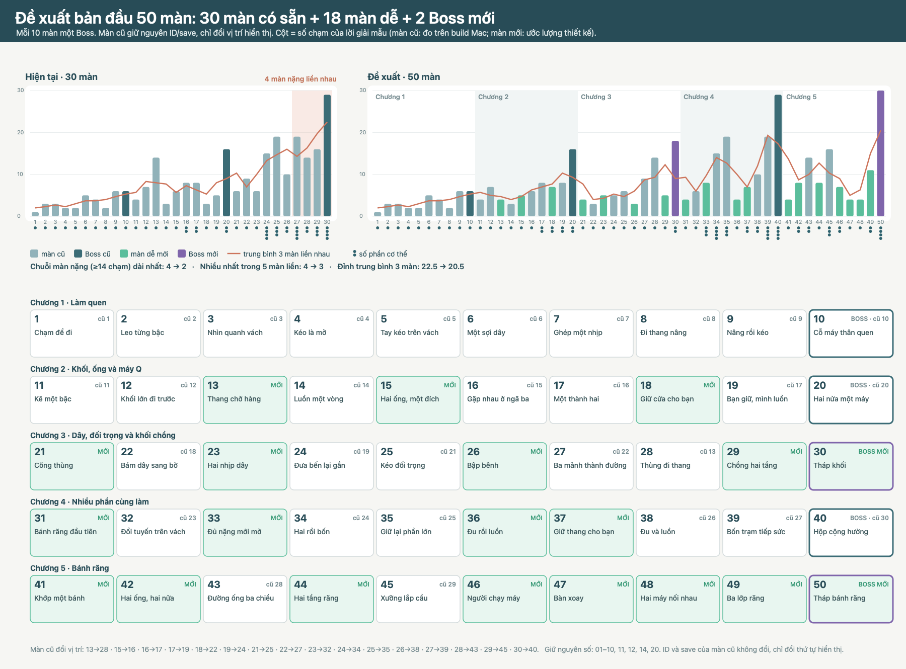

# Đề xuất thứ tự 50 màn (bản đầu)

30/09/2026 · **Đề xuất, chờ Mrk duyệt.** 30 màn đã dựng (Pilot 01–10, Spatial 11–30) + 18 màn dễ mới + 2 Boss mới. Mỗi 10 màn một Boss (luật thiết kế mục 1.8). Màn cũ **giữ nguyên ID và save**, chỉ đổi vị trí hiển thị trong catalog.

## Vì sao độ khó đang “sốc” và cách sửa

Số chạm của lời giải mẫu (đo trên build Mac, bản đang có) cho thấy hai vấn đề:

1. **Đoạn 24–30 dồn màn nặng:** 24 (15 chạm, bốn phần), 25 (19), 27 (19), 28 (14), 29 (16), 30 (29) — bốn màn ≥14 chạm liền nhau (27–30), ba cơ chế nhiều phần nối tiếp.
2. **Ba hệ cơ quan mới trong năm màn:** ống (14), Q (16), đu dây (18) rồi Boss 20 phối hợp ngay.

Cách sửa: sau mỗi cơ quan mới có một màn dễ tập riêng ý đó; trước mỗi màn nặng có một màn “mở khoá” ý khó nhất của nó với ít bước hơn; sau mỗi Boss là màn nghỉ. Hai Boss mới đứng ở 30 và 50 và chỉ phối hợp kỹ năng đã dạy (khối chồng dạy ở 21, 29; bánh răng dạy ở 31, 41–49).

| Chỉ số (số chạm lời giải mẫu) | 30 màn hiện tại | 50 màn đề xuất |
| --- | --- | --- |
| Chuỗi màn nặng (≥14 chạm) dài nhất | 4 | 2 |
| Nhiều màn nặng nhất trong 5 màn liền | 4 | 3 |
| Đỉnh trung bình 3 màn liền nhau | 22,5 | 20,5 |

Số chạm là chỉ báo thô (có cả thao tác chọn phần và chạm lại), không phải điểm khó; số của màn mới là ước lượng thiết kế. Cần chơi thử người mới để chốt.

Màn cũ đổi vị trí: 15→16, 16→17, 17→19, 18→22, 19→24, 21→25, 22→27, 13→28, 23→32, 24→34, 25→35, 26→38, 27→39, 30→40, 28→43, 29→45. Giữ nguyên số: 01–10, 11, 12, 14, 20.

## Thứ tự

### Chương 1 · Làm quen

| Vị trí | Màn | Nguồn | Vai trò / ý chính | Phần | Chạm |
| --- | --- | --- | --- | --- | --- |
| 1 | Chạm để đi | cũ 01 | bò trên sàn tới lỗ | 1 | 1 |
| 2 | Leo từng bậc | cũ 02 | leo khối cố định | 1 | 3 |
| 3 | Nhìn quanh vách | cũ 03 | xoay camera đọc đường | 1 | 3 |
| 4 | Kéo là mở | cũ 04 | kéo tay A trên sàn | 1 | 2 |
| 5 | Tay kéo trên vách | cũ 05 | leo lên thao tác trên vách | 1 | 2 |
| 6 | Một sợi dây | cũ 06 | ròng rọc nâng nhịp | 1 | 5 |
| 7 | Ghép một nhịp | cũ 07 | đưa khối cầu vào chỗ trống | 1 | 4 |
| 8 | Đi thang nâng | cũ 08 | đứng khay rồi gọi nâng | 1 | 2 |
| 9 | Nâng rồi kéo | cũ 09 | ròng rọc + cần trên cao | 1 | 6 |
| 10 | BOSS · Cỗ máy thân quen | cũ 10 | phối hợp cơ quan đã học | 1 | 6 |

### Chương 2 · Khối, ống và máy Q

| Vị trí | Màn | Nguồn | Vai trò / ý chính | Phần | Chạm |
| --- | --- | --- | --- | --- | --- |
| 11 | Kê một bậc | cũ 11 | thùng thành bậc | 1 | 4 |
| 12 | Khối lớn đi trước | cũ 12 | đổi thứ tự hai khối | 1 | 7 |
| 13 | [**Thang chở hàng**](LevelE01/README.md) | **mới** | Luyện tập (dễ) | 1 | ~4 |
| 14 | Luồn một vòng | cũ 14 | giới thiệu ống | 1 | 3 |
| 15 | [**Hai ống, một đích**](LevelE02/README.md) | **mới** | Luyện tập (dễ) | 1 | ~5 |
| 16 | Gặp nhau ở ngã ba | cũ 15 (từ 15) | nhánh cơ quan trước nhánh thoát | 1 | 6 |
| 17 | Một thành hai | cũ 16 (từ 16) | giới thiệu Q, hai nút | 2 | 8 |
| 18 | [**Giữ cửa cho bạn**](LevelE03/README.md) | **mới** | Luyện tập (dễ) | 2 | ~7 |
| 19 | Bạn giữ, mình luồn | cũ 17 (từ 17) | giữ nắp + luồn ống + chốt | 2 | 8 |
| 20 | BOSS · Hai nửa một máy | cũ 20 | Q + ống + kê + tời | 2 | 16 |

### Chương 3 · Dây, đối trọng và khối chồng

| Vị trí | Màn | Nguồn | Vai trò / ý chính | Phần | Chạm |
| --- | --- | --- | --- | --- | --- |
| 21 | [**Cõng thùng**](LevelE04/README.md) | **mới** | Nghỉ nhịp sau Boss (dễ) | 1 | ~4 |
| 22 | Bám dây sang bờ | cũ 18 (từ 18) | giới thiệu đu dây | 1 | 3 |
| 23 | [**Hai nhịp dây**](LevelE05/README.md) | **mới** | Luyện tập (dễ) | 1 | ~5 |
| 24 | Đưa bến lại gần | cũ 19 (từ 19) | đưa khay vào cung đu | 1 | 5 |
| 25 | Kéo đối trọng | cũ 21 (từ 21) | thùng làm đối trọng nâng ván | 1 | 6 |
| 26 | [**Bập bênh**](LevelE06/README.md) | **mới** | Giới thiệu cơ quan mới (dễ) | 1 | ~3 |
| 27 | Ba mảnh thành đường | cũ 22 (từ 22) | thứ tự ba mảnh | 1 | 9 |
| 28 | Thùng đi thang | cũ 13 (từ 13) | chở thùng lên rồi làm bậc | 1 | 14 |
| 29 | [**Chồng hai tầng**](LevelE07/README.md) | **mới** | Chuẩn bị Boss (dễ) | 1 | ~5 |
| 30 | [**BOSS · Tháp khối**](LevelB1/README.md) | **mới** | Boss chương 3 (rất khó) | 2 | ~18 |

### Chương 4 · Nhiều phần cùng làm

| Vị trí | Màn | Nguồn | Vai trò / ý chính | Phần | Chạm |
| --- | --- | --- | --- | --- | --- |
| 31 | [**Bánh răng đầu tiên**](LevelE08/README.md) | **mới** | Nghỉ nhịp + giới thiệu (dễ) | 1 | ~4 |
| 32 | Đổi tuyến trên vách | cũ 23 (từ 23) | đổi van ống trên cao | 1 | 6 |
| 33 | [**Đủ nặng mới mở**](LevelE09/README.md) | **mới** | Luyện tập (dễ–vừa) | 3 | ~8 |
| 34 | Hai rồi bốn | cũ 24 (từ 24) | tách lặp, bốn nút | 4 | 15 |
| 35 | Giữ lại phần lớn | cũ 25 (từ 25) | 50% đẩy, hai 25% giữ khóa | 3 | 19 |
| 36 | [**Đu rồi luồn**](LevelE10/README.md) | **mới** | Luyện tập (dễ) | 1 | ~4 |
| 37 | [**Giữ thang cho bạn**](LevelE11/README.md) | **mới** | Luyện tập (dễ–vừa) | 2 | ~7 |
| 38 | Đu và luồn | cũ 26 (từ 26) | nửa đi ống mở bến cho nửa đu | 2 | 10 |
| 39 | Bốn trạm tiếp sức | cũ 27 (từ 27) | bốn vai, thang cần giữ | 4 | 19 |
| 40 | BOSS · Hộp cộng hưởng | cũ 30 (từ 30) | ba khoang, bốn phần | 4 | 29 |

### Chương 5 · Bánh răng

| Vị trí | Màn | Nguồn | Vai trò / ý chính | Phần | Chạm |
| --- | --- | --- | --- | --- | --- |
| 41 | [**Khớp một bánh**](LevelE12/README.md) | **mới** | Nghỉ nhịp + luyện (dễ) | 1 | ~4 |
| 42 | [**Hai ống, hai nửa**](LevelE13/README.md) | **mới** | Luyện tập (dễ) | 2 | ~8 |
| 43 | Đường ống ba chiều | cũ 28 (từ 28) | mạng ống ba tầng | 2 | 14 |
| 44 | [**Hai tầng răng**](LevelE14/README.md) | **mới** | Luyện tập (dễ–vừa) | 1 | ~8 |
| 45 | Xưởng lắp cầu | cũ 29 (từ 29) | ráp hai mảnh vào khung rồi nâng | 3 | 16 |
| 46 | [**Người chạy máy**](LevelE15/README.md) | **mới** | Luyện tập (dễ–vừa) | 2 | ~7 |
| 47 | [**Bàn xoay**](LevelE16/README.md) | **mới** | Giới thiệu biến thể mới (dễ) | 1 | ~4 |
| 48 | [**Hai máy nối nhau**](LevelE17/README.md) | **mới** | Luyện tập (dễ) | 1 | ~4 |
| 49 | [**Ba lớp răng**](LevelE18/README.md) | **mới** | Chuẩn bị Boss (vừa) | 2 | ~11 |
| 50 | [**BOSS · Tháp bánh răng**](LevelB2/README.md) | **mới** | Boss cuối (rất khó) | 4 | ~30 |

## Ghi chú

- **Chương 5 nhẹ hơn chương 4 ở các màn thường** vì dạy hệ bánh răng mới (bảy màn dễ nối nhau thành chuỗi học); độ khó dồn vào Boss 50. Nếu muốn chương 5 nặng hơn, có thể đổi chỗ 45 (Xưởng lắp cầu) với 49, hoặc kéo 39 (Bốn trạm) sang chương 5.
- Boss 30 cũ (Hộp cộng hưởng) chuyển xuống 40 vì Boss 30 mới cần ít phần hơn (hai phần) nhưng nhiều bước suy luận hơn; Boss 50 là khó nhất (bốn phần, ba tầng bánh răng).
- Màn cũ 13 (Thùng đi thang) chuyển xuống 28: màn 13 mới (Thang chở hàng) dạy trước ý chính của nó, và nó làm bài chuẩn bị cho Boss khối 30.
- Đổi thứ tự 24 ↔ 25 cũ (nay 34, 35): bốn phần trên bốn nút (đơn giản) trước, phân vai theo khối lượng sau; màn 33 mới dạy tách hai lượt trước cả hai.
