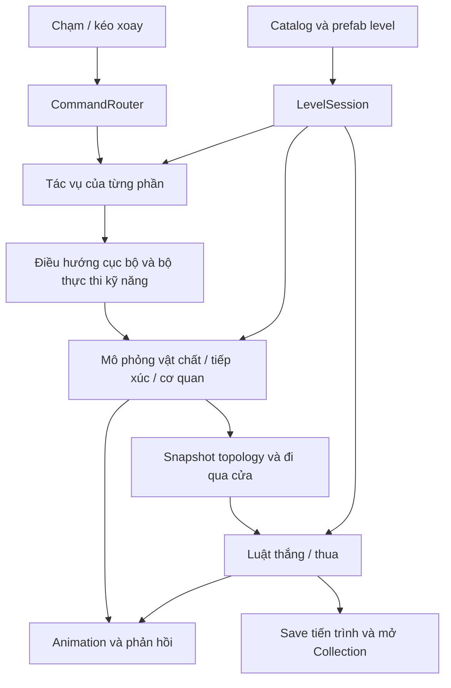

# Venom — Kiến trúc level và kế hoạch xây dựng chương 01–10

Ngày 15/09/2026. Đây là **kiến trúc đề xuất để triển khai** từ [thiết kế đã đối chiếu](VENOM_CAMPAIGN_01_10.md), không phải báo cáo code đã hoàn thành. Runtime và macOS vẫn là năm Journey cũ. Quyết định của người dùng có ưu tiên: thuần puzzle; cắt mới tách; gần nhau tự tụ; hợp thể trước khi thoát; Boss 10 không hướng dẫn và mở Collection “Nhà của sinh vật”.

## 1. Mục tiêu và ranh giới

Một bộ mô phỏng sinh vật, một hệ điều khiển chạm và một bộ cơ quan dùng được cho nhiều hình hộp. Tác giả dựng geometry, đặt vật liệu/cơ quan, nối điều kiện, rồi chơi kiểm chứng. Số thứ tự chỉ dùng hiển thị và tiến trình, không quyết định lực, cửa, AI hoặc luật thắng.

Không xây hệ phân điểm, mô hình học máy, backend, cửa hàng thật hoặc copy vật thể trong đợt mười màn này. Kiến thức kỹ năng là sự kiện đã trải nghiệm, không phải điều kiện ngăn người chơi thử dao lần đầu ở Boss. Trí thông minh thực hiện tác vụ được giao, không tìm lời giải campaign thay người chơi.

Tách hai sản phẩm của thiết kế: (1) dữ liệu gameplay có thể dựng, chơi và đo; (2) đường giải mẫu và tiêu chí QA chỉ có trong Editor/tests. Runtime không đọc đường giải mẫu.

## 2. Đối chiếu code đang có

| Nền hiện tại | Có thể giữ | Phần phải thay hoặc mở rộng |
| --- | --- | --- |
| [CohesiveOrganism](../Assets/_Game/Venom/Runtime/CohesiveOrganism.cs) | 32 hạt có Rigidbody, khối lượng, liên kết, cắt/tụ và ID hạt | Tách số phần vật chất toàn cục khỏi số phần còn trong hộp; kiểm tra topology khi thoát. Biến dạng qua ống không được gây phân tách gameplay ngoài dao |
| [VenomLevelController](../Assets/_Game/Venom/Runtime/VenomLevelController.cs) | Các kiểm tra đi xuyên miệng lỗ, hỗ trợ thoát có va chạm, reset | Hiện `EvaluateEscape` tích lũy hạt thoát và thắng khi đủ 32, có gom mô ngoài hộp. Tách luật kết thúc, detector cửa và assist; bỏ thành công do các phần ra lần lượt |
| [VenomJourney](../Assets/_Game/Venom/Runtime/VenomJourney.cs) | Lệnh trên anchor vật chất, giữ nhiệm vụ, A/B, chốt cửa, chu trình dao | Bỏ nhánh `Chapter`, mảng tên/hint 1–5 và `GuideAllOut` giao Exit cho mọi phần. Đổi thành tác vụ/cơ quan cấu hình được |
| [VenomWallClimb](../Assets/_Game/Venom/Runtime/VenomWallClimb.cs), [VenomSurfaceRoute](../Assets/_Game/Venom/Runtime/VenomSurfaceRoute.cs) | Lực trong hệ quy chiếu bề mặt, chuyển mép, phản ứng tiếp xúc | Hiện giới hạn sáu mặt và kích thước hộp cố định; cần mặt vật cản, mặt cong, mặt đồ vật động và vùng vật liệu |
| [VenomJourneyRoute](../Assets/_Game/Venom/Runtime/VenomJourneyRoute.cs) | Tránh cơ quan chưa được giao, tái lập route khi geometry đổi | Hiện là đồ thị trên sàn với Rect, chưa đủ để giải leo vách thấp hoặc cú rơi bắt vành |
| [VenomSqueeze](../Assets/_Game/Venom/Runtime/VenomSqueeze.cs) | Dò khe và hướng dẫn các hạt luồn với va chạm | Chưa là hệ ống nối hai khoang; cần thể tích ống, trạng thái chuyển khoang và bảo toàn cơ thể liền mạch |
| [VenomJourneyProgress](../Assets/_Game/Venom/Runtime/VenomJourneyProgress.cs) | Ý nghĩa kiến thức sống qua retry | `Completed & 31` và 5 bit cũ không biểu diễn catalog mới; cần ID ổn định, phiên bản save, quyền Collection |
| [VenomJourneyBuilder](../Assets/_Game/Editor/VenomJourneyBuilder.cs) | Dựng geometry trong Editor, asset có thể chỉnh | Builder hiện lặp 1–5 và sao scene; cần catalog/prefab authoring, build list và validation từ cùng nguồn |
| [VenomSurface](../Assets/_Game/Venom/Runtime/VenomSurface.cs), [VenomCelebration](../Assets/_Game/Venom/Runtime/VenomCelebration.cs) | Skin mềm, xúc tu, ba điệu vui, focus sau thắng | Skin dựng lại trong LateUpdate cần đo khi thân trải dài qua ống; ăn mừng chỉ nhận kết quả Won hợp lệ |

Không sửa tất cả cùng lúc. Giữ source Journey và bằng chứng hồi quy để so sánh, chuyển từng trách nhiệm vào hệ mới rồi gỡ logic trùng. Các giới hạn mobile bên dưới là mục tiêu đo, chưa có bằng chứng thiết bị cho mười màn mới.

## 3. Dữ liệu và authoring

Đề xuất lưu `CampaignCatalog` và `LevelDefinition` bằng asset cấu hình; geometry/cơ quan là prefab có component authoring, bake dữ liệu trong Editor. Dùng một scene chạy campaign chung, tải prefab level theo catalog. Scene thí nghiệm cũ tiếp tục mở riêng để hồi quy, không sao chép mười bộ runtime.

| Dữ liệu | Nội dung bắt buộc |
| --- | --- |
| `CampaignCatalog` | ID campaign, danh sách LevelId theo thứ tự, RuleSetId chung, phiên bản nội dung |
| `LevelDefinition` | ID ổn định, tên hiển thị, prefab, camera ban đầu, cho/khóa xoay, presentation policy, năng lực được thử và mục tiêu học, mở khóa khi thắng |
| `SurfaceDefinition` | Collider/miền bề mặt, vật liệu tiếp xúc, vùng bám, quy tắc chọn bề mặt, điểm/đường nối tới mặt khác |
| `MechanismDefinition` | ID cơ quan, prefab, điểm tác động, giới hạn lực/hành trình, cổng tín hiệu và liên kết giữa chúng |
| `PortalDefinition` | ID, geometry lòng ống/cửa, khoang đầu/cuối, loại `Transfer` hoặc `FinalExit`, điều kiện cửa thông |
| `CreatureProfile` | Khối lượng/mật độ, mức lực chủ động, độ bám, vật liệu mô và giới hạn biến dạng dùng chung |
| `LevelVerification` | Đường giải mẫu, điều kiện hình học, trường hợp thua/khôi phục, ngân sách trình bày; chỉ Editor/test |

Đề xuất ID: `venom.origin.01`…`venom.origin.10`, giữ nguyên khi sắp xếp lại. Ví dụ cấu hình minh họa, chưa phải asset đã sinh:

```text
venom.origin.07: Rotation=Locked, Prop=PushPull, ReleaseAfterNoInput=3s
venom.origin.08: Rotation=Locked, SlipPatch + CatchRing + TransferTube + FinalExit
venom.origin.10: Presentation=BossDiscovery, Hints=None,
                 Mechanisms=Cutter + A + B + LatchedExit,
                 FirstWinUnlock=collection.creature_home
CampaignRuleSet: RequireUnifiedFinalExit (không tùy chọn tắt theo từng màn)
```

Luật hợp thể áp dụng chung cho Venom khi tích hợp. Chỉ fixture lịch sử có thể giữ policy cũ được ghi tên rõ; không để người xây level mới vô tình chọn luật cũ. Legacy lab có topology đặc biệt phải được kiểm tra khả giải trước khi phát hành với luật mới.

## 4. Luồng chạy và các lớp trách nhiệm



`LevelSession` sở hữu vòng đời, đồng hồ gameplay, các registry và bus sự kiện của đúng màn. Thứ tự một bước mô phỏng phải tường minh: ý định/lực → vật lý và contact → cắt/tụ/topology → kiểm tra đi qua cửa/kết thúc → phát sự kiện và biểu diễn. Nếu dùng FixedUpdate tự động, cần gom dữ liệu của cùng physics tick và đánh giá sau bước physics tương ứng; không dựa vào thứ tự ngẫu nhiên của các MonoBehaviour.

Retry hủy lệnh, bộ đếm 3 giây, lực/ràng buộc bám đồ vật, cờ vào lỗ, kết quả thua, cơ quan và VFX đang chờ. Trả vật thể/root về cấu hình đầu rồi khởi tạo lại contact; không còn callback màn trước. Kiến thức và quyền sở hữu đã lưu giữ nguyên.

## 5. Chạm, điều hướng và vật liệu

`CommandRouter` phân biệt chạm và kéo; thao tác xoay không phát thêm lệnh đi khi nhả. Khi 07–08 khóa xoay, kéo không được âm thầm trở thành joystick. Mỗi điểm chỉ lưu SurfaceId/PropId và tọa độ cục bộ để vẫn bám theo đúng vật khi nó dịch chuyển. Điều hướng dùng normal và vận tốc điểm tiếp xúc thực thay vì giả định mặt luôn đứng yên.

Chọn mặt dùng một query chung, dấu chỉ xuất hiện trên mặt nhận lệnh thật; không ưu tiên chọn lỗ phía sau xuyên qua mặt trước. Geometry dùng cho chạm được khai báo rõ và debug được; cửa thật vẫn rỗng, có proxy chọn đích không va chạm. Đầu việc đầu tiên về camera/input là kiểm chứng cả 01–02 chạm sàn/tường và 03 chạm mặt trước che lỗ sau. Cần preset nhìn và cách hiển thị mặt cho kết quả nhất quán; không chữa riêng bằng `if LevelNumber == 3`. Đây là rủi ro tương tác cần chơi trực quan trước khi nhân bản các màn.

Điều hướng dùng đồ thị các miền bề mặt và liên kết hình học, bake topology tĩnh; đồ vật động chỉ cập nhật vùng lân cận khi đổi vị trí đủ mức. Có các đoạn bò, chuyển mép, leo và luồn. Trượt/rơi là trạng thái mô phỏng do tiếp xúc, không phải đường bay do planner điều khiển. Hệ có thể thực hiện một chuyển tiếp được giao, nhưng không tự tìm điểm rơi, bố trí hộp làm bậc hoặc quyết định phân vai để giải cả puzzle.

Vật liệu có hai trách nhiệm riêng: ma sát va chạm và khả năng sinh vật chủ động bám/phát lực. `Slippery` dùng cùng profile trong 04–08: không tạo bám chủ động hay lực bò tiếp tuyến trên chính vùng đó; vẫn giữ trọng lực/va chạm. Tính theo từng vùng mô tiếp xúc, để một phần thân trên kính còn bám trong lúc phần khác đã trượt. Không đảo cả cơ thể thành rơi chỉ vì một đỉnh mesh chạm biên texture. Skin không quyết định lực.

Không đổi gravity theo local trục hộp. Lực bám cần phản lực tại vật đỡ; với hộp nhựa/nắp rời thì tác động ngược lên Rigidbody của vật. Mặt cầu lấy normal tiếp xúc thực, không quy về một trong sáu hướng. Trượt mặt đáy vẫn có tiếp xúc nâng đỡ nhưng không có lực bò bí mật.

## 6. Đẩy/kéo, rơi bắt vành và chui ống

### Đẩy/kéo cùng một tác vụ

`PropManipulationTask`: Approach → Attach → MoveProp → Release → Idle. Điểm chạm mới trong lúc bám đổi đích **của đồ vật**, không đổi thành lệnh bò bỏ đồ. Chọn phía tì/kéo từ các vùng còn tiếp cận được; đổi hướng có thể tái bám một mặt phù hợp. Lực tối đa dựa trên khối lượng phần đang điều khiển và sức bám thực, lực/phản lực có điểm tác dụng. Hộp kẹt thì dừng dịch chuyển, sinh vật thể hiện đang tì; không xuyên kính hoặc teleport vật.

Thời hạn 3 giây không nhận điều khiển mới áp dụng từ lúc đã bám, theo đồng hồ gameplay, tạm dừng khi pause. Hết hạn hủy đích, nhả ràng buộc và về Idle kể cả đang đẩy; UI/animation buông phải khớp thời điểm lực ngừng. Không áp dụng timeout này cho lệnh giữ A/B. Điểm chạm không tới được phải có phản hồi và không tạo lực xuyên vật cản. Cần kiểm tra sát cả một mặt kính lẫn góc hai mặt kính: vẫn còn mặt bám và chỗ lùi để kéo ra.

### Cú rơi ở 08

Người chơi chọn điểm tiếp cận vùng trơn trên nóc. Khi rời vùng bám, controller ngừng lực treo/lái trên không; giữ vận tốc thực và gravity. Ring chỉ bắt khi collider mô tiếp xúc đúng vật liệu có bám, với lực bám hữu hạn. Không hút qua khe hở. Nếu rơi hụt, sàn và đường leo lại là cách thử lại tự nhiên.

Vị trí vùng trơn, hình học mép nóc, offset vào thành, vận tốc lúc rời và bề rộng ring phải cho **một dải quỹ đạo** bắt được vành. Không chỉ đặt vành nhìn thẳng hàng trên ảnh phối cảnh rồi coi là khả giải. Kiểm chứng bằng lực/tiếp xúc từ lệnh chơi; không đặt thẳng vị trí/vận tốc lúc bắt để làm test pass.

### Ống chuyển khoang

`TubeTraversalTask` chỉ bắt đầu sau khi tiếp cận/bám miệng hợp lệ và có ý định qua ống. Profile biến dạng giữ lượng mô, cho phép thu tiết diện và kéo dài có giới hạn; tất cả hạt đi qua lòng ống với collider. Không disable vách ống, không xóa hạt phía đầu rồi sinh lại đầu kia. Đổi hướng hoặc hủy phải có trạng thái dừng/rút phù hợp vị trí thực, retry luôn giải phóng lực.

Mục tiêu biểu diễn là một dòng liên tục: đầu dò vào → thân kéo dài chảy qua → đuôi rút khỏi miệng → co lại ở khoang kia. Tách phần vật lý khỏi việc dựng skin dạng dòng; skin phải theo vật chất và không che việc hạt kẹt. Nếu độ phân giải 32 hạt không đủ cho hình học/chiều dài ống, điều chỉnh geometry hoặc phát triển solver có kiểm chứng, không tuyên bố chỉ thêm animation là đủ. Thiết kế hiện chỉ yêu cầu toàn bộ cơ thể đi qua, không đặt ngưỡng khối lượng phải cắt ở màn 08.

## 7. Luật thoát là một giao dịch của toàn bộ sinh vật

Trạng thái đề xuất: `Playing → TraversingFinalExit → Won`, hoặc `Playing/TraversingFinalExit → Lost(UnmergedExit)`. `Won` và `Lost` loại trừ nhau, được chốt một lần tới retry. Popup lấy reason key, với bản tiếng Việt đúng nguyên văn **“bạn phải hợp thể trước khi chui ra”**.

`MatterTopology` giữ roster đầy đủ của lần spawn và nhóm vật chất sau cắt/tụ. **Không dùng `FragmentCount` hiện tại để quyết định thắng**, vì code loại nhóm đã thoát hoàn toàn khỏi số phần trong hộp. Không dùng `MergeCount > 0`: đã từng nhập không đảm bảo hiện đã nhập đủ. Không dùng mesh nhìn dính: hai phần chưa có liên kết thật vẫn là hai phần.

Hợp thể đạt khi toàn bộ roster thuộc một cơ thể kết nối hợp lệ sau điều kiện kết dính hiện có; không đổi cooldown dao/bảo vệ nhiệm vụ để nhập giả. Cắt vẫn do cơ quan cắt, không do việc proxy hạt giãn khi chui ống. Liên kết vật lý biến dạng và sự kiện tách cơ thể cần được phân biệt để sai số solver không trở thành cơ chế cắt thứ hai.

Trình tự kiểm tra đề xuất:

1. Theo dõi sweep từ bên trong qua lòng cửa cuối, dùng pose cũ/mới của cửa và hạt, chiều dày và clearance thật. `Transfer` không phát sự kiện cuối màn. Trường hợp đi qua vỏ ở ngoài lỗ thuộc lỗi containment, không phải UnmergedExit.
2. Đầu tiên có mô ra ngoài qua đúng cửa (tiêu chí hạt đã qua hết mặt ngoài như detector hiện tại), lấy snapshot topology trước khi bỏ bất kỳ vật chất nào khỏi roster. Nếu còn nhiều phần độc lập: chốt Lost ngay. Không đợi cả phần lớn ra hết hoặc đợi đủ 32 hạt.
3. Nếu chỉ có một cơ thể, ghi snapshot toàn bộ roster làm giao dịch thoát. Cho đầu ra trước đuôi; hỗ trợ ở miệng chỉ dẫn cơ thể đó. Bộ sưu tập mô ngoài cửa không được che giấu một lần tách thực sau đó.
4. Nếu phát sinh tách gameplay trong khi đang qua cửa, chốt thua; không cho nhập ở ngoài cứu một lần thoát sai. Proxy/contact nội bộ không được giả phát sự kiện cắt.
5. Khi đủ toàn bộ roster thoát đúng lỗ và giao dịch còn hợp lệ: chốt Won, lưu hoàn thành/mở khóa, rồi bắt đầu ăn mừng. Không dùng điều kiện đủ số hạt đơn lẻ tách khỏi topology.

Hai nhóm đi qua trong cùng physics tick vẫn thua; kết quả không phụ thuộc thứ tự vòng lặp hạt. Việc hợp thể phải được xác nhận khi toàn bộ vật chất còn bên trong trước lần vượt ra đầu tiên. Tick đồng thời có dấu hiệu vừa nhập vừa vượt cửa chưa chứng minh được thứ tự thì cần chia bước kiểm tra/sweep tại cửa; không cập nhật merge ở cuối tick rồi cho qua hồi tố. Pause và frame chậm không thay luật.

Exit assist giữ lực hữu hạn, va chạm và điều kiện lỗ thông, không kéo xuyên nắp/vùng trơn. Khi chưa hợp thể, không tự dùng assist gom/đẩy các phần ra ngoài; người chơi vẫn có thể đi/rơi qua cửa thật và nhận thua. Không dựng một bức tường vô hình ngăn hết mọi trường hợp để né luật thua mới. Việc tới gần lỗ không phải lý do tự gọi phần đang giữ nút bỏ việc.

## 8. Boss, tri thức và phần thưởng

Boss 10 cấu hình `Hints=None`, `DiscoverableCapabilities` gồm dùng dao/chọn phần/giữ cơ quan dù chưa có knowledge flag. Sau lần thực hiện đúng mới ghi nhận kiến thức; không yêu cầu đã học Divide ở màn trước, không chèn tutorial bù. Giữ dấu chọn phần, mức nút bị đè, chuyển động cửa và phản ứng sinh vật. Bỏ status/hint cũ tiết lộ thứ tự từ `VenomJourney.Hint`, `RequestCut`, trạng thái khi chốt và nút “Cùng ra ngoài”. Thông báo thua được yêu cầu vẫn hiện, không xem nó là tutorial cần tắt.

Trình bày Boss dùng tín hiệu cơ quan thật: dao cắt, A mở lối tới B, A/B chốt cửa, hai phần nhập lại, thoát và vui mừng. AI không tự thực hiện hai bước chiến lược cuối. Cửa latch giữ mở sau khi nhả các nút để có thể tụ. Cần đủ vùng gặp an toàn tránh dao/cửa; vẫn cho người chơi tự chọn vị trí khác hợp lệ.

Đề xuất `ProgressService` lưu trong một lần commit: LevelId hoàn thành, knowledge events, quyền `collection.creature_home` và pending reveal. Lưu theo phiên bản, có bản dự phòng; khi mở lại, reconcile quyền nhà từ lần thắng Boss hợp lệ nếu app đóng giữa các bước. `Won` replay không cấp trùng. `Lost`, vào scene Boss, debug skip và đã thắng Journey04 cũ không tự cấp quyền nhà mới.

Sau ăn mừng Boss, `CompletionFlow` ưu tiên thông báo mở Collection trước tự chuyển màn. Người chơi được vào nhà hoặc tiếp tục theo nội dung catalog có thật; khi mới có 10 màn không sinh lối “màn 11” trống. Đây là đề xuất flow cụ thể để bảo đảm phần thưởng nhìn thấy được. Nhà, đồ sở hữu, bố trí, đồ ăn và cử chỉ nằm ở module riêng; không sửa lực/năng lực giải đố. Chỉ tải khi cần, không chạy đồ nhà trong lúc giải Boss.

## 9. Tiến trình và chuyển dữ liệu cũ

Save đề xuất gồm `schemaVersion`, completed LevelIds, skill memories, collection unlocks, pending reveals và vùng lưu lịch sử prototype. `venom.journey.v1` được đọc và giữ nguyên; không xóa hoặc dùng bit màn 4 cũ làm bằng chứng thắng Boss mới. Chuyển các kỹ năng tương đương theo bảng rõ ràng, giữ những trường lịch sử chưa có ánh xạ. Campaign mới dùng ID mới, trạng thái hoàn thành mới vì bố cục và luật thắng khác. Bộ chọn lab vẫn cho xem lịch sử cũ.

Migration phải chạy được nhiều lần mà không nhân dữ liệu; kiểm tra save trống, đủ năm màn cũ, dữ liệu hỏng, retry, mở lại và cập nhật sau này. Version migration chỉ chạy khi tích hợp code, không sửa PlayerPrefs của người dùng ở bước tài liệu hiện tại.

## 10. Cách đo độ khó và hiệu năng

Giữ thứ tự bản vẽ. Chưa gán điểm khó hoặc tỷ lệ thắng giả khi chưa chơi. Với mỗi màn ghi: thời gian tìm ra ý tưởng và thời gian thao tác riêng; số lệnh đổi đích; số lần trượt hụt/buông hộp/đặt lại; retry; reason thua; thời gian không tiến triển và tỷ lệ hoàn thành ở lần đầu/replay. Màn 10 đo thêm số lần cắt, phân vai, cửa đã mở nhưng chưa hợp thể, và nhận ra Collection sau thắng.

Đề xuất test với người mới không được nghe lời giải, đặc biệt Boss. Phân biệt mắc kẹt do chưa suy luận với lỗi input/va chạm/không đọc được tín hiệu. Boss cần thử thách lớn nhưng nếu đa số chỉ không biết chọn phần hay không thấy nút thì phải cải thiện tín hiệu, không âm thầm bật tutorial trái yêu cầu. Độ khó “đã”, yếu tố bất ngờ và gắn bó cần phản hồi chơi thật, không suy ra từ số cơ quan.

Mobile: giữ fixed physics ổn định, bắt đầu từ cấu hình đang có; đo CPU physics, route, skin, raycasts, GPU kính/VFX, bộ nhớ và frame-time trên máy mục tiêu. Mục tiêu trình bày ban đầu 60 fps (16,7 ms/frame), cấu hình hình ảnh thấp có thể 30 fps; đây chưa phải cam kết đã đạt. Không đổi lực/khả giải theo chất lượng máy. Chỉ dựng route khi có lệnh/đổi geometry, cache kết quả tiếp xúc trong bước mô phỏng, tái sử dụng bộ nhớ. Giới hạn skin/VFX vùng đang dùng; số hạt/chất lượng vật lý chỉ đổi sau hồi quy gameplay. Không chạy planner tìm toàn bộ lời giải hoặc AI suy luận bằng mô hình ngôn ngữ trên thiết bị.

## 11. Thứ tự triển khai và tiêu chí dừng từng bước

| Bước | Kết quả phải có trước khi đi tiếp |
| --- | --- |
| A — Khung và luật kết thúc | Catalog/LevelId, session/reset, tách detector khỏi outcome, save migration và test hợp thể/thoát. Giữ fixture cũ có tên rõ |
| B — Bề mặt và 01–04 | Chạm đúng mặt; leo vách kín; vật liệu bám/trơn theo contact; kiểm chứng hai lời giải của 04 và không tự route tránh trơn |
| C — Trượt và 05–06 | Mặt trơn lật xuống dùng gravity; vỏ cầu xoay không mang theo sinh vật; detector cửa làm việc khi cửa di chuyển |
| D — Vật động và 07/09 | Đẩy/kéo điểm chạm, buông đúng 3 giây, kéo khỏi góc kính, leo hộp; nắp 09 rơi thật và không bị exit assist xuyên qua |
| E — Rơi và 08 | Rơi bắt vành trong một khoảng sai số; hụt leo lại được; dòng cơ thể qua ống giữ vật chất/liền mạch, không tính là thoát |
| F — Boss và Collection | A/B khác phần chốt mở, có thể rời nút hợp thể; thoát sai báo đúng câu; không tutorial; thắng mở quyền nhà bền vững và hiển thị phần thưởng |
| G — Hoàn thiện bản test | Chơi đủ 10 trên macOS, hồi quy vật lý/thao tác, QA camera/VFX và trạng thái đầu/cuối. APK chỉ khi người dùng yêu cầu; đo thiết bị trước chốt tuning mobile |

Đề xuất phạm vi Collection cho bản test đầu: quyền mở khóa, màn vào nhà cơ bản và một tương tác xem được, dùng lại sinh vật; không kết nối thanh toán hoặc mặc định danh mục đồ mua. Nội dung cụ thể của nhà cần bước thiết kế riêng; module mở khóa phải hoạt động dù thư viện đồ được bổ sung sau.

## 12. Bộ kiểm chứng bắt buộc khi triển khai

- **Outcome:** một cơ thể chưa từng bị cắt vẫn thắng; hai phần ra lần lượt hoặc cùng tick đều thua với đúng câu; đã nhập một phần nhưng còn mảnh nhỏ vẫn thua; nhập hết bên trong rồi thoát đầu–đuôi thắng; không nhập ngoài cửa để cứu; retry hủy Lost; transfer tube không kích hoạt outcome.
- **L07:** đổi đích đẩy sang kéo; sát kính/góc kéo ra được; 3 giây không điều khiển nhả hết lực; pause không ăn timeout; chọn lại sau Idle; hủy/reset không còn joint/lực cũ; không áp timeout lên A/B.
- **L08:** rơi dưới gravity, không có lực lái trong không trung; chỉ contact ring mới bám; rơi hụt phục hồi; giữ roster qua ống, quay lại nếu hủy ở vị trí có thể rút; skin theo mô và không nhấp nháy thành các mảnh độc lập.
- **Boss:** cắt ở nhiều tư thế không bật mô khỏi vỏ; đổi phần không hủy nút đang giữ; cửa đã chốt không đóng khi gọi về; có đường nhập và thoát; Hint=None trên save mới/cũ, sau nhiều retry; thất bại không mở Collection.
- **Save/flow:** quyền nhà và completed nhất quán sau tắt app giữa Won/ăn mừng/reveal; replay không cấp trùng; legacy Journey04 không mở Boss; Collection không tăng khả năng puzzle; không auto next tới level chưa tồn tại.
- **Hình học và vòng đời:** collider khớp vách/ring/lòng ống/cửa; không collider bịt lỗ; bảo toàn vật chất; tải/retry luân phiên đủ mười màn không để force registry, contact hoặc callback cũ. Đo runtime và xem trực quan riêng, không coi test logic thay thế kiểm tra cảm giác.

Các tên module/schema là đề xuất kỹ thuật. Kích thước hộp, vật liệu, lực bám ring, tốc độ, hình ảnh Boss và nội dung nhà chưa được cân bằng hoặc xây trong lần này. Thiết kế có đủ cơ chế để bắt đầu theo bước A; không cần bịa thêm màn hay chờ thêm bản vẽ.
