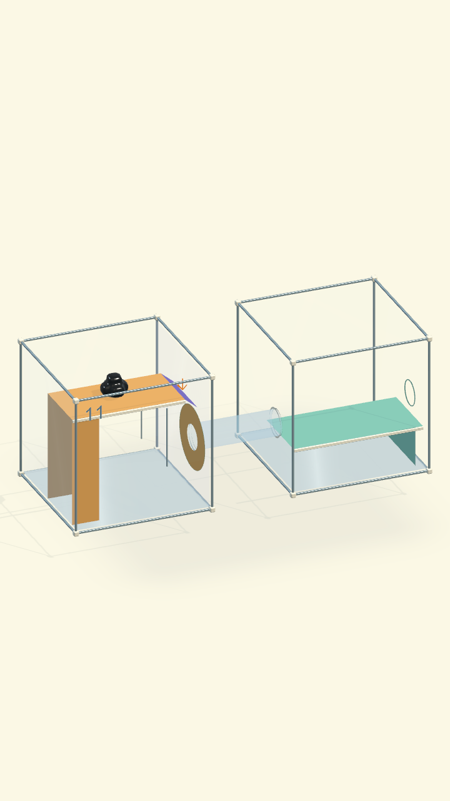
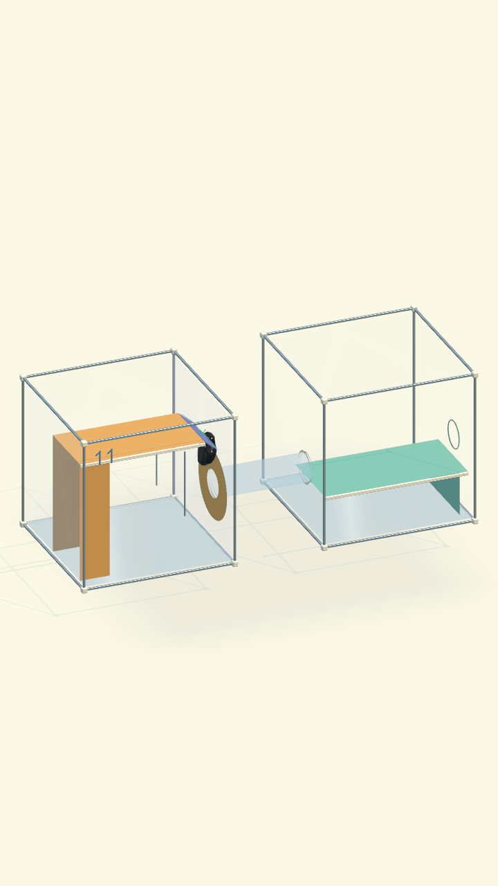
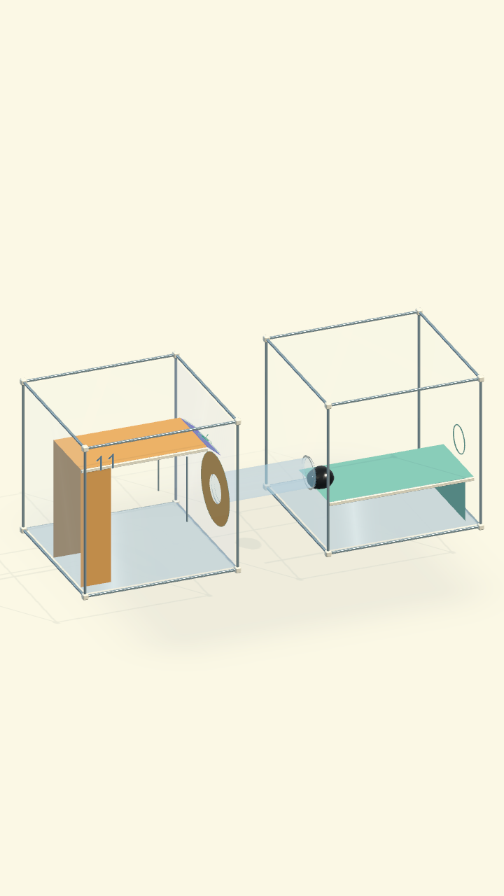

# COghe Origin 30 — kiểm chứng prototype

Ngày chạy: 17/09/2026

Unity: 6000.3.19f1

Phạm vi: scene tích hợp `COgheOrigin01`…`COgheOrigin30`, nội dung mới
`venom.origin.21`…`venom.origin.30`.

## Thứ tự và dữ liệu tiến trình

Campaign dùng thứ tự nội dung:

```text
01 02 03 04 21 05 06 07 23 30
22 08 09 24 11 25 13 26 16 10
27 12 28 17 14 29 18 15 19 20
```

`Definition.Order` là vị trí chơi 1–30. `Definition.Id` vẫn là ID nội dung ổn định,
vì vậy việc xen màn không đổi khóa save của 20 màn cũ. Boss được đánh dấu tại vị trí
10, 20 và 30.

## Kiểm thử tự động

`COgheCampaign30IntegrationTests`: **7/7 qua**.

`COgheCampaign30SolvabilityTests`: **10/10 qua**.

- Nạp đủ 30 scene; xác nhận ID, display order, trang chọn màn và ba Boss.
- Nạp/reset/idle 10 màn mới; không mất vật chất, không tự thắng/thua, không thiếu script
  hoặc collider; mặt trơn vẫn chọn được.
- Kiểm tra đúng loại cơ quan theo từng hồ sơ 21–30.
- Điều khiển đầu tiên của mỗi màn cơ khí được chọn bằng screen tap qua camera thật.
- Ray, cửa nối tiếp, bộ truyền bánh răng và cơ cấu một bánh hai trạm đạt chốt vật lý,
  mở lối ra và reset về trạng thái đóng.
- Kiểm tra mô phỏng 600 bước cho mỗi màn mới: không có tăng bộ nhớ managed vượt 2 MB.
- Giải trọn vẹn cả 10 nội dung mới bằng API điều khiển giống touch thật: bò/leo,
  nghiêng, chọn tay nắm, đẩy/kéo ray, chém, giữ nút, tụ lại, đi qua ống và qua lỗ.
  Test không teleport mô và không gán trực tiếp trạng thái hoàn thành của cơ quan.

Hồi quy toàn dự án sau lần sửa cuối: **288/288 PlayMode** và **8/8 EditMode** qua,
không có test bị bỏ qua. Bản macOS Development cũng build thành công bằng
`VenomCampaignBuilder.BuildMac`; player chứa đúng 30 scene `COgheOrigin`.

## Đối chiếu bản vẽ và lời giải thật

| Vị trí | Nội dung | Chuỗi đã chạy đến thắng | So với mockup đã duyệt |
| ---: | ---: | --- | --- |
| 05 | 21 | chạm máng → nghiêng → trượt vào khay bám → lỗ | Bản v3 sửa 18/09 khớp bệ cao, máng cong liền và khay rộng; xem kiểm chứng mới bên dưới |
| 09 | 23 | kéo bánh G ăn khớp → bộ truyền nâng cửa → lỗ | Khớp cơ quan, hướng truyền và thứ tự |
| 10 | 30 | đưa G vào bộ truyền → lộ tay B → kéo cửa cuối → lỗ | Khớp Boss hai nhịp; hình học Unity giản lược chi tiết trang trí |
| 11 | 22 | tới vùng bám → tự vào ống → toàn thân chảy sang buồng hai → lỗ | Khớp hai buồng và ống; dòng chảy giữ thân liền, không còn kéo dài mắc vành |
| 14 | 24 | bám tay nắm → kéo nắp vào hốc → lỗ | Khớp một nắp, một hốc và một hành động sửa được |
| 16 | 25 | kéo nắp A → lộ tời B → kéo B nâng cửa → lỗ | Khớp chuỗi A rồi B |
| 18 | 26 | kéo cầu vào khe → cầu khóa thành mặt liền → bò qua → lỗ | Khớp cầu một nhịp; đã bỏ khe PhysX tại hai mép ghép |
| 21 | 27 | đưa một bánh G tới A → chuyển cùng bánh sang B → lỗ | Khớp một vật dùng ở hai trạm |
| 23 | 28 | đỗ thùng vào hốc vuông góc → ray G thông → mở cửa → lỗ | Khớp; thùng là collider thật chặn đường ray, không phải cờ logic |
| 26 | 29 | qua dao → một phần giữ A, phần kia kéo B → tụ lại → lỗ | Khớp luật phối hợp và bắt buộc hợp thể |

Mức “khớp” ở đây là bố cục chức năng, thứ tự suy luận, trạng thái cơ quan và kết quả
vật lý. Hình minh họa là bản phác thảo ý đồ; scene dùng bộ primitive Day Lab tối ưu
mobile nên không sao chép từng nét, tỷ lệ hoặc chi tiết trang trí 1:1.

Trang chọn màn trước đây chỉ tạo hai dải `01–10` và `11–20`. Selector hiện tính số
trang từ `VenomCampaign.LevelCount`, tạo đủ trang thứ ba `21–30` và có test khóa
`LevelPageCount == 3` để lỗi này không quay lại.

Kết quả thời gian mô phỏng script trên máy Mac chạy batch:

| Vị trí chơi | Nội dung | Trung bình ms/bước |
| ---: | --- | ---: |
| 05 | 21 · Nghiêng là tới | 0,289 |
| 09 | 23 · Khớp rồi! | 0,287 |
| 10 | 30 · Nhà máy tí hon | 0,314 |
| 11 | 22 · Đáp rồi chui | 0,342 |
| 14 | 24 · Kéo ra mới qua | 0,262 |
| 16 | 25 · Hai nhịp một cửa | 0,408 |
| 18 | 26 · Bắc một nhịp | 0,320 |
| 21 | 27 · Một bánh, hai việc | 0,397 |
| 23 | 28 · Nhường đường | 0,299 |
| 26 | 29 · Bạn giữ, tớ kéo | 0,306 |

Đây là thời gian của vòng mô phỏng có script trong batch test, không phải frame time
GPU hoặc FPS trên điện thoại. Mốc nghiệm thu mobile vẫn cần playtest Android/iOS.

## Viền lỗ thoát mint — 18/09/2026

Toàn bộ 30 scene tích hợp dùng một `LineRenderer` rộng 3,2 mm, vật liệu quiet mint
dùng chung và emission nhẹ quanh đúng aperture thật. Viền nằm phẳng trên mặt kính,
không collider, không bóng đổ, không light và không thay đổi ray chạm hay vật lý thoát.

- Kiểm tra riêng tải đủ 30 scene và xác nhận material, độ rộng, trạng thái hiển thị,
  shadow và collider: **1/1 đạt**.
- Hồi quy `VenomOriginTests` cùng `COgheCampaign30IntegrationTests`: **56/56 đạt**,
  không skipped hoặc failure.
- So sánh Unity portrait: [trước](exit-outline-before-02.png) và
  [sau](exit-outline-after-02.png). Ảnh sau cho thấy viền mint rõ hơn nhưng vẫn giữ
  ánh sáng Day Lab dịu và không che lỗ.

## Hồi quy liên quan

- Tình huống màn 04 bò thẳng vào lớp trơn vẫn trượt; sau khi người chơi dẫn tới điểm
  an toàn, lệnh vào lỗ dùng vành bám gần nhất và không quay lại lớp trơn do sai lấy mẫu.
- Bộ tìm đường heap được đối chiếu với Dijkstra tham chiếu để giữ khả năng tới đích,
  thứ tự hòa và waypoint qua góc.
- Build settings giữ cả scene legacy/Journey cho test hồi quy; các builder Android/iOS
  lấy đúng 30 scene tích hợp làm player content.

## Màn 04 — lớp trơn tự giải thích — 18/09/2026

Lệnh chạm thẳng vào lỗ từ mặt xuất phát giữ điểm đến vật lý gần nhất, vì vậy sinh vật
chọn đường ngắn, bò vào lớp phủ tím và tuột xuống sàn mà chưa thắng. Cơ chế này dùng
đúng độ bám của bề mặt và trọng lực, không dùng cutscene, teleport hay cờ “đã ngã”.
Sau đó người chơi có thể chỉ đường vòng trên kính khô; khi sinh vật đã đứng trên điểm
khô cùng mặt với lỗ, lệnh cuối chọn vành bám khô và hoàn tất màn.

- Ba tình huống riêng của màn 04 đều đạt: cú chạm đầu bị trượt, đường vòng trực tiếp
  vẫn thắng, và đường vòng sau khi ngã vẫn thắng.
- Hồi quy `VenomOriginTests`, `COgheCampaign30IntegrationTests` và
  `COgheCampaign30SolvabilityTests`: **68/68 đạt**, không skipped hoặc failure.
- Khung kiểm chứng sau cú trượt đầu tiên: [level04-first-tap-slip.png](level04-first-tap-slip.png).

## Màn 05 — dựng lại cầu trượt — 18/09/2026

Theo phản hồi người dùng, bản v2 chưa thể hiện đúng phác thảo: bệ và khay gần trong
suốt, mặt máng rời và thành chắn vật lý không hiện. Các mặt dẫn đường còn đổi trục
ở góc dốc thoải. Bản v3 dùng hộp ngang, bệ hổ phách cao, máng tím satin liên tục
có độ dày và thành sứ thấp, khay mint rộng nối sát lỗ. Phần hiển thị lấy tiết diện
từ collider thật và không thêm collider; luôn nhìn được khi dùng follow camera.

Test cũ chỉ chứng minh tâm mô đi sang phải rồi cuối cùng qua lỗ; nó chưa kiểm tra
chạm pixel và chưa loại trường hợp rơi xuống sàn dưới khay. Test mới đã bổ sung cả
hai điều kiện này, cùng tiếp xúc thật với máng và điều kiện đủ 32 hạt thoát.

- Đạt ba lượt với độ nghiêng 12°/24°/36°, chạm lệch ngang −40/0/+40 mm.
- Đạt đứng chờ 10 giây; nghiêng ngược 30° rồi phục hồi bằng lệnh chạm bệ. Không tách
  thân hoặc mất mô. Phần cầu trượt vẫn hiển thị trong follow, không chứa collider trang trí.
- Hồi quy Origin, campaign 30, lời giải 10 màn xen kẽ và cơ quan 11–14: **76/76 đạt**.
- Build macOS thành công. Đã chơi tay bằng chuột qua màn hai lượt: hộp ban đầu và
  sau một thao tác kéo nghiêng nhẹ. Quan sát animation chiến thắng và tự sang màn 06.
  Follow/toàn cảnh hoạt động, vẫn thấy bệ và máng. Đã đưa bản Mac về đầu màn 05.
- Máng có độ dốc tự nhiên nên ở tư thế ban đầu một lần chạm cũng có thể đưa COghe
  tới khay và thoát; chấp nhận kết quả vật lý này, không ép thêm điều kiện phải xoay.
- [Bệ xuất phát và máng thật](level05-slide-start.png) · [COghe ở khay bám](level05-slide-caught.png).

## Màn 06 — điểm chạm sau khi lật và hướng cố bò — 18/09/2026

Màn hiển thị 06 là nội dung `venom.origin.05` (nóc trơn). Người dùng báo sinh vật
bò lung tung sau khi chỉ vào mặt trơn đã lật xuống. Đã tái hiện hai lỗi độc lập:

- Graph dùng tọa độ local để tái sử dụng qua xoay, nhưng chọn điểm bám còn dùng
  snapshot world cũ. Bài kiểm tra so với graph dựng lại cho đường đi khác nhau
  (10 waypoint so với 14). Hiện mỗi lệnh cập nhật tọa độ world từ pose Root hiện tại;
  không dựng lại topology chỉ vì hộp xoay.
- Khi mô trượt lệch ngang, hướng cố bò còn nhắm waypoint chưa đi qua. Test có xung
  vận tốc ngang làm fixture cho kết quả dot 0,768 với hướng đích (yêu cầu >0,95).
  Hiện động tác trên mặt không bám nhắm điểm chỉ cuối cùng; không thêm lực bám/đẩy.

Các test tập trung sau sửa đạt **7/7**, gồm sàn lật, thay đổi hướng, quán tính ngang,
vật liệu trơn phẳng, mặt cầu trơn và lời giải màn nóc trơn. Bài màn 06 còn yêu cầu
sinh vật thực sự đi từ vách tới mặt trơn đã chọn; chỉ đúng marker chưa đủ.

Hồi quy Origin, campaign 30, lời giải các màn xen kẽ, cơ quan 11–20, camera và
cache tìm đường đạt **108/108** (`slide06-regression.xml`). Bài đối chiếu heap với
Dijkstra cũ từng lệch vì giả định chọn đích trước thay đổi màn 04; chạy lại không
có bản sửa tọa độ cũng tái hiện cùng lỗi. Bài này hiện đối chiếu hai thuật toán tới
cùng mẫu tiếp cận (vẫn kiểm tra khoảng snap, đường đi, corner và tie-break), còn
quy tắc chọn đích được kiểm tra riêng bằng input thật ở màn 04/06.

[Sinh vật tiếp cận mặt trơn sau khi lật hộp](level06-inverted-floor-command.png).

Build macOS thành công sau bản sửa. Đã thao tác chuột trong player: lật mặt tím
xuống, chỉ lên sàn và quan sát sinh vật xuống từ vách, thử đổi điểm chỉ khi đang
trượt. Hướng trôi trên mặt nghiêng vẫn do trọng lực; không có lực bò trên lớp trơn.
Player được đưa về đầu màn 06 để test lại. Chưa đo lại trên OPPO trong lần sửa này.

## Màn 09 — bám tay nắm bánh răng — 18/09/2026

Màn hiển thị 09 dùng nội dung `venom.origin.23`. Test chạm tay nắm rồi chỉ đích
phía trên tái hiện việc mất bám; G chỉ dịch tới 61,8 mm/160 mm. Trong 2,75 giây có
28 tick thân tụt ngược quá 60 mm/s; test giải màn trước đây cho bám lại nhiều lượt
nên không bắt được lỗi thao tác này.

Nguyên nhân: đích thân luôn cách tay nắm 45 mm về phía trước, đẩy thân ra xa vách
cố định. Khi không còn chân tiếp xúc, phản lực và trọng lực kéo sinh vật xuống;
khoảng cách tay vượt giới hạn và tự buông. Bộ lực không thể thay thế chỗ đứng thật.

Sửa chung ở `VenomPropManipulation`: chọn mặt bám cố định song song ray khi nhận
lệnh, kiểm tra khoảng trống cho thân và tầm tay, chờ chân chạm thật rồi mới nắm.
Thân theo mặt bám khi ray dịch chuyển; hand contact vẫn nằm trên vật động. Dùng
chung cho các scene cũ và campaign 30, không rẽ nhánh bằng số màn. Không tăng lực,
không teleport thân/cơ quan, không thêm điểm bám trên vật liệu trơn. Truy vấn chỗ
đứng chạy lúc chọn vật; physics tick dùng lại mặt đã chọn.

Vị trí thao tác đã có chân đỡ (tay kéo sát sàn) được giữ lại để không đẩy thân vào
hốc che. Cơ quan cũ chưa gán `ManipulationGrip` chọn mặt nắm từ collider của vật;
các scene dùng cùng runtime này, không cần sửa riêng theo số màn. Test ray B ở
màn 24 đi qua lối sàn bên phải bằng lệnh người chơi trước khi nắm, đúng tuyến
tiếp cận quanh kính chắn trong lời giải đã có.

Test một lệnh màn 09 sau sửa: tới chốt 157,1 mm (dung sai chốt 3 mm) trong khoảng
2 giây, giữ nắm liên tục, 0 tick tụt ngược, khoảng cách tay/thân tối đa 91,5 mm.
Test bổ sung kéo ngược, buông sau 3 giây, hai ray đẩy lên/kéo xuống ở màn 24 và reset.
Script `Tools/verify-coghe-expansion.sh` đã bao gồm cả suite campaign 30 để kiểm tra
hệ dùng chung cùng các màn tích hợp mới.

Hồi quy runtime cuối: **108/110** trong một lượt. Sau đó **3/3 test chạy lại đạt**:
test ray A/B dùng tuyến sàn và mặt bám bên phải như lời giải màn 24 đã có; hai test
máng màn 05 đạt lại mà không đổi runtime/màn 05. Một lượt bài trượt màn 05 từng
dừng sau khi đáp khay; đây là dấu hiệu test/vật lý chưa ổn định cần theo dõi, không
ghi thành một lượt 110/110. Các lời giải Boss 10 và Boss ba khoang, phối hợp, hợp thể,
thoát và lực theo khối lượng đều đạt ở lượt hồi quy cuối.
Log/XML: `Artifacts/COgheExpansion/verification.*`,
`Artifacts/COgheCampaign30/gear09-followup.*`; lỗi trước sửa ở `gear09-before.*`.

[COghe giữ chân trên vách cạnh ray khi đưa G tới chốt](level09-stable-gear-grip.png).

Build MacOS thành công. Đã chơi tay trong player mới: chạm tay nắm, chỉ lên trên
một lần → G lên tới chốt, giữ thân trên vách, bộ truyền nâng cửa → chạm lỗ → thắng
và tự chuyển sang Boss 10. Đã đưa player về đầu màn 09 để người dùng thử lại.
Chưa build/cài lại OPPO trong lần sửa này.

## Giới hạn còn lại

Các test trên chứng minh cấu trúc, tương tác đầu vào, trạng thái cơ khí và giới hạn CPU
trong môi trường batch. Chúng không chứng minh độ dễ, cảm giác kéo/đẩy, độ rõ hình ảnh
hoặc FPS trên mọi máy. Lời giải tự động chứng minh màn có thể hoàn tất, chưa chứng minh
người chơi mới sẽ hiểu hoặc thấy thao tác dễ. Cần playtest trên OPPO/iPhone để hiệu
chỉnh tiếp camera, vùng chạm, lực và nhịp thưởng mà không thay lời giải đã duyệt.


## Slot 11 / content 22 — rebuild to the approved sketch, 18 September 2026

The former single decorative cage and near-invisible internal decks did not read
like the approved two-room sketch. Its inlet was displaced 20 cm inside room A.
The old solve test targeted the tube directly; it did not prove that a visible
purple-edge tap performed the intended fall. Rebuilt only slot 11 through
`VenomCampaignBuilder.RebuildCatchAndFlow` (also used by the full generator).

Two separate framed chambers now meet a cyan tube at their actual apertures. A
solid amber deck, short purple departure, physical side guides and flush amber
grip annulus explain the action. Room B has a mint receiving deck and the real
final exit. The recoverable climbing support starts clear of the initial tissue
footprint. Overview is 26° pitch / 22° yaw, with independent room inspection.
`VenomTransferTube.DepartureHint` only drives the existing presentation arrow; it
does not give movement commands, add traction or change catch/flow eligibility.

`Artifacts/COgheCampaign30/level11-regression.xml`: **20/20 passed**, completed
18 September 2026 at 04:04:25 UTC. Includes the complete new slot-11 screen-tap
solution; ±35 mm lateral taps without any input during the fall; floor recovery
and re-entry; reset during flow; existing tube catches/misses; campaign load,
reset, UI/geometry/mechanism contracts and the shared gear-grasp regressions.
All three complete departure trials pass transfer without counting an exit,
then win with all 32 particles at the final aperture. No tissue teleports or
forced solved state in these slot-11 solutions.

The idle simulation sample for slot 11 was 0.2747 ms/step on this Mac, 21 navigation
surfaces, zero dynamic props and no measured managed-memory growth over its
600-step sample. This is an Editor CPU sample, not mobile FPS or a GPU profile.
OPPO was not rebuilt or profiled for this change.





macOS player build: `Artifacts/Venom01/build-macOS.log` reports **Build Finished,
Result: Success** and `ORIGIN BUILD SUCCESS`. Played the rebuilt app at 480×828
using native mouse input: a single overview tap on the purple departure flowed
the creature to room B; the second tap on the final aperture completed the level
and automatically loaded slot 12. No corrective mid-air or tube-entry tap was
needed. Returned to a fresh slot 11 and verified the Hộp 1 close view.


## Màn 14, 16, 18 — khớp phác thảo và giải thật, 18/09/2026

Đã chỉnh nắp/hốc, chuỗi A→B và cầu một nhịp theo thiết kế được duyệt.
[Báo cáo, ảnh và giới hạn kiểm thử](review-14-16-18.md). Ba đường giải đạt;
bộ hồi quy vẫn ghi nhận lỗi riêng của màn 5, không tuyên bố toàn suite đạt.

## Màn 17 — dòng cơ thể khi thoát ống, 18/09/2026

[Nguyên nhân, fix dùng chung và kiểm thử lớp da thật](tube-exit-17.md).

## Màn 05 — thân mắc ở bệ, xuyên máng khi xoay, 21/09/2026

[Báo cáo spawn, collider kín và hồi quy 91/91](slide05-solid-trough.md).
Máng dày thật và khớp phần nhìn thấy; không thay lực mô hoặc luật tách/hợp thể.
