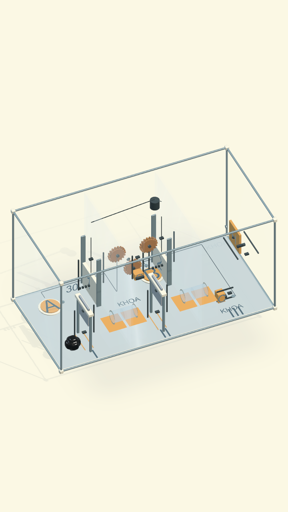
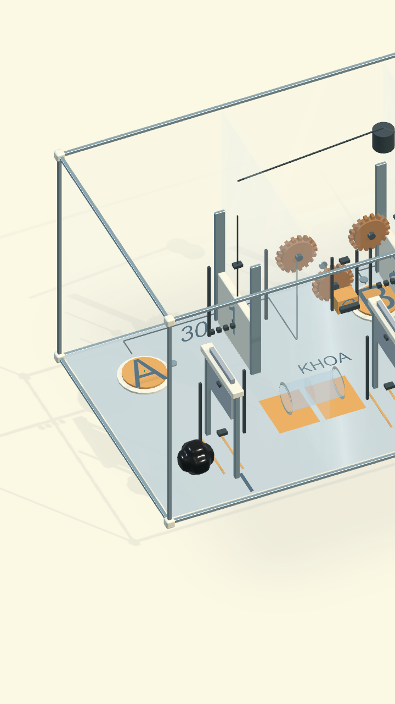
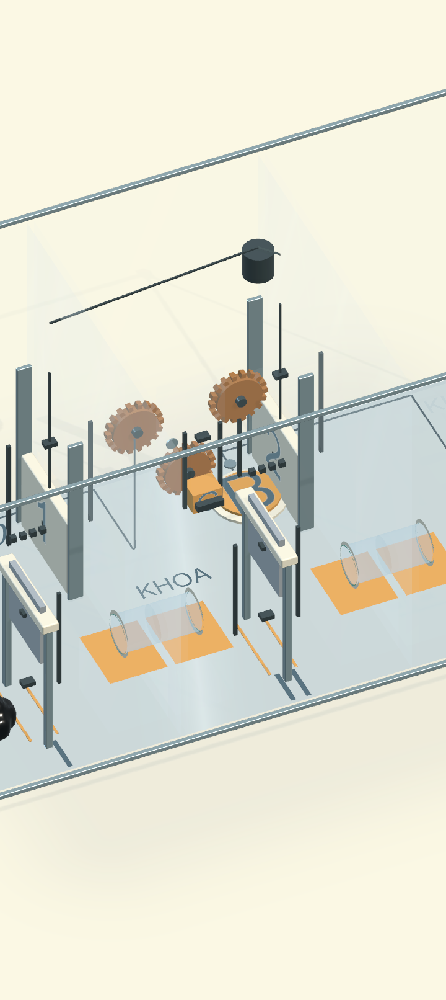

# Màn 30 — TAM HỢP, bản dễ đọc và dễ thao tác

18/09/2026. Source `venom.origin.20`, slot hiển thị 30. Giữ ba khoang và
bài toán phối hợp; thay đổi theo yêu cầu người dùng làm rõ và dễ chơi hơn.

## Thay đổi

- Ống hai chiều hạ 225 mm và tăng bán kính từ 25 lên 32 mm, bệ thấp có mặt
  leo liên tục; không yêu cầu căn rơi vào miệng ống.
- Nút A/B rộng 112 mm, tải kích hoạt 12 g. B được đưa ra bên phải tấm kính
  bám G để chạm được từ tổng quan và cận cảnh.
- G nhẹ hơn (20 g, cản 0,030 N), giữ trọng lực/khóa/chốt; cú cắt đầu không
  cần cố tạo một mảnh lớn hơn 19 hạt như test cũ.
- C dùng tay nắm về bên phải, cùng hướng kéo ray, chừa đường rời cơ quan.
  Tời nâng cửa với tốc độ mục tiêu 0,10 m/s; vẫn dùng lực hữu hạn và phanh
  khi mất tải. H có cản 0,36 N, chốt chỉ mở khóa sau khi hai cửa mở hết.
- Kính ngăn giảm độ đậm, cửa porcelain có ray, dao thép có khung và vùng cắt,
  ống có cổ nối rõ. Đèn A/G/B/C/H và chữ khóa/mở đọc trạng thái thật; không
  hiển thị bước giải, không tự điều khiển sinh vật.
- Camera 42°/24°, mở gần khoang A, ba nút xem cận cảnh có tên cơ quan và nút
  Toàn cảnh. Nóc vẫn chọn được. `InitialCameraZone` là dữ liệu; mặc định −1
  giữ toàn cảnh cho các màn khác.
- Sửa nhận chạm dùng chung: khi phần đang chọn đứng sát tay nắm, bấm cơ quan
  vẫn nắm lại được sau 3 giây tự buông. Trước đây vùng chọn cơ thể nuốt lệnh
  này. Chạm phần khác vẫn đổi phần; chạm riêng cơ thể đang chọn vẫn không
  phát lệnh di chuyển ngoài ý muốn.

Builder `RebuildReadableBoss` cập nhật source 20 và bản tích hợp 30. Những màn
khác giữ dữ liệu. Các thay đổi thông số helper có giá trị mặc định cũ.

## Phạm vi kiểm tra

Kiểm tra lời giải nguyên vẹn với cắt bằng dao thật, giữ A/B, nâng G, chui hai
ống, kéo C, tự tụ và kéo H trước khi thoát đủ 32 hạt. Kiểm tra mất tải, chốt,
reset, và chọn tay nắm/nút qua camera ở 720×1280 và 720×1612, cả tổng quan
và từng khoang. Fixture gán vị trí chỉ dùng để cô lập liên động, không dùng
làm bằng chứng giải trọn.

## Kết quả tự động

- Kết quả cuối sau sửa nắm lại G: `boss30-input-regression.xml`, **20/20 đạt**.
  Chạy lại cả bộ cơ quan và camera, gồm lời giải đủ 32 hạt và chuỗi thao tác
  màn hình mới có thử buông/nắm lại.
- `Artifacts/COgheCampaign30/boss30-regression.xml`: **19/19 đạt**, gồm bộ cơ
  quan (dao, truyền lực, chốt, mất tải, reset, giải các màn 17–20), chọn đích,
  toàn cảnh 20 màn, camera theo sinh vật/khoang và nền ở hai tỷ lệ dọc.
- Sau chỉnh nhãn cuối, `boss30-final.xml`: **2/2 đạt**, chạy lại lời giải màn
  tích hợp 30 và chọn tay nắm/nút trong toàn cảnh lẫn ba khoang ở 720×1280,
  720×1612. Ảnh được render đúng kích thước tương ứng.
- Lời giải mới bắt đầu bằng một cú chạm dao, cắt thật **16+16**, rồi **16+8+8**.
  Mảnh 16 hạt nâng G, 8 hạt kéo C, sau đó cả 32 hạt tụ lại, kéo H và thoát.
  Test source 20 còn kiểm tra phép chia **10+22 → 10+11+11**. Không gán
  nhóm hoặc khối lượng trong các bài giải trọn.
- Đã bắt và sửa kẹt phần C khi rời tay nắm sau mở cửa. Đã bắt và sửa vùng
  chọn mở rộng của dao II che B. Test điểm chạm không chỉ gọi API chọn cơ quan.
- Kiểm tra bổ sung `Campaign30CanApproachGFromTransferUsingScreenCommands`
  dùng điểm màn hình để chạm dao, A, miệng ống, G, và hướng nâng. Nó còn chờ
  sinh vật tự buông 5 giây rồi chạm nắm lại, và kiểm tra chọn phần khác.
  Trường hợp nắm lại đã tái hiện lỗi ở `boss30-screen-idle.xml` trước bản sửa.

## Kiểm tra bản MacOS

`Tools/build-venom.sh` đã build thành công bản cuối tại
`Builds/Venom/macOS/Venom.app`; log `Artifacts/Venom01/build-macOS.log`
có `ORIGIN BUILD SUCCESS` (18/09/2026, 15:00 giờ Việt Nam).

Đã thao tác trực tiếp trên cửa sổ 480×800: vào màn 30 tự mở cận khoang A,
chạm dao để cắt, chọn phần trái giữ A và cho phần phải vào ống sang khoang II;
đã xem cả ba camera cơ quan. Việc đưa nhầm phần đi xuyên qua phần còn lại
có thể gây tụ lại theo đúng luật; chọn phần bên trái cho A giữ được hai phần.
Kiểm tra tay G bằng chuỗi điểm màn hình tự động ở trên bắt được lỗi nắm lại.
Lời giải trọn được kiểm chứng bằng mô phỏng vật lý tự động; không ghi nhận
đây là một lượt chơi tay thắng toàn bộ Boss.

Ảnh trên là render Unity, chưa gồm IMGUI. Chưa đo lại OPPO và chưa playtest
với người mới; không suy ra FPS hoặc độ dễ từ test tác giả.
