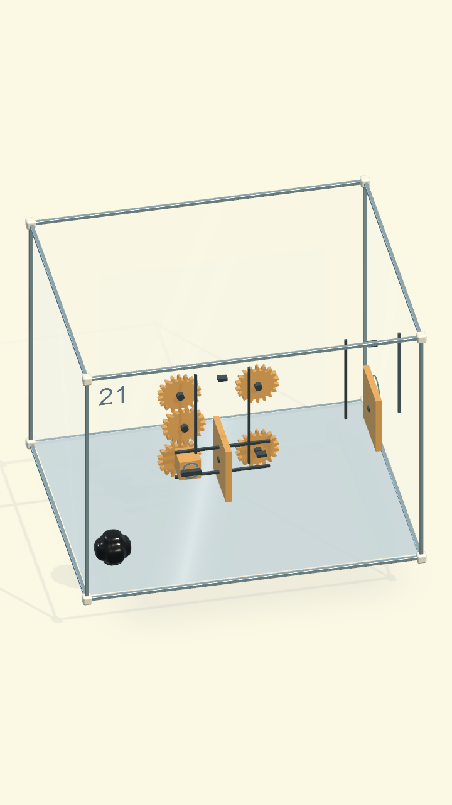
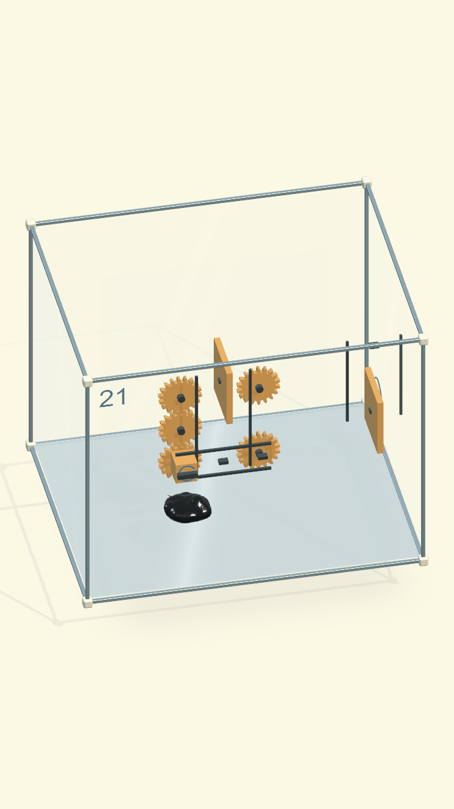
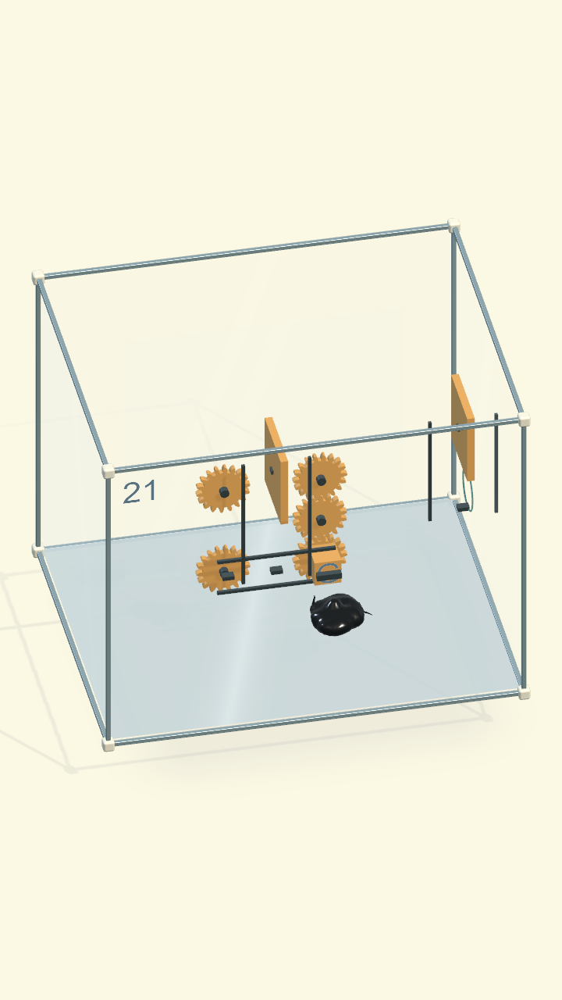

# Màn 21 — bánh G ăn khớp ở hai trạm

18/09/2026. Màn hiển thị 21, content `venom.origin.27`, **Một bánh hai việc**.

## Lỗi và thay đổi

Trước sửa, G lệch 75 mm theo trục so với hai trạm. Khoảng cách các bánh cố định
cũng không đúng tổng bán kính vòng chia. Driver chỉ xét đầu ray, còn bánh tải
quay sai chiều so với cấu trúc G khớp trực tiếp cả hai bánh.

- Cả năm bánh cùng mặt phẳng z=85 mm, vòng chia r=45 mm, cùng 18 răng. Mỗi trạm
  có motor ở trên, G ở giữa, tải ở dưới; khoảng cách G–motor và G–tải là 90 mm.
- Ray ngang 180 mm, A/B tại x=−90/+90 mm. Nắp A nâng 225 mm để cả đỉnh răng
  đi qua, không chỉ hộp carriage nhỏ hơn. Không đổi thứ tự giải A → B → Exit.
- Mesh liền với sườn răng involute 20°, module 5 mm, đỉnh răng +1 module,
  chân răng −1,25 module và khe hở nhỏ. Tham khảo quy ước kích thước của
  [Technische Antriebselemente](https://technische-antriebselemente.de/en/tools/gear-geometry-calculator/).
  Đây là hình học hiển thị theo bộ truyền lý tưởng; không thêm PhysX collider
  cho từng răng hoặc tuyên bố mô phỏng tiếp xúc bánh răng công nghiệp.
- Driver xét tiếp xúc vòng chia, cùng mặt phẳng và trục song song, cùng điều
  kiện đến trạm. Răng căn pha khi vào vùng khớp; cả hai bánh cố định quay ngược G.
  Tốc độ quay đọc vận tốc tải thật; ray đã bù trọng lực không được cộng bù lần hai.
- Rút G giữa lúc nâng thì phanh giữ tải; tới chốt cuối thì giữ mở. Reset trả cả
  pha bánh, carriage, cửa và trạng thái ban đầu.

Mỗi bánh giờ có 2 renderer (răng liền + ổ trục), thay cho 20 renderer (web +
18 răng rời + ổ trục): cụm 5 bánh giảm 100 xuống 10 renderer. Giữ 32 hạt/120 Hz,
không thêm solver hay collider răng. Chưa đo lại FPS/GPU trên OPPO cho bản sửa này.

## Kiểm thử

Đường giải thật dùng lệnh bám/kéo hiện hành: kéo G về A, chờ nắp tới chốt,
kéo G sang B, chờ cửa cuối mở, rời tay rồi thoát đủ 32 hạt. Không gán vị trí
sinh vật hoặc ép trạng thái cửa trong test giải trọn màn. Ảnh dưới là Unity render.

Fixture cơ quan riêng sắp đặt carriage để kiểm tra: lệch mặt phẳng 20 mm không
truyền; trục nghiêng không truyền; pha đúng suốt vòng quay; ngắt khớp giữa lúc
tải chạy thì phanh giữ; Reset trả pha G. Fixture không thay thế bằng chứng giải màn.

Builder có lệnh riêng `RebuildMeshingStations` để dựng lại đúng slot 21; không
phải sinh lại các màn khác. Hồ sơ [Level27](../../LevelDesign/COghe/Level27/README.md)
ghi cấu hình hiện hành.

Kết quả 18/09/2026:
- 3/3 test tập trung đạt trong `Artifacts/COgheCampaign30/gear21-targeted.xml`.
- 27/27 test hồi quy đạt trong `Artifacts/COgheCampaign30/gear21-regression.xml`:
  toàn bộ `COgheCampaign30IntegrationTests`, `COgheMechanismExpansionTests` và
  đường giải `Inserted21UsesOneGearAtAThenBAndExits`.
- Đây là kết quả của các suite nêu trên, không phải xác nhận đã chơi thủ công
  toàn bộ 30 màn hoặc đo FPS trên điện thoại.

Bản Mac build thành công bằng `bash Tools/build-venom.sh`; log
`Artifacts/Venom01/build-macOS.log` có `ORIGIN BUILD SUCCESS`. Đã mở đúng
slot 21 trên app, bấm tay kéo G về A và sang B: cả hai cửa nâng, G chuyển
trạm và khớp giữa hai bánh cố định như ảnh render.
Sau đó bấm vào lỗ thoát, sinh vật ra ngoài và app tự chuyển sang màn 22.
Đây là lượt chơi thủ công trên bản Mac qua UI, ngoài test tự động ở trên.
Đã chọn lại màn 21 ở trạng thái đầu để người dùng test.
