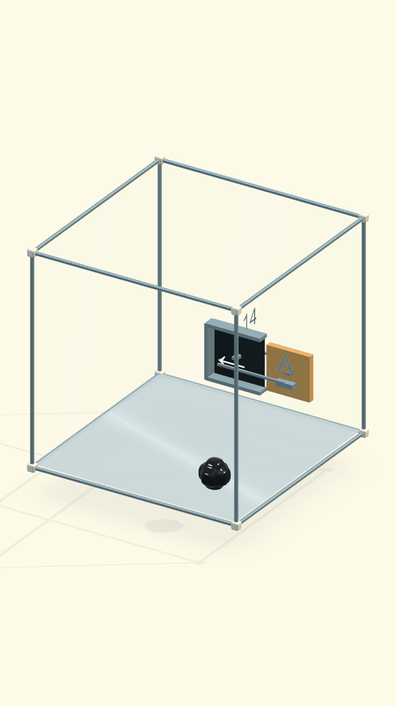
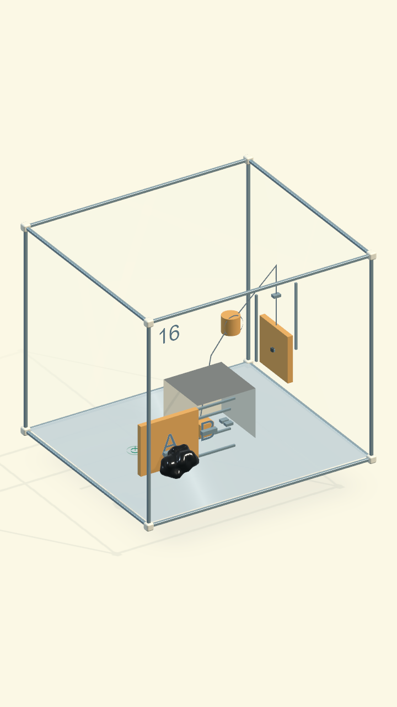
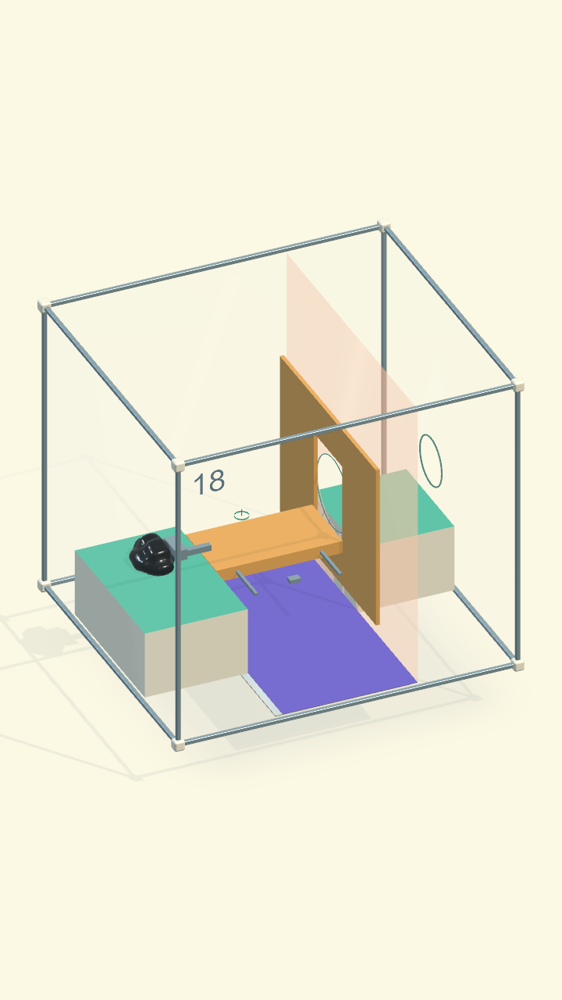

# Rà soát màn 14, 16, 18 — 18/09/2026

Phạm vi là **số màn hiển thị trong campaign 30 màn**. Nội dung nguồn tương ứng:
14 → `venom.origin.24` (Kéo ra mới qua), 16 → `venom.origin.25` (Hai nhịp một cửa),
18 → `venom.origin.26` (Bắc một nhịp). Không thay các màn nguồn cũ 14/16/18.

## Sai khác phát hiện

- Màn 14: hốc nhận nắp chỉ là một hình chữ nhật đen, tay nắm dùng hướng tiếp cận
  mặc định không phù hợp vách bên. Camera làm nắp và hốc khó đọc.
- Màn 16: A là mái nằm ngang của hốc hở phía trước; người chơi thấy và chạm được B
  khi A còn đóng. Cáp chưa thể hiện liên kết từ B tới trống tời.
- Màn 18: bệ bị art kính làm gần như vô hình; chưa có vùng trơn rõ; cầu quá ít hành
  trình. Tấm có lỗ bị vô hiệu hóa cùng deck khi ghép xong, dùng khóa thắng theo ray
  thay cho một vách kín và cửa thông thật. Test cũ tự chọn/bám lại trong nhiều đợt,
  nên chưa chứng minh thao tác kéo liên tục bằng chạm màn hình.

## Thay đổi

- 14: tay nắm quay vào phía sinh vật; hốc có lưng và ba mép nhận nắp, không che tay.
  Camera nhìn rõ vách cơ quan. Hành trình 160 mm, nắp trượt về phía hốc bên trái
  trên màn hình, chặn/phanh/chốt dùng `COgheRailSlider` hiện có.
- 16: A thành cửa trước thẳng đứng của hốc có hai má, mái và lưng kín; B nằm trong
  hốc thật. A đi sang trái, buông vẫn giữ chốt, sau đó mới tới B. Cáp hiển thị bám
  theo tay B, trống và tải; không điều khiển lực hoặc puzzle state.
- 18: bệ đặc màu mint/sứ, cầu hổ phách, sàn trơn lavender. Một tấm có lỗ gắn cùng
  Rigidbody cầu chạy trước vách kín. Mặt deck được thay bằng mặt tĩnh trùng khít
  khi gài chốt; **tấm chắn và các collider khác vẫn tồn tại**. Bỏ khóa thắng theo
  pose cầu. Tay nắm riêng nhận tương tác, mặt cầu nhận lệnh bò. Điều chỉnh vùng
  đứng bám và điểm spawn để toàn bộ mô nằm ngoài bệ đặc.

## Kiểm chứng

Unity 6000.3.19f1 / macOS, PlayMode vật lý thật 120 Hz, 32 hạt.
**Lượt chốt: 4/4 đạt**, `Artifacts/COgheCampaign30/reviewed-screen-solutions.xml`,
kết thúc **04:39:30 UTC 18/09/2026**. Gồm ba lời giải hoàn toàn qua chạm màn hình
và kiểm tra các cơ quan đầu tiên nhận chạm từ overview; riêng màn 18 test chọn
vào thanh nối của tay cầu, chạm deck rồi chạm lỗ cuối, không dùng lệnh đi nội bộ.

`Artifacts/COgheCampaign30/reviewed-final.xml`, kết thúc **04:30:43 UTC 18/09/2026**:
**16 đạt / 17 ca**, ca còn lỗi là `Inserted05SlidesThroughTheCurvedTroughAndExits`,
ngoài ba màn đang rà soát. Không coi cả suite đã xanh.

Các ca 14/16/18 đều thắng trọn màn. Test không teleport mô hoặc gán pose cơ quan
để giải: chạm tay nắm bằng pixel qua camera thật, kéo bằng lực cơ thể; mỗi cơ quan
được kéo trong một lần bám, không tự chọn lại khi tuột tay. Kiểm tra thêm:

- 14: chạm hướng sai gặp chặn rồi đổi sang kéo đúng mà không phải chọn lại; chạm
  lỗ cuối sau mở thắng.
- 16: B không chọn được khi A đóng; A mở rồi tự buông sau 3 giây, chốt vẫn giữ;
  chạm B, kéo tời, chạm lỗ cuối thắng.
- 18: lúc đầu raycast bị tấm đặc chặn; sau ghép ray đi qua khe thật trong khi tấm
  và collider vẫn bật; đi qua cầu, thắng đủ 32 hạt; reset khôi phục chắn kín.
- Bộ integration chung: load/reset, điểm chạm từ overview, cơ cấu và ngân sách
  simulation; hồi quy bám tay nắm G ở các màn dùng chung.

Lượt bộ rộng `Artifacts/COgheExpansion/verification.xml` trước khi tăng clearance
cửa nối màn 18: 109/111 đạt. Hai lỗi là màn 5 và mép cửa màn 18; lỗi màn 18 đã được
sửa và kiểm lại trong lượt 16/17 ở trên. Màn 5 còn bị dừng ở khay sau trượt khi
ra lệnh thoát trong test, cần xử lý riêng; không sửa màn 5 trong lượt này.

Bản Mac build thành công (`ORIGIN BUILD SUCCESS`, `Artifacts/Venom01/build-macOS.log`).
Đã chơi bằng chuột native ở cửa sổ **480×828**, xác nhận cả ba màn tự chuyển
sang màn kế sau khi thắng:

- 14 → 15: chọn A, chạm phía hốc, rồi chạm lỗ.
- 16 → 17: mở A sang trái, đợi/buông tay, chọn B và chỉ phía kéo, rồi chạm lỗ.
- 18 → 19: chọn tay nắm, chờ sinh vật tới tư thế giữ, chỉ phía sau để ghép,
  chạm mặt cầu, chạm lỗ cuối.
  Có thử pause/resume lúc tiếp cận và quan sát việc tự buông sau 3 giây. Không
  chỉnh pose cơ quan hay vị trí mô qua debug để qua màn.

Qua chơi tay phát hiện thanh nối nhìn giống tay nắm nhưng chưa nhận chạm.
Đã gộp thanh nối vào vùng chọn tay nắm, thêm biên nhận chạm 9 mm quanh thanh;
trigger này không tạo va chạm/lực và không thay đường giải. Lượt 4/4 ở trên kiểm
lại bằng cách chạm chính giữa thanh nối. Phải chờ COghe bám trước khi chỉ hướng;
3 giây không ra lệnh sẽ tự buông theo luật chung.
Bản Mac cuối đã mở lại; chạm trực tiếp thanh nối ở (194,495) trên cửa sổ 480×828
đưa sinh vật vào trạng thái giữ (hiện “Buông vật”). Đã để sẵn màn 18 sau Retry.
Mẫu idle 600 bước trên Mac: màn 14 **0,2579 ms/bước**, màn 16 **0,3102 ms/bước**, màn 18 **0,2819 ms/bước**. Đây là trung bình CPU mô phỏng Editor; không phải FPS player hay đo GPU.
Không dùng số đo PlayMode trên Mac để khẳng định FPS trên OPPO. Chưa build APK ở lượt này.
