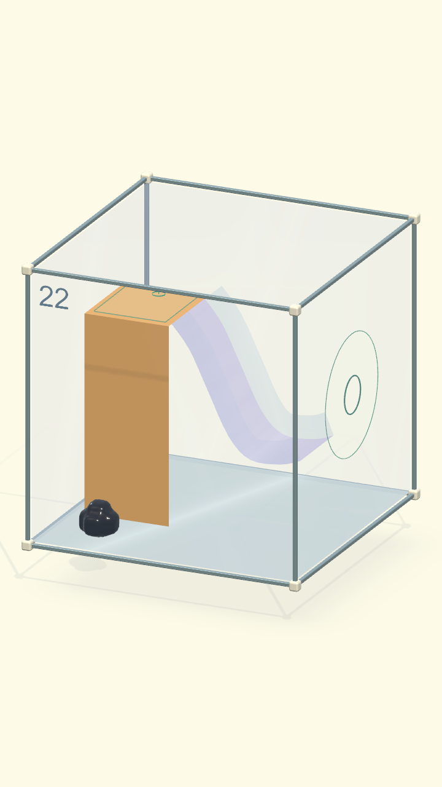
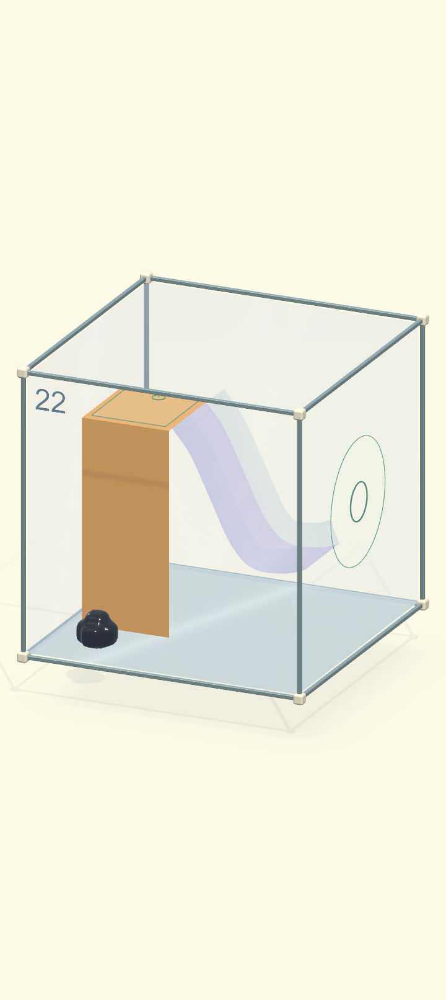

# Màn 22 — lên bệ cầu trượt dễ chọn hơn

18/09/2026. Màn hiển thị 22, content `venom.origin.12`, **Trượt rồi bay!**.

## Phạm vi sửa

- Mặt leo cũ tại x = −268 mm hướng +X, còn bệ trên nhô về +X. Sinh vật ở
  phía bám của vách có thể gặp mặt dưới bệ, cần vòng qua cạnh hẹp để lên trên.
- Chuyển mặt leo ra mép trước z = −100 mm, hướng −Z. Mép trên nối mặt bệ ở
  y = 145 mm, mặt dưới chạm sàn y = −300 mm. Spawn ở trước mặt leo.
- Tăng chiều sâu bệ hổ phách từ 100 lên 200 mm, giữ chiều dài 193 mm. Bệ
  dừng đúng đầu máng x = −75 mm, không chồng mặt bám lên mặt trơn.
- Camera pitch 20°, yaw −24°. Góc 27° đã được loại trong quá trình kiểm tra vì
  tia chạm bệ phía sau đi qua nóc hộp; giữ nóc chọn được theo luật dùng chung.
- Giữ nguyên hình học máng, ma sát, vùng đón, khoảng bay và luật thắng. Không
  thay solver, số hạt, lực bám hoặc runtime điều khiển. Vẫn cần tiếp xúc thật
  sau khi bay để bám tường; không kéo sinh vật bằng animation hoặc teleport.

Builder `RebuildAccessibleSlide` dựng source 12 và copy sang slot 22, giữ nguyên
build catalog và các màn khác. Hai mặt bám vẫn dùng hai collider như trước;
không thêm vòng lặp/truy vấn runtime hay hệ điều khiển riêng.

## Kiểm chứng

Test chạm năm vị trí trên mặt bệ qua `TouchPoint`, từ spawn thật mỗi lượt; dùng
chuyển động thật để xuống sàn phía sau rồi leo lại. Đường giải khác kiểm tra
leo → trượt → toàn bộ mô rời mép máng → tiếp xúc vùng bám → thoát đủ cơ thể.
Không sắp đặt vị trí hạt/cửa hoặc ép trạng thái thắng trong các đường giải này.

Báo cáo này chưa xác nhận FPS trên OPPO; thay đổi hiện được kiểm tra ở Mac/Unity.

Test tập trung đạt **3/3** (`Artifacts/COgheCampaign30/slide22-targeted.xml`):
5 đích trên bệ và đường quay lại; giải slot 22; giải source 12 với 3 vị trí
lệch ngang ban đầu. Chạm máng tại phần dốc trên (segment 4), không chạm sát
mép nối vài mm: điểm quá sát bệ là lệnh dừng khi đuôi còn bám, chưa phải
lệnh đưa toàn thân vào máng. Quy tắc này giữ nguyên lực bám thật.

Hồi quy đạt **11/11** (`Artifacts/COgheCampaign30/slide22-regression.xml`):
toàn bộ `COgheEarlyExpansionTests` và
`COgheCampaignCameraTests.Campaign22DeckIsVisibleAndPickableAtBothPortraitRatios`.
Đã xem render 720×1280 và 720×1612; mặt trên hiện rõ, tia chạm nhận đúng bệ
và các góc hộp nằm trong vùng chơi. Kết quả không đại diện cho toàn bộ 30 màn.

Build macOS thành công bằng `bash Tools/build-venom.sh`;
`Artifacts/Venom01/build-macOS.log` có `ORIGIN BUILD SUCCESS`.

Chơi tay trên app Mac: bấm vùng giữa mặt bệ hổ phách một lần từ spawn;
sinh vật leo lên, vượt mép rồi dừng trên mặt trên. Không cần chỉ nhiều
điểm trung gian hoặc vòng sang mép bên.

Lượt chơi tay tiếp tục chạm phần dốc tím → trượt/bay → hiện “Bám được rồi”
ở tường → chạm lỗ → app tự chuyển sang màn 23. Đã mở lại màn 22 ở spawn
để người dùng kiểm tra bản mới. Chưa build APK trong nhiệm vụ này.
