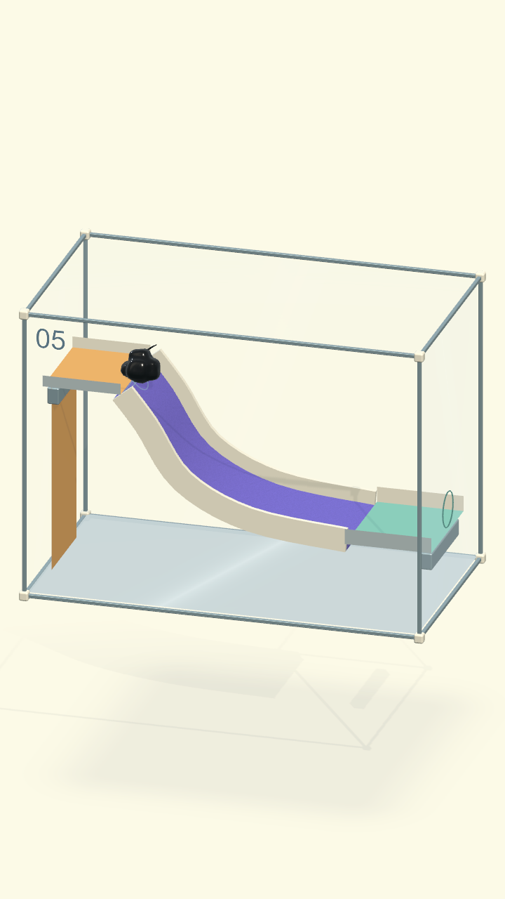

# Màn 05: kẹt đuôi và xuyên máng — 21/09/2026

Content 21, slot chơi 05. Giữ bố cục phác thảo `Level21/mockup-v1.png`.

## Tái hiện

Chạm máng đầu tiên bằng tọa độ màn hình; sau 1 giây, khoảng cách nối gần nhất
giữa hai cụm hạt lên 47,95 mm. 32 hạt vẫn chung một graph và chưa hạt nào thoát.
Ảnh kiểm thử giống phản hồi người chơi: một cục nhỏ mắc trên bệ, phần lớn ở mép.
Kiểm tra ray từ dưới máng thất bại vì collider không có mặt dưới.

## Thay đổi

Spawn cao hơn 19 mm để không tạo hạt bên trong bệ ngay từ đầu. Đáy máng vật lý
dày 24 mm, thành 10 mm, tiết diện kín với hai đầu bịt; sửa hướng mặt va chạm của
thành. Art cùng tiết diện vật lý. Không sửa mô phỏng mô, navigation, tốc độ bò,
trọng lực hoặc luật thắng. Không thêm lực đẩy xuống máng hay hút về khay.

## Kiểm chứng

Các bài PlayMode dùng lệnh chạm/xoay thật, PhysX 120 Hz; không đặt lại vị trí
hạt, ép hợp thể hay gán trạng thái thắng. Bài chờ ở mép lấy mẫu mỗi 0,1 giây
trong 15 giây: khoảng cách nối lớn nhất 20,10 / 19,64 / 19,64 mm ở ba điểm chạm
đầu/giữa máng. Giới hạn kiểm thử 43 mm phát hiện đúng lỗi cũ.

Hồi quy **91/91 đạt**: `VenomOriginTests`, `COgheCampaign30IntegrationTests`,
`COgheCampaign30SolvabilityTests`, `COgheEarlyExpansionTests`. Log/XML tại
`Artifacts/COgheCampaign30/slide05-verification.*`. Đạt ray mặt dưới/hai thành,
nghiêng qua lại 40°/45°, xoay Z −35°/+30° rồi lật 180°; kiểm tra từng hạt mỗi
bước vật lý trong 16 giây không chui vào thể tích đáy. Đạt tuyến trượt–khay–lỗ
ở 12°/24°/36°, điểm chạm lệch ±40 mm; đứng chờ trên bệ, nghiêng sai rồi quay lại.

Không suy ra FPS OPPO từ kết quả PlayMode trên Mac; lượt này chưa đo trên OPPO.

Build Mac thành công (`ORIGIN BUILD SUCCESS`). Chơi trực tiếp bằng chuột ở
480×828: chạm máng, cơ thể giữ liền, trượt tới khay và qua lỗ; đã thấy màn vui
chiến thắng. Bản app: `Builds/Venom/macOS/Venom.app`.
