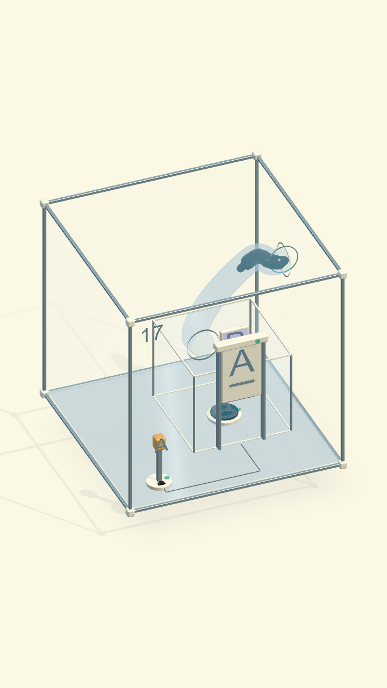
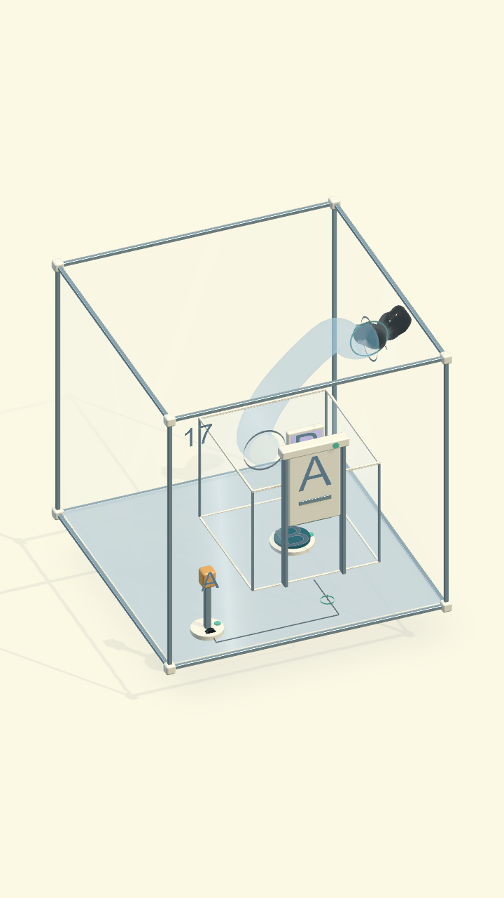
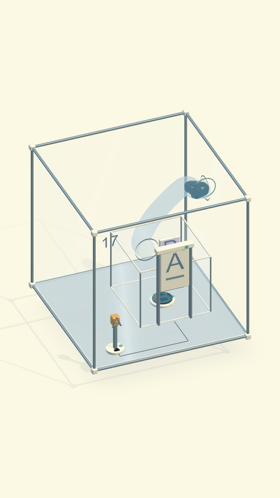
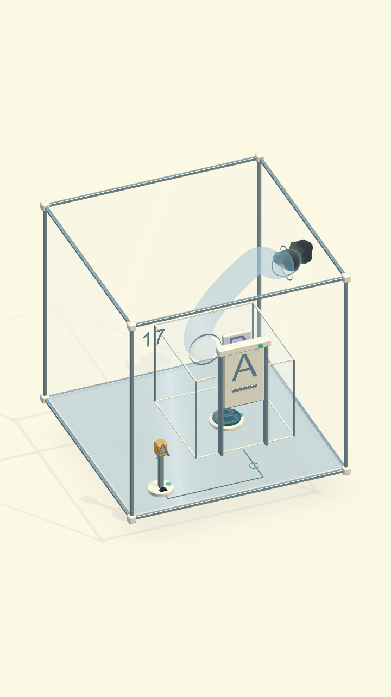

# Màn 17 — giữ cơ thể liền khi ra ống

Ngày 18/09/2026. Màn hiển thị 17 là content 13 **Mở đường!** trong campaign 30
màn, không phải content 17 bánh răng. Giữ nguyên bố cục và lời giải được duyệt.

## Nguyên nhân và thay đổi

Trước sửa, liên kết dữ liệu vẫn báo một bản thể nhưng lực hút lỗ cuối tiếp quản
từng hạt đầu với tốc độ lớn hơn dòng trong ống. Sau khi một hạt được tính đã
thoát, nó lại chịu lực gom ngoài hộp; phần đuôi vẫn theo đường cong. Hình học da
metaball có thể bị đứt dù còn nối bởi lò xo dài. Khoảng nối lớn nhất quan sát
được trong lượt baseline là khoảng 28 mm.

`COgheTubeNetwork` giờ giữ quyền dẫn cả đầu đã ra và đuôi chưa ra cho tới khi
toàn khối qua miệng. `VenomCampaign` không cộng lực gom lên phần đầu còn do ống
dẫn. Hạt giữ collider trong quá trình này; không teleport, không sửa khối lượng,
không ép hợp thể và không đổi luật thắng. Máy dò lỗ vẫn đếm riêng đủ 32 hạt thật.
Fix nằm trong cơ chế ống chung, không kiểm tra số level.

## Kiểm chứng

- Lời giải qua chạm màn hình thật trong bản integrated 17 và source 13: đến
  cần A, kéo qua nấc, vào cửa, đè B, chạm miệng ống, đi hết đường cong, thắng,
  Retry phục hồi cửa và nắp. Không gán vị trí mô hoặc trạng thái cửa để giải.
- Lượt integrated có thêm chạm nhầm sàn khi đầu đang ra. Ống tiếp tục dẫn đúng.
- Kiểm tra từng bước vật lý: đủ khối lượng, không có lần cắt, luôn một bản thể,
  collider còn bật khi ống điều khiển; khoảng nối lớn nhất giới hạn dưới 24 mm
  (bản sửa đo 20.9 mm trong hai đường giải).
- Dựng lại mesh da thật mỗi 0.1 giây mô phỏng. Hàn các đỉnh trùng vị trí, đếm
  thành phần liên thông theo tam giác; luôn một mảnh đáng kể. Bỏ qua mảnh cực
  nhỏ dưới 2% diện tích da để không coi chi tiết xúc tu là cơ thể bị chém.
- Kiểm tra đường ống nhiều nhánh, ngõ cụt/quay đầu, nhận chạm, vách chặn hợp thể,
  cùng các hồi quy Origin về cắt/hợp thể/lỗ cuối. Kết quả suite ghi bên dưới.

Suite cuối: **63/63 Passed**, `Artifacts/COgheCampaign30/tube17-regression.xml`,
kết thúc `2026-09-18 06:13:09Z`. Phạm vi: `COgheEarlyExpansionTests`,
`COghePipeExpansionTests`, `VenomOriginTests`. Đây không phải toàn campaign 30;
lỗi màn 5 đã ghi trong lượt kiểm trước nằm ngoài thay đổi này.

`bash Tools/build-venom.sh` đã build thành công, log
`Artifacts/Venom01/build-macOS.log` có `Build Finished, Result: Success` và
`ORIGIN BUILD SUCCESS`. Đã mở player mới, vào màn 17 và kiểm tra Retry bằng chuột.
Chứng cứ đi trọn đường giải/đo liên tục lớp da ở trên đến từ PlayMode; chưa xác
nhận thêm một lượt giải trọn màn bằng chuột trên native player. Player được để
sẵn tại trạng thái đầu màn 17 cho người dùng test.

Đây là kiểm tra chức năng và hình ảnh trên Mac, không phải đo FPS trên OPPO.
Không thêm hạt, mesh hoặc collider runtime; số hạt vẫn là 32. Chưa build APK
hay đo lại trên điện thoại cho thay đổi này.

## Bổ sung theo phản hồi 21/09/2026

Người chơi vẫn gặp phần đầu ở ngoài, mô rời rạc trong ống và không hoàn tất.
Đường giải cũ và một lượt chơi chuột trên bản Mac trước sửa bổ sung vẫn qua được;
chưa tái hiện nguyên trạng kẹt vĩnh viễn từ ảnh. Đã mở rộng kiểm thử với bấm
thẳng nút B, chờ 3/10 giây trước khi vào ống và chạy `FixedUpdate` thật. Lượt
chờ 10 giây trước sửa vượt giới hạn khoảng nối 24 mm (đo 24,1 mm).

Thay đổi dùng chung trong `COgheTubeNetwork`:

- Tính vị trí từng phần dọc đường cong, giảm tốc đồng bộ phần trước khi có
  khoảng trống tăng giữa đầu và đuôi. Giới hạn độ dài cụm đang được dẫn để một
  đuôi vướng tạm không để đầu chạy hết ống trước. Không kéo tắt xuyên thành cong.
- Giữ lực căn giữa đầy đủ tới khi tâm hạt ra khỏi miệng một khoảng bằng bán
  kính cộng 12 mm; sau đó mới giảm lực căn giữa cho phần đầu nở ra. Trước đây
  lực này giảm ngay từ lúc tâm vừa qua mặt miệng, khi collider vẫn vướng vành.
- Giữ collider và toàn bộ vật chất; chỉ thắng khi đủ 32 hạt thực sự thoát.
  Tái dùng các mảng 32 phần tử và kết quả chiếu lên đường cong, không thêm lần
  tìm điểm đường cong cho mỗi hạt hoặc cấp phát mảng trong bước mô phỏng.

Các ca giải source 13 / integrated 17, chờ trước khi vào, bấm thẳng B và chạy
nhịp vật lý thật đạt trước vòng hồi quy cuối. Thân hiển thị một mảnh đáng kể;
không có lần cắt; khối lượng giữ nguyên; đủ 32 hạt ra ngoài.

Fixture riêng cố định hạt ở cuối đuôi tại vị trí hiện tại trong **8 giây**, rồi
tháo ràng buộc. Đây là thử kẹt cực đoan, không phải lời giải của người chơi.
Trong lúc giữ: chưa hạt nào thoát, không hạt nào cách miệng vào quá 18 cm.
Sau thả và 2 giây phục hồi: lớp da một mảnh, khoảng nối tối đa 19,6 mm và
tự hoàn tất bằng lực dẫn bình thường. Không gán vị trí mô hoặc ép trạng thái thắng.

Log/XML các ca mới: `Artifacts/COgheCampaign30/tube17-coherent.*`,
`tube17-snag-recovery.*`. Bộ đầy đủ: `Artifacts/COgheExpansion/verification.*`.
Lượt này chưa đo FPS hoặc cài lại OPPO.

Hồi quy cuối: `Artifacts/COgheExpansion/verification.xml` có 127/128 đạt.
Ca còn lại là assertion cũ bắt buộc chọn nóc source 17 / display 24, trái với
thiết kế đã duyệt tắt chọn nắp để chọn bánh răng. Đã sửa riêng kỳ vọng này,
vẫn kiểm tra collider và độ bám của nóc còn hoạt động. Chạy lại toàn ca duyệt
các scene bằng `Artifacts/COgheCampaign30/roof-policy-verification.xml`: 1/1 đạt.
Như vậy 128 ca được xác minh qua hai lượt; không phải một XML 128/128 duy nhất.

Build Mac ngày 21/09 sau cả bản sửa này và cầu trượt màn 5 đã thành công:
`Artifacts/Venom01/build-macOS.log` có `Build Finished, Result: Success` và
`ORIGIN BUILD SUCCESS`. Đã chơi trực tiếp bằng chuột trên player mới ở cửa sổ
480×828: tiếp cận và kéo A, chạm B trong phòng, chạm miệng ống; sinh vật thoát
và hiện cảnh chiến thắng **“Chúng mình làm được rồi!”**. Không dùng lệnh ép
cửa, dịch chuyển sinh vật hoặc ép thắng. Sau đó mở lại đầu màn 17 để người dùng
test. Đây là xác nhận chức năng trên Mac, chưa phải xác nhận bản APK trên OPPO.

