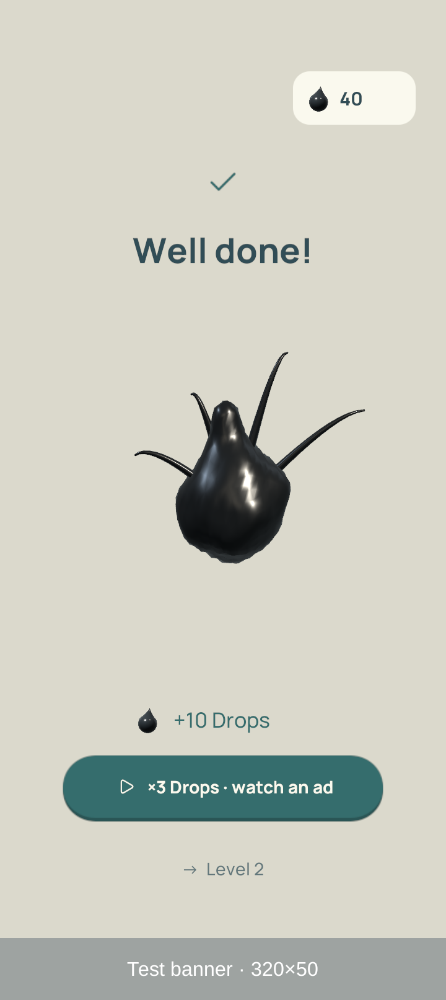

# OPPO victory UI and fullscreen inspection — 3 October 2026

NewGraphic, based on `030d823d`, with the local victory UI changes. Unity 6000.3.19f1;
OPPO CPH2591 / Android 15; ARM64 IL2CPP release test APK, all 50 Spatial scenes.

## Changed

- Earned Drops and the optional ×3 action are grouped below the celebration,
  above the next-level line and ad banner. Claiming ×3 updates one earned amount.
- The Product victory camera fits its dance into the space between the heading
  and reward dock, accounting for the phone's safe area and current banner height.
  Confetti follows that composition. Non-Product victory framing is unchanged.
- Home/Style unlocks keep their existing post-celebration popup; the duplicate
  inline Home action no longer crowds the reward dock. The final Menu action has
  its own footer row.
- No physics, level geometry, reward amounts, save IDs or progression changes.

## Fullscreen finding

The reported grey **top** border was not reproduced in this inspection. Both the
old and updated APK render a full 720×1612 surface. Android's window and Unity's
camera cover `(0,0)–(720,1612)`, fullscreen is true, and the top 64 pixels are the
camera-cutout safe inset for **controls**, not a crop of the background.
Checked cold Main Menu, gameplay, victory, Home and Style. See the actual
[gameplay screenshot](oppo-fullscreen.png). No native fullscreen setting was
changed without a reproduced cause. The grey **bottom** `Test banner · 320×50`
is the existing placeholder advertisement, not a fullscreen fault.

The user was asked which screen shows the top border; that detail is still
pending. These captures do not rule out an intermittent/system-overlay problem.

## Verification

- Four final PlayMode tests passed: real level-1 solve and automatic advance;
  UI overlap audit at 720×1280, 1080×2340 and 1536×2048; banner clearance;
  single reward amount after claiming ×3.
- Native Mac at 720×1280 and 720×1612, and OPPO at 720×1612: real level-1
  completion, all three dance variants, earned/×3 controls, test reward callback,
  banner/no-banner layouts, Home and Style. The proof sampled the rendered mesh
  against UI bounds: **zero overlaps in the final runs**.
- The first OPPO run found six sampled overlaps with the lowered reward text
  during the spinning pose. This prompted the camera-stage fix; moving text alone
  was insufficient. An initial Android screenshot-path error in the proof was
  also fixed before the final captured run.
- The proof uses in-memory progress/wallet and does not persist rewards or unlocks.
  Installed APK hash was checked against the build: [build record](build-record.json).
  [Device result](device-result.txt). Raw tests, logs and all captures are under
  `Artifacts/COgheMobileUI` (ignored).
- This is UI/device verification, not a new all-50-level solve or FPS benchmark.

## Repeat

`COgheMobileUIProof` only exists in Editor, development and test builds. It is
opt-in: `-coghe-mobile-ui-proof` on the Mac player, or boolean Android intent
extra `coghe_ui_proof=true` on a cold launch. It captures to
`Application.persistentDataPath/MobileUIProof`, then quits. Relaunch without the
extra to return to normal play and the user's existing save.
