# Actual Unity cooperation frames

Candidate16, native Mac accelerated author replay; each frame is taken during overlapping positive inputs, before the output catches. JSON records two distinct tissue groups. Captures are unaltered player frames; the normal-speed routes are reported separately.

## Level 23

Twin spring pulls and wall shutter · 15% travel

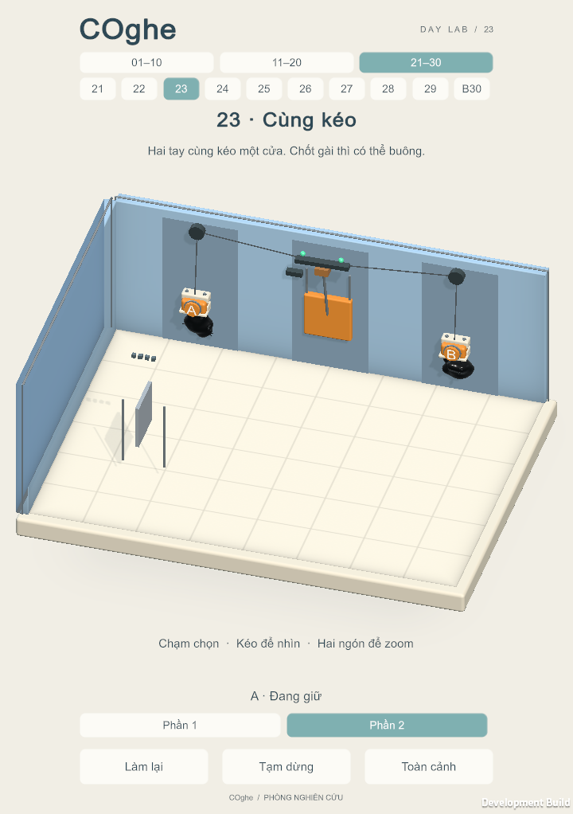

## Level 24

Brake release and return bridge · 19% travel

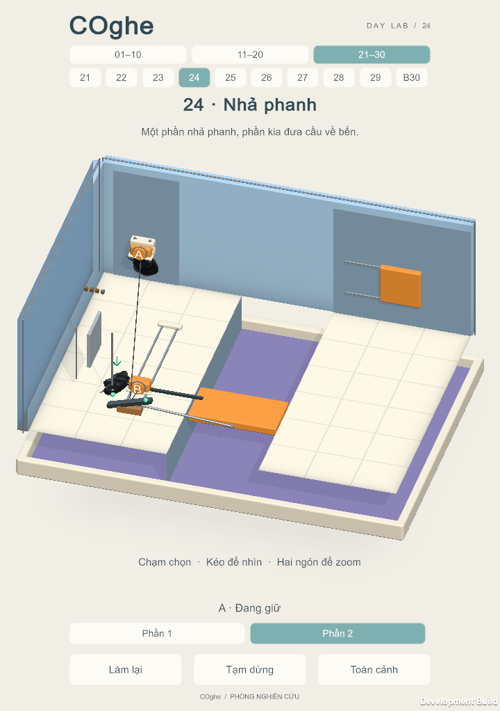

## Level 25

Brake release and return bridge · 19% travel

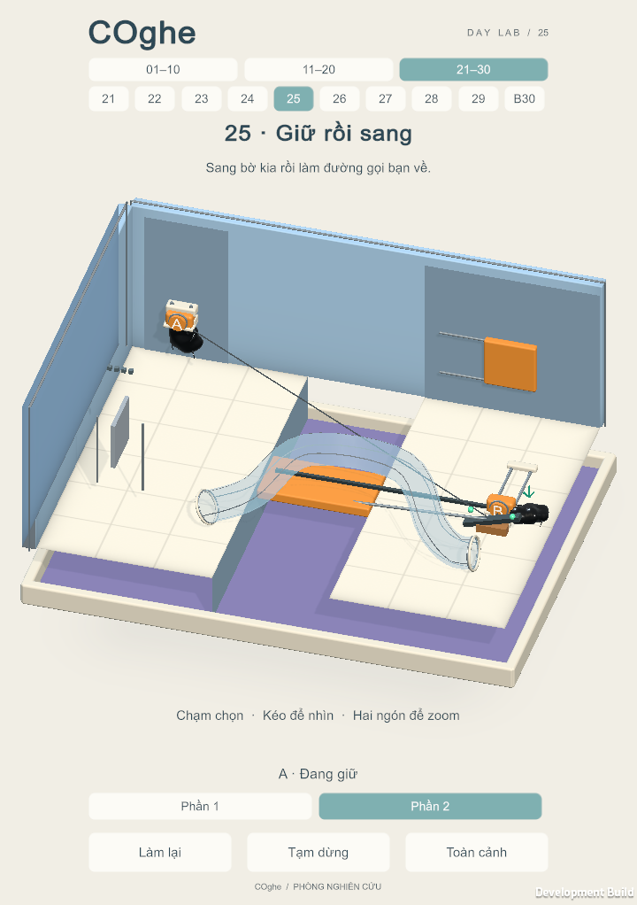

## Level 26

Paired pressure lift · 22% travel

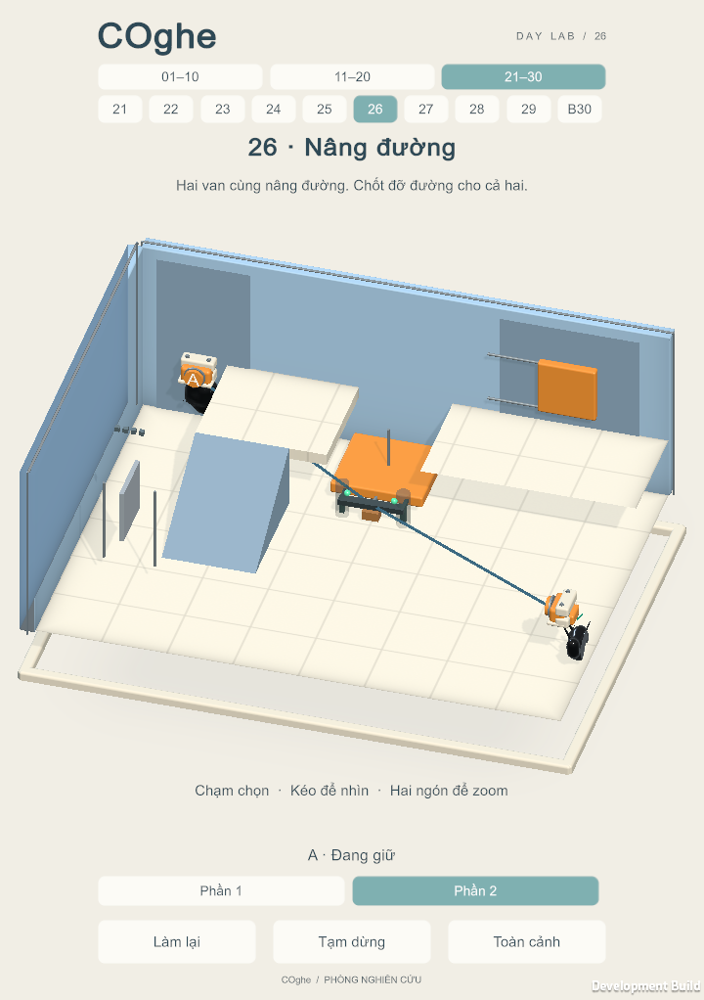

## Level 27

Twin spring pulls and wall shutter · 20% travel

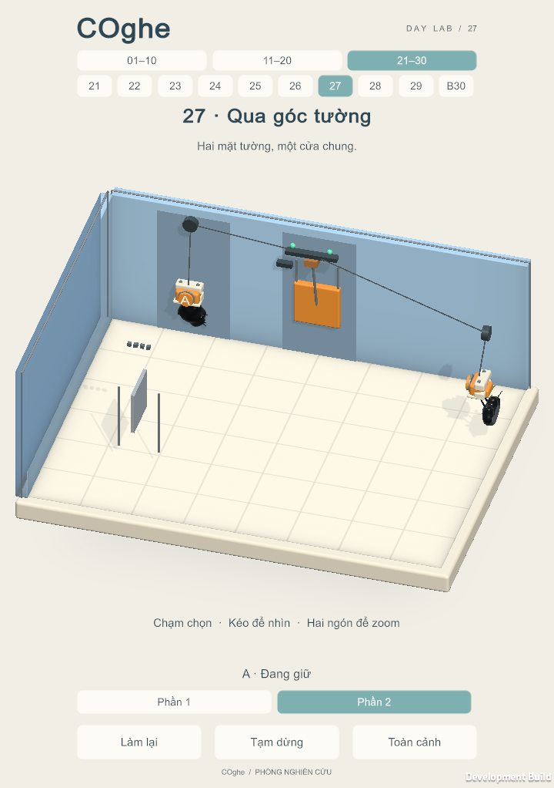

## Level 28

Selected return route · 23% travel

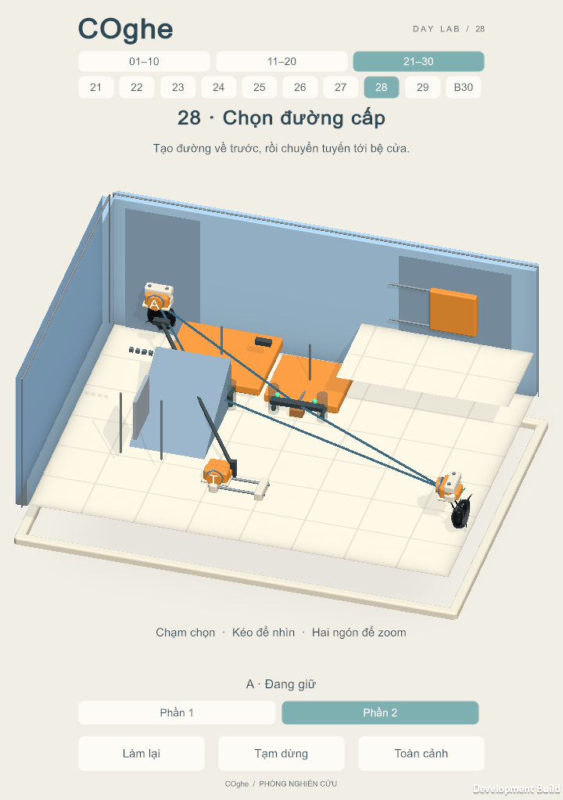

Paired pressure lift · 25% travel

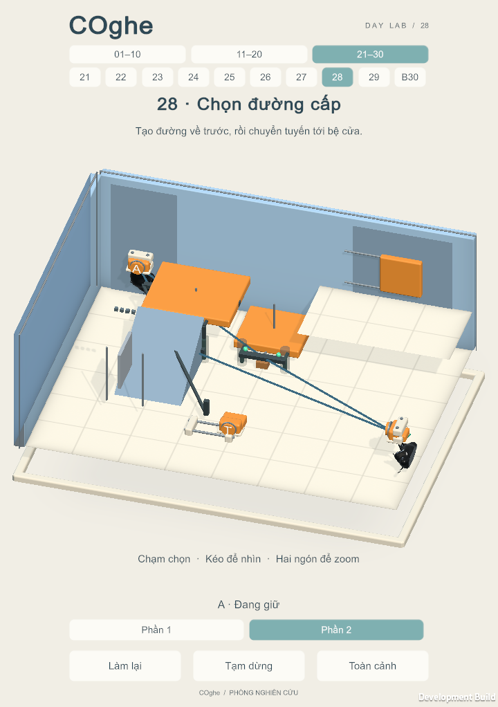

## Level 29

Brake release and return bridge · 19% travel

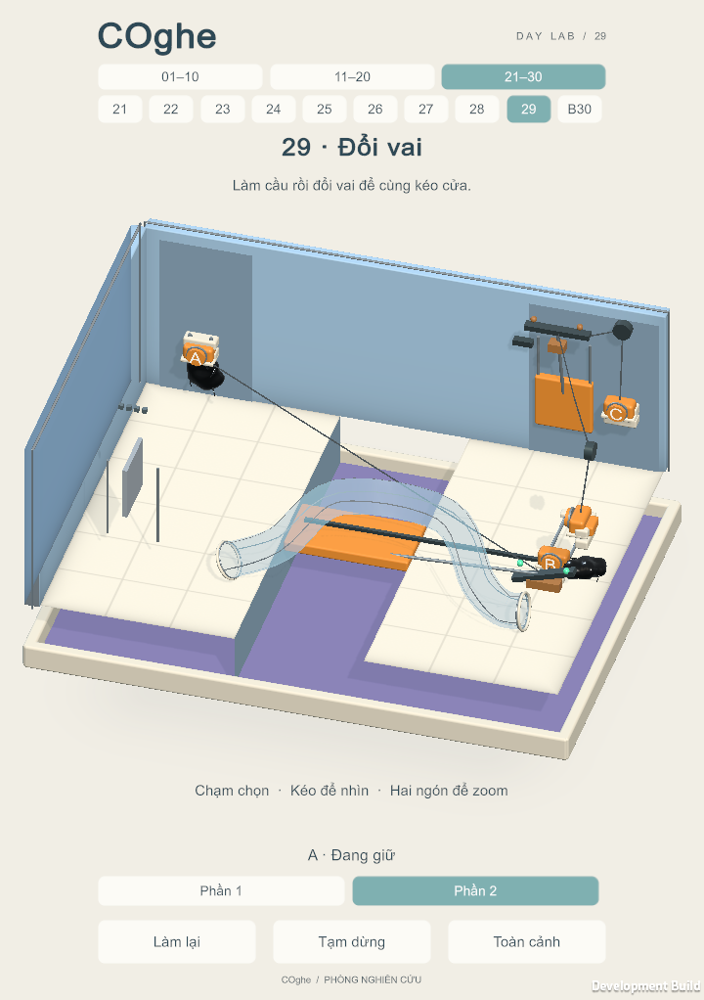

Far twin pull exit · 21% travel

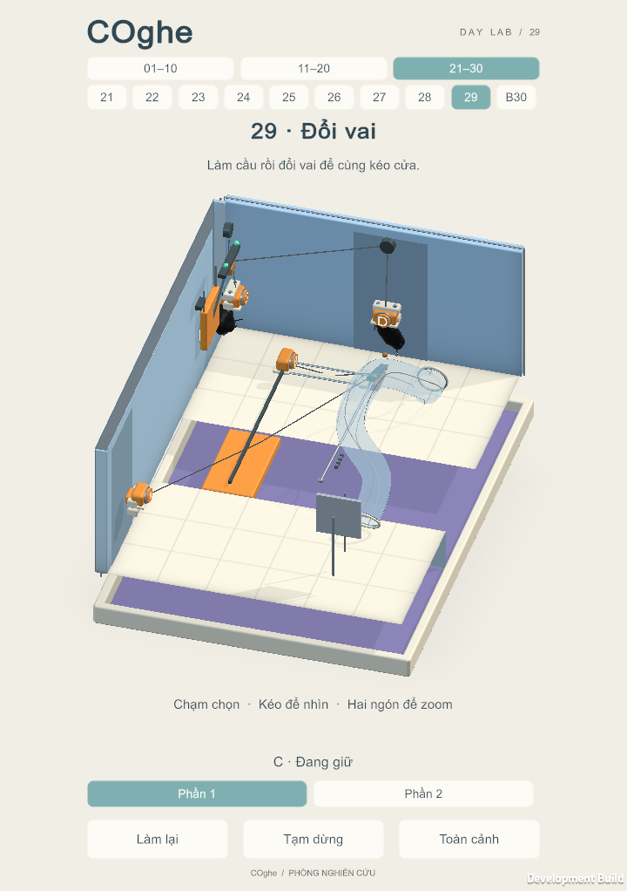

## Level 30

Brake release and return bridge · 35% travel

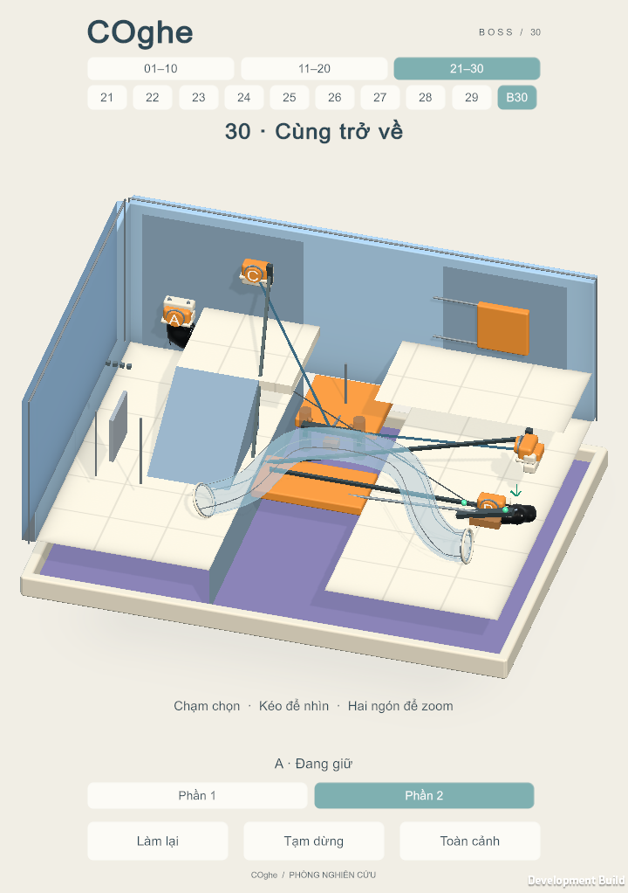

Paired pressure lift · 27% travel

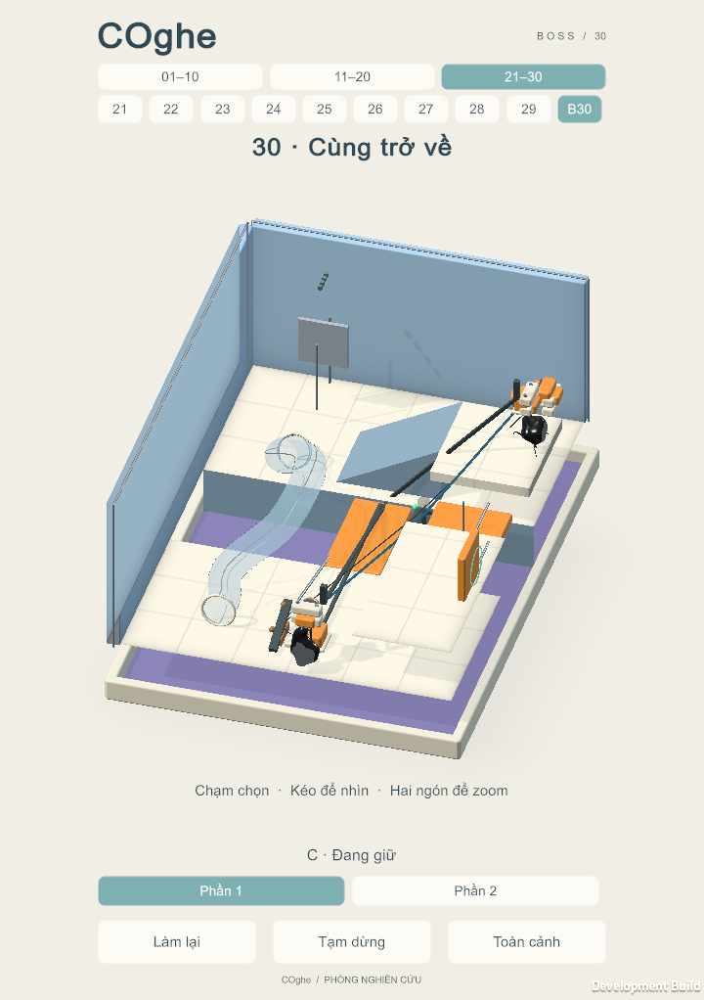
