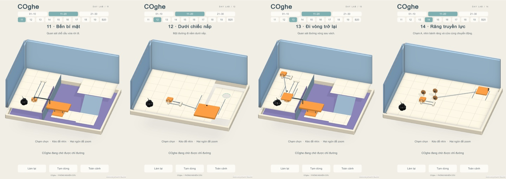
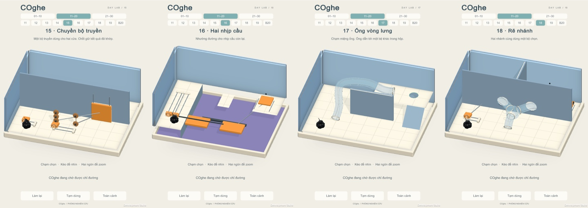
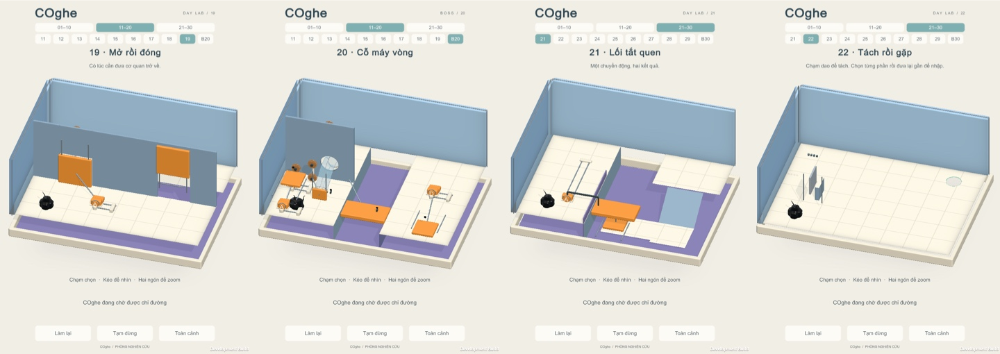
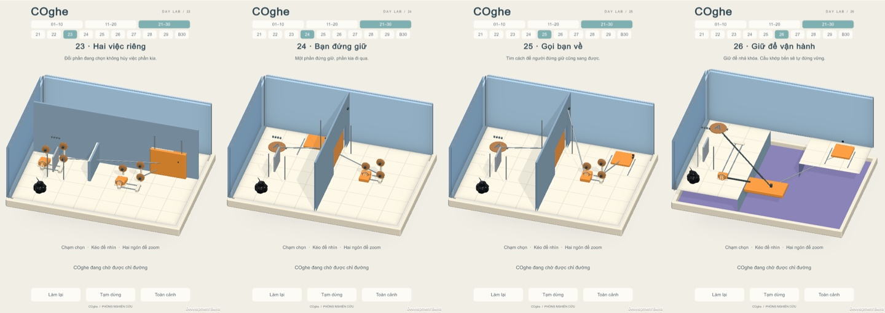
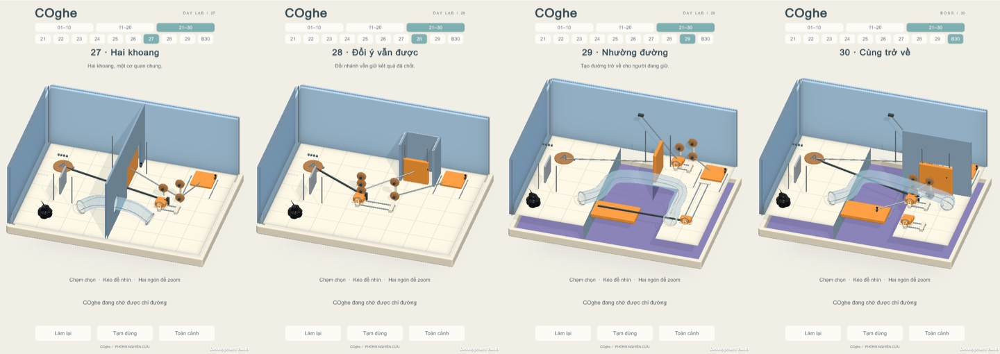

# COghe V2 expansion 11–30 — verified Mac prototype

Twenty authored scenes extend the approved V2 campaign to 30. This handoff implements the five concept boards' mechanism dependencies with real rails, gates, tube transit, cutting and reunion. The follow-up also redesigns level04 as a distinct floor inspection lesson and fades near walls/trim smoothly throughout the catalog. Other original scenes retain their physical layout; definitions append the new stable IDs and scenes receive fade-material references. Old progress and Home remain on the existing save schema.

## Exact candidate

Candidate 22, based on `0ab0931b6d9e2ddf967dd35eade6d606bf25e427` plus the source in [SourceManifest.json](SourceManifest.json). Unity 6000.3.19f1, Test Framework 1.6.0, Input System 1.17.0, URP 17.3.0. The local Mac development build is `Builds/Venom/macOS/Venom.app`; [MacManifest.json](MacManifest.json) records every file and build GUID `00c3dbc173144b7db002d232bc8531d3`. The final commit includes this report and the same source inputs.

The source snapshot before testing is retained separately. Three archived PhysicsLab glass materials receive a known `_SrcBlend` import/test side effect and are restored to their original bytes. The shared mint material is restored to its exact pre-test hash after the suite toggles its emission keyword. The V2 build does not contain those archived scenes. Two pre-existing untracked ProjectSettings files and temporary Unity test fixtures are excluded from delivered source.

## Results

- [Full PlayMode](FullPlay.xml): **513/513 passed**, no failures or skips. All 441 prior cases plus **68 expansion cases and 4 feedback cases**. [New-case index](CaseIndex.json).
- [Full EditMode](FullEdit.xml): **8/8 passed**, no failures or skips.
- [Accelerated native touch replay](FastPlayerRun.json): **30/30 passed**, all 32 particles escaped as one fragment, zero captured Error/Exception/Assert. This is gameplay diagnosis, not a frame-rate measurement.
- [Realtime native touch replay](RealtimePlayerRun.json): **30/30 passed**, all 32 particles escaped as one fragment, zero captured errors. Ran after the Editor suites exited. World interactions, orbit and pinch inject InputSystem touch; fragment chips use the same public selection command. No tissue teleport, forced gate state or forced victory in authored solutions.
- Every new level has a full solution, Retry/pause/repeated-input/portrait checks, and a distinct wrong-action/recovery scenario. Additional cases exercise off-centre cutting, knife waiting, premature unmerged exit, spring-door safety, tube reset, real branch return, shared-clutch catches, pad release/rehold and bent-path terminal detection.
- All 20 art applications compare collider, Rigidbody, joint, surface, rail-task and tube serialization/poses before and after decoration. Candidate 19 verified all 20 art applications; candidate 20 regenerated level 18 with the same guard. Candidate 22 regenerated level04 and verified identical physical/input data across all thirty before and after adding fade references ([before](fade-physics-before.txt), [after](fade-physics-after.txt)). Decorative geometry adds no physical or input surface.
- Level04 is the authorized geometry replacement; other original levels retain their physical layout. [Asset audit](AssetAudit22.json): 30 unique IDs, 30 entries in every definition, 1,830 new assets paired with meta files, and 2,176 distinct scene GUID references resolved in project assets or pinned packages.

## Actual player gallery

All 20 start frames and two in-progress frames are in [Images](Images). Reviewed native captures for palette, open apertures/tubes, handle access, linkage visibility, creature silhouette and HUD. The requested 722×1280 window was constrained by macOS to **722×1022**. Tests separately check 720×1280 and 720×1612 framing with safe areas. Individual frames are Unity captures. Contact sheets resize them with their original aspect ratio; no concept illustrations are included in this gallery.

## Orbit fade and zoom lesson

[Native orbit/zoom diagnostic](OrbitAndZoomPlayerRun.json) passed the new level04 at realtime speed on the same build. It injects a slow 90° drag, reverses it and waits at rest, recording 180 angle/opacity samples; 52 samples contain intermediate visibility. Start, partial fade, returned view, pinch and completed-route frames are included in Images. Both wall casing and trim use the same opacity. The [contact sheet](Images/04-orbit-transition.jpg) shows three captured moments from the return drag; it is not a video or a frame-rate measurement. PlayMode separately tests rapid reversal, a fixed partial angle, pause, material/physics invariants and enlarged route detail.

Level02 retains its broad ramp. Level04 now has two low satin baffles with opposite end gaps, rounded visual shells, fine silver floor grooves and a floor exit. The native solution follows the four bends after inspecting the route. A separate PlayMode solution succeeds without zooming: zoom improves legibility, with no hidden win flag. Pinch may intentionally crop the enlarged room; Overview restores the full room. [Overview versus pinch](Images/04-overview-and-zoom.jpg).

## Desktop performance observation

Device `Mac16,10`, `Apple M4`, `Metal`, `Mac OS X 26.5.1`. Normal player loop, development build, target 60 FPS. Total sampled gameplay across 30 levels: **485.88s**. Warm-up, loads, screenshot work and victory animation are excluded from frame samples. Replay duration includes pauses for evidence capture. GC collection counts in the raw report include screenshot work.

| Level | Realtime solution | Replay seconds | Mean FPS | p95 ms | p99 ms |
| --- | --- | --- | --- | --- | --- |
| 11 | Pass | 14.67 | 59.36 | 16.70 | 32.41 |
| 12 | Pass | 9.55 | 59.77 | 16.72 | 17.00 |
| 13 | Pass | 21.31 | 59.04 | 16.80 | 33.24 |
| 14 | Pass | 8.09 | 59.75 | 16.92 | 17.58 |
| 15 | Pass | 20.87 | 58.78 | 16.93 | 33.28 |
| 16 | Pass | 19.84 | 59.88 | 16.74 | 17.09 |
| 17 | Pass | 14.89 | 59.86 | 16.73 | 17.20 |
| 18 | Pass | 41.30 | 59.28 | 16.77 | 30.22 |
| 19 | Pass | 21.72 | 58.81 | 16.76 | 33.27 |
| 20 | Pass | 25.12 | 58.57 | 16.72 | 33.30 |
| 21 | Pass | 14.69 | 59.16 | 16.69 | 32.85 |
| 22 | Pass | 10.37 | 59.98 | 16.70 | 16.74 |
| 23 | Pass | 15.50 | 58.70 | 16.96 | 33.31 |
| 24 | Pass | 21.12 | 59.60 | 16.77 | 17.58 |
| 25 | Pass | 18.95 | 59.64 | 16.86 | 17.58 |
| 26 | Pass | 17.46 | 59.75 | 16.88 | 17.48 |
| 27 | Pass | 20.15 | 59.69 | 16.81 | 17.53 |
| 28 | Pass | 16.11 | 58.88 | 16.93 | 33.14 |
| 29 | Pass | 32.79 | 59.15 | 16.73 | 33.21 |
| 30 | Pass | 45.68 | 58.96 | 16.84 | 33.11 |

Slowest sampled frame across the 30: **50.05 ms**; frames over 33.33 ms: **24**; over 50 ms: **1**. These values characterize this Mac run only.

## Corrections and review

Validation corrected actual bridge seams, gate/headroom collisions, rear handle access, wrong-branch picking and the holder's return route. A realtime-only failure at level 18 exposed a stance that led emerging tissue back across the pipe wall; candidate 20 places the B grip on the open rear landing and preserves the route and solver. The curved-tube fix now requires path-end arrival before using the distal plane: a bent path can place source tissue beyond that infinite plane while it is still at the inlet. All legacy regressions were rerun after that shared correction.

New knives retain the real lowered blade while tissue remains in its sensor, then retract after clearance. This gives time to choose each fragment and retains automatic physical fusion; no cooldown or task-based fusion protection is added. Off-centre cuts keep their real mass distribution. Layout adjustments preserve the approved dependency graph and are recorded in [implementation](../../COGHE_VIEW_V2_EXPANSION.md) and [dossiers](../../LevelDesign/COghe/ViewV2).

A fresh source/diff review checked runtime ownership/reset, finite-force catches, old-scene defaults, serialized references and build/catalog integration. No additional blocker was identified in the verified scenarios.

## Reproduce and limits

Open the checked-in scenes; regeneration is unnecessary. To regenerate only the expansion, use **Gravity Box → COghe → V2 → Generate levels 11–30**. Build via `bash Tools/build-venom.sh`; run the full PlayMode suite via `bash Tools/verify-coghe-expansion.sh` with graphics enabled. Exact native replay arguments are in [implementation](../../COGHE_VIEW_V2_EXPANSION.md).

The Computer Use service failed initialization twice (`process is not defined`); no manual GUI playthrough is claimed. Automated author replay does not establish novice comprehension, puzzle difficulty or physical touch ergonomics. Android/iOS hardware, GPU cost, temperature and a sustained 15–20 minute phone session remain unmeasured. No new APK or iOS build is included. Photographic lighting and exact concept composition are not asserted as a measured visual match.
