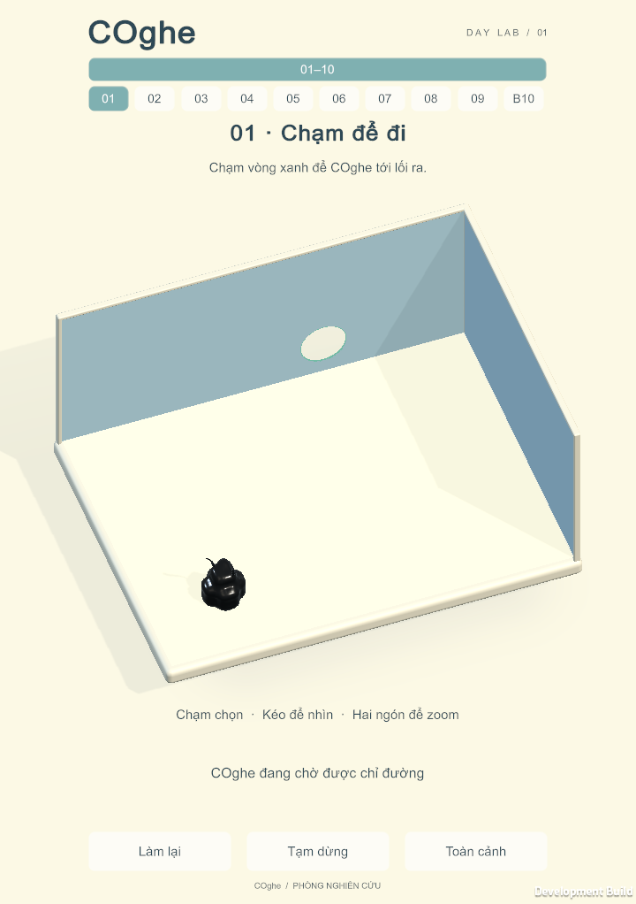
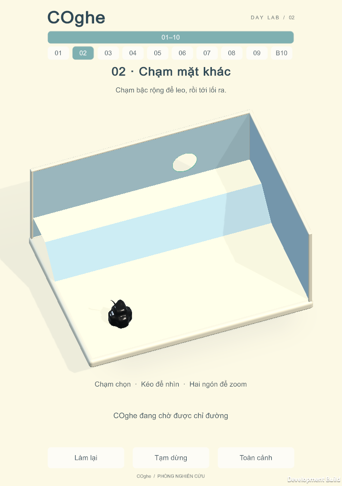
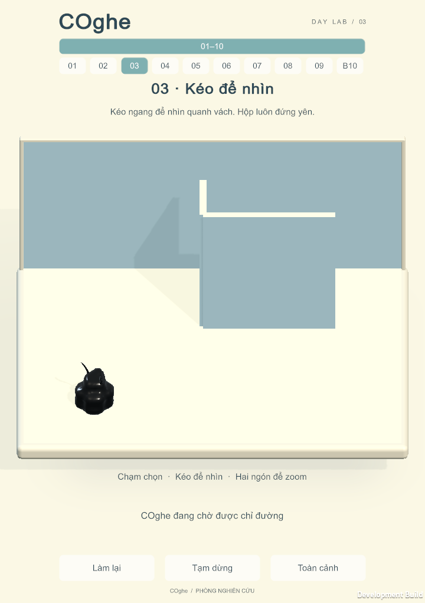
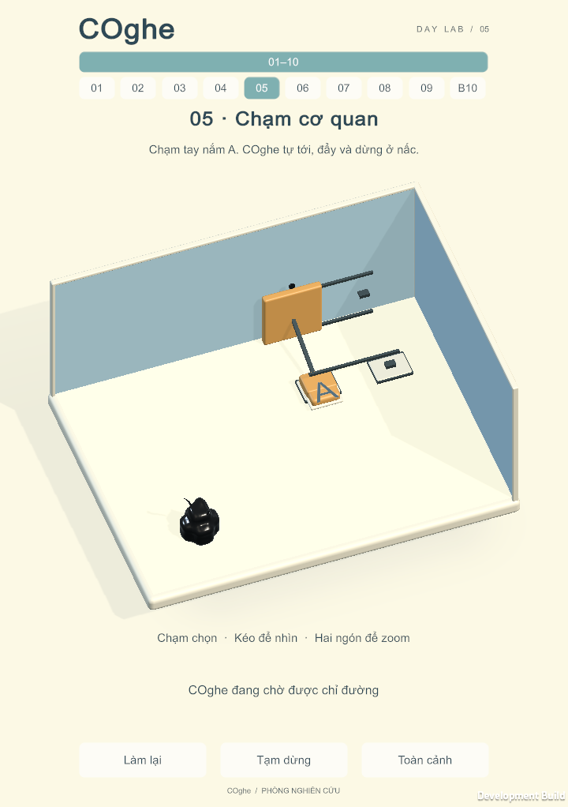
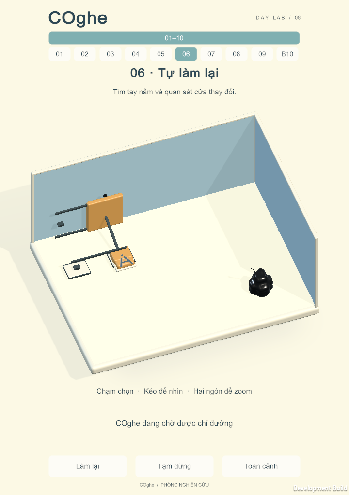
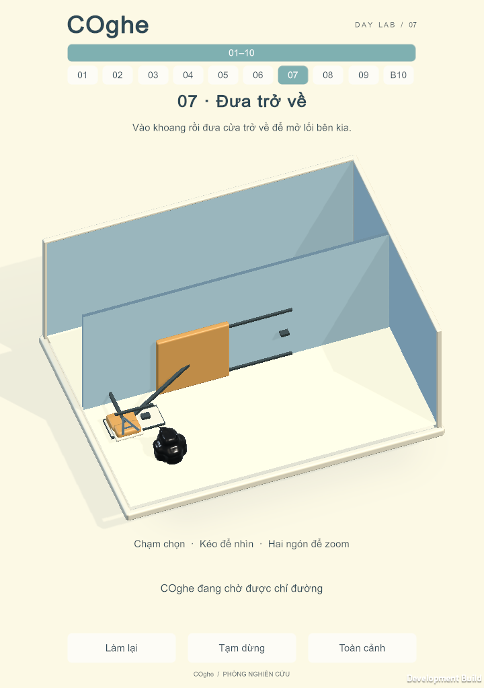
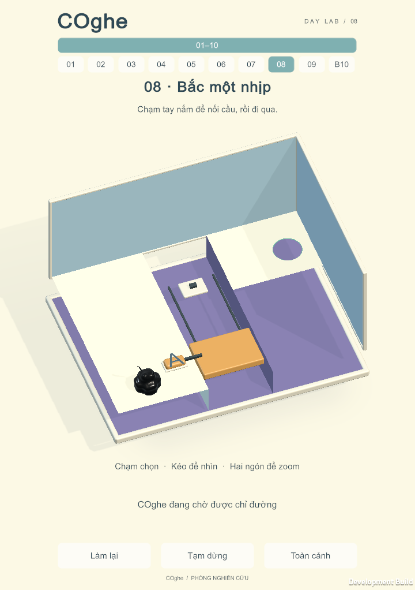
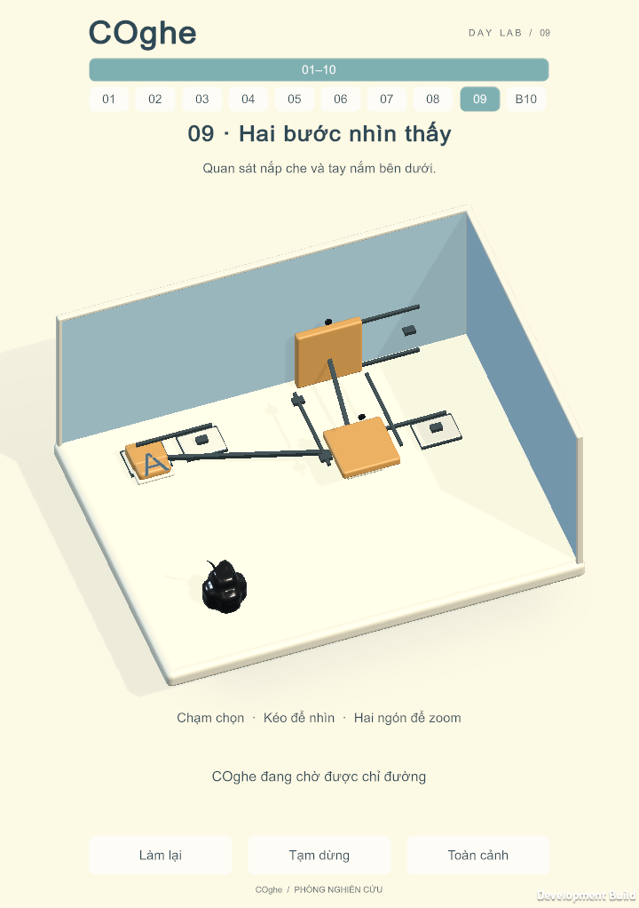
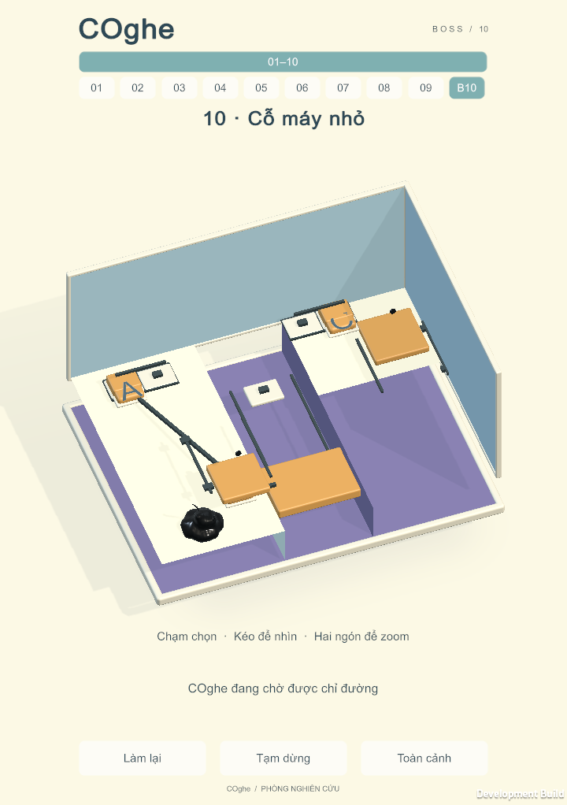

# COghe V2 — implementation and verification, 28 September 2026

Ten new playable levels implement the authorized view-only concept. Source and scene commit: `bd0ca04bf656c20fc4f29243c2f88bc312fcb690` (Unity6000.3.19f1, URP17.3.0, InputSystem1.17.0). This is a tested prototype awaiting phone and novice qualification.

## Automated coverage

| Check | Final result | Evidence |
| --- | --- | --- |
| Full PlayMode package | 441/441 passed, 0 skipped, 355.14s | [XML](FullPlay4.xml) |
| Full EditMode package | 8/8 passed, 0 skipped | [XML](FullEdit2.xml) |
| V2 cases within PlayMode | 20/20 | `COgheViewCampaignTests` in the full XML |

The20 new cases cover all ten authored solutions,32 escaped particles/one body, retry, unchanged chamber/gravity during orbit/pinch, pinch release, drag, third finger, retry with held contacts, focus/pause, midpoint zoom, portrait framing at720×1280 and720×1612 with safe areas, opaque-cover/interior-wall occlusion, physical door reversal, initial particle/prop clearance, production save key and preservation of old completions/Home. Portrait camera captures/mathematical checks do not prove a native phone HUD.

No puzzle or win state is assigned to make a solution pass. Test-only scripted simulation uses120Hz. Independent player replay uses the normal update loop and InputSystem touch events, including actual drag and pinch sequences. It disables automatic level advance to capture victory and loads each authored scene explicitly. Manual phone navigation and novice behavior remain separate checks.

## Earlier failure retained

[Earlier full-suite XML](EarlierFullPlay3.xml) passed440/441 (all20 V2 cases passed). The archived `HollowVesselsStaySlipperyAndContainedDuringWrongRotationAndRetry` test observed a particle outside slot59's physical shell. Its test, vessel and physical solver were unchanged by V2. The failure did not reproduce in the complete, isolated final run above. Cause is unconfirmed; it is not declared fixed. That old rotating vessel is excluded from the new ten-scene player catalog. The earlier run overlapped a player replay, so its frame timings are not used as an isolated performance result.

## Mobile cost controls

The implementation keeps32 particles and120Hz physics, reuses the established mobile skin/navigation systems, batches decorative geometry by material and uses collider-free trim. Incoming exterior panes are hidden, reducing transparency overdraw. Studio reflections use a static128-pixel cubemap. There is one shadow-casting key plus an unshadowed fill, no realtime reflection captures, SSAO or depth-of-field. Existing MobileURP uses renderScale1,4×MSAA, a single shadow cascade and2048 main shadow map; these are recorded settings, not an assertion that every phone reaches60FPS.

Target:60FPS, p95≤20ms, p99≤33.3ms, record >50ms hitches, memory/GC and sustained15–20 minute behavior. ADB inventory was empty during this task. No Android FPS, thermal, battery, GPU timing or finger-touch usability pass is claimed. Historical OPPO measurements for older scenes do not qualify V2.

## Reproduction and changes from concept

Use [V2 build/control guide](../../COGHE_VIEW_V2.md). Default Mac/Android/iOS builder methods select ten V2 scenes; Editor Build Settings also retain archived scenes for regression tests. For the smallest player use the documented builder/menu. No Generate is needed after pull: scenes, definitions, materials and meshes are committed. Open `Assets/_Game/Venom/ViewCampaign/COgheView01.unity` for the first level in Editor.

Levels2/4 have a broad ramp. Level7 has a floor exit, two-sided A handle and return shutter. Levels8/10 use a bridge that slides into a dock at floor height. Boss C operates from a fixed bank outside the moving shutter's sweep. Initial spawn now clears the floor for every particle. These changes preserve the intended lessons while removing collision traps found during replay. Near exterior panes/trim hide together; opaque interior barriers remain physical and block selection.

The old save key and Home unlock are retained; new puzzles have new IDs. The gameplay art is actual Unity geometry/materials and is not a measured80–90% match to the AI concepts.

Raw build logs, earlier failed iterations and frame captures are local under `Artifacts/COgheViewV2/`. Final player and APK evidence follows.

## Final Mac player replay

[Raw run and frame samples](MacPlayerRun.json) · [full app content hashes](Mac14Manifest.json).

10/10 levels passed, each32 particles/one body, 0 captured Error/Exception/Assert logs. BuildGUID `7551d40733d94413b34eec71cf56da8b`. Device Mac16,10 / Apple M4 / macOS26.5.1 / Metal. Development player,60FPS cap, no Unity Editor test/build running concurrently. The OS clamped the requested720×1280 window to **720×1022 actual pixels**; this is the native resolution of these HUD captures.

Two seconds of warm-up per scene, one complete author replay, **75.46 seconds of sampled gameplay**. Scene load, warm-up, screenshot capture/settling and victory animation are excluded from frame samples. This short desktop result is not a sustained mobile performance pass.

| Level | Average FPS | p95 ms | p99 ms | Max ms | Peak Unity allocated MiB |
| --- | ---: | ---: | ---: | ---: | ---: |
| 01 | 59.75 | 17.04 | 17.59 | 22.64 | 72.0 |
| 02 | 60.00 | 16.67 | 16.68 | 16.70 | 72.2 |
| 03 | 59.76 | 16.69 | 16.73 | 33.16 | 72.3 |
| 04 | 59.76 | 16.67 | 16.84 | 32.54 | 72.2 |
| 05 | 59.87 | 16.77 | 17.52 | 22.62 | 72.6 |
| 06 | 59.85 | 16.76 | 17.18 | 27.24 | 72.7 |
| 07 | 59.79 | 16.90 | 17.58 | 23.08 | 72.9 |
| 08 | 59.86 | 16.78 | 17.33 | 23.90 | 72.7 |
| 09 | 59.90 | 16.70 | 16.78 | 30.98 | 72.9 |
| 10 | 59.58 | 16.70 | 17.38 | 33.30 | 73.2 |

Across these samples: no frame exceeded33.33ms; none exceeded50ms. Peak allocation is Unity's `Profiler.GetTotalAllocatedMemoryLong`, not operating-system RSS or total GPU memory. CPU counters are instrumented subsystem time, not independent GPU timing. GC counts in the raw report include screenshot work and are not evidence of allocation-free gameplay.

## Actual Unity captures

These are unedited player captures, not concept images. [Zoom](Images/04-pinch.png) · [level7 exit open](Images/07-exit-open.png) · [bridge docked](Images/08-docked.png) · [Boss in progress](Images/10-bridge.png) · [Boss victory](Images/10-won.png).

## Android artifacts

Both Android builds succeeded: **ARM64 IL2CPP Release**, ten packaged scenes (`level0`…`level9`), package `com.gravityboxlab.venom`, label **COghe**, minimum API26, target API36. APK ZIP CRC checks passed; APK signatures verified with the bundled JDK/apksigner. They use the local Android Debug test certificate, not a store signing key. [Build metadata and full SHA-256 values](AndroidBuilds.json).

- `Builds/Venom/Android/COghe-V2-release.apk` — 33,570,988 bytes; SHA-256 `d0303565db9db2011c6a678531e115349196ceebcebcc1be0c28b7b68865b05d`.
- `Builds/Venom/Android/COghe-V2-benchmark.apk` — 33,652,476 bytes; SHA-256 `11c1f60bd8abbeed267baf382b24a3e19629ce4d5a19f8238da2871423e4b265`.

The ordinary `COghe.apk` path contains the release APK. The separate benchmark APK includes the opt-in `coghe_view_proof` intent; launching without it plays normally. The opt-in path has been compiled for Android, but cannot be exercised without a device. During Android import Unity normalized the shared mint material's emission keyword; no runtime, scene or physics changes were made after the tested commit.

Buzz rejected the APK upload as unsupported `application/zip`. The APKs remain at the local paths above; source and complete build instructions are provided in the repository. PNG captures were accepted by Buzz.

## Remaining acceptance work

1. Connect the target Android over USB, authorize ADB; install the ordinary APK and check native portrait/safe area, tap accuracy, orbit, pinch, background/resume, retry, level selection/advance and saved progress.
2. Run the instrumented APK on that phone, collect JSON/logs and a sustained15–20 minute session. Qualify frame-time, memory/GC and thermal behavior; optimize measured bottlenecks before declaring mobile performance passed.
3. Repeat with new players. Author solutions do not establish that the new controls or difficulty curve are easy to learn.

No production mobile acceptance is claimed by this handoff.
