# Mười màn kéo hộp (thiết kế, 06/10/2026)

Mrk (06/10/2026): "mày tạo ra 10 màn kéo hộp như này có độ khó tăng dần" và "gửi tao thiết kế trước khi xây dựng màn chơi
trong unity". Đây là bản thiết kế để duyệt; chưa dựng trong Unity. Bộ này thay bộ 5 màn ở `COGHE_CRATE_PUZZLES.md`: thêm
luật chỗ đứng cho COghe để dựng được trong game.

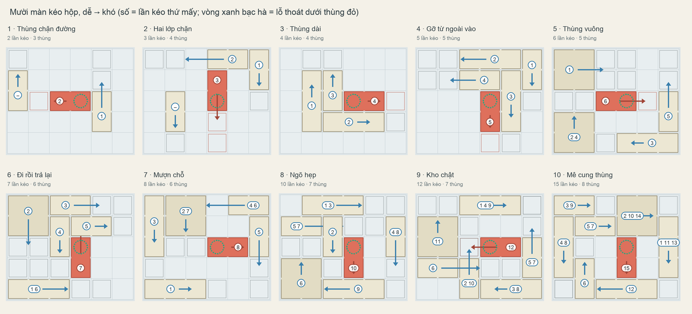

## Luật chơi

- Lưới 6 × 5 ô (ô 12 cm) trong hộp 80 × 60 cm. Lỗ thoát trên sàn (vòng xanh bạc hà) bị **thùng đỏ** che.
- Mỗi thùng trượt theo một hướng trên ray riêng, giữa hai điểm dừng. Một lần chạm = trượt sang điểm dừng kia; chạm lần nữa
  thì về chỗ cũ. Thùng chỉ trượt khi cả đoạn đường trống.
- **Chỗ đứng của COghe:** muốn dời một thùng, phải có một ô trống ngay sau thùng (COghe đẩy), hoặc ngay sau chỗ thùng sẽ
  dừng (COghe kéo và lùi dần). Thùng sát kính hoặc bị kẹp giữa các thùng khác có thể không dời được theo hướng đó.
- Hình dạng: thùng dài 2 ô, dài 3 ô (từ màn 3), thùng vuông lớn 2 × 2 (từ màn 5). Thùng ngà; chỉ thùng đỏ khác màu.
- Không thế bày nào bị kẹt: mọi màn đều kiểm tra rằng từ bất kỳ thế bày nào người chơi tạo ra vẫn còn đường thắng, nên
  không cần nút Retry.

Kiểm tra bằng chương trình giải (BFS, có luật chỗ đứng): số lần kéo ít nhất, số thế bày người chơi có thể tạo ra, số thế
bày chết (bằng 0 ở cả 10 màn). Công cụ: `Tools/crate_puzzles` (`search10.py`, `levels10.py`).

| Màn | Kéo ít nhất | Thùng | Kéo lại thùng đã kéo | Thế bày | Ý mới |
| --- | --- | --- | --- | --- | --- |
| 1 · Thùng chặn đường | 2 | 3 | 0 | 8 | Thùng đỏ bị một thùng chặn; một thùng khác không liên quan. |
| 2 · Hai lớp chặn | 3 | 4 | 0 | 16 | Thùng chặn thùng đỏ lại bị một thùng khác chặn. |
| 3 · Thùng dài | 4 | 4 | 0 | 16 | Thùng dài 3 ô: cần khoảng trống dài hơn mới trượt được. |
| 4 · Gỡ từ ngoài vào | 5 | 5 | 0 | 32 | Chuỗi bốn thùng chặn nhau: gỡ thùng ngoài cùng trước. |
| 5 · Thùng vuông | 6 | 5 | 1 | 24 | Thùng vuông lớn; lần đầu phải dời một thùng rồi trả về. |
| 6 · Đi rồi trả lại | 7 | 6 | 1 | 40 | Sáu thùng; một thùng dời tạm để thùng khác đi qua. |
| 7 · Mượn chỗ | 8 | 6 | 2 | 36 | Hai thùng phải dời tạm rồi trả lại chỗ cũ. |
| 8 · Ngõ hẹp | 10 | 7 | 3 | 64 | Bảy thùng, ba lần trả thùng về. |
| 9 · Kho chật | 12 | 7 | 5 | 30 | Thùng vuông chắn giữa; năm lần trả thùng về. |
| 10 · Mê cung thùng | 15 | 8 | 7 | 32 | Tám thùng; thùng vuông phải dời ba lần. Bài cuối của bộ. |

## Đề xuất chèn

Hai màn mỗi chương, độ khó vẫn tăng trong từng chương (tổng 60 màn): 1–2 ở chương 1, 3–4 ở chương 2, 5–6 ở chương 3,
7–8 ở chương 4, 9–10 ở chương 5. Hoặc gom 10 màn thành một chương riêng. Mrk chọn rồi mới dựng.

## Từng màn

### Màn 1 · Thùng chặn đường (2 lần kéo)
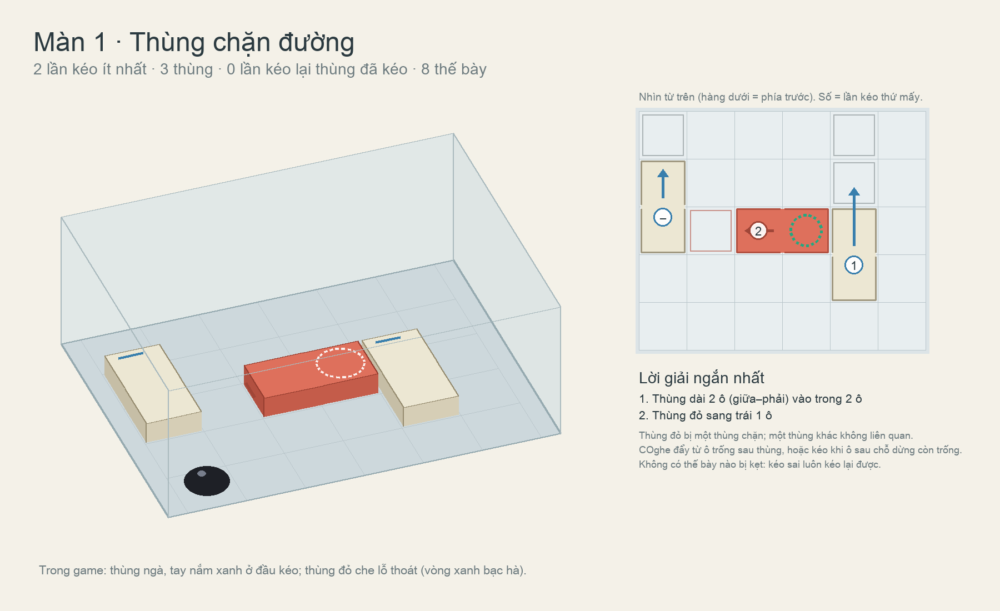

### Màn 2 · Hai lớp chặn (3 lần kéo)
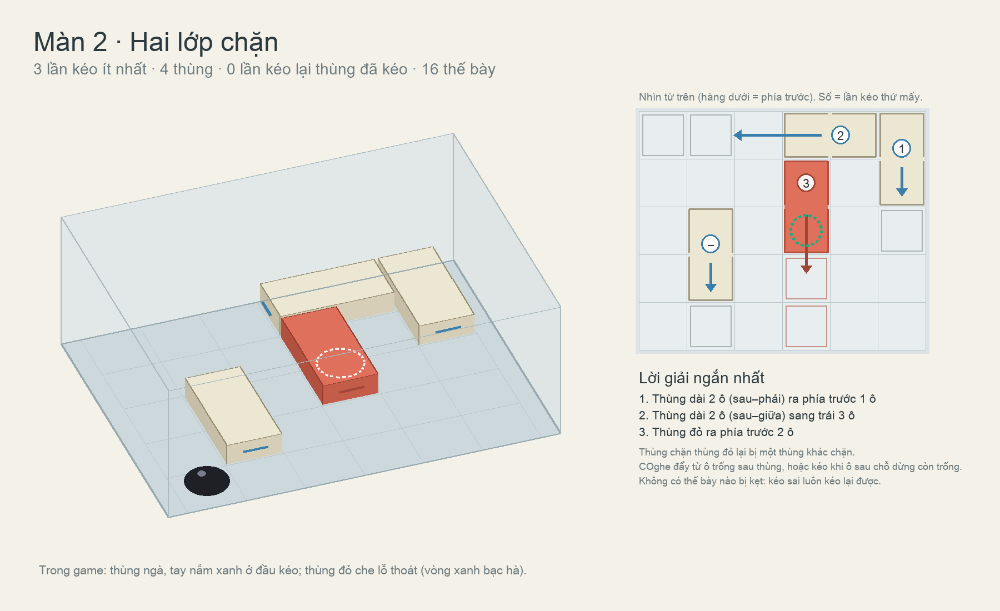

### Màn 3 · Thùng dài (4 lần kéo)
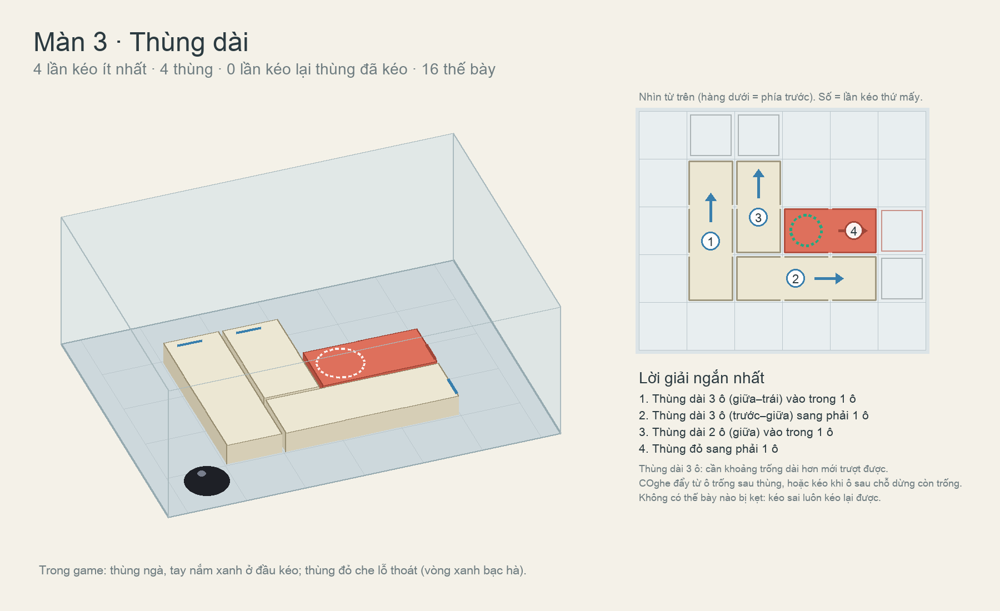

### Màn 4 · Gỡ từ ngoài vào (5 lần kéo)
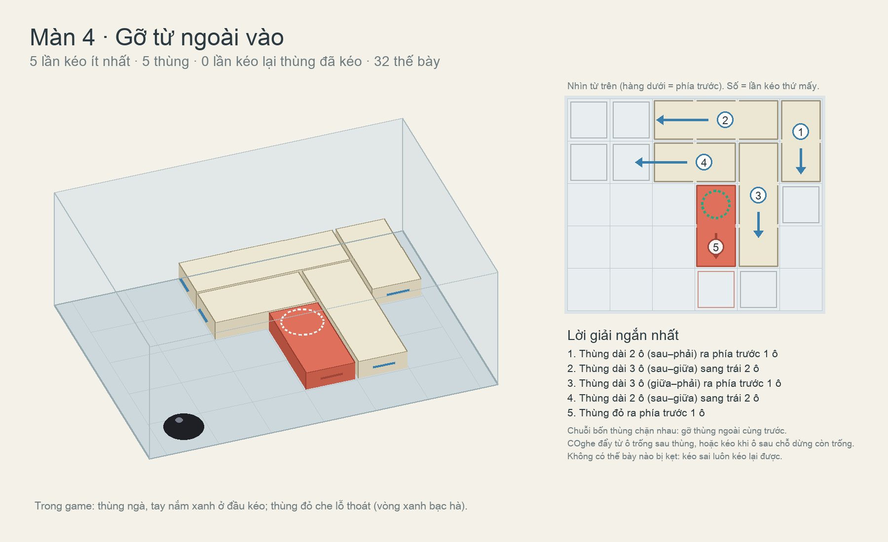

### Màn 5 · Thùng vuông (6 lần kéo)
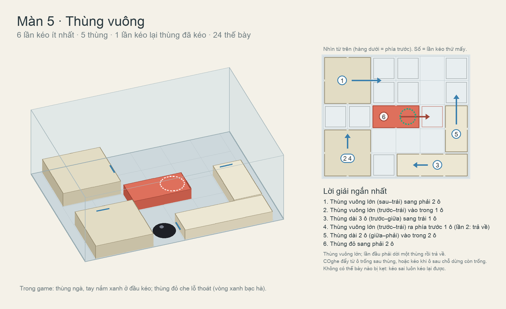

### Màn 6 · Đi rồi trả lại (7 lần kéo)
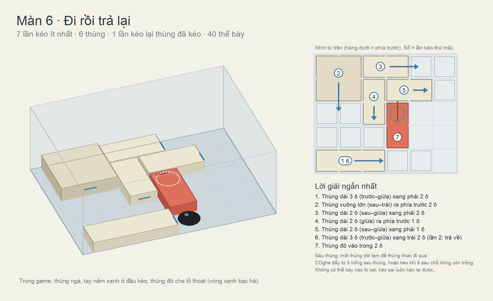

### Màn 7 · Mượn chỗ (8 lần kéo)
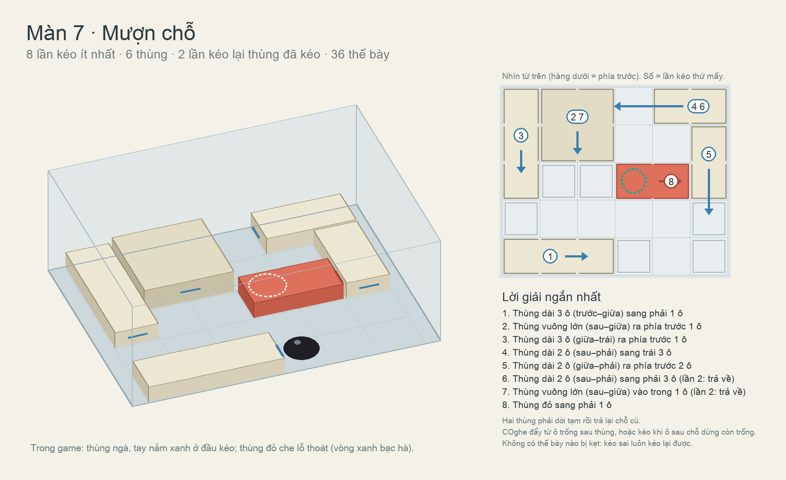

### Màn 8 · Ngõ hẹp (10 lần kéo)
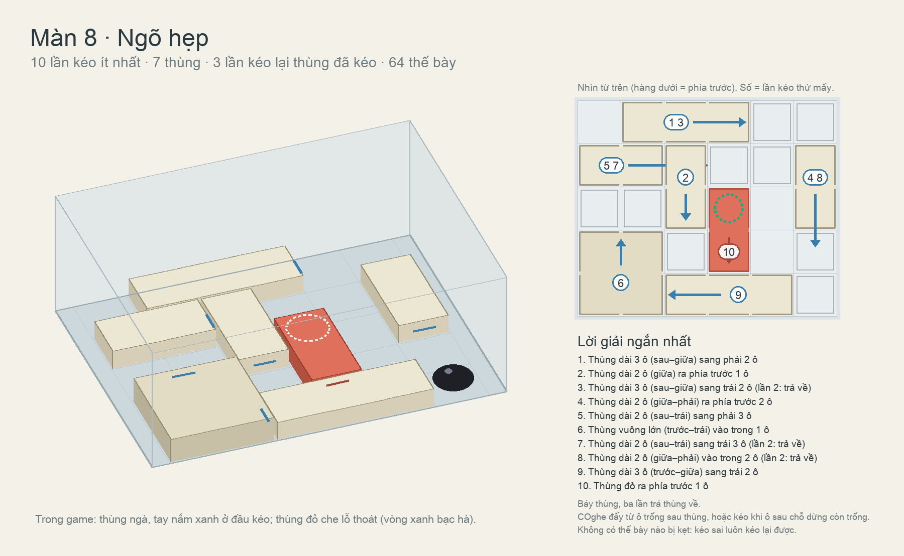

### Màn 9 · Kho chật (12 lần kéo)
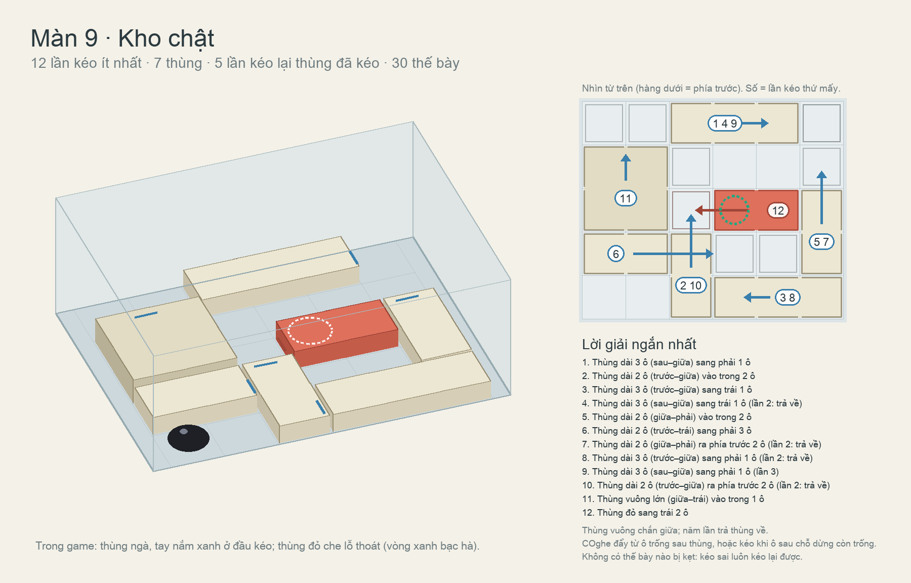

### Màn 10 · Mê cung thùng (15 lần kéo)
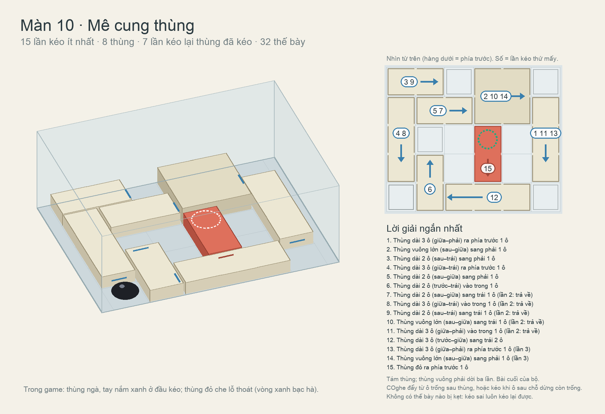

## Khi dựng trong Unity (sau khi Mrk duyệt)

- Mỗi thùng: rail hai điểm dừng (`NextCrate`), thùng vuông là khối 24 × 24 cm cao 6 cm, các thùng khác cao 4,5 cm, mặt ngà
  leo được. Vị trí, hướng, điểm dừng lấy đúng từ `crate-levels-10/summary10.json`. Lỗ thoát: cửa sập sàn như màn 7.
- Tay nắm ở cả hai đầu thùng theo hướng trượt: COghe chọn đẩy hay kéo tuỳ chỗ đứng còn trống.
- Lời giải mẫu theo đúng thứ tự trong bảng; test giải và test đi lang thang cho từng màn.
